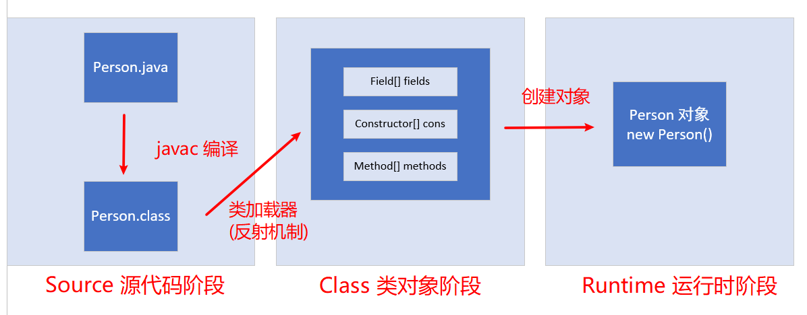
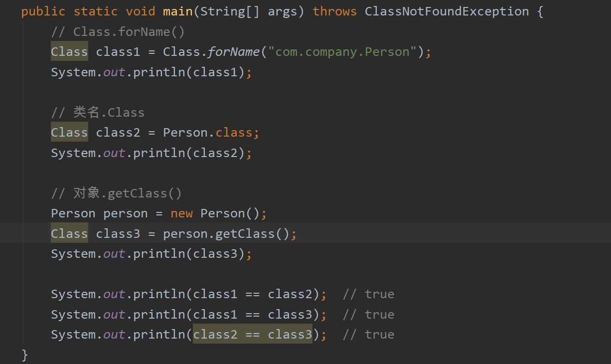
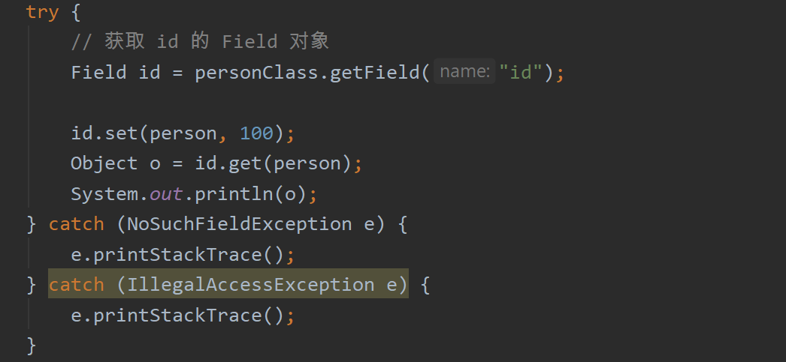

# Reflection 反射

>  反射：框架设计的灵魂

一般的应用程序员不用考虑反射机制，但你如果是开发工具程序员，要为其他 Java 程序员构建工具，你务必了解反射，一种功能强大且复杂的机制。

## 目录


## 1. 什么是反射？


举一个简单的例子

这是我们常见的 `Person` 类，从 `Person.java` 文件到最终能在内存中运行，到底经历了些什么呢？

<div align="center">  </div><br>

<div align="center">  </div><br>

### Source 源代码阶段

我们写了一个 `Person.java` 文件，`javac` 将文件编译成 `Person.class` 类文件，这时文件还是存储在硬盘中。

但是，计算机的程序都是在内存中进行的，`CPU` 会把需要计算的数据调到内存中进行运算。那现在存储在硬盘的文件又如何写进内存呢？

这就需要经历第二阶段：`Class` 类对象阶段。

```
Class.forName("");
```

将字节码


### Class 类对象阶段

反射机制：将 `Java` 类中的属性和方法封装成对象

万物皆对象。


### Runtime 运行时阶段


## 2. 反射有什么用？

1. 在程序运行过程中可以方便获取与操作这些对象
2. 解耦，提高可扩展性


## 3. 获取 Class 对象方法

共三种方法：

<div align="center">  </div><br>

<div align="center">  </div><br>

其中这三种方法获取到的 `Class` 类对象相同，即 `Class` 类对象只生成一次


## 4. Class 对象方法

`Class` 对象里面封装了以下部分（有但不止）：

1. `Field[] field`：成员变量对象

2. `Constructor[] constructors`：构造函数对象

3.  `Method[] methods`：成员方法对象

   这是我们定义的 `Person` 类，含有 4 个成员变量

   <div align="center">  </div><br>

`Field`

<div align="center">  </div><br>

获取了 `Field` 成员变量们有什么用？

显然，常见的操作是 `get` 和 `set`

<div align="center">  </div><br>

:bulb:Tips

可以先记住方法名称，开发过程中在通过查阅文档写出正确代码

`Constructor`


`Method`


