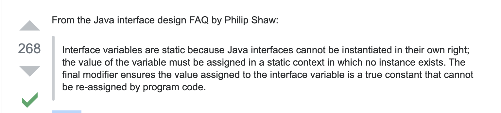

# 接口增强

Table of Contents
-----------------

* [1. 接口回顾](#1-接口回顾)
* [2. 默认方法 (Java 8)](#2-默认方法-java-8)
* [3. 静态方法 (Java 8)](#3-静态方法-java-8)
* [4. 私有方法 (Java 9)](#4-私有方法-java-9)
* [参考链接](#参考链接)

## 1. 接口回顾

- 常量：`public static final`
- 方法：`public abstract`

  
 

## 2. 默认方法 (Java 8)

 简单说，默认方法就是接口可以有实现方法，而且不需要实现类去实现其方法。

我们只需在方法名前面加个 default 关键字即可实现默认方法。

**为什么要有这个特性？**

*首先，之前的接口是个双刃剑，好处是面向抽象而不是面向具体编程，缺陷是，当需要修改接口时候，需要修改全部实现该接口的类，目前的 java 8 之前的集合框架没有 foreach 方法，通常能想到的解决办法是在JDK里给相关的接口添加新的方法及实现。然而，对于已经发布的版本，是没法在给接口添加新方法的同时不影响已有的实现。所以引进的默认方法。他们的目的是为了解决接口的修改与现有的实现不兼容的问题。*

## 3. 静态方法 (Java 8)

## 4. 私有方法 (Java 9)

## 参考链接

- [java，接口的变量为啥要是public static final？](https://blog.csdn.net/u010002184/article/details/81347559)
- [Why are interface variables static and final by default?](https://stackoverflow.com/questions/2430756/why-are-interface-variables-static-and-final-by-default/2430787)
- [Java 8 默认方法](https://www.runoob.com/java/java8-default-methods.html)