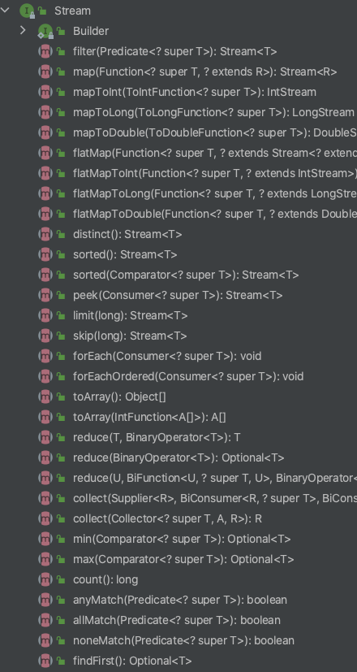
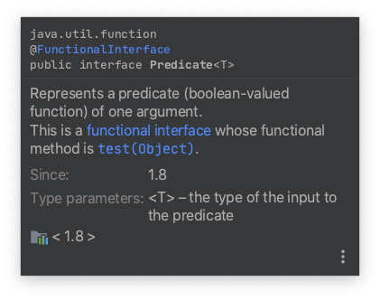
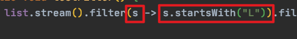
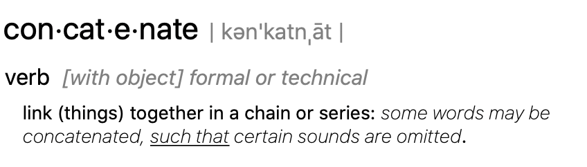

# Stream

Table of Contents
-----------------

* [1. 什么是 Stream](#1-什么是-stream)
* [2. 为什么要使用 Stream](#2-为什么要使用-stream)
* [3. 如何实现 Stream](#3-如何实现-stream)
* [4. Demo](#4-demo)
   * [4.1 filter](#41-filter)
   * [4.2 limit](#42-limit)
   * [4.3 concat](#43-concat)
   * [4.4 sorted](#44-sorted)
   * [4.5 map](#45-map)
   * [4.6 forEach](#46-foreach)
   * [4.7 collect](#47-collect)
* [参考链接](#参考链接)


## 1. 什么是 Stream

**Java 8 新特性**

Java 8 API 添加了一个新的抽象称为流 Stream，可以让你以一种声明的方式处理数据。

<div align="center">  </div><br>

这种风格将要处理的元素集合看作一种流， 流在管道中传输， 并且可以在管道的节点上进行处理， 比如筛选， 排序，聚合等。

```java
public interface Stream<T> extends BaseStream<T, Stream<T>> {}
```


## 2. 为什么要使用 Stream

方便开发，主要用于集合类（与 `lambda expression` 连用）

<div align="center">  </div><br>


## 3. 如何实现 Stream

- 生成流：通过数据源（集合）生成流
- 中间操作：一个流后面可以跟随 0 或多个中间操作，目的是打开流，做出某种程度的数据过滤 / 映射，然后返回一个新的流，交给下一个操作使用
- 终结操作：一个流有且仅有一个终结操作


## 4. Demo

在进行 `demo` 之前需要配置单测和日志

**pom.xml**

```xml
<dependencies>
  <dependency>
    <groupId>junit</groupId>
    <artifactId>junit</artifactId>
    <version>4.12</version>
    <scope>test</scope>
  </dependency>
  <!-- https://mvnrepository.com/artifact/org.slf4j/slf4j-api -->
  <dependency>
    <groupId>org.slf4j</groupId>
    <artifactId>slf4j-api</artifactId>
    <version>1.7.30</version>
  </dependency>
  <!-- https://mvnrepository.com/artifact/org.slf4j/slf4j-simple -->
  <dependency>
    <groupId>org.slf4j</groupId>
    <artifactId>slf4j-simple</artifactId>
    <version>1.7.30</version>
    <scope>test</scope>
  </dependency>
  <!-- https://mvnrepository.com/artifact/org.projectlombok/lombok -->
  <dependency>
    <groupId>org.projectlombok</groupId>
    <artifactId>lombok</artifactId>
    <version>1.18.12</version>
    <scope>provided</scope>
  </dependency>
</dependencies>
```

### 4.1 filter

首先看 `filter` 方法，从字面意思看是过滤的意思，需要传入 `Predicate` 参数

**Stream.java**

```java
/**
 * Returns a stream consisting of the elements of this stream that match
 * the given predicate.
 *
 * <p>This is an <a href="package-summary.html#StreamOps">intermediate
 * operation</a>.
 *
 * @param predicate a <a href="package-summary.html#NonInterference">non-interfering</a>,
 *                  <a href="package-summary.html#Statelessness">stateless</a>
 *                  predicate to apply to each element to determine if it
 *                  should be included
 * @return the new stream
 */
Stream<T> filter(Predicate<? super T> predicate);
```

`predicate` 是谓语的意思

> the part of a sentence or clause containing a verb and stating something about the subject (e.g., *went home* in *John went home*)

在 `predicate` 接口中，发现了 `@FunctionalInterface` 注解，看来和 `lambda expression` 扯上关系了

接口中 **有且仅有** 一个抽象方法：`test()`

作用是判断传入的参数 `t` 是否与谓词匹配

**Predicate.java**

```java
/**
 * Represents a predicate (boolean-valued function) of one argument.
 *
 * <p>This is a <a href="package-summary.html">functional interface</a>
 * whose functional method is {@link #test(Object)}.
 *
 * @param <T> the type of the input to the predicate
 *
 * @since 1.8
 */
@FunctionalInterface
public interface Predicate<T> {

    /**
     * Evaluates this predicate on the given argument.
     *
     * @param t the input argument
     * @return {@code true} if the input argument matches the predicate,
     * otherwise {@code false}
     */
    boolean test(T t);

    /**
     * Returns a composed predicate that represents a short-circuiting logical
     * AND of this predicate and another.  When evaluating the composed
     * predicate, if this predicate is {@code false}, then the {@code other}
     * predicate is not evaluated.
     *
     * <p>Any exceptions thrown during evaluation of either predicate are relayed
     * to the caller; if evaluation of this predicate throws an exception, the
     * {@code other} predicate will not be evaluated.
     *
     * @param other a predicate that will be logically-ANDed with this
     *              predicate
     * @return a composed predicate that represents the short-circuiting logical
     * AND of this predicate and the {@code other} predicate
     * @throws NullPointerException if other is null
     */
    default Predicate<T> and(Predicate<? super T> other) {
        Objects.requireNonNull(other);
        return (t) -> test(t) && other.test(t);
    }

    /**
     * Returns a predicate that represents the logical negation of this
     * predicate.
     *
     * @return a predicate that represents the logical negation of this
     * predicate
     */
    default Predicate<T> negate() {
        return (t) -> !test(t);
    }

    /**
     * Returns a composed predicate that represents a short-circuiting logical
     * OR of this predicate and another.  When evaluating the composed
     * predicate, if this predicate is {@code true}, then the {@code other}
     * predicate is not evaluated.
     *
     * <p>Any exceptions thrown during evaluation of either predicate are relayed
     * to the caller; if evaluation of this predicate throws an exception, the
     * {@code other} predicate will not be evaluated.
     *
     * @param other a predicate that will be logically-ORed with this
     *              predicate
     * @return a composed predicate that represents the short-circuiting logical
     * OR of this predicate and the {@code other} predicate
     * @throws NullPointerException if other is null
     */
    default Predicate<T> or(Predicate<? super T> other) {
        Objects.requireNonNull(other);
        return (t) -> test(t) || other.test(t);
    }

    /**
     * Returns a predicate that tests if two arguments are equal according
     * to {@link Objects#equals(Object, Object)}.
     *
     * @param <T> the type of arguments to the predicate
     * @param targetRef the object reference with which to compare for equality,
     *               which may be {@code null}
     * @return a predicate that tests if two arguments are equal according
     * to {@link Objects#equals(Object, Object)}
     */
    static <T> Predicate<T> isEqual(Object targetRef) {
        return (null == targetRef)
                ? Objects::isNull
                : object -> targetRef.equals(object);
    }
}
```

先上一个 `demo`

**TestDemo.java**

```java
/**
 * Demo for stream
 */
public class TestDemo {

    private List<String> list = new ArrayList<>();

    @Before
    public void init() {
        list.add("LBJ");
        list.add("AD");
    }

    @Test
    public void testFilter() {
        list.stream().filter(s -> s.startsWith("L")).filter(s -> s.length() >= 3).forEach(System.out::println);  // LBJ
    }

}
```

<div align="center">  </div><br>

<div align="center">  </div><br>

第一个框是流中的每个元素，第二个框是筛选的条件（符合的留下，不符合的走）

### 4.2 limit

**Stream.java**

```java
/**
 * Returns a stream consisting of the elements of this stream, truncated
 * to be no longer than {@code maxSize} in length.
 *
 * <p>This is a <a href="package-summary.html#StreamOps">short-circuiting
 * stateful intermediate operation</a>.
 *
 * @apiNote
 * While {@code limit()} is generally a cheap operation on sequential
 * stream pipelines, it can be quite expensive on ordered parallel pipelines,
 * especially for large values of {@code maxSize}, since {@code limit(n)}
 * is constrained to return not just any <em>n</em> elements, but the
 * <em>first n</em> elements in the encounter order.  Using an unordered
 * stream source (such as {@link #generate(Supplier)}) or removing the
 * ordering constraint with {@link #unordered()} may result in significant
 * speedups of {@code limit()} in parallel pipelines, if the semantics of
 * your situation permit.  If consistency with encounter order is required,
 * and you are experiencing poor performance or memory utilization with
 * {@code limit()} in parallel pipelines, switching to sequential execution
 * with {@link #sequential()} may improve performance.
 *
 * @param maxSize the number of elements the stream should be limited to
 * @return the new stream
 * @throws IllegalArgumentException if {@code maxSize} is negative
 */
Stream<T> limit(long maxSize);
```

**TestDemo.java**

```java
@Test
public void testLimit() {
    list.stream().limit(2).forEach(System.out::println);  // LBJ AD
}
```


### 4.3 concat

<div align="center">  </div><br>

**TestDemo.java**

```java
@Test
public void testConcat() {
    Stream<String> limit = list.stream().limit(1);
    Stream<String> skip = list.stream().skip(1);
    Stream.concat(limit, skip).forEach(System.out::println);  // LBJ AD
}
```


### 4.4 sorted

**TestDemo.java**

```java
@Test
public void testSorted() {
    list.stream().sorted().forEach(System.out::println);  // AD LBJ
}
```

除了默认排序外，还有一个传入 `Comparator` 参数的方法

**Stream.java**

```java
/**
 * Returns a stream consisting of the elements of this stream, sorted
 * according to the provided {@code Comparator}.
 *
 * <p>For ordered streams, the sort is stable.  For unordered streams, no
 * stability guarantees are made.
 *
 * <p>This is a <a href="package-summary.html#StreamOps">stateful
 * intermediate operation</a>.
 *
 * @param comparator a <a href="package-summary.html#NonInterference">non-interfering</a>,
 *                   <a href="package-summary.html#Statelessness">stateless</a>
 *                   {@code Comparator} to be used to compare stream elements
 * @return the new stream
 */
Stream<T> sorted(Comparator<? super T> comparator);
```

进入 `Comparator` 的源码看一下

**Comparator.java**

```java
@FunctionalInterface
public interface Comparator<T> {
    /**
     * Compares its two arguments for order.  Returns a negative integer,
     * zero, or a positive integer as the first argument is less than, equal
     * to, or greater than the second.<p>
     *
     * In the foregoing description, the notation
     * <tt>sgn(</tt><i>expression</i><tt>)</tt> designates the mathematical
     * <i>signum</i> function, which is defined to return one of <tt>-1</tt>,
     * <tt>0</tt>, or <tt>1</tt> according to whether the value of
     * <i>expression</i> is negative, zero or positive.<p>
     *
     * The implementor must ensure that <tt>sgn(compare(x, y)) ==
     * -sgn(compare(y, x))</tt> for all <tt>x</tt> and <tt>y</tt>.  (This
     * implies that <tt>compare(x, y)</tt> must throw an exception if and only
     * if <tt>compare(y, x)</tt> throws an exception.)<p>
     *
     * The implementor must also ensure that the relation is transitive:
     * <tt>((compare(x, y)&gt;0) &amp;&amp; (compare(y, z)&gt;0))</tt> implies
     * <tt>compare(x, z)&gt;0</tt>.<p>
     *
     * Finally, the implementor must ensure that <tt>compare(x, y)==0</tt>
     * implies that <tt>sgn(compare(x, z))==sgn(compare(y, z))</tt> for all
     * <tt>z</tt>.<p>
     *
     * It is generally the case, but <i>not</i> strictly required that
     * <tt>(compare(x, y)==0) == (x.equals(y))</tt>.  Generally speaking,
     * any comparator that violates this condition should clearly indicate
     * this fact.  The recommended language is "Note: this comparator
     * imposes orderings that are inconsistent with equals."
     *
     * @param o1 the first object to be compared.
     * @param o2 the second object to be compared.
     * @return a negative integer, zero, or a positive integer as the
     *         first argument is less than, equal to, or greater than the
     *         second.
     * @throws NullPointerException if an argument is null and this
     *         comparator does not permit null arguments
     * @throws ClassCastException if the arguments' types prevent them from
     *         being compared by this comparator.
     */
    int compare(T o1, T o2);
```

值得注意的是，`equals` 也是抽象方法，但是是属于 `Object` 类的，实际上 `compare()` 才是 `Comparator` 有且仅有的那个抽象方法

<div align="center">  </div><br>

接口中有许多方法（现阶段先学会熟练调用 `api`，底层实现原理暂不研究）

**TestDemo.java**

```java
@Test
public void testReverseSorted() {
    list.stream().sorted(Comparator.comparingInt(String::length)).forEach(System.out::println);  // AD LBJ
    list.stream().sorted(Comparator.comparingInt(String::length).reversed()).forEach(System.out::println);  // LBJ AD
}
```

### 4.5 map

### 4.6 forEach

### 4.7 collect


## 参考链接

- [Java 8 Stream](https://www.runoob.com/java/java8-streams.html)
- [Java Streams Tutorial | 2020](https://www.youtube.com/watch?v=Q93JsQ8vcwY)