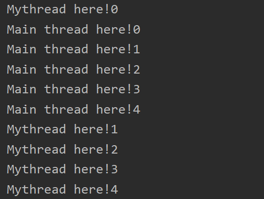

# 多线程

## 目录

* [1. 线程简介](#1-----)
  + [1.1 并行与并发](#11------)
    - [1.1.1 什么是并发？](#111-------)
    - [1.1.2 什么是并行？](#112-------)
  + [1.2 Process（进程） 与 Thread（线程）](#12-process-------thread----)
* [2. 线程实现（重点）](#2---------)
  + [2.1 继承 Thread 类](#21----thread--)
  + [2.2 实现 Runnable 接口](#22----runnable---)
  + [2.3 实现 Callable 接口](#23----callable---)
* [3. 线程状态](#3-----)
* [4. 线程同步（重点）](#4---------)
* [5. 线程通信](#5-----)


## 1. 线程简介

### 1.1 并行与并发

#### 1.1.1 什么是并发？

当有多个线程在操作时，如果系统只有一个 `CPU` ，则它根本不可能真正同时进行一个以上的线程。它只能把 `CPU` 运行时间划分成若干个时间段，再将时间段分配给各个线程执行。在一个时间段的线程代码运行时，其它线程处于挂起状态

#### 1.1.2 什么是并行？

当系统有一个以上 `CPU` 时，则线程的操作有可能非并发。当一个 `CPU` 执行一个线程时，另一个 `CPU` 可以执行另一个线程，两个线程互不抢占 `CPU` 资源，可以同时进行。


<div align="center">  </div><br>

### 1.2 Process（进程） 与 Thread（线程）

先理清楚三个概念：

- 程序: 指令和数据的有序集合，是一个静态的概念
- 进程: 程b序的一次执行过程，是一个动态的概念。是系统资源分配的单位
- 线程: 一个进程可以包括若干个线程。一个进程至少有一个线程。线程是 CPU 调度和执行的单位


## 2. 线程实现（重点）

在 `Java` 中，有三种实现多线程的方式：

- 继承 `Thread` 类
- 实现 `Runnable` 接口
- 实现 `Callable` 接口


### 2.1 继承 Thread 类

**MyThread.java**

```java
public class MyThread extends Thread {

    @Override
    public void run() {
        for (int i = 0; i < 5; i++) {
            System.out.println("Mythread here!" + i);
        }
    }
}
```

**Main.java**

```java
public class Main {

    public static void main(String[] args) {

        // my thread
        MyThread myThread = new MyThread();

        // start mythread
        myThread.start();

        // Main thread
        for (int i = 0; i < 5; i++) {
            System.out.println("Main thread here!" + i);
        }

    }
}
```

可以看出 `myThread` 和 `Main` 线程轮流打印，交替进行

<div align="center">  </div><br>

### 2.2 实现 Runnable 接口

在 `Thread` 类中，还支持像 `Thread` 类传入 `Runnable` 接口的方法

**Thread.java**

```java
public Thread(Runnable target) {
    init(null, target, "Thread-" + nextThreadNum(), 0);
}
```


**MyThreadRunnable.java**

```java
public class MyThreadRunnable implements Runnable {
    @Override
    public void run() {
        for (int i = 0; i < 5; i++) {
            System.out.println("MyThread (implements runnable) here!" + i);
        }
    }
}
```

**Main.java**

```java
public class Main {

    public static void main(String[] args) {

        MyThreadRunnable myThreadRunnable = new MyThreadRunnable();

        // start new thread
        new Thread(myThreadRunnable).start();

        for (int i = 0; i < 5; i++) {
            System.out.println("Main thread here! " + i);
        }

    }
}
```


<div align="center">  </div><br>

**继承 Thread 和 实现 Runnable 接口有什么区别？**

推荐使用实现 `Runnable` 接口的方式

- 避免单继承的局限性
- 同一个对象可以被多个线程使用


### 2.3 实现 Callable 接口


## 3. 线程状态


## 4. 线程同步（重点）


## 5. 线程通信


