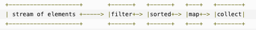
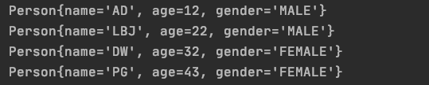
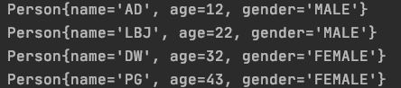
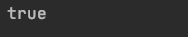

# Stream

Table of Contents
=================

   * [Stream](#stream)
      * [1. 什么是 Stream](#1-什么是-stream)
      * [2. 为什么要使用 Stream](#2-为什么要使用-stream)
      * [3. 如何实现 Stream](#3-如何实现-stream)
      * [4. Quickstart](#4-quickstart)
      * [参考资料](#参考资料)


## 1. 什么是 Stream

**Java 8 新特性**

Java 8 API 添加了一个新的抽象称为流 Stream，可以让你以一种声明的方式处理数据。

<div align="center">  </div><br>

这种风格将要处理的元素集合看作一种流， 流在管道中传输， 并且可以在管道的节点上进行处理， 比如筛选， 排序，聚合等。

元素流在管道中经过中间操作（intermediate operation）的处理，最后由最终操作(terminal operation)得到前面处理的结果。


## 2. 为什么要使用 Stream

**方便开发，主要用于集合类**

这种风格将要处理的元素集合看作一种流， 流在管道中传输， 并且可以在管道的节点上进行处理， 比如筛选， 排序，聚合等。

元素流在管道中经过中间操作（intermediate operation）的处理，最后由最终操作 (terminal operation) 得到前面处理的结果。


## 3. 如何实现 Stream

**记住，Stream 关注的是做什么，而不是怎么做**


## 4. Quickstart

传统的写法：

```java
public static void main(String[] args) {

    List<Person> personList = new ArrayList<>();

    personList.add(new Person("AD", 12, MALE.name()));
    personList.add(new Person("LBJ", 22, MALE.name()));
    personList.add(new Person("DW", 32, FEMALE.name()));
    personList.add(new Person("PG", 43, FEMALE.name()));

    for (Person person : personList) {
        System.out.println(person);
    }

}
```


<div align="center">  </div><br>

- 筛选出所有女生

  ```java
  List<Person> females = personList.stream()
          .filter(person -> person.getGender().equals(FEMALE.name()))
          .collect(Collectors.toList());
  
  females.forEach(System.out::println);
  ```

  思维是：

  `personList` 是一个数组

  对于数组，我们可以使用 `stream` 优雅我们的写法

  过滤，转为 `list`

  对于每个元素，输出（遍历）
  

  <div align="center">  </div><br>

- 按照年龄从小到大排序

  ```java
  List<Person> sorted = personList.stream()
    .sorted(Comparator.comparing(Person::getAge))
    .collect(Collectors.toList());
  
  sorted.forEach(System.out::println);
  ```


<div align="center">  </div><br>

- 按照年龄从大到小排序

  ```java
  List<Person> sorted = personList.stream()
          .sorted(Comparator.comparing(Person::getAge).reversed())
          .collect(Collectors.toList());
  
  sorted.forEach(System.out::println);
  ```


  <div align="center">  </div><br>

- 是否所有元素都是男生

  ```java
  boolean allMatch = personList.stream()
          .allMatch(person -> person.getGender().equals(FEMALE.name()));
  
  System.out.println(allMatch);
  ```

  <div align="center">  </div><br>

- 是否所有元素年龄都大于 10

  ```java
  boolean noneMatch = personList.stream()
          .noneMatch(person -> person.getAge() <= 10);
  
  System.out.println(noneMatch);
  ```


  <div align="center">  </div><br>

- 获取最值

  ```java
  personList.stream()
          .max(Comparator.comparing(Person::getAge))
          .ifPresent(System.out::println);
  ```


- 按性别排列

  ```java
  Map<String, List<Person>> genderGroup = personList.stream()
          .collect(Collectors.groupingBy(Person::getGender));
  
  genderGroup.forEach((s, people) -> {
      System.out.println(s);
      people.forEach(person -> {
          System.out.println(person);
      });
  });
  ```


## 参考资料

- [Java 8 Stream](https://www.runoob.com/java/java8-streams.html)
- [Java Streams Tutorial | 2020](https://www.youtube.com/watch?v=Q93JsQ8vcwY)