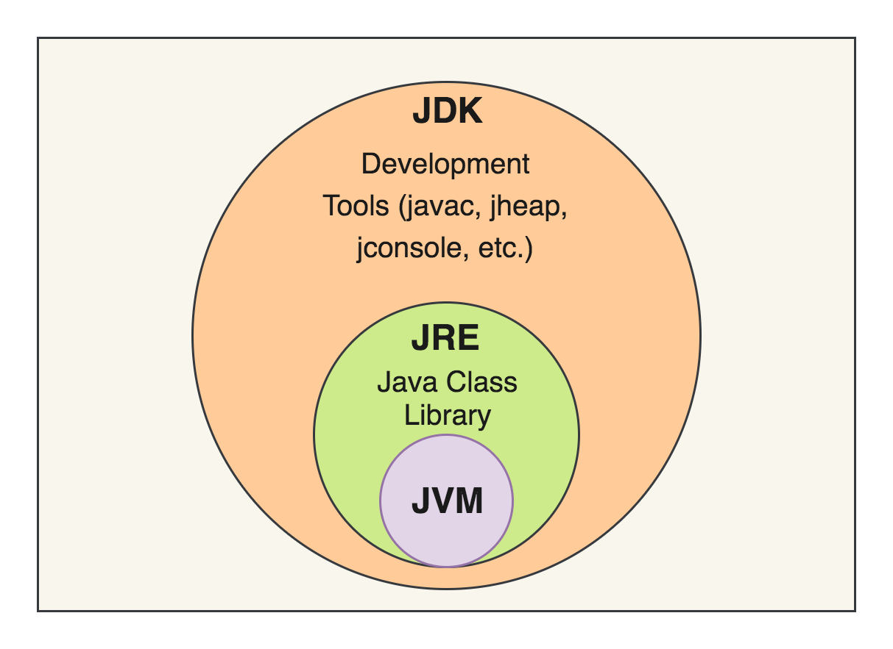
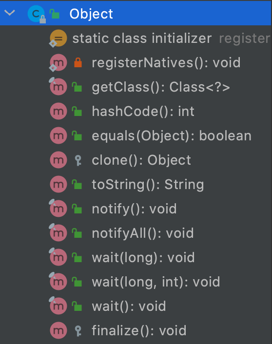
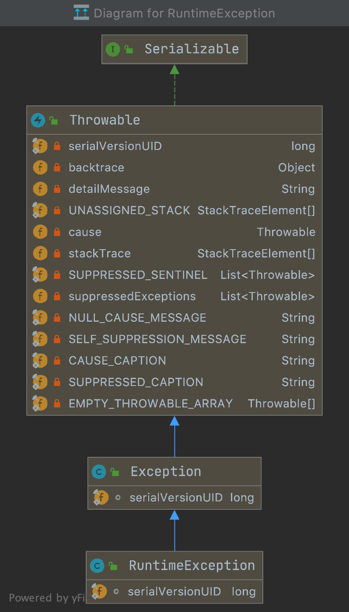

# Java Interview Questions

Table of Contents
-----------------

* [1. Is Data Passed by Reference or by Value in Java?](#1-is-data-passed-by-reference-or-by-value-in-java)
* [2. Which Access Modifiers Are Available in Java and What Is Their Purpose?](#2-which-access-modifiers-are-available-in-java-and-what-is-their-purpose)
* [3. What Is the Difference Between JDK, JRE, and JVM?](#3-what-is-the-difference-between-jdk-jre-and-jvm)
* [4. What Are the Methods of the Object Class and What Do They Do?](#4-what-are-the-methods-of-the-object-class-and-what-do-they-do)
* [5. Exception 和 Error 有何区别？](#5-exception-和-error-有何区别)
* [References](#references)


## 1. Is Data Passed by Reference or by Value in Java?

首先理清楚两个概念：

- 值传递：传递该 `object` 的一份拷贝
- 引用传递：传递该 `object` 的引用


在 `Java` 中，

1. 对于原始数据类型：

- byte
- short
- int
- long
- float
- double
- char
- boolean

存放的是其确切的值

2. 对于非原始数据类型（对象，包装类等）存放的是其引用值（address）


**两者都存放于栈内存中**


举个例子：


**App.java**

```java
public class App {

    @Test
    public void testPrimitives() {

        int x = 1;
        int y = 2;

        assertEquals(1, x);
        assertEquals(2, y);

        modifyPrimitives(x, y);

        // Test passed
        assertEquals(1, x);
        assertEquals(2, y);

    }

    public void modifyPrimitives(int x, int y) {
        x = 5;
        y = 10;
    }

    @Test
    public void testNonPrimitives() {

        Person a = new Person(1);
        Person b = new Person(2);

        assertEquals(1, a.age);
        assertEquals(2, b.age);

        modifyNonPrimitives(a, b);

        // Test passed
        assertEquals(2, a.age);
        assertEquals(2, b.age);

    }

    public void modifyNonPrimitives(Person a, Person b) {

        a.age++;

        Person newPerson = new Person(23);
        newPerson.age++;

    }

    public class Person {

        int age;

        public Person(int age) {
            this.age = age;
        }

    }

}
```


## 2. Which Access Modifiers Are Available in Java and What Is Their Purpose?

- private：只对当前类暴露

- default：对当前 `package` 暴露

- protected：在 `default` 的基础上，若子类不在当前 `package` 下也可以访问

- public：对所有开放

  


## 3. What Is the Difference Between JDK, JRE, and JVM?

  <div align="center">  </div><br>


## 4. What Are the Methods of the Object Class and What Do They Do?

  <div align="center">  </div><br>

- getClass: Returns the runtime class of this object
- hashCode: The hashCode method does return distinct integers for distinct objects
- equals: Indicates whether some other object is "equal to" this one
- clone:
- toString: Returns a string representation of the object
- notify:
- notifyAll:
- wait:
- finalize:


**App.java**

```java
public class App {

    public static void main(String[] args) {

        String a = "aaa";
        System.out.println(a.getClass());  // class java.lang.String

        Integer b = 100;
        System.out.println(b.getClass());  // class java.lang.Integer

    }

}
```


## 5. Exception 和 Error 有何区别？

**相同：**

继承了 `Throwable` 类，证明可以被抛出 `throw` 和捕获 `catch`


**不同：**

`Exception` 是程序运行中可以预料的意外情况，应该被 `catch` 到，并进行相应的处理；而 `Error` 是指正常情况下不太可能出现的异

 常（若出现，则会导致程序运行出错）


**值得注意的是：**

`Exception` 分为 `checked` 和 `unchecked` 两种，前者需要在 `coding` 时显示 `try-catch`，而后者不用

后者需继承 `RuntimeException`（如空指针，数组越界，应该在 `coding` 的时候避免）


  <div align="center">  </div><br>


## References

- [Java Interview Questions](https://www.baeldung.com/java-interview-questions)
- [Cannot find symbol assertEquals](https://stackoverflow.com/questions/20631621/cannot-find-symbol-assertequals)
- [A Guide to Java Enums](https://www.baeldung.com/a-guide-to-java-enums)
- [Why String is Immutable in Java?](https://www.baeldung.com/java-string-immutable)
