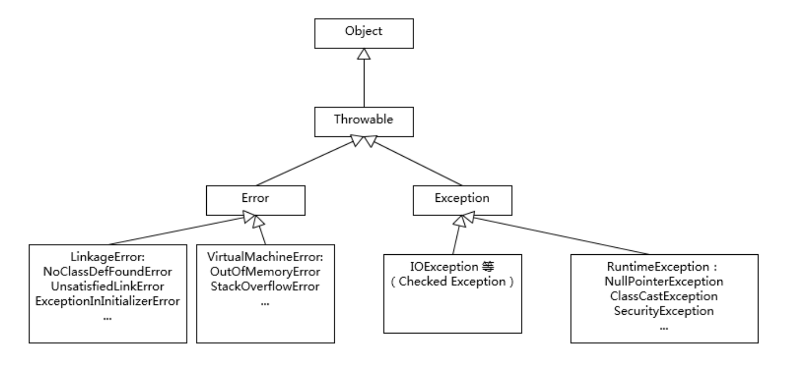

# Java Interview Questions

Table of Contents
-----------------

* [1. Java 到底是值传递还是地址传递？](#1-java-到底是值传递还是地址传递)
* [2. 说说 JDK, JRE, JVM 的区别？](#2-说说-jdk-jre-jvm-的区别)
* [3. Exception 和 Error 有何区别？](#3-exception-和-error-有何区别)
* [4. int 和 Integer 有什么区别？](#4-int-和-integer-有什么区别)
* [References](#references)


## 1. Java 到底是值传递还是地址传递？

首先理清楚两个概念：

- 值传递：传递该 `object` 的一份拷贝
- 引用传递：传递该 `object` 的引用


在 `Java` 中，

1. 对于原始数据类型：

- byte
- short
- int
- long
- float
- double
- char
- boolean

存放的是其确切的值

2. 对于非原始数据类型（对象，包装类等）存放的是其引用值（address）


**两者都存放于栈内存中**


举个例子：


**App.java**

```java
public class App {

    @Test
    public void testPrimitives() {

        int x = 1;
        int y = 2;

        assertEquals(1, x);
        assertEquals(2, y);

        modifyPrimitives(x, y);

        // Test passed
        assertEquals(1, x);
        assertEquals(2, y);

    }

    public void modifyPrimitives(int x, int y) {
        x = 5;
        y = 10;
    }

    @Test
    public void testNonPrimitives() {

        Person a = new Person(1);
        Person b = new Person(2);

        assertEquals(1, a.age);
        assertEquals(2, b.age);

        modifyNonPrimitives(a, b);

        // Test passed
        assertEquals(2, a.age);
        assertEquals(2, b.age);

    }

    public void modifyNonPrimitives(Person a, Person b) {

        a.age++;

        Person newPerson = new Person(23);
        newPerson.age++;

    }

    public class Person {

        int age;

        public Person(int age) {
            this.age = age;
        }

    }

}
```


## 2. JDK, JRE, JVM 有什么关系？

  <div align="center">  </div><br>


## 3. Exception 和 Error 有何区别？

**相同：**

继承了 `Throwable` 类，证明可以被抛出 `throw` 和捕获 `catch`


**不同：**

`Exception` 是程序运行中可以预料的意外情况，应该被 `catch` 到，并进行相应的处理；而 `Error` 是指正常情况下不太可能出现的异

 常（若出现，则会导致程序运行出错）


**值得注意的是：**

`Exception` 分为 `checked` 和 `unchecked` 两种，前者需要在 `coding` 时显示 `try-catch`，而后者不用

后者需继承 `RuntimeException`（如空指针，数组越界，应该在 `coding` 的时候避免）


  <div align="center">  </div><br>


  <div align="center">  </div><br>


**延伸 1：ClassNotFoundException 和 NoClassDefFoundError 有何区别？**


**ClassNotFoundException:**

*ClassNotFoundException* is a checked exception which occurs when an application tries to load a class through its fully-qualified name and can not find its definition on the classpath

```java
@Test(expected = ClassNotFoundException.class)
public void givenNoDrivers_whenLoadDriverClass_thenClassNotFoundException() 
  throws ClassNotFoundException {
      Class.forName("oracle.jdbc.driver.OracleDriver");
}
```


**NoClassDeFoundError:**


**延伸 2：在捕获特定异常而不是通用异常，方便定位问题**


**延伸 3：不要生吞异常（在 catch 中以日志的方式输出）**


## 4. int 和 Integer 有什么区别？


**知识点：自动装箱 / 自动拆箱**

自动拆箱 / 装箱指的是原始数据类型与其包装类型的相互转换


构建 `Integer` 对象的传统方式是直接 `new`，但根据实践，发现大部分数据都是集中在有限的，较小的数值范围（二八原则？），因此在调用 `valueOf` 方法时会利用一个缓存机制，带来了性能的提升。**默认缓存是 -128 到 127**（在特定的应用场景，可能会频繁地使用更大的数值，这里可以通过 `JVM` 进行调参）


**IntegerCache**

```java
private static class IntegerCache {
    static final int low = -128;
    static final int high;
    static final Integer cache[];

    static {
        // high value may be configured by property
        int h = 127;
        String integerCacheHighPropValue =
            sun.misc.VM.getSavedProperty("java.lang.Integer.IntegerCache.high");
        if (integerCacheHighPropValue != null) {
            try {
                int i = parseInt(integerCacheHighPropValue);
                i = Math.max(i, 127);
                // Maximum array size is Integer.MAX_VALUE
                h = Math.min(i, Integer.MAX_VALUE - (-low) -1);
            } catch( NumberFormatException nfe) {
                // If the property cannot be parsed into an int, ignore it.
            }
        }
        high = h;

        cache = new Integer[(high - low) + 1];
        int j = low;
        for(int k = 0; k < cache.length; k++)
            cache[k] = new Integer(j++);

        // range [-128, 127] must be interned (JLS7 5.1.7)
        assert IntegerCache.high >= 127;
    }

    private IntegerCache() {}
}
```


## References

- [Java Interview Questions](https://www.baeldung.com/java-interview-questions)
- [Cannot find symbol assertEquals](https://stackoverflow.com/questions/20631621/cannot-find-symbol-assertequals)
- [A Guide to Java Enums](https://www.baeldung.com/a-guide-to-java-enums)
- [Why String is Immutable in Java?](https://www.baeldung.com/java-string-immutable)
- [ClassNotFoundException vs NoClassDefFoundError](https://www.baeldung.com/java-classnotfoundexception-and-noclassdeffounderror)

