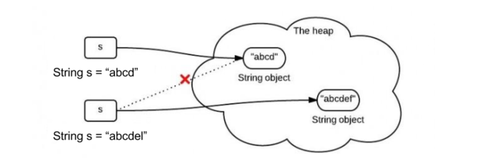

# Java 基础

Table of Contents
-----------------

* [Brainstorming](#brainstorming)
* [1. Data types](#1-data-types)
   * [1.1 基本类型](#11-基本类型)
   * [1.2 Autoboxing &amp; Unboxing](#12-autoboxing--unboxing)
   * [1.3 IntegerCache](#13-integercache)
   * [1.4 String](#14-string)
      * [1.4.1 Immutable](#141-immutable)
      * [1.4.2 String Pool](#142-string-pool)
      * [1.4.3 为什么 String 设计成不可变?](#143-为什么-string-设计成不可变)
* [2. 运算](#2-运算)
* [3. Keyword](#3-keyword)
* [4. Object](#4-object)
* [5. 继承](#5-继承)
* [6. 反射](#6-反射)
* [7. 异常](#7-异常)
* [8. 泛型](#8-泛型)
* [9. 注解](#9-注解)
* [References](#references)

## Brainstorming

<div align="center">  </div><br>

## 1. Data types

### 1.1 基本类型

- 二进制中的一位称为 `bit`


### 1.2 Autoboxing & Unboxing

```java
public class Main {

    public static void main(String[] args) {
        // Autoboxing: Integer.valueOf(int)
        Integer x = 1;
        // Unboxing: x.intValue()
        int y = x;
        // x 会拆箱 实际上是两个 int 在比较
        System.out.println(x == y);  // true
    }
}
```


### 1.3 IntegerCache

```java
public static Integer valueOf(int i) {
    if (i >= IntegerCache.low && i <= IntegerCache.high)
        return IntegerCache.cache[i + (-IntegerCache.low)];
    return new Integer(i);
}

// 下限为 -128
static final int low = -128;
// 上限默认 127, 可通过 JVM 调参
static final int high;
```


### 1.4 String

#### 1.4.1 Immutable

在 Java 8，`String` 内部使用 `char[]` 存储数据，

```java
public final class String
    implements java.io.Serializable, Comparable<String>, CharSequence {
    /** The value is used for character storage. */
    private final char value[];
```


**如何理解不可变?**

```java
public class Main {

    public static void main(String[] args) {

        String a = "abc";
        System.out.println(a.hashCode());  // 96354

        a = "efg";
        System.out.println(a.hashCode());  // 100326

    }
}
```

<div align="center">  </div><br>


#### 1.4.2 String Pool

Java String Pool is the special memory region where Strings are stored by the JVM


Thanks to the immutability of *Strings* in Java, the JVM can optimize the amount of memory allocated for them by **storing only one copy of each literal String in the pool**. This process is called *interning*.


<div align="center">  </div><br>


**不使用 new 关键字创建 String**

```java
public class Main {

    public static void main(String[] args) {
        String a = "abc";
        String b = "abc";
        System.out.println(a == b);  // true
    }
}
```

**使用 new 关键字创建 String**

```java
public class Main {

    public static void main(String[] args) {
        String a = "abc";
        String b = new String("abc");
        System.out.println(a == b);  // false
    }
}
```


#### 1.4.3 为什么 String 设计成不可变?

1. Caching hashcode

   `String` 经常作为 `key` 使用（例如 `hashmap`）

   好处：可以缓存其 `hash` 值，避免重复计算

   ```java
   public final class String
       implements java.io.Serializable, Comparable<String>, CharSequence {
   
       /** Cache the hash code for the string */
       private int hash; // Default to 0
   ```

2. Security

   `String` 另一个应用场景是作为类的传递参数（例如网络传输，文件等）

   好处：避免安全问题

   ```java
   boolean connect(string s){
       if (!isSecure(s)) { 
   throw new SecurityException(); 
   }
       //here will cause problem, if s is changed before this by using other references.    
       causeProblem(s);
   }
   ```

3. Thread-safe


## 2. 运算


## 3. Keyword


## 4. Object


## 5. 继承


## 6. 反射


## 7. 异常


## 8. 泛型


## 9. 注解


## References

- [CS-Notes](https://github.com/CyC2018/CS-Notes/blob/master/notes/Java%20%E5%9F%BA%E7%A1%80.md)
- [Guide to Java String Pool](https://www.baeldung.com/java-string-pool)
- [Why String is Immutable in Java?](https://www.baeldung.com/java-string-immutable)
- [Why String is immutable in Java?](https://www.programcreek.com/2013/04/why-string-is-immutable-in-java/)