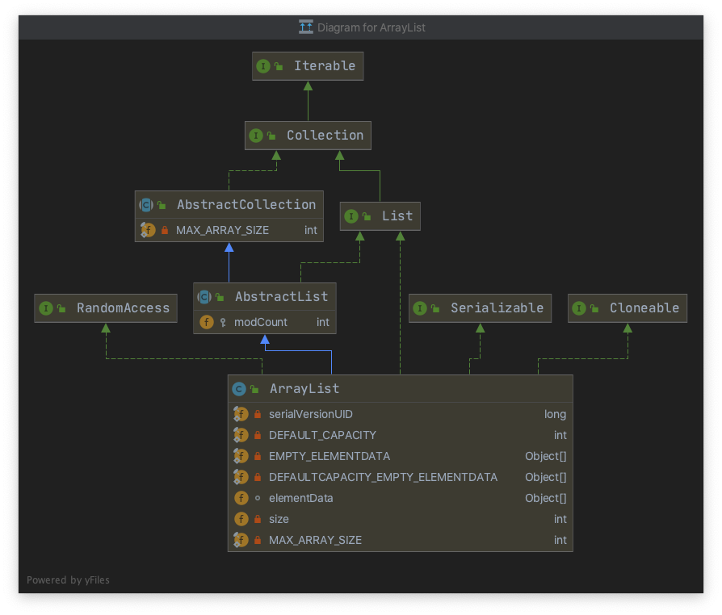

# ArrayList 

Table of Contents
-----------------

* [Overview](#overview)
* [Constructor](#constructor)
* [set()](#set)
* [get()](#get)
* [add()](#add)
* [remove()](#remove)
* [参考链接](#参考链接)


## Overview

<div align="center">  </div><br>

优点：

- 查询快，根据地址和索引直接获取元素

缺点：

- 数组增删慢，需要创建新的数组，且移动元素位置


```java
public class ArrayList<E> extends AbstractList<E>
        implements List<E>, RandomAccess, Cloneable, java.io.Serializable {
  
}
```

<div align="center">  </div><br>


- RandomAccess：支持 `O(1)` 级别的随机访问 / 顺序访问
- Cloneanle：支持克隆（需重写 `clone` 方法）
- Serializable：可支持序列化


```java
private static final long serialVersionUID = 8683452581122892189L;

/**
 * Default initial capacity.
 */
private static final int DEFAULT_CAPACITY = 10;

/**
 * Shared empty array instance used for empty instances.
 */
private static final Object[] EMPTY_ELEMENTDATA = {};

/**
 * Shared empty array instance used for default sized empty instances. We
 * distinguish this from EMPTY_ELEMENTDATA to know how much to inflate when
 * first element is added.
 */
private static final Object[] DEFAULTCAPACITY_EMPTY_ELEMENTDATA = {};

/**
 * The array buffer into which the elements of the ArrayList are stored.
 * The capacity of the ArrayList is the length of this array buffer. Any
 * empty ArrayList with elementData == DEFAULTCAPACITY_EMPTY_ELEMENTDATA
 * will be expanded to DEFAULT_CAPACITY when the first element is added.
 */
transient Object[] elementData; // non-private to simplify nested class access

/**
 * The size of the ArrayList (the number of elements it contains).
 *
 * @serial
 */
private int size;
```

## Constructor

`ArrayList` 包含 3 个构造方法：

- ArrayList()
- ArrayList(int initialCapacity)
- ArrayList(Collection<? extends E> c)

```java
// Constructs an empty list with the specified initial capacity
public ArrayList(int initialCapacity) {
  if (initialCapacity > 0) {
    this.elementData = new Object[initialCapacity];
  } else if (initialCapacity == 0) {
    this.elementData = EMPTY_ELEMENTDATA;
  } else {
    throw new IllegalArgumentException("Illegal Capacity: "+
                                       initialCapacity);
  }
}

// Constructs an empty list with an initial capacity of ten
public ArrayList() {
  this.elementData = DEFAULTCAPACITY_EMPTY_ELEMENTDATA;
}

// Constructs a list containing the elements of the specified collection
public ArrayList(Collection<? extends E> c) {
  elementData = c.toArray();
  if ((size = elementData.length) != 0) {
    // c.toArray might (incorrectly) not return Object[] (see 6260652)
    if (elementData.getClass() != Object[].class)
      elementData = Arrays.copyOf(elementData, size, Object[].class);
  } else {
    // replace with empty array.
    this.elementData = EMPTY_ELEMENTDATA;
  }
}
```


## set()

`set()` 方法逻辑比较简单，先检查 `index` 是否合法，若合法只需要在 `index` 位置替换掉原先的元素即可 

```java
// Replaces the element at the specified position in this list with the specified element
public E set(int index, E element) {
  rangeCheck(index);

  E oldValue = elementData(index);
  elementData[index] = element;
  return oldValue;
}

// Check if the given index is in range
private void rangeCheck(int index) {
  if (index >= size)
    throw new IndexOutOfBoundsException(outOfBoundsMsg(index));
}

// Get element by specific index
E elementData(int index) {
  return (E) elementData[index];
}
```


## get()

`get()` 方法和 `set()` 逻辑相似

```java
// Returns the element at the specified position in this list
public E get(int index) {
  rangeCheck(index);

  return elementData(index);
}

// Check if the given index is in range
private void rangeCheck(int index) {
  if (index >= size)
    throw new IndexOutOfBoundsException(outOfBoundsMsg(index));
}

// Get element by specific index
E elementData(int index) {
  return (E) elementData[index];
}
```


## add()

`add()` 方法首先确保内部空间是否足够

- 足够：直接赋值
- 不够：扩容

```java
// Appends the specified element to the end of this list
public boolean add(E e) {
  ensureCapacityInternal(size + 1);  // Increments modCount!!
  elementData[size++] = e;
  return true;
}

// 确保内部容量是否足够
private void ensureCapacityInternal(int minCapacity) {

  // 当空参构造方法第一次调用 add() 时，默认容量为 10
  if (elementData == DEFAULTCAPACITY_EMPTY_ELEMENTDATA) {
    minCapacity = Math.max(DEFAULT_CAPACITY, minCapacity);
  }

  // 判断是否需要扩容
  ensureExplicitCapacity(minCapacity);
}

private void ensureExplicitCapacity(int minCapacity) {
  modCount++;

  // 若容量不足，调用 grow() 进行扩容
  // overflow-conscious code
  if (minCapacity - elementData.length > 0)
    grow(minCapacity);
}

// 扩容方法
private void grow(int minCapacity) {
  // overflow-conscious code
  int oldCapacity = elementData.length;
  
  // 扩容 1.5 倍（新容量为旧容量的 1.5 倍）
  int newCapacity = oldCapacity + (oldCapacity >> 1);
  
  // 若新容量仍不够，直接扩容到所需的最小容量
  if (newCapacity - minCapacity < 0)
    newCapacity = minCapacity;
  if (newCapacity - MAX_ARRAY_SIZE > 0)
    newCapacity = hugeCapacity(minCapacity);
  // minCapacity is usually close to size, so this is a win:
  elementData = Arrays.copyOf(elementData, newCapacity);
}
```
<div align="center">  </div><br>


<div align="center">  </div><br>

## remove()

```java
// Removes the element at the specified position in this list
public E remove(int index) {
  rangeCheck(index);

  modCount++;
  E oldValue = elementData(index);

  int numMoved = size - index - 1;
  if (numMoved > 0)
    System.arraycopy(elementData, index+1, elementData, index,
                     numMoved);
  elementData[--size] = null; // clear to let GC do its work

  return oldValue;
}

// Removes the first occurrence of the specified element from this list, if it is present.  If the list does not contain the element, it is unchanged
public boolean remove(Object o) {
  if (o == null) {
    for (int index = 0; index < size; index++)
      if (elementData[index] == null) {
        fastRemove(index);
        return true;
      }
  } else {
    for (int index = 0; index < size; index++)
      if (o.equals(elementData[index])) {
        fastRemove(index);
        return true;
      }
  }
  return false;
}
```


## 参考链接

- [Java Collections Framework Internals - ArrayList](https://github.com/CarpenterLee/JCFInternals/blob/master/markdown/2-ArrayList.md)