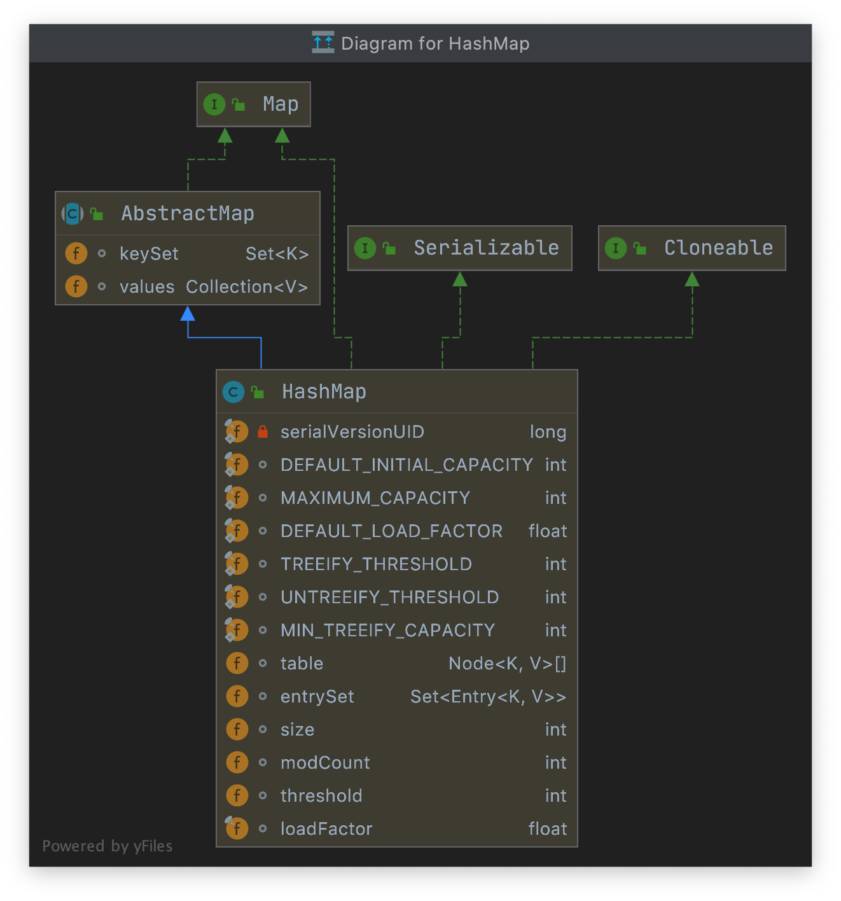

# HashMap 

## 1. 预备知识

### 1.1 什么是哈希表？

维基百科

> 散列表（Hash table，也叫哈希表），是根据键（Key）而直接访问在内存储存位置的数据结构。也就是说，它通过计算一个关于键值的函数，将所需查询的数据映射到表中一个位置来访问记录，这加快了查找速度。这个映射函数称做散列函数，存放记录的数组称做散列表。

### 1.2 哈希表的特点

- 不可从 `hash` 反推原始数据
- 输入数据的微小变化会得到完全不同的 `hash` 值，相同的数据会得到相同的值
- 执行效率高效
- 冲突概率小

## 2. 原理

  
 

## 参考链接

- [What is a HashTable Data Structure - Introduction to Hash Tables , Part 0](https://www.youtube.com/watch?v=MfhjkfocRR0)
-  [What is Hashing? Hash Functions Explained Simply](https://www.youtube.com/watch?v=2BldESGZKB8)