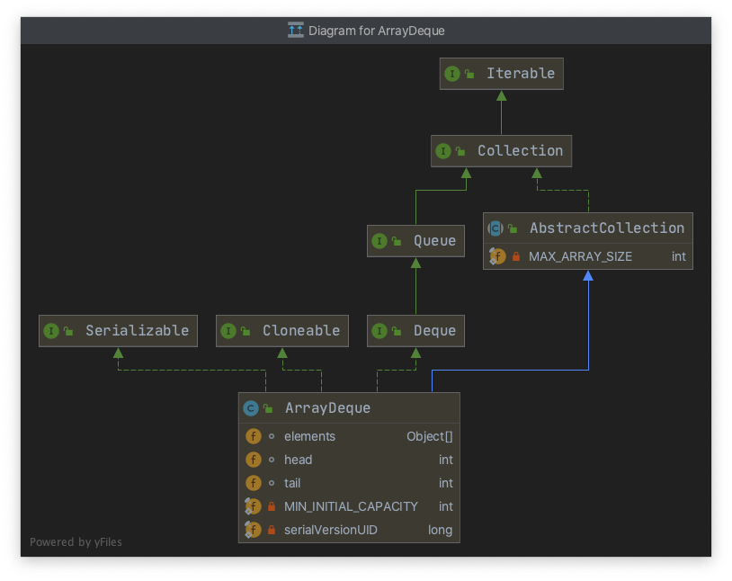

# Stack & Queue

## 前言

```java
public class Stack<E>
  extends Vector<E>
```

The `Stack` class represents a last-in-first-out (LIFO) stack of objects. It extends class `Vector` with five operations that allow a vector to be treated as a stack. The usual `push` and `pop` operations are provided, as well as a method to `peek` at the top item on the stack, a method to test for whether the stack is `empty`, and a method to `search` the stack for an item and discover how far it is from the top.

When a stack is first created, it contains no items.

A more complete and consistent set of LIFO stack operations is provided by the [`Deque`](https://docs.oracle.com/javase/8/docs/api/java/util/Deque.html) interface and its implementations, which should be used in preference to this class. For example:

```java
Deque<Integer> stack = new ArrayDeque<Integer>();
```

`Java` 官方推荐使用 `ArrayDequeue` 来实现栈和队列，本文重点介绍 `ArrayDeque` 的实现和原理


## Overview

```java
public class ArrayDeque<E> extends AbstractCollection<E>
                           implements Deque<E>, Cloneable, Serializable
{
```


<div align="center">  </div><br>

要想透彻了解 `ArrayDeque`，首先需要了解 `Deque`：双端队列

<div align="center">  </div><br>


```java
// Deque is short for "double ended queue"
// which supports element insertion and removal at both ends
public interface Deque<E> extends Queue<E> {

  
  // Inserts the specified element at the front of this deque
  // Otherwise, throw an IllegalStateException
  void addFirst(E e);

  
  // Inserts the specified element at the end of this deque
  // Otherwise, throw an IllegalStateException
  void addLast(E e);
  
  
  // Inserts the specified element at the front of this deque 
  // unless it would violate capacity restrictions
  // 推荐使用
  boolean offerFirst(E e);


  // Inserts the specified element at the end of this deque 
  // unless it would violate capacity restrictions
  // 推荐使用
  boolean offerLast(E e);

  // Retrieves and removes the first element of this deque
  // it throws an exception if this deque is empty
  E removeFirst();


  // Retrieves and removes the last element of this deque
  // it throws an exception if this deque is empty
  E removeLast();


  // Retrieves and removes the first element of this deque
  // returns {@code null} if this deque is empty
  E pollFirst();


  // Retrieves and removes the last element of this deque
  // returns {@code null} if this deque is empty
  E pollLast();


  // Retrieves, but does not remove, the first element of this deque
  // it throws an exception if this deque is empty
  E getFirst();


  // Retrieves, but does not remove, the last element of this deque
  // it throws an exception if this deque is empty
  E getLast();


  // Retrieves, but does not remove, the first element of this deque
  // or returns {@code null} if this deque is empty
  E peekFirst();

  // Retrieves, but does not remove, the last element of this deque
  // or returns {@code null} if this deque is empty
  E peekLast();


  boolean removeFirstOccurrence(Object o);

  boolean removeLastOccurrence(Object o);

  boolean add(E e);


  boolean offer(E e);


  E remove();


  E poll();


  E element();


  E peek();


  void push(E e);


  E pop();


  boolean remove(Object o);

  boolean contains(Object o);


  public int size();


  Iterator<E> iterator();


  Iterator<E> descendingIterator();

}
```


## Constructor


