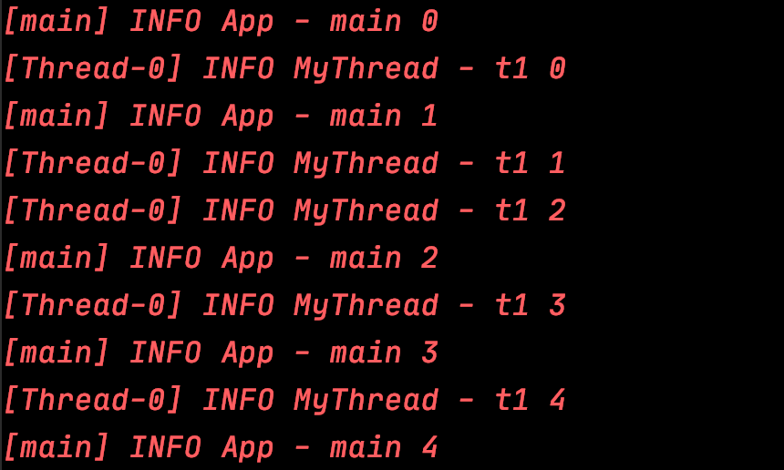
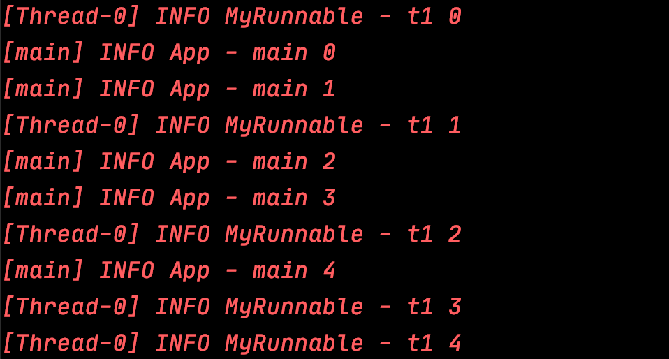
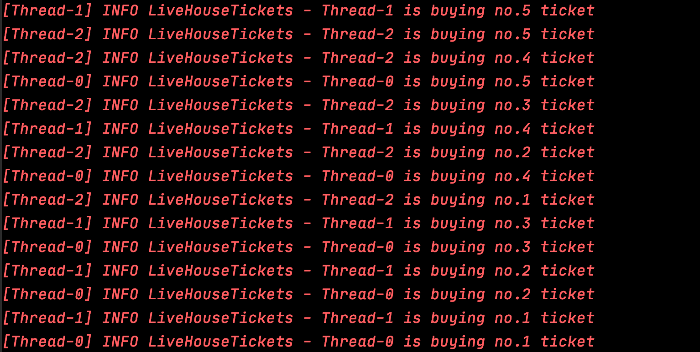

# Java Concurrency

Table of Contents
-----------------

* [Brainstorming](#brainstorming)
* [1. 进程 &amp; 线程的诞生](#1-进程--线程的诞生)
   * [1.1 批处理操作系统](#11-批处理操作系统)
   * [1.2 进程的提出](#12-进程的提出)
   * [1.3 线程的提出](#13-线程的提出)
* [2. 如何创建线程?](#2-如何创建线程)


## Brainstorming

  <div align="center">  </div><br>

## 1. 进程 & 线程的诞生

最初的计算机只能接受一些特定的指令，用户输入一些指令，计算机读取后执行

在用户思考 / 输入时，计算机大量时间处于等待状态，效率低下


### 1.1 批处理操作系统

到了批处理操作系统时代，用户可以将需要执行的指令用一张清单记录，作为计算机的输入

计算机执行过后，会将结果输出到另一张清单上

这样虽然提高了效率，但在一定程度上，**由于批处理操作系统的指令方式是串行的，内存中仍然只有一个程序在运行**

当前一个程序由于 I / O 操作或网络原因堵塞时，效率受到限制


### 1.2 进程的提出

为了解决上述问题，科学家提出的进程的概念


**进程就是在内存中分配空间，也就是正在运行的程序**


各个线程之间互不干扰，同时进程保持着每一个程序的运行状态

`CPU` 采用时间片轮转的方式运行线程：`CPU` 为每个进程分配一个时间段，称作时间片。

如果在时间片结束时进程仍然在运行，则暂停这个进程的运行，并且 `CPU` 分配给另一个进程（上下文切换）

若进程在时间片结束之前阻塞 / 结束，`CPU` 立即进行切换，不用等时间片用完


进程在我们生活中无处不在

<div align="center">  </div><br>


### 1.3 线程的提出

虽然进程的出现再次提升了操作系统的性能，但随着时间的推移，人们并不满足一个进程在一段时间内只能做一件事情。如果一个线程有多个子任务时，只能逐个地执行这些子任务，很影响效率

<div align="center">  </div><br>

那能否让这些子任务同时执行呢？于是人们又提出了线程的概念

**让一个线程执行一个子任务，则一个进程就包含了多个线程**

## 2. 如何创建线程?

三种方式：

- 继承 Thread，重写 run 方法

**MyThread.java**

```java
@Slf4j
public class MyThread extends Thread {
    @Override
    public void run() {
        for (int i = 0; i < 5; i++) {
            log.info("t1 " + i);
        }
    }
}
```

**App.java**

```java
@Slf4j
public class App {
    public static void main(String[] args) {

        MyThread t1 = new MyThread();
        t1.start();

        for (int i = 0; i < 5; i++) {
            log.info("main " + i);
        }

    }
}
```


<div align="center">  </div><br>

- 实现 Runnable 接口，重写 run 方法

**MyRunnable.java**

```java
@Slf4j
public class MyRunnable implements Runnable {
    public void run() {
        for (int i = 0; i < 5; i++) {
            log.info("t1 " + i);
        }
    }
}
```

**App.java**

```java
@Slf4j
public class App {
    public static void main(String[] args) {

        Thread t1 = new Thread(new MyRunnable());
        t1.start();

        for (int i = 0; i < 5; i++) {
            log.info("main " + i);
        }

    }
}
```

<div align="center">  </div><br>

生活中有着许多并发的场景，比如你最喜爱的 rapstar 要开 live 了，粉丝和 bot 疯狂进行抢票，面对并发问题若不采取措施，后果将不堪设想


比如说：

**LiveHouseTickets.java**

```java
@Slf4j
public class LiveHouseTickets implements Runnable{

    private int ticket = 5;

    public void run() {
        while (true) {

            if (ticket <= 0) break;

            log.info(Thread.currentThread().getName() + " is buying no." + ticket + " ticket");
            ticket--;

        }
    }

    public static void main(String[] args) {
        new Thread(new LiveHouseTickets()).start();
        new Thread(new LiveHouseTickets()).start();
        new Thread(new LiveHouseTickets()).start();
    }

}
```

<div align="center">  </div><br>


## References