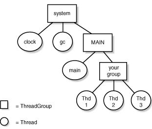
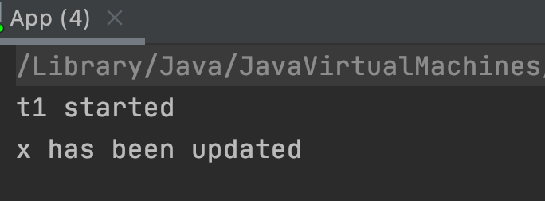
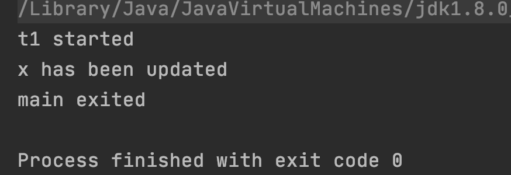

# Java Concurrency

Table of Contents
-----------------

* [Brainstorming](#brainstorming)
* [1. 基础](#1-基础)
   * [1.1 继承 Thread](#11-继承-thread)
   * [1.2 实现 Runnable](#12-实现-runnable)
   * [1.3 Thread 类构造方法](#13-thread-类构造方法)
   * [1.4 ThreadGroup](#14-threadgroup)
* [2. 原理](#2-原理)
   * [2.1 CPU cache](#21-cpu-cache)
   * [2.1 volatile](#21-volatile)
      * [2.1.1 保证 visibility](#211-保证-visibility)
      * [2.1.2 不保证 atomicity](#212-不保证-atomicity)
      * [2.1.3 保证 ordering](#213-保证-ordering)


## Brainstorming

<div align="center">  </div><br>

## 1. 基础

### 1.1 继承 Thread

```java
public class App {
    public static class MyThread extends Thread {
        @Override
        public void run() {
            System.out.println("Mythread here!");
        }
    }

    public static void main(String[] args) {
        System.out.println("Main here!");
        new MyThread().start();
    }
}
```


### 1.2 实现 Runnable

```java
@FunctionalInterface
public interface Runnable {
    public abstract void run();
}


public class App {

    public static void main(String[] args) {
        new Thread(() -> {
            System.out.println("My thread here!");
        }).start();
        System.out.println("Main here!");
    }
}
```

- `Thread` 的构造函数中，包含 `@FunctionalInterface` 的只有 `Runnable` -> 使用 JDK8 函数式编程简化代码


### 1.3 Thread 类构造方法

对于 1.1 和 1.2 两种构造线程的方法，底层实现逻辑都是调用了 `Thread.init()`

```java
public Thread(Runnable target) {
        init(null, target, "Thread-" + nextThreadNum(), 0);
    }


private void init(ThreadGroup g, Runnable target, String name,
                      long stackSize, AccessControlContext acc,
                      boolean inheritThreadLocals) {
```

- g: 线程组
- target: 要执行的任务
- name: 线程名字
- stackSize:
- acc:
- inheritThreadLocals:

### 1.4 ThreadGroup

`threadgroup` 呈树状结构


<div align="center">  </div><br>

**ThreadGroup.java**

```java
public
class ThreadGroup implements Thread.UncaughtExceptionHandler {
    private final ThreadGroup parent;
    String name;
    int maxPriority;
    boolean destroyed;
    boolean daemon;
    boolean vmAllowSuspension;

    int nUnstartedThreads = 0;
    int nthreads;
    Thread threads[];

    int ngroups;
    ThreadGroup groups[];
```


若创建线程时没有显式指定 `threadgroup`: 使用父线程的 `threadgroup`

**App.java**

```java
public class App {

    public static void main(String[] args) {
        new Thread(() -> {
            System.out.println("The ThreadGroup of t1: "
                    + Thread.currentThread().getThreadGroup().getName());
        }, "t1").start();  // The ThreadGroup of t1: main

        System.out.println("The ThreadGroup of main: "
                + Thread.currentThread().getThreadGroup().getName());  // The ThreadGroup of main: main

    }

}
```

## 2. 原理

### 2.1 CPU cache

<div align="center">  </div><br>

### 2.1 volatile

#### 2.1.1 保证 visibility

**MyObj.java**

```java
public class MyObj {

    private int x = 0;

    public void increase() {
        x = 100;
    }

    public int getX() {
        return x;
    }
}
```

**App.java**

```java
public class App {

    public static void main(String[] args) {

        MyObj obj = new MyObj();

        new Thread(() -> {

            try {
                Thread.sleep(2000);
            } catch (InterruptedException e) {
                e.printStackTrace();
            }

            System.out.println(Thread.currentThread().getName() + " started");
            obj.increase();
            System.out.println("x has been updated");

        }, "t1").start();

        // main thread
        while (obj.getX() == 0) {
            // do nothing
        }

        System.out.println(Thread.currentThread().getName() + " exited");

    }

}
```

**结果**

主线程不停止

<div align="center">  </div><br>


但对变量 x 加上 `volatile` 关键字后


**MyObj.java**

```java
public class MyObj {

    private volatile int x = 0;

    public void increase() {
        x = 100;
    }

    public int getX() {
        return x;
    }
}
```


<div align="center">  </div><br>

#### 2.1.2 不保证 atomicity

#### 2.1.3 保证 ordering


## References

