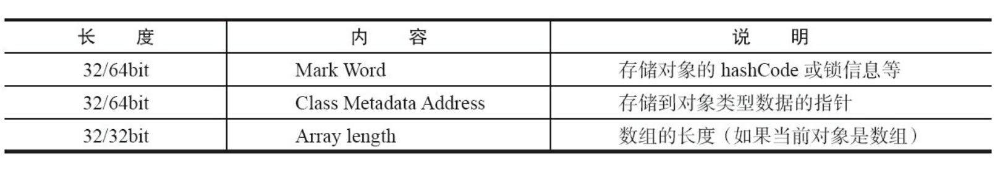
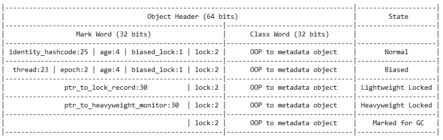
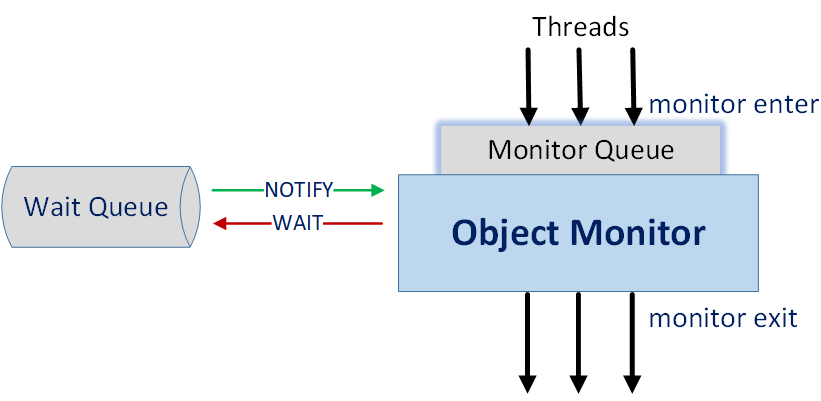
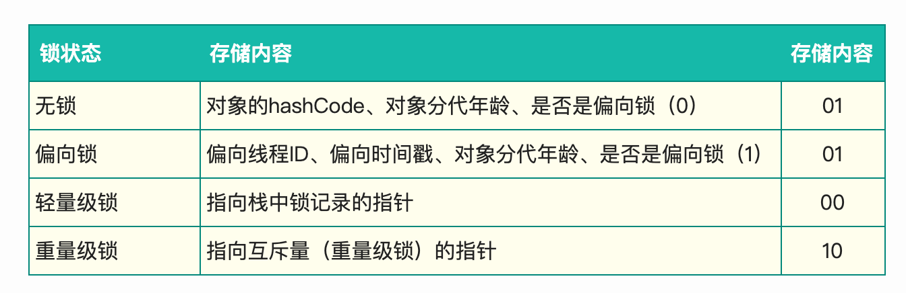
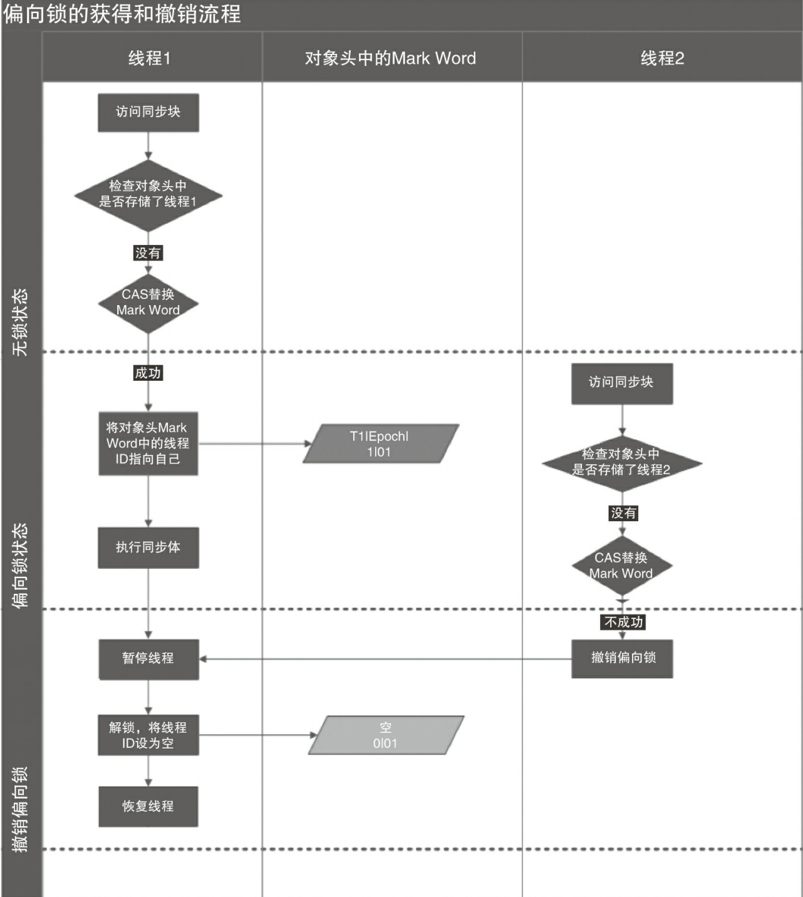
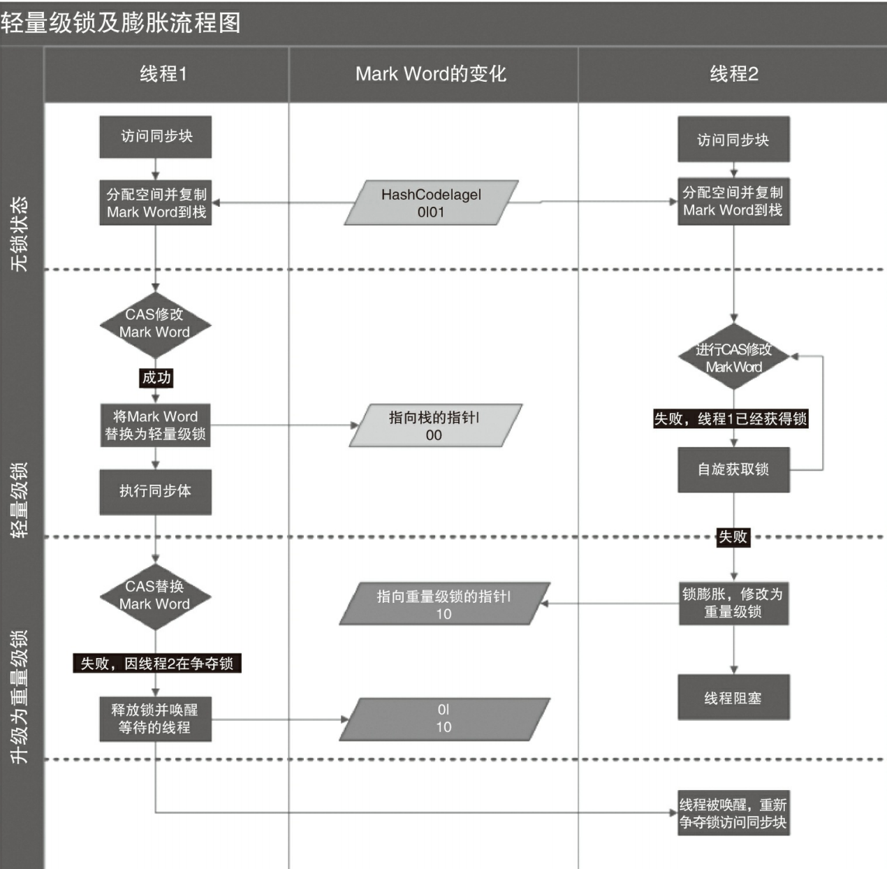
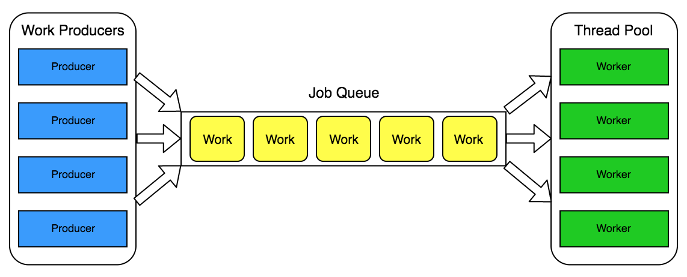

# Concurrency

## Table of Contents

- [1. 关键字](#1-关键字)
	- [1.1 synchronized](#11-synchronized)
	- [1.2 volatile](#12-volatile)
- [2. 线程通信](#2-线程通信)
	- [2.1 生产者/消费者经典范式](#21-生产者消费者经典范式)
- [3. 线程状态](#3-线程状态)
- [4. 锁](#4-锁)
	- [4.1 竞争时流程有没有区别?](#41-竞争时流程有没有区别)
		- [4.1.1 无锁](#411-无锁)
		- [4.1.2 偏向锁](#412-偏向锁)
		- [4.1.3 轻量级锁](#413-轻量级锁)
		- [4.1.4 重量级锁](#414-重量级锁)
	- [4.2 一个线程多个流程能不能获得同一把锁?](#42-一个线程多个流程能不能获得同一把锁)
		- [4.2.1 可重入锁](#421-可重入锁)
	- [4.3 要不要锁住同步资源?](#43-要不要锁住同步资源)
		- [4.3.1 悲观锁](#431-悲观锁)
		- [4.3.2 乐观锁](#432-乐观锁)
- [5. ThreadPool](#5-threadpool)
- [References](#references)


## 1. 关键字

### 1.1 synchronized

**Java Object Header**

<div align="center">  </div><br>

**Mark Word**

<div align="center">  </div><br>

**Monitor in Java**

<div align="center">  </div><br>

### 1.2 volatile

- 内存可见性（**写**：将本地内存的共享变量刷新到主内存中；**读**：将本地内存置为无效，刷新主内存到工作内存，再读）
- 禁止 *volatile* 变量与普通变量重排序（作为轻量级锁，**只保证本线程内**）


**底层实现**

<div align="center">  </div><br>

**重排序规则**

1. 若第一个操作是 *volatile* 读，那无论第二个操作是什么，都不能重排序
2. 如果第二个操作是 *volatile* 写，那无论第一个操作是什么，都不能重排序
3. 如果第一个操作是 *volatile* 写，第二个操作是 *volatile* 读，那不能重排序


## 2. 线程通信

### 2.1 生产者/消费者经典范式

**消费者(等待方)**

```java
synchronized(lock) {
  while (不满足条件) {
    lock.wait()
  }
  // 满足条件后的代码
}
```

**生产者(通知方)**

```java
synchronized(lock) {
  // 改变条件
  lock.notifyAll();
}
```

## 3. 线程状态

**Java 线程状态**

<div align="center">  </div><br>

 


## 4. 锁

### 4.1 竞争时流程有没有区别?

<div align="center">  </div><br>

#### 4.1.1 无锁

无锁没有对资源进行锁定，所有的线程都可以访问，但某一时刻只有一个能修改成功

线程会在循环中不断尝试修改，若没冲突则修改成功，退出循环；若有冲突，则一直循环尝试修改（CAS 就是一种无锁的实现）


#### 4.1.2 偏向锁

偏向锁适用于只有一个线程访问同步块的场景。若一个同步块一直被一个线程访问，则自动加锁，降低了获取锁的成本

**工作流程**

<div align="center">  </div><br>

**解锁**

当遇到其他线程竞争偏向锁时，持有偏向锁的线程才会释放锁。偏向锁的撤销，需要等待全局安全点（没有字节码正在执行）。它会首先暂停拥有偏向锁的线程，检查其状态。撤销后恢复到无锁或轻量级锁状态


#### 4.1.3 轻量级锁

当偏向锁遇到竞争时，会升级为轻量级锁。轻量级锁的特点在于其他线程会自旋，而不会进入阻塞状态，提高性能

**工作流程**

<div align="center">  </div><br>


**加锁**

线程在执行同步块之前，JVM 会在当前线程的 stack frame 中创建用于存储锁记录的空间，并将 *mark word* 拷贝到锁记录中（*displayed mark word*）

接着线程尝试使用 CAS 将 *mark word* 替换成指向锁记录的指针，若成功，当前线程获得锁；若失败，则自旋

**解锁**

线程使用 CAS 尝试将 *displayed mark word* 换回 *mark word* 中，若成功，表示没有竞争发生；若失败，表示当前锁存在竞争，锁膨胀成重量级锁


#### 4.1.4 重量级锁


### 4.2 一个线程多个流程能不能获得同一把锁?

#### 4.2.1 可重入锁

**ReentrantLock**

```java
reentrantLock.lock();
try {
	// 临界区
} finally {
  // 释放锁
  reentrantLock.unlock();
}
```


### 4.3 要不要锁住同步资源?

#### 4.3.1 悲观锁

在并发场景下，悲观锁认为自己在使用数据的时候一定会有别的线程来修改，因此在使用数据之前先加锁，使用完后再释放锁。Java 中的 *synchronized* 和 *Lock* 都是基于悲观锁的思想。


#### 4.3.2 乐观锁

与悲观锁相反，乐观锁认为自己在使用数据的时候没有别的线程来修改，不用加锁。在更新数据之前会判断该数据是否被其他线程修改，若没有则直接更新，反之，执行其他操作（e.g 报错或自动重试）


#### 4.3.3 CAS

**CAS**

<div align="center">  </div><br>

**AtomicInteger.java**

```java
public class AtomicInteger extends Number implements java.io.Serializable {

  // Unsafe 是执行低级别, 不安全操作（e.g 访问系统内存资源, 自主管理内存资源）的类
  private static final Unsafe unsafe = Unsafe.getUnsafe();
  private static final long valueOffset;

  static {
    try {
      valueOffset = unsafe.objectFieldOffset
        (AtomicInteger.class.getDeclaredField("value"));
    } catch (Exception ex) { throw new Error(ex); }

    // 为什么需要 volatile 修饰? -> 保证内存可见性, 确保读取的是最新的值
    private volatile int value;

    public final boolean compareAndSet(int expect, int update) {
      // 内存位置, 预期原值, 新值
      return unsafe.compareAndSwapInt(this, valueOffset, expect, update);
    }
    
    // 底层实现为 CPU 原子指令 cmpxchg
    public final native boolean compareAndSwapInt(Object var1, long var2, int var4, int var5);

}
```


**CAS 带来什么问题?**

1. ABA 问题（*AtomicStampedReference* 增加了 *stamp* 字段用于解决该问题）
2. 循环开销大
3. 只能保证一个共享变量的原子操作（采用类封装的思想，*AtomicStampedReference*）


## 5. ThreadPool

**为什么需要线程池?**

本质上是一种池化思想

1. 资源**管理**，**控制并发数量**（主要原因），避免线程数量膨胀导致过分调度，保证了对内核的充分利用
2. 降低资源消耗，**复用**的思想（频繁创建和销毁线程容易造成 OOM）
3. 提高响应速度，提供更强大的功能


**ThreadPool**

<div align="center">  </div><br>


## References

- *Java 并发编程的艺术*
- [What is a Monitor in Computer Science?](https://www.baeldung.com/cs/monitor)
- [不可不说的 Java “锁”事](https://tech.meituan.com/2018/11/15/java-lock.html)
- [Java魔法类：Unsafe应用解析](https://tech.meituan.com/2019/02/14/talk-about-java-magic-class-unsafe.html)
- [Java线程池实现原理及其在美团业务中的实践](https://tech.meituan.com/2020/04/02/java-pooling-pratice-in-meituan.html)
