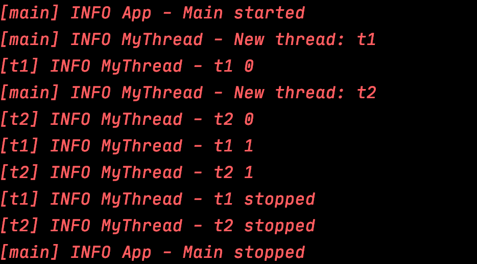
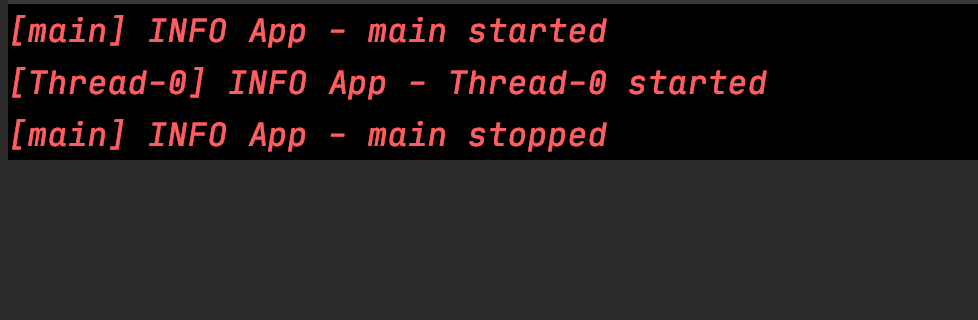
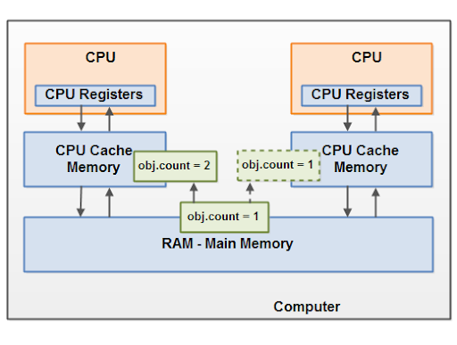
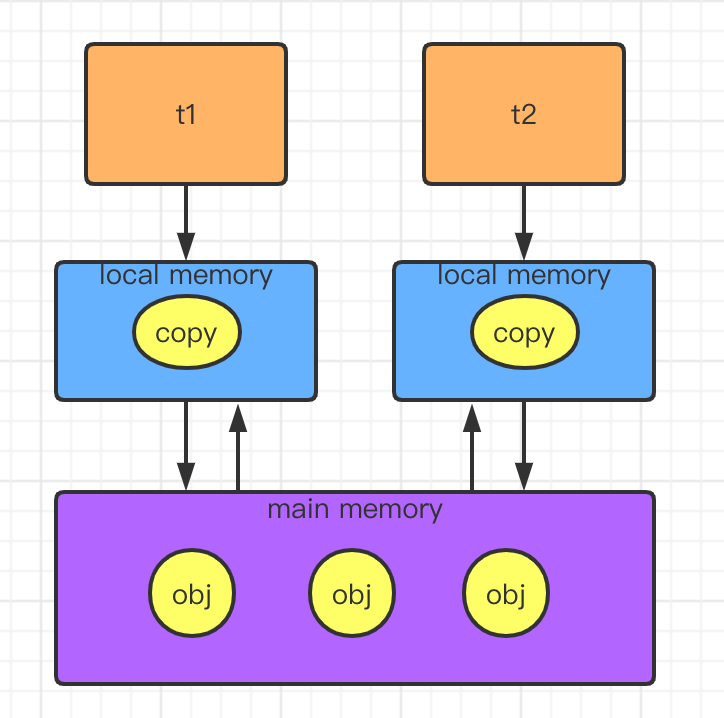
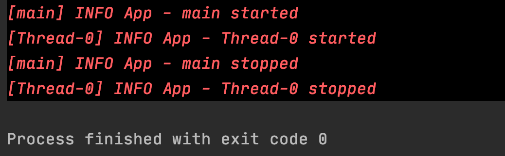
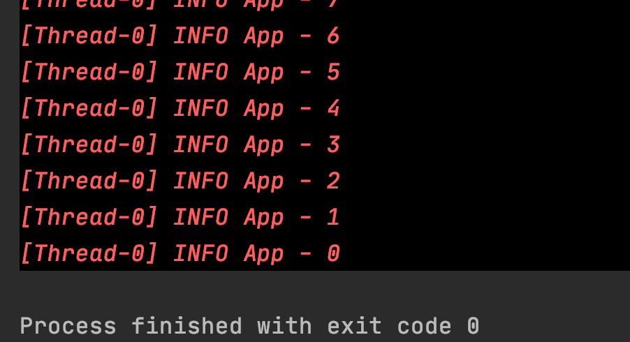
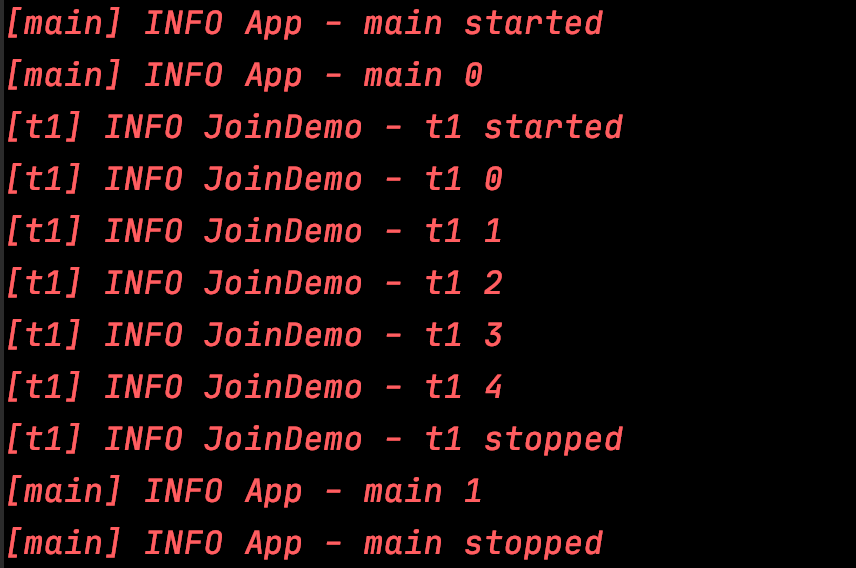

# Java Concurrency

Table of Contents
-----------------

* [Brainstorming](#brainstorming)
* [1. 进程 &amp; 线程的诞生](#1-进程--线程的诞生)
   * [1.1 批处理操作系统](#11-批处理操作系统)
   * [1.2 进程的提出](#12-进程的提出)
   * [1.3 线程的提出](#13-线程的提出)
* [2. 如何创建线程?](#2-如何创建线程)
* [3. 线程状态](#3-线程状态)
* [4. 如何优雅地停止线程?](#4-如何优雅地停止线程)
* [5. Thread 常用方法](#5-thread-常用方法)
   * [5.1 Thread.sleep()](#51-threadsleep)
   * [5.2 Thread.join()](#52-threadjoin)
* [References](#references)


## Brainstorming

  <div align="center">  </div><br>

## 1. 进程 & 线程的诞生

最初的计算机只能接受一些特定的指令，用户输入一些指令，计算机读取后执行

在用户思考 / 输入时，计算机大量时间处于等待状态，效率低下


### 1.1 批处理操作系统

到了批处理操作系统时代，用户可以将需要执行的指令用一张清单记录，作为计算机的输入

计算机执行过后，会将结果输出到另一张清单上

这样虽然提高了效率，但在一定程度上，**由于批处理操作系统的指令方式是串行的，内存中仍然只有一个程序在运行**

当前一个程序由于 I / O 操作或网络原因堵塞时，效率受到限制


### 1.2 进程的提出

为了解决上述问题，科学家提出的进程的概念


**进程就是在内存中分配空间，也就是正在运行的程序**


各个线程之间互不干扰，同时进程保持着每一个程序的运行状态

`CPU` 采用时间片轮转的方式运行线程：`CPU` 为每个进程分配一个时间段，称作时间片。

如果在时间片结束时进程仍然在运行，则暂停这个进程的运行，并且 `CPU` 分配给另一个进程（上下文切换）

若进程在时间片结束之前阻塞 / 结束，`CPU` 立即进行切换，不用等时间片用完


进程在我们生活中无处不在

<div align="center">  </div><br>


### 1.3 线程的提出

虽然进程的出现再次提升了操作系统的性能，但随着时间的推移，人们并不满足一个进程在一段时间内只能做一件事情。如果一个线程有多个子任务时，只能逐个地执行这些子任务，很影响效率

<div align="center">  </div><br>

那能否让这些子任务同时执行呢？于是人们又提出了线程的概念

**让一个线程执行一个子任务，则一个进程就包含了多个线程**

## 2. 如何创建线程?

三种方式：

- 继承 Thread，重写 run 方法

**MyThread.java**

```java
@Slf4j
public class MyThread extends Thread {
    @Override
    public void run() {
        for (int i = 0; i < 5; i++) {
            log.info("t1 " + i);
        }
    }
}
```

**App.java**

```java
@Slf4j
public class App {
    public static void main(String[] args) {

        MyThread t1 = new MyThread();
        t1.start();

        for (int i = 0; i < 5; i++) {
            log.info("main " + i);
        }

    }
}
```


<div align="center">  </div><br>

- 实现 Runnable 接口，实现 run 方法

**MyRunnable.java**

```java
@Slf4j
public class MyRunnable implements Runnable {
    public void run() {
        for (int i = 0; i < 5; i++) {
            log.info("t1 " + i);
        }
    }
}
```

**App.java**

```java
@Slf4j
public class App {
    public static void main(String[] args) {

        Thread t1 = new Thread(new MyRunnable());
        t1.start();

        for (int i = 0; i < 5; i++) {
            log.info("main " + i);
        }

    }
}
```

<div align="center">  </div><br>

生活中有着许多并发的场景，比如你最喜爱的 rapstar 要开 live 了，粉丝和 bot 疯狂进行抢票，面对并发问题若不采取措施，后果将不堪设想


比如说：

**LiveHouseTickets.java**

```java
@Slf4j
public class LiveHouseTickets implements Runnable{

    private int ticket = 5;

    public void run() {
        while (true) {

            if (ticket <= 0) break;

            log.info(Thread.currentThread().getName() + " is buying no." + ticket + " ticket");
            ticket--;

        }
    }

    public static void main(String[] args) {
        new Thread(new LiveHouseTickets()).start();
        new Thread(new LiveHouseTickets()).start();
        new Thread(new LiveHouseTickets()).start();
    }

}
```

<div align="center">  </div><br>


**P.S:** 日志相关的 `maven` 依赖如下

```xml
<dependencies>
  
    <!-- https://mvnrepository.com/artifact/org.projectlombok/lombok -->
    <dependency>
        <groupId>org.projectlombok</groupId>
        <artifactId>lombok</artifactId>
        <version>1.18.12</version>
        <scope>provided</scope>
    </dependency>

    <!-- https://mvnrepository.com/artifact/org.slf4j/slf4j-api -->
    <dependency>
        <groupId>org.slf4j</groupId>
        <artifactId>slf4j-api</artifactId>
        <version>1.7.30</version>
    </dependency>

    <!-- https://mvnrepository.com/artifact/org.slf4j/slf4j-simple -->
    <dependency>
        <groupId>org.slf4j</groupId>
        <artifactId>slf4j-simple</artifactId>
        <version>1.7.30</version>
    </dependency>

</dependencies>
```


## 3. 线程状态

<div align="center">  </div><br>


## 4. 如何优雅地停止线程?

- Using a flag

**MyThread.java**

```java
@Slf4j
public class MyThread implements Runnable {

    private boolean flag;
    private String name;

    public MyThread(String name) {

        this.name = name;
        flag = true;

        new Thread(this, name).start();
        log.info("New thread: " + name);

    }

    public void stop() {
        flag = false;
    }

    public void run() {
        int i = 0;
        while (flag) {
            try {
                log.info(Thread.currentThread().getName() + " " + i );
                i++;
                // Make it a bit slower
                Thread.sleep(1000);
            } catch (InterruptedException e) {
                e.printStackTrace();
            }
        }

        log.info(Thread.currentThread().getName() + " stopped");

    }
}
```

**App.java**

```java
import lombok.extern.slf4j.Slf4j;

@Slf4j
public class App {

    public static void main(String[] args) {

        log.info("Main started");

        MyThread t1 = new MyThread("t1");
        MyThread t2 = new MyThread("t2");

        try {
            Thread.sleep(2000);
            t1.stop();
            t2.stop();
            Thread.sleep(2000);
        } catch (InterruptedException e) {
            e.printStackTrace();
        }

        log.info("Main stopped");

    }
}						
```

<div align="center">  </div><br>


看起来程序没毛病，可当代码逻辑处理不当，线程进入死循环时，情况就发生变化了：

```java
@Slf4j
public class App {

    // Use static keyword because
    // Non-static cannot be referenced from a static context
    static boolean flag = true;

    public static void main(String[] args) {

        log.info(Thread.currentThread().getName() + " started");

        new Thread(() -> {
            log.info(Thread.currentThread().getName() + " started");
            while (flag) {
                // Do nothing
            }
            log.info(Thread.currentThread().getName() + " stopped");
        }).start();

        try {
            Thread.sleep(1000);
        } catch (InterruptedException e) {
            e.printStackTrace();
        }

        flag = false;
        log.info(Thread.currentThread().getName() + " stopped");

    }

}
```

程序会无限循环下去

<div align="center">  </div><br>

**为什么会出现这种情况？**

要想弄明白，首先要熟悉 `JMM`


**什么是 JMM?**

`JMM` 是 `Java memory model` 的缩写，隶属于 `JVM`，定义了 `JVM` 在 `RAM` 中的工作方式

<div align="center">  </div><br>

`Main memory`：存放共享变量（可以理解为 `JVM` 中的堆内存）

`Local memory`：线程私有，存放共享变量的副本，读 / 写都只通过本地内存（可以理解为 `JVM` 中的虚拟机栈）


若 t1 和 t2 进行通行：

1. t1 将更新过的变量写入自己的 `local memory` 中
2. `local memory`（t1 的） 刷新到 `main memory` 中
3. t2 的 `local memory` 从 `main memory` 读取最新的值


<div align="center">  </div><br>

**volatile 的作用：**

当一个变量被 `volatile` 修饰时，任何线程对它的写操作都会立即刷新到主内存中，并且会强制让缓存了该变量的线程中的数据清空，必须从主内存重新读取最新数据。


当给 `flag` 加上 `volatile` 修饰之后，程序就避免了死循环

**App.java**

```java
@Slf4j
public class App {

    // Use static keyword because
    // Non-static cannot be referenced from a static context
    volatile static Boolean flag = true;

    public static void main(String[] args) {

        log.info(Thread.currentThread().getName() + " started");

        new Thread(() -> {
            log.info(Thread.currentThread().getName() + " started");
            while (flag) {
                // Do nothing
            }
            log.info(Thread.currentThread().getName() + " stopped");
        }).start();

        try {
            Thread.sleep(1000);
        } catch (InterruptedException e) {
            e.printStackTrace();
        }

        flag = false;
        log.info(Thread.currentThread().getName() + " stopped");

    }
}
```

<div align="center">  </div><br>

- 调用 `Thread.interrupt()`

```java
public void interrupt() {
  	// Do something
}
```


## 5. Thread 常用方法

### 5.1 Thread.sleep()

**特点：**

- 模拟网络延时：放大问题安全性；模拟 countdown
- 会抛出 `InterruptedException`
- 不会释放锁


**App.java**

```java
@Slf4j
public class App {

    private static Integer countdown = 10;

    public static void main(String[] args) {

        new Thread(() -> {
            while (countdown >= 0) {
                try {
                    log.info(countdown.toString());
                    countdown--;
                    Thread.sleep(1000);
                } catch (InterruptedException e) {
                    e.printStackTrace();
                }
            }
        }).start();

    }
}
```


<div align="center">  </div><br>


### 5.2 Thread.join()


> Waits for this thread to die


**JoinDemo.java**

```java
@Slf4j
public class JoinDemo implements Runnable {
    @Override
    public void run() {
        log.info(Thread.currentThread().getName() + " started");
        for (int i = 0; i < 5; i++) {
            log.info(Thread.currentThread().getName() + " " + i);
        }
        log.info(Thread.currentThread().getName() + " stopped");
    }
}
```

**App.java**

```java
@Slf4j
public class App {

    public static void main(String[] args) throws InterruptedException {

        log.info(Thread.currentThread().getName() + " started");

        Thread t1 = new Thread(new JoinDemo(), "t1");
        t1.start();

        for (int i = 0; i < 2; i++) {
            log.info(Thread.currentThread().getName() + " " + i);
            if (i == 0) t1.join();
        }

        log.info(Thread.currentThread().getName() + " stopped");

    }

}
```


<div align="center">  </div><br>


## References

- [Life Cycle of a Thread in Java](https://www.baeldung.com/java-thread-lifecycle)
- [你应该知道的 volatile 关键字](https://crossoverjie.top/2018/03/09/volatile/)
- [How to Kill a Java Thread](https://www.baeldung.com/java-thread-stop)
- [Killing threads in Java](https://www.geeksforgeeks.org/killing-threads-in-java/)
- [Guide to the Volatile Keyword in Java](https://www.baeldung.com/java-volatile)