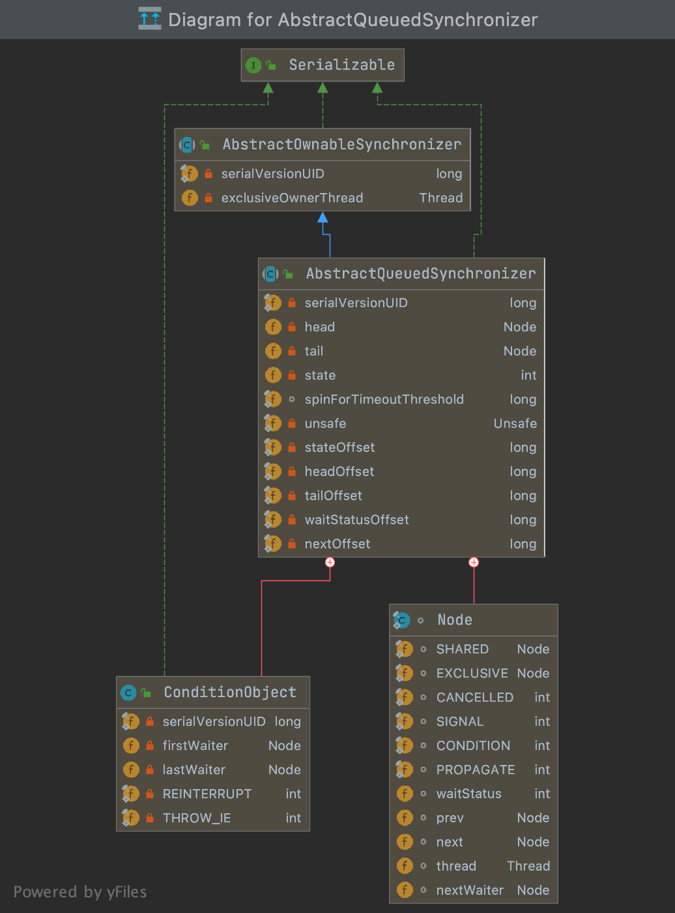
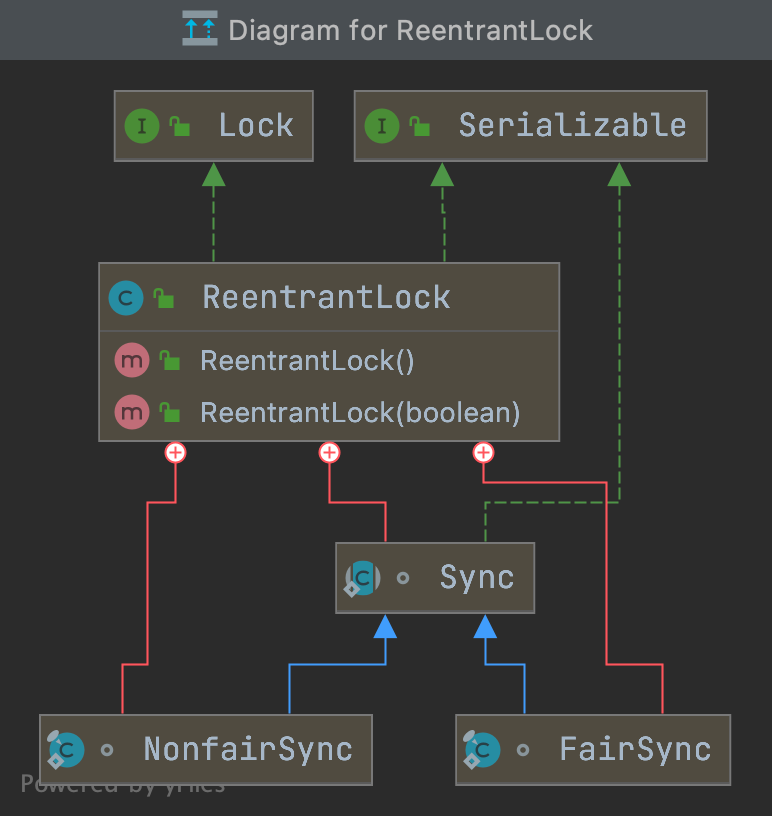
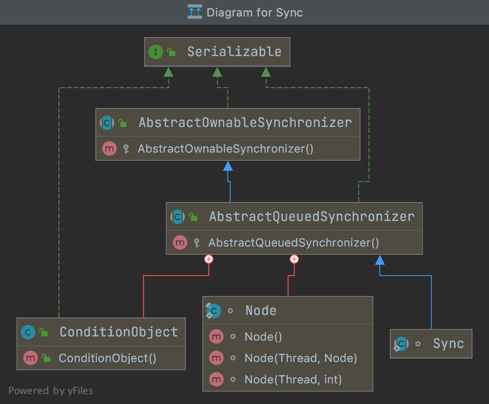

# Concurrency

## Table of Contents
- [1. 关键字](#1-关键字)
	- [1.1 synchronized](#11-synchronized)
		- [1.1.1 无锁](#111-无锁)
		- [1.1.2 偏向锁](#112-偏向锁)
		- [1.1.3 轻量级锁](#113-轻量级锁)
	- [1.2 volatile](#12-volatile)
- [2. 线程通信](#2-线程通信)
	- [2.1 生产者/消费者经典范式](#21-生产者消费者经典范式)
- [3. 线程状态](#3-线程状态)
- [4. CAS](#4-cas)
	- [4.1 原子类](#41-原子类)
	- [4.2 CAS 引发的问题](#42-cas-引发的问题)
- [5. AQS](#5-aqs)
	- [5.1 Outline](#51-outline)
- [6. ReentrantLock](#6-reentrantlock)
	- [6.1 Lock Interface](#61-lock-interface)
	- [6.2 Outline](#62-outline)
	- [6.3 公平锁 vs 非公平锁](#63-公平锁-vs-非公平锁)
	- [6.4 加锁](#64-加锁)
		- [6.4.1 非公平锁加锁](#641-非公平锁加锁)
	- [6.5 出队](#65-出队)
- [7. ThreadPool](#7-threadpool)
	- [7.1 Outline](#71-outline)
		- [7.1.1 阻塞队列](#711-阻塞队列)
		- [7.1.2 不同线程池适用场景](#712-不同线程池适用场景)
	- [7.2 生命周期管理](#72-生命周期管理)
	- [7.3 任务执行机制](#73-任务执行机制)
- [References](#references)


## 1. 关键字

### 1.1 synchronized

**Java Object Header**

<div align="center">  </div><br>

**Mark Word**

<div align="center">  </div><br>

**Monitor in Java**

<div align="center">  </div><br>

**锁升级**

<div align="center">  </div><br>

#### 1.1.1 无锁

无锁没有对资源进行锁定，所有的线程都可以访问，但某一时刻只有一个能修改成功

线程会在循环中不断尝试修改，若没冲突则修改成功，退出循环；若有冲突，则一直循环尝试修改


#### 1.1.2 偏向锁

偏向锁适用于只有一个线程访问同步块的场景。若一个同步块一直被一个线程访问，则自动加锁，降低了获取锁的成本

**工作流程**

<div align="center">  </div><br>

**解锁**

当遇到其他线程竞争偏向锁时，持有偏向锁的线程才会释放锁。偏向锁的撤销，需要等待全局安全点（没有字节码正在执行）。它会首先暂停拥有偏向锁的线程，检查其状态。撤销后恢复到无锁或轻量级锁状态


#### 1.1.3 轻量级锁

当偏向锁遇到竞争时，会升级为轻量级锁。轻量级锁的特点在于其他线程会自旋，而不会进入阻塞状态，提高性能

**工作流程**

<div align="center">  </div><br>


**加锁**

线程在执行同步块之前，JVM 会在当前线程的 stack frame 中创建用于存储锁记录的空间，并将 *mark word* 拷贝到锁记录中（*displayed mark word*）

接着线程尝试使用 CAS 将 *mark word* 替换成指向锁记录的指针，若成功，当前线程获得锁；若失败，则自旋

**解锁**

线程使用 CAS 尝试将 *displayed mark word* 换回 *mark word* 中，若成功，表示没有竞争发生；若失败，表示当前锁存在竞争，锁膨胀成重量级锁


### 1.2 volatile

- 内存可见性（**写**：将本地内存的共享变量刷新到主内存中；**读**：将本地内存置为无效，刷新主内存到工作内存，再读）
- 禁止 *volatile* 变量与普通变量重排序（作为轻量级锁，**只保证本线程内**）


**底层实现**

<div align="center">  </div><br>

**重排序规则**

1. 若第一个操作是 *volatile* 读，那无论第二个操作是什么，都不能重排序
2. 如果第二个操作是 *volatile* 写，那无论第一个操作是什么，都不能重排序
3. 如果第一个操作是 *volatile* 写，第二个操作是 *volatile* 读，那不能重排序


## 2. 线程通信

### 2.1 生产者/消费者经典范式

**消费者(等待方)**

```java
synchronized(lock) {
  while (不满足条件) {
    lock.wait()
  }
  // 满足条件后的代码
}
```

**生产者(通知方)**

```java
synchronized(lock) {
  // 改变条件
  lock.notifyAll();
}
```

## 3. 线程状态

**Java 线程状态**

<div align="center">  </div><br>

 

## 4. CAS

### 4.1 原子类

```java
public class AtomicInteger extends Number implements java.io.Serializable {

  // Unsafe 是执行低级别, 不安全操作（e.g 访问系统内存资源, 自主管理内存资源）的类
  private static final Unsafe unsafe = Unsafe.getUnsafe();
  private static final long valueOffset;

  static {
    try {
      valueOffset = unsafe.objectFieldOffset
        (AtomicInteger.class.getDeclaredField("value"));
    } catch (Exception ex) { throw new Error(ex); }

    // 为什么需要 volatile 修饰? -> 保证内存可见性, 确保读取的是最新的值
    private volatile int value;

    public final boolean compareAndSet(int expect, int update) {
      // 内存位置, 预期原值, 新值
      return unsafe.compareAndSwapInt(this, valueOffset, expect, update);
    }
    
    // 底层实现为 CPU 原子指令 cmpxchg
    public final native boolean compareAndSwapInt(Object var1, long var2, int var4, int var5);

}
```

### 4.2 CAS 引发的问题

1. ABA 问题（*AtomicStampedReference* 增加了 *stamp* 字段用于解决该问题）
2. 循环开销大
3. 只能保证一个共享变量的原子操作（采用类封装的思想，*AtomicStampedReference*）


## 5. AQS

> AbstractQueuedSynchronizer, 队列同步器

### 5.1 Outline

*AQS* 是用来构建锁和其他同步组件的基础框架， 它使用了一个 int 成员变量表示同步状态，通过内置的 FIFO 队列来完成资源获取线程的排队工作

- 资源状态 (一个 *volatile* 变量)
- FIFO 的阻塞队列（类似于 *monitor* 的 entryList）
- 多条件变量实现等待/唤醒（类似于 *monitor* 的 waitSet）

**Diagram of AQS**

<div align="center">  </div><br>


## 6. ReentrantLock

### 6.1 Lock Interface

**Lock.java**

```java
public interface Lock {

  // 获取锁, 若获取失败则阻塞直到锁被释放
  void lock();

  // 类似于上一个方法, 但阻塞的时候可被打断
  void lockInterruptibly() throws InterruptedException;

  // lock() 的非阻塞版本, 只尝试一次
  boolean tryLock();
  
  // 带超时机制的 tryLock()
  boolean tryLock(long time, TimeUnit unit) throws InterruptedException;

  // 释放锁
  void unlock();

  // 创建条件变量
  Condition newCondition();
  
}
```


**如何使用?**

```java
Lock l = ...;
l.lock();
try {
  // access the resource protected by this lock
} finally {
  l.unlock();
}
```


**synchronized 与 Lock 的对比?**

<div align="center">  </div><br>


### 6.2 Outline

**ReentrantLock**

<div align="center">  </div><br>

**Sync**

<div align="center">  </div><br>

### 6.3 公平锁 vs 非公平锁


| Categories |                Pros                |                   Cons                   |
| :--------: | :--------------------------------: | :--------------------------------------: |
|   公平锁   |            线程不会饿死            | 整体吞吐量较低, CPU 唤醒阻塞线程开销较大 |
|  非公平锁  | 减少唤醒线程的开销, 整体吞吐量较高 |               线程可能饿死               |

**ReentrantLock.java**

```java
public ReentrantLock() {
  
  // 默认创建非公平锁
  sync = new NonfairSync();

}
```


### 6.4 加锁

**AQS 与 ReentrantLock 的联系**

<div align="center">  </div><br>

#### 6.4.1 非公平锁加锁

**Outline**

```java
// ReentrantLock 方法
public void lock() {
  // 调用同步器 lock() 方法
  sync.lock();
}


// NonfairSync 实现的 lock() 方法（默认）
final void lock() {

  // 尝试获取锁 -> CAS 修改 state 的值
  if (compareAndSetState(0, 1))
    // 获取成功, 当前线程成为 owner
    setExclusiveOwnerThread(Thread.currentThread());
  else
    // CAS 失败
    acquire(1);
}


// AQS 方法, 以下三个方法为核心方法
public final void acquire(int arg) {
  
  // 1.tryAcquire(arg) 为抽象方法, 具体实现交给子类
  if (!tryAcquire(arg) &&
      acquireQueued(addWaiter(Node.EXCLUSIVE), arg))
    selfInterrupt();
  
}
```


**1. tryAcquire(): 模版, 交给子类实现**

```java
// 1. 基于非公平锁实现（ReentrantLock）
final boolean nonfairTryAcquire(int acquires) {
  final Thread current = Thread.currentThread();
  int c = getState();

  // 1.1 CAS 抢资源 -> 非公平
  if (c == 0) {
    if (compareAndSetState(0, acquires)) {
      setExclusiveOwnerThread(current);
      return true;
    }
  }

  // 1.2 可重入锁判断逻辑
  else if (current == getExclusiveOwnerThread()) {
    int nextc = c + acquires;
    if (nextc < 0) // overflow
      throw new Error("Maximum lock count exceeded");
    setState(nextc);
    return true;
  }

  // 1.3 以上两个条件都不符合, 返回 false
  return false;
}
```


**2. addWaiter()**

```java
private Node addWaiter(Node mode) {

  // 1. 创建一个新的 node, 参数为当前线程和独占模式
  Node node = new Node(Thread.currentThread(), mode);

  Node pred = tail;
  
  // 2. 尾插
  if (pred != null) {
    // 2.1 先将 prev 指向队尾
    node.prev = pred;
    // 2.2 CAS 尾插, 成功就 return, 失败就进 enq()
    if (compareAndSetTail(pred, node)) {
      pred.next = node;
      return node;
    }
  }

  // 3. 入队
  enq(node);

  return node;
}


// 3. 入队
private Node enq(final Node node) {
  // 自旋
  for (;;) {
    Node t = tail;
    if (t == null) { 
      // 3.1 初始化队列
      if (compareAndSetHead(new Node()))
        // 3.1.1 创建了一个 dummy node, 设为 head
        // 3.1.2 将 tail 指向 head 地址
        tail = head;
    } else {
      // 3.2 尾插
      // 3.2.1 将当前 node 的 prev 指向队尾
      node.prev = t;
      // 3.2.2 CAS 尾插
      if (compareAndSetTail(t, node)) {
        t.next = node;
        // 成功就 return, 失败就自旋
        return t;
      }
    }
  }
}
```


**3. acquireQueued()**

```java
final boolean acquireQueued(final Node node, int arg) {
  boolean failed = true;
  try {
    boolean interrupted = false;

    // 自旋
    for (;;) {

      // 获取当前 node 的前驱, 前驱为空则抛 NPE
      final Node p = node.predecessor();

      // 该 node 为第二个(初始化时头部为 dummy node), 且获取资源成功
      if (p == head && tryAcquire(arg)) {
        setHead(node);
        p.next = null; // help GC
        failed = false;
        return interrupted;
      }

      // 进入阻塞
      if (shouldParkAfterFailedAcquire(p, node) &&
          parkAndCheckInterrupt())
        interrupted = true;
    }
  } finally {
    if (failed)
      cancelAcquire(node);
  }
}


private static boolean shouldParkAfterFailedAcquire(Node pred, Node node) {
  int ws = pred.waitStatus;
  if (ws == Node.SIGNAL)
    return true;
  if (ws > 0) {
    do {
      node.prev = pred = pred.prev;
    } while (pred.waitStatus > 0);
    pred.next = node;
  } else {
    compareAndSetWaitStatus(pred, ws, Node.SIGNAL);
  }
  return false;
}


// 被阻塞, 等待被 unpark()
private final boolean parkAndCheckInterrupt() {
  LockSupport.park(this);
  // 一直被 park, 但程序还没有结束
  return Thread.interrupted();
}
```


### 6.5 出队


## 7. ThreadPool

**为什么需要线程池?**

本质上是一种池化思想

1. 资源**管理**，**控制并发数量**（主要原因），避免线程数量膨胀导致过分调度，保证了对内核的充分利用
2. 降低资源消耗，**复用**的思想（频繁创建和销毁线程容易造成 OOM）
3. 提高响应速度，提供更强大的功能


**ThreadPool**

<div align="center">  </div><br>


### 7.1 Outline

**ThreadPoolExecutor**

<div align="center">  </div><br>

**ThreadPoolExecutor.java**

```java
public ThreadPoolExecutor(

  // 核心线程数量, 一直存在（铁饭碗）
  int corePoolSize,

  // 最大线程 = 核心线程 + 救急线程
  // 救急线程若长时间闲置会被销毁（临时工）
  int maximumPoolSize,

  // 闲置超时时间
  long keepAliveTime,
  TimeUnit unit,

  // 阻塞队列
  BlockingQueue<Runnable> workQueue,
  
  // 创建线程工厂
  ThreadFactory threadFactory,

  /*
    拒绝策略
    1) 丢弃任务, 抛异常
    2) 丢弃任务, 但不抛异常
    3) 丢弃头部任务, 尝试加入
    4) 由调用线程自己处理
   */
  RejectedExecutionHandler handler) {

}
```


#### 7.1.1 阻塞队列


#### 7.1.2 不同线程池适用场景


### 7.2 生命周期管理


### 7.3 任务执行机制


## References

- *Java 并发编程的艺术*
- [深入浅出多线程](http://concurrent.redspider.group/RedSpider.html)
- [What is a Monitor in Computer Science?](https://www.baeldung.com/cs/monitor)
- [不可不说的 Java “锁”事](https://tech.meituan.com/2018/11/15/java-lock.html)
- [Java魔法类：Unsafe应用解析](https://tech.meituan.com/2019/02/14/talk-about-java-magic-class-unsafe.html)
- [Java线程池实现原理及其在美团业务中的实践](https://tech.meituan.com/2020/04/02/java-pooling-pratice-in-meituan.html)
- [Guide to java.util.concurrent.Locks](https://www.baeldung.com/java-concurrent-locks)
