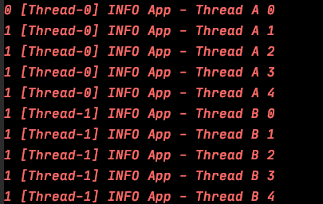
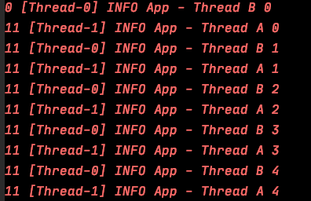

# 多线程基础

Table of Contents
-----------------

* [1. 进程产生的背景](#1-进程产生的背景)
   * [1.1 批处理操作系统](#11-批处理操作系统)
   * [1.2 进程的提出](#12-进程的提出)
   * [1.3 线程的提出](#13-线程的提出)
* [2. 上下文切换](#2-上下文切换)
* [3. Java 多线程入门类和接口](#3-java-多线程入门类和接口)
   * [3.1 Thread 类](#31-thread-类)
   * [3.2 Runnable 接口](#32-runnable-接口)
   * [3.3 Thread 与 Runnable 接口比较](#33-thread-与-runnable-接口比较)
   * [3.4 Thread 构造方法](#34-thread-构造方法)
   * [3.5 Thread 常用方法](#35-thread-常用方法)
   * [3.6 Callable](#36-callable)
   * [3.7 Future](#37-future)
   * [3.8 FutureTask](#38-futuretask)
   * [3.9 FutureTask 的几个状态](#39-futuretask-的几个状态)
* [4. ThreadGroup](#4-threadgroup)
* [5. 操作系统中的线程状态转换](#5-操作系统中的线程状态转换)
* [6. Java 线程的 6 个状态](#6-java-线程的-6-个状态)
   * [6.1 NEW](#61-new)
   * [6.2 RUNNABLE](#62-runnable)
   * [6.3 BLOCKED](#63-blocked)
   * [6.4 WAITING](#64-waiting)
   * [6.5 TIMED_WAITING](#65-timed_waiting)
   * [6.6 TERMINATED](#66-terminated)
* [7. 通信](#7-通信)
   * [7.1 锁与同步](#71-锁与同步)
   * [7.2 等待 / 通知](#72-等待--通知)


## 1. 进程产生的背景

最初的计算机只能接受一些特定的指令，用户输入一些指令，计算机读取后执行

在用户思考 / 输入时，计算机大量时间处于等待状态，效率低下


### 1.1 批处理操作系统

到了批处理操作系统时代，用户可以将需要执行的指令用一张清单记录，作为计算机的输入

计算机执行过后，会将结果输出到另一张清单上

这样虽然提高了效率，但在一定程度上，**由于批处理操作系统的指令方式是串行的，内存中仍然只有一个程序在运行**

当前一个程序由于 I / O 操作或网络原因堵塞时，效率受到限制


### 1.2 进程的提出

为了解决上述问题，科学家提出的进程的概念


**进程就是在内存中分配空间，也就是正在运行的程序**


各个线程之间互不干扰，同时进程保持着每一个程序的运行状态

`CPU` 采用时间片轮转的方式运行线程：`CPU` 为每个进程分配一个时间段，称作时间片。

如果在时间片结束时进程仍然在运行，则暂停这个进程的运行，并且 `CPU` 分配给另一个进程（上下文切换）

若进程在时间片结束之前阻塞 / 结束，`CPU` 立即进行切换，不用等时间片用完


进程在我们生活中无处不在

<div align="center">  </div><br>


### 1.3 线程的提出

虽然进程的出现再次提升了操作系统的性能，但随着时间的推移，人们并不满足一个进程在一段时间内只能做一件事情。如果一个线程有多个子任务时，只能逐个地执行这些子任务，很影响效率

<div align="center">  </div><br>

那能否让这些子任务同时执行呢？于是人们又提出了线程的概念

**让一个线程执行一个子任务，则一个进程就包含了多个线程**


<div align="center">  </div><br>


## 2. 上下文切换

上下文切换指的是 `CPU` 从一个进程 / 线程切换到另一个进程 / 线程


上下文切换通常是计算密集型，故线程不是越多越好。如何减少系统中上下文切换次数，是提升多线程性能的一个重点课题


## 3. Java 多线程入门类和接口

### 3.1 Thread 类

创建一个 `t1` 线程

重写 `run` 方法，即需要实现的任务

调用 `start` 方法开启线程

```java
@Slf4j
public class App {

    public static void main(String[] args) {
        Thread t1 = new Thread() {
            @Override
            public void run() {
                log.info("t1 here!");
            }
        };
        t1.setName("t1");
        t1.start();
        log.info("main here!");
    }

}
```

可见两个线程在同时抢夺 `CPU` 资源，执行顺序不一致

<div align="center">  </div><br>

<div align="center">  </div><br>

⚠️注意：

调用 `start()` 后，该线程才算启动！

> 在程序中调用了 start() 方法后，虚拟机会先为我们创建一个线程，然后等到这个线程第一次得到时间片时再调用 run() 方法
>
>
> 注意不可多次调用 start() 方法


### 3.2 Runnable 接口

```java
@Slf4j
public class App {

    public static void main(String[] args) {

        Runnable r1 = new Runnable() {
            public void run() {
                log.info("t1 here!");
            }
        };

        Thread t1 = new Thread(r1, "t1");
        t1.start();

        log.info("main here!");
    }

}
```


<div align="center">  </div><br>


<div align="center">  </div><br>

使用 `lambda expression` 进行简化

```java
@Slf4j
public class App {

    public static void main(String[] args) {

        Runnable r1 = () -> {
            log.info("t1 here!");
        };

        Thread t1 = new Thread(r1, "t1");
        t1.start();

        log.info("main here!");
    }

}
```

### 3.3 Thread 与 Runnable 接口比较

- 底层实现原理一样
- 推荐使用实现 `runnable` 接口的方式（降低耦合度）

调用 `Thread` 类的构造方法传入 `runnable` 接口时，底层也是重写了 `Thread` 类的 `run` 方法

```java
public Thread(Runnable target, String name) {
    init(null, target, name, 0);
}


private void init(ThreadGroup g, Runnable target, String name,
                  long stackSize, AccessControlContext acc,
                  boolean inheritThreadLocals) {
}


@Override
public void run() {
    if (target != null) {
        target.run();
    }
}
```

### 3.4 Thread 构造方法

**Thread.java**

```java
// 构造函数
public Thread(Runnable target) {
  init(null, target, "Thread-" + nextThreadNum(), 0);
}


// init 方法
// g: 线程组
// target: 指定要执行的任务
// name: 线程的名字 默认为 Thread-线程编号
// stackSize: 暂不讨论
// inheritThreadLocals: 暂不在本节讨论
private void init(ThreadGroup g, Runnable target, String name,
                  long stackSize, AccessControlContext acc,
                  boolean inheritThreadLocals) {


  this.inheritedAccessControlContext =
    acc != null ? acc : AccessController.getContext();


}

ThreadLocal.ThreadLocalMap threadLocals = null;


ThreadLocal.ThreadLocalMap inheritableThreadLocals = null;

```

实际情况下，我们大多是直接调用下面两个构造方法：

```java
public Thread(Runnable target) {
  init(null, target, "Thread-" + nextThreadNum(), 0);
}


public Thread(Runnable target, String name) {
  init(null, target, name, 0);
}
```


### 3.5 Thread 常用方法

**currentThread()**

```java
// Returns a reference to the currently executing thread object
public static native Thread currentThread();
```


**start()**

```java
/**
 * Causes this thread to begin execution; the Java Virtual Machine
 * calls the <code>run</code> method of this thread.
 * <p>
 * The result is that two threads are running concurrently: the
 * current thread (which returns from the call to the
 * <code>start</code> method) and the other thread (which executes its
 * <code>run</code> method).
 * <p>
 * It is never legal to start a thread more than once.
 * In particular, a thread may not be restarted once it has completed
 * execution.
 *
 * @exception  IllegalThreadStateException  if the thread was already
 *               started.
 * @see        #run()
 * @see        #stop()
 */
public synchronized void start() {
    /**
     * This method is not invoked for the main method thread or "system"
     * group threads created/set up by the VM. Any new functionality added
     * to this method in the future may have to also be added to the VM.
     *
     * A zero status value corresponds to state "NEW".
     */
    if (threadStatus != 0)
        throw new IllegalThreadStateException();

    /* Notify the group that this thread is about to be started
     * so that it can be added to the group's list of threads
     * and the group's unstarted count can be decremented. */
    group.add(this);

    boolean started = false;
    try {
        start0();
        started = true;
    } finally {
        try {
            if (!started) {
                group.threadStartFailed(this);
            }
        } catch (Throwable ignore) {
            /* do nothing. If start0 threw a Throwable then
              it will be passed up the call stack */
        }
    }
}

private native void start0();
```


**yield()**

```java
/**
 * A hint to the scheduler that the current thread is willing to yield
 * its current use of a processor. The scheduler is free to ignore this
 * hint.
 *
 * <p> Yield is a heuristic attempt to improve relative progression
 * between threads that would otherwise over-utilise a CPU. Its use
 * should be combined with detailed profiling and benchmarking to
 * ensure that it actually has the desired effect.
 *
 * <p> It is rarely appropriate to use this method. It may be useful
 * for debugging or testing purposes, where it may help to reproduce
 * bugs due to race conditions. It may also be useful when designing
 * concurrency control constructs such as the ones in the
 * {@link java.util.concurrent.locks} package.
 */
public static native void yield();
```


**sleep()**

```java
/**
 * Causes the currently executing thread to sleep (temporarily cease
 * execution) for the specified number of milliseconds, subject to
 * the precision and accuracy of system timers and schedulers. The thread
 * does not lose ownership of any monitors.
 *
 * @param  millis
 *         the length of time to sleep in milliseconds
 *
 * @throws  IllegalArgumentException
 *          if the value of {@code millis} is negative
 *
 * @throws  InterruptedException
 *          if any thread has interrupted the current thread. The
 *          <i>interrupted status</i> of the current thread is
 *          cleared when this exception is thrown.
 */
public static native void sleep(long millis) throws InterruptedException;
```


**join()**

```java
/**
 * Waits for this thread to die.
 *
 * <p> An invocation of this method behaves in exactly the same
 * way as the invocation
 *
 * <blockquote>
 * {@linkplain #join(long) join}{@code (0)}
 * </blockquote>
 *
 * @throws  InterruptedException
 *          if any thread has interrupted the current thread. The
 *          <i>interrupted status</i> of the current thread is
 *          cleared when this exception is thrown.
 */
public final void join() throws InterruptedException {
  join(0);
}


/**
     * Waits at most {@code millis} milliseconds for this thread to
     * die. A timeout of {@code 0} means to wait forever.
     *
     * <p> This implementation uses a loop of {@code this.wait} calls
     * conditioned on {@code this.isAlive}. As a thread terminates the
     * {@code this.notifyAll} method is invoked. It is recommended that
     * applications not use {@code wait}, {@code notify}, or
     * {@code notifyAll} on {@code Thread} instances.
     *
     * @param  millis
     *         the time to wait in milliseconds
     *
     * @throws  IllegalArgumentException
     *          if the value of {@code millis} is negative
     *
     * @throws  InterruptedException
     *          if any thread has interrupted the current thread. The
     *          <i>interrupted status</i> of the current thread is
     *          cleared when this exception is thrown.
     */
public final synchronized void join(long millis)
  throws InterruptedException {
  long base = System.currentTimeMillis();
  long now = 0;

  if (millis < 0) {
    throw new IllegalArgumentException("timeout value is negative");
  }

  if (millis == 0) {
    while (isAlive()) {
      wait(0);
    }
  } else {
    while (isAlive()) {
      long delay = millis - now;
      if (delay <= 0) {
        break;
      }
      wait(delay);
      now = System.currentTimeMillis() - base;
    }
  }
}
```

### 3.6 Callable

通常来说，使用 `Runnable` 和 `Thread` 来创建一个新的线程有一个弊端：`run` 方法没有返回值

有时候我们希望开启一个线程去执行一个任务，并且这个任务执行完成后有一个返回值


`JDK` 提供了 `Callable` 和 `Future` 接口为我们解决这个问题，所谓的“异步”模型

**Callable.java**

```java
@FunctionalInterface
public interface Callable<V> {
    /**
     * Computes a result, or throws an exception if unable to do so.
     *
     * @return computed result
     * @throws Exception if unable to compute a result
     */
    V call() throws Exception;
}
```


### 3.7 Future


### 3.8 FutureTask


### 3.9 FutureTask 的几个状态


## 4. ThreadGroup

每个 `Thread` 必然存在于一个 `ThreadGroup` 中

如果在 `new Thread()` 时没有显示指定，那么默认将父线程（当前执行 `new Thread()` 的线程）线程组设置为自己的线程组


**App.java**

```java
@Slf4j
public class App {

    public static void main(String[] args) {

        // Create a new thread
        Thread t1 = new Thread(() -> {
            log.info("The name of current threadGroup: {}", Thread.currentThread().getThreadGroup().getName());
            log.info("The name of current thread: {}", Thread.currentThread().getName());
        });

        // Start the thread
        t1.start();

        log.info("The name of main threadGroup: {}", Thread.currentThread().getName());
        log.info("The name of main thread: {}", Thread.currentThread().getName());

    }
}
```

<div align="center">  </div><br>


 


## 5. 操作系统中的线程状态转换


<div align="center">  </div><br>

- ready 状态：线程正在等待使用 `CPU`，经调度程序调用之后进入 `running`
- running 状态：线程正在使用 `CPU`
- waiting 状态：线程经过等待事件的调用 / 正在等待其他资源（I / O）


## 6. Java 线程的 6 个状态

**Thread.java**

```java
public enum State {

  // 线程仍未被执行 
  NEW,

  // 当前线程正在运行中，被 JVM 执行，也有可能等待 CPU 分配资源
  RUNNABLE,

  // 阻塞状态，正在等待锁的释放进入同步区
  BLOCKED,

  // 等待状态，需要被唤醒才能进入 Runnable
  WAITING,

  // 超时等待状态
  TIMED_WAITING,

  // 终止状态
  TERMINATED;
}
```

### 6.1 NEW

```java
/**
 * Thread state for a thread which has not yet started.
 */
NEW,
```

```java
@Slf4j
public class App {

    public static void main(String[] args) {

        Thread t1 = new Thread(() -> {
        });

        log.info(t1.getState().toString());
    }
}
```

<div align="center">  </div><br>


### 6.2 RUNNABLE

```java
/**
 * Thread state for a runnable thread.  A thread in the runnable
 * state is executing in the Java virtual machine but it may
 * be waiting for other resources from the operating system
 * such as processor.
 */
RUNNABLE,
```

`Java` 线程中的 `RUNNABLE` 实际上是操作系统中 `ready` 和 `running` 状态的合集


### 6.3 BLOCKED

```java
/**
 * Thread state for a thread blocked waiting for a monitor lock.
 * A thread in the blocked state is waiting for a monitor lock
 * to enter a synchronized block/method or
 * reenter a synchronized block/method after calling
 * {@link Object#wait() Object.wait}.
 */
BLOCKED,
```

阻塞状态，等待锁的释放进入同步区


### 6.4 WAITING

```java
/**
 * Thread state for a waiting thread.
 * A thread is in the waiting state due to calling one of the
 * following methods:
 * <ul>
 *   <li>{@link Object#wait() Object.wait} with no timeout</li>
 *   <li>{@link #join() Thread.join} with no timeout</li>
 *   <li>{@link LockSupport#park() LockSupport.park}</li>
 * </ul>
 *
 * <p>A thread in the waiting state is waiting for another thread to
 * perform a particular action.
 *
 * For example, a thread that has called <tt>Object.wait()</tt>
 * on an object is waiting for another thread to call
 * <tt>Object.notify()</tt> or <tt>Object.notifyAll()</tt> on
 * that object. A thread that has called <tt>Thread.join()</tt>
 * is waiting for a specified thread to terminate.
 */
WAITING,
```


### 6.5 TIMED_WAITING

```java
/**
 * Thread state for a waiting thread with a specified waiting time.
 * A thread is in the timed waiting state due to calling one of
 * the following methods with a specified positive waiting time:
 * <ul>
 *   <li>{@link #sleep Thread.sleep}</li>
 *   <li>{@link Object#wait(long) Object.wait} with timeout</li>
 *   <li>{@link #join(long) Thread.join} with timeout</li>
 *   <li>{@link LockSupport#parkNanos LockSupport.parkNanos}</li>
 *   <li>{@link LockSupport#parkUntil LockSupport.parkUntil}</li>
 * </ul>
 */
TIMED_WAITING,
```


### 6.6 TERMINATED

```java
/**
 * Thread state for a terminated thread.
 * The thread has completed execution.
 */
TERMINATED;
```


## 7. 通信

合理使用多线程可以提供服务器资源利用率，当我们需要线程之间互相合作时，线程间的通信就变得格外重要了

### 7.1 锁与同步

锁：一个锁在同一时间只能被一个对象持有

同步：线程之间按照一定的顺序执行


先来看一个无锁的程序：

**App.java**

```java
@Slf4j
public class App {

    static class ThreadA implements Runnable {

        @Override
        public void run() {
            for (int i = 0; i < 5; i++) {
                log.info("Thread A " + i);
            }
        }
    }

    static class ThreadB implements Runnable {

        @Override
        public void run() {
            for (int i = 0; i < 5; i++) {
                log.info("Thread B " + i);
            }
        }
    }

    public static void main(String[] args) {
        new Thread(new ThreadA()).start();
        new Thread(new ThreadB()).start();

    }
}
```


<div align="center">  </div><br>

线程之间执行的顺序是无法控制的

若想让线程 B 先执行，然后再到线程 A，那么如何实现？

答案是加锁

**App.java**

```java
@Slf4j
public class App {

    private static Object lock = new Object();

    static class ThreadA implements Runnable {

        @Override
        public void run() {
            synchronized (lock) {
                for (int i = 0; i < 5; i++) {
                    log.info("Thread A " + i);
                }
            }
        }
    }

    static class ThreadB implements Runnable {

        @Override
        public void run() {
            synchronized (lock) {
                for (int i = 0; i < 5; i++) {
                    log.info("Thread B " + i);
                }
            }
        }
    }

    public static void main(String[] args) throws InterruptedException {
        new Thread(new ThreadB()).start();
        Thread.sleep(10);
        new Thread(new ThreadA()).start();

    }
}
```


<div align="center">  </div><br>

### 7.2 等待 / 通知

等待 / 通知机制是与加锁不同的机制

基于 “锁” 的方式，线程需要不断地尝试获得锁，如果失败了，再继续尝试。这可能会耗费服务器资源

等待 / 通知机制需要涉及以下 3 个 `Object` 类方法：

- wait()
- notify()
- notifyAll()


先来看看 `wait()` 方法

假如线程 A 获得了锁，它可以使用 `lock.wait()` 使自己处于等待状态，与此同时释放锁

此时，线程 B 获得了 `lock` 锁并开始执行，它可以在某一时刻使用 `lock.notify()` / `lock.notifyAll()` 通知线程 A，让其继续执行

需要注意的是，此时线程 B 并没有释放锁，除非线程 B 使用 `lock.wait()` 释放或线程 B 执行完成自动释放锁


**wait()**

```java
/**
 * Causes the current thread to wait until another thread invokes the
 * {@link java.lang.Object#notify()} method or the
 * {@link java.lang.Object#notifyAll()} method for this object.
 * In other words, this method behaves exactly as if it simply
 * performs the call {@code wait(0)}.
 * <p>
 * The current thread must own this object's monitor. The thread
 * releases ownership of this monitor and waits until another thread
 * notifies threads waiting on this object's monitor to wake up
 * either through a call to the {@code notify} method or the
 * {@code notifyAll} method. The thread then waits until it can
 * re-obtain ownership of the monitor and resumes execution.
 * <p>
 * As in the one argument version, interrupts and spurious wakeups are
 * possible, and this method should always be used in a loop:
 * <pre>
 *     synchronized (obj) {
 *         while (&lt;condition does not hold&gt;)
 *             obj.wait();
 *         ... // Perform action appropriate to condition
 *     }
 * </pre>
 * This method should only be called by a thread that is the owner
 * of this object's monitor. See the {@code notify} method for a
 * description of the ways in which a thread can become the owner of
 * a monitor.
 *
 * @throws  IllegalMonitorStateException  if the current thread is not
 *               the owner of the object's monitor.
 * @throws  InterruptedException if any thread interrupted the
 *             current thread before or while the current thread
 *             was waiting for a notification.  The <i>interrupted
 *             status</i> of the current thread is cleared when
 *             this exception is thrown.
 * @see        java.lang.Object#notify()
 * @see        java.lang.Object#notifyAll()
 */
public final void wait() throws InterruptedException {
  wait(0);
}


public final native void wait(long timeout) throws InterruptedException;
```


**notify()**

```java
/**
 * Wakes up a single thread that is waiting on this object's
 * monitor. If any threads are waiting on this object, one of them
 * is chosen to be awakened. The choice is arbitrary and occurs at
 * the discretion of the implementation. A thread waits on an object's
 * monitor by calling one of the {@code wait} methods.
 * <p>
 * The awakened thread will not be able to proceed until the current
 * thread relinquishes the lock on this object. The awakened thread will
 * compete in the usual manner with any other threads that might be
 * actively competing to synchronize on this object; for example, the
 * awakened thread enjoys no reliable privilege or disadvantage in being
 * the next thread to lock this object.
 * <p>
 * This method should only be called by a thread that is the owner
 * of this object's monitor. A thread becomes the owner of the
 * object's monitor in one of three ways:
 * <ul>
 * <li>By executing a synchronized instance method of that object.
 * <li>By executing the body of a {@code synchronized} statement
 *     that synchronizes on the object.
 * <li>For objects of type {@code Class,} by executing a
 *     synchronized static method of that class.
 * </ul>
 * <p>
 * Only one thread at a time can own an object's monitor.
 *
 * @throws  IllegalMonitorStateException  if the current thread is not
 *               the owner of this object's monitor.
 * @see        java.lang.Object#notifyAll()
 * @see        java.lang.Object#wait()
 */
public final native void notify();
```


**notifyAll()**

```java
/**
 * Wakes up all threads that are waiting on this object's monitor. A
 * thread waits on an object's monitor by calling one of the
 * {@code wait} methods.
 * <p>
 * The awakened threads will not be able to proceed until the current
 * thread relinquishes the lock on this object. The awakened threads
 * will compete in the usual manner with any other threads that might
 * be actively competing to synchronize on this object; for example,
 * the awakened threads enjoy no reliable privilege or disadvantage in
 * being the next thread to lock this object.
 * <p>
 * This method should only be called by a thread that is the owner
 * of this object's monitor. See the {@code notify} method for a
 * description of the ways in which a thread can become the owner of
 * a monitor.
 *
 * @throws  IllegalMonitorStateException  if the current thread is not
 *               the owner of this object's monitor.
 * @see        java.lang.Object#notify()
 * @see        java.lang.Object#wait()
 */
public final native void notifyAll();
```


给一个 demo 感受一下

**App.java**

```java
@Slf4j
public class App {

    private static Object lock = new Object();

    static class ThreadA implements Runnable {

        @Override
        public void run() {
            synchronized (lock) {
                for (int i = 0; i < 5; i++) {
                    try {
                        log.info("Thread A " + i);
                        lock.notify();
                        lock.wait();
                    } catch (InterruptedException e) {
                        e.printStackTrace();
                    }
                }
                lock.notify();
            }
        }
    }

    static class ThreadB implements Runnable {

        @Override
        public void run() {
            synchronized (lock) {
                for (int i = 0; i < 5; i++) {
                    try {
                        log.info("Thread B " + i);
                        lock.notify();
                        lock.wait();
                    } catch (InterruptedException e) {
                        e.printStackTrace();
                    }
                }
                lock.notify();
            }
        }
    }

    public static void main(String[] args) throws InterruptedException {
        new Thread(new ThreadB()).start();
        Thread.sleep(10);
        new Thread(new ThreadA()).start();

    }
}
```


<div align="center">  </div><br>

