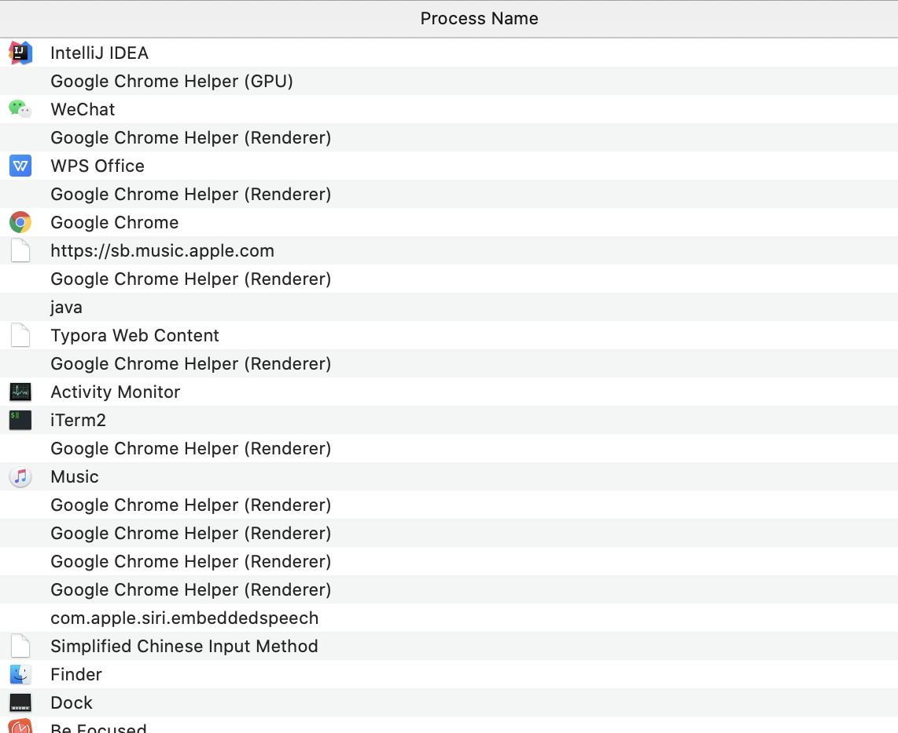
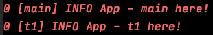
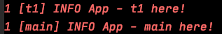
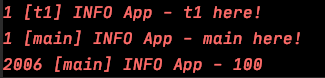

# 并发编程基础


## 1. 进程和线程

### 1.1 进程产生的背景

最初的计算机只能接受一些特定的指令，用户输入一些指令，计算机读取后执行

在用户思考 / 输入时，计算机大量时间处于等待状态，效率低下


**批处理操作系统**

到了批处理操作系统时代，用户可以将需要执行的指令用一张清单记录，作为计算机的输入

计算机执行过后，会将结果输出到另一张清单上

这样虽然提高了效率，但在一定程度上，**由于批处理操作系统的指令方式是串行的，内存中仍然只有一个程序在运行**

当前一个程序由于 I / O 操作或网络原因堵塞时，效率受到限制


**进程的提出**

为了解决上述问题，科学家提出的进程的概念


**进程就是在内存中分配空间，也就是正在运行的程序**


各个线程之间互不干扰，同时进程保持着每一个程序的运行状态

`CPU` 采用时间片轮转的方式运行线程：`CPU` 为每个进程分配一个时间段，称作时间片。

如果在时间片结束时进程仍然在运行，则暂停这个进程的运行，并且 `CPU` 分配给另一个进程（上下文切换）

若进程在时间片结束之前阻塞 / 结束，`CPU` 立即进行切换，不用等时间片用完


 

**线程的提出**

虽然进程的出现再次提升了操作系统的性能，但随着时间的推移，人们并不满足一个进程在一段时间内只能做一件事情。如果一个线程有多个子任务时，只能逐个地执行这些子任务，很影响效率

<div align="center">  </div><br>

那能否让这些子任务同时执行呢？于是人们又提出了线程的概念

**让一个线程执行一个子任务，则一个进程就包含了多个线程**


### 1.2 上下文切换

上下文切换指的是 `CPU` 从一个进程 / 线程切换到另一个进程 / 线程


上下文切换通常是计算密集型，故线程不是越多越好。如何减少系统中上下文切换次数，是提升多线程性能的一个重点课题


### 1.3 进程 / 线程的定义

**进程**

- 程序由指令和数据组成，这些指令要执行，数据要读写，就必须将指令加载到 `CPU`，数据加载到内存。指令运行的过程中，还需要用到磁盘或网络等设备。进程就是用来加载指令，管理内存，管理 `IO` 的
- 当一个程序被运行，从磁盘加载这个程序的代码至内存，就开启了一个进程
- 进程可以视为程序的一个实例


**线程**

- 一个进程中可以有多个线程
- 一个线程就是一个指令流，将指令流中的一条条指令以一定的顺序交给 `CPU` 执行
- 线程作为最小调度单位，进程作为资源分配最小单位


<div align="center">  </div><br>

进程和线程在我们生活中无处不在

<div align="center">  </div><br>


## 2. Java 多线程

### 2.1 创建和运行

**方法1: 使用 Thread 类**

创建一个 `t1` 线程

重写 `run` 方法，即需要实现的任务

调用 `start` 方法开启线程

```java
@Slf4j
public class App {

    public static void main(String[] args) {
        Thread t1 = new Thread() {
            @Override
            public void run() {
                log.info("t1 here!");
            }
        };
        t1.setName("t1");
        t1.start();
        log.info("main here!");
    }

}
```

可见两个线程在同时抢夺 `CPU` 资源，执行顺序不一致

<div align="center">  </div><br>

<div align="center">  </div><br>


**方法2: 实现 Runnable 接口（推荐）**

```java
@Slf4j
public class App {

    public static void main(String[] args) {

        Runnable r1 = new Runnable() {
            public void run() {
                log.info("t1 here!");
            }
        };

        Thread t1 = new Thread(r1, "t1");
        t1.start();

        log.info("main here!");
    }

}
```


<div align="center">  </div><br>


<div align="center">  </div><br>

使用 `lambda expression` 进行简化

```java
@Slf4j
public class App {

    public static void main(String[] args) {

        Runnable r1 = () -> {
            log.info("t1 here!");
        };

        Thread t1 = new Thread(r1, "t1");
        t1.start();

        log.info("main here!");
    }

}
```

**创建 Thread 类和实现 Runnable 接口有何区别？**

- 底层实现原理一样
- 推荐使用实现 `runnable` 接口的方式（降低耦合度）

调用 `Thread` 类的构造方法传入 `runnable` 接口时，底层也是重写了 `Thread` 类的 `run` 方法

```java
public Thread(Runnable target, String name) {
    init(null, target, name, 0);
}


private void init(ThreadGroup g, Runnable target, String name,
                  long stackSize, AccessControlContext acc,
                  boolean inheritThreadLocals) {
}


@Override
public void run() {
    if (target != null) {
        target.run();
    }
}
```


**方法3: FutureTask 配合 Thread**

`FutureTask` 先了解

```java
public class FutureTask<V> implements RunnableFuture<V>
```

<div align="center">  </div><br>


`FutureTask` 构造方法传入 `Callable` 接口作为参数

```java
public FutureTask(Callable<V> callable) {
    if (callable == null)
        throw new NullPointerException();
    this.callable = callable;
    this.state = NEW;       // ensure visibility of callable
}
```


那什么是 `Callable` 呢？原来 `Callable` 和 `Runnable` 是一对好兄弟

```java
package java.util.concurrent;

/**
 * A task that returns a result and may throw an exception.
 * Implementors define a single method with no arguments called
 * {@code call}.
 *
 * <p>The {@code Callable} interface is similar to {@link
 * java.lang.Runnable}, in that both are designed for classes whose
 * instances are potentially executed by another thread.  A
 * {@code Runnable}, however, does not return a result and cannot
 * throw a checked exception.
 *
 * <p>The {@link Executors} class contains utility methods to
 * convert from other common forms to {@code Callable} classes.
 *
 * @see Executor
 * @since 1.5
 * @author Doug Lea
 * @param <V> the result type of method {@code call}
 */
@FunctionalInterface
public interface Callable<V> {
    /**
     * Computes a result, or throws an exception if unable to do so.
     *
     * @return computed result
     * @throws Exception if unable to compute a result
     */
    V call() throws Exception;
}
```


`Callable` 接口可以返回值以及抛出异常，而 `Runnable` 接口不行

至于返回值的作用，稍后再继续深入


```java
@Slf4j
public class App {

    public static void main(String[] args) {

        FutureTask<Integer> futureTask = new FutureTask<>(new Callable<Integer>() {
            @Override
            public Integer call() throws Exception {
                log.info("t1 here!");
                Thread.sleep(2000);
                return 100;
            }
        });

        new Thread(futureTask, "t1").start();
        log.info("main here!");

        try {
            log.info(String.valueOf(futureTask.get()));
        } catch (InterruptedException e) {
            e.printStackTrace();
        } catch (ExecutionException e) {
            e.printStackTrace();
        }

    }
}
```


<div align="center">  </div><br>

值得注意的是，`log.info(String.valueOf(futureTask.get()));` 这一句是 `main` 线程执行的，因调用了 `futureTask.get()`，即处于阻塞状，态等待 `t1` 线程执行完毕后再执行


### 2.2 线程运行原理


## 3. 共享模型之管程


## 4. 共享模型之内存


## 5. 共享模型之无锁


## 6. 共享模型之不可变

