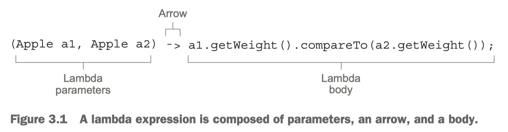
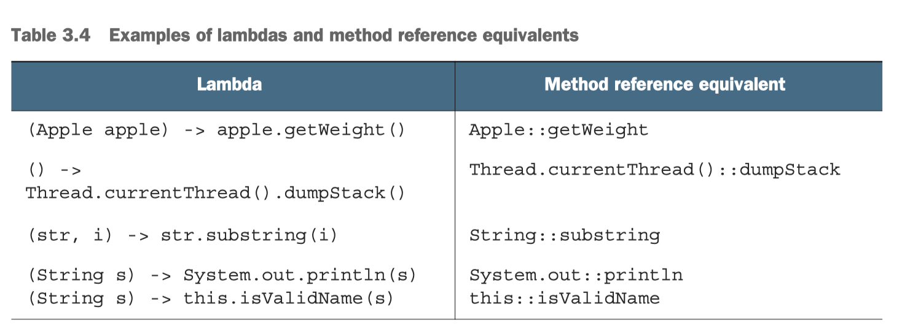
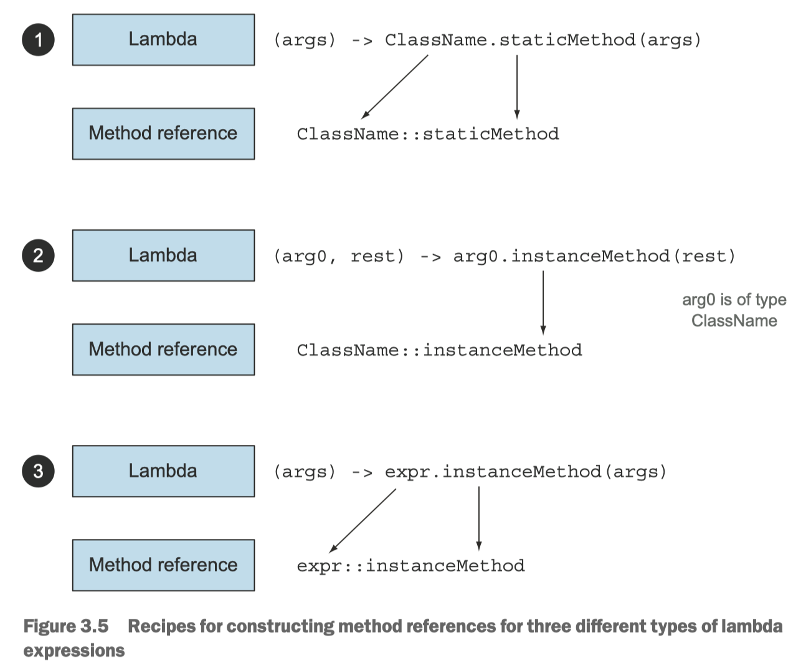
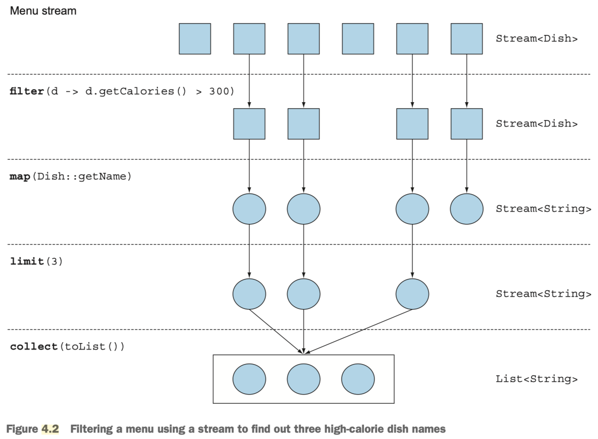
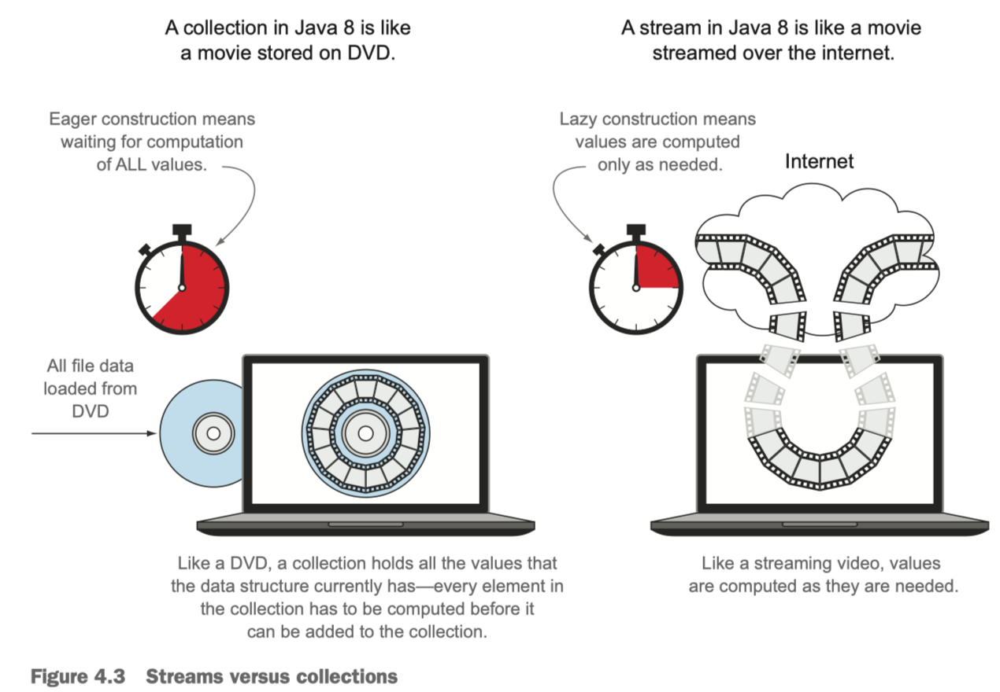
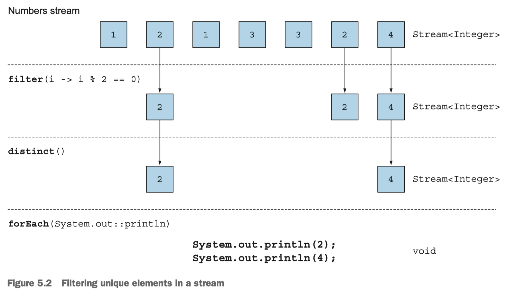

# Java 8

Table of Contents
-----------------

* [1. Why Java 8?](#1-why-java-8)
* [2. Priciples](#2-priciples)
* [3. Lambda](#3-lambda)
   * [3.1 Functional Interface](#31-functional-interface)
   * [3.2 Method Reference](#32-method-reference)
* [4. Streams](#4-streams)
   * [4.1 Overview](#41-overview)
   * [4.2 Filtering](#42-filtering)
* [References](#references)


## 1. Why Java 8?

- More concise code
- Simpler use of multi-core processors


## 2. Priciples

- *Streaming processing*
- *Behavior parameterization*


## 3. Lambda

> A *lambda expression* can be understood as a concise representation of an anonymous function that can be passed around

<div align="center">  </div><br>

- *A list of paras*
- *An arrow*
- *The body of lambda*


**Basic syntax**

```java
(parameters) -> expression
```

or

```java
(parameters) -> {statements;}
```


**Example**

```java
// A boolean expression
(List<String> list) -> list.isEmpty()
  
// Creating objs
() -> new Apple(10)
  
// Consuming from an obj
(Apple a) -> {
  System.out.println(a.getWeight());
}

// Select / extract from an obj
(String s) -> s.length()
  
// Combine two values
(int a, int b) -> a * b
  
// Compare two objs
(Apple a1, Apple a2) -> a1.getWeight().compareTo(a2.getWeight())
```


### 3.1 Functional Interface

> An interface that specifics exactly one abstract method

**Predicate**

```java
@FunctionalInterface
public interface Predicate<T> {

    boolean test(T t);

}
```


**Consumer**

```java
@FunctionalInterface
public interface Consumer<T> {

    void accept(T t);
  
}
```


**Function**

```java
@FunctionalInterface
public interface Function<T, R> {

    R apply(T t);

}
```


### 3.2 Method Reference

> *Method reference* can be seen as shorthand for lambdas calling only a specific method

**Why method reference?**

The basic idea is that:

if a lambda represents "call this method directly", it's **best to refer to the method by name** rather than by a description of how to call it


**Basic Syntax**

```java
target reference :: name of the method
```


**Example**

<div align="center">  </div><br>

**Method References**

<div align="center">  </div><br>

## 4. Streams

> Fancy iterators over a collection of data, what's more, *streams* can be processed in parallel transparently

### 4.1 Overview

**Streams**

<div align="center">  </div><br>


**Streams vs. Collections**

<div align="center">  </div><br>

- *Streams* : a set of values spread out in time
- *Collections* : a set of values spread out in space (computer memory)


### 4.2 Filtering

**Predicate**

<div align="center">  </div><br>


**Distinct**

<div align="center">  </div><br>


## References

- *Modern Java In Action*