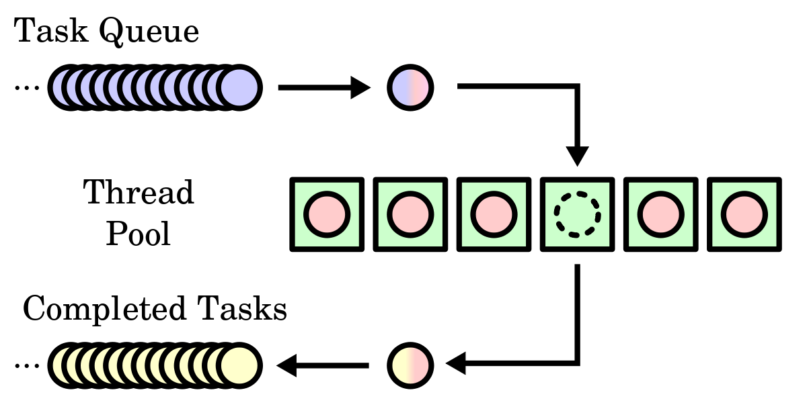
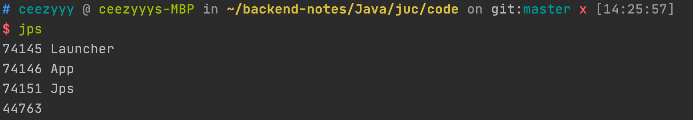
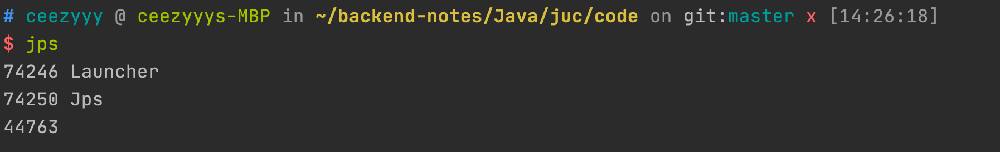
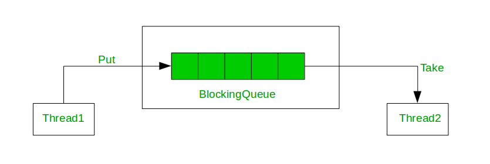
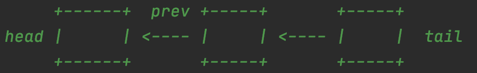

# J.U.C

Table of Contents
-----------------

* [Brainstorming](#brainstorming)
* [1. 线程](#1-线程)
   * [1.1 创建](#11-创建)
      * [1.1.1 Runnable](#111-runnable)
      * [1.1.2 FutureTask](#112-futuretask)
   * [1.2 状态](#12-状态)
      * [1.2.1 操作系统中线程状态](#121-操作系统中线程状态)
      * [1.2.2 Java 中线程状态](#122-java-中线程状态)
   * [1.3 机制](#13-机制)
      * [1.3.1 Executor](#131-executor)
      * [1.3.2 Daemon](#132-daemon)
      * [1.3.3 sleep()](#133-sleep)
   * [1.4 中断](#14-中断)
   * [1.5 协作](#15-协作)
      * [1.5.1 Thread.join()](#151-threadjoin)
      * [1.5.2 Object.wait()  &amp; Object.notify()](#152-objectwait---objectnotify)
* [2. 锁](#2-锁)
   * [2.1 乐观锁](#21-乐观锁)
      * [2.1.1 CAS 原理](#211-cas-原理)
      * [2.1.2 原子操作类](#212-原子操作类)
   * [2.2 悲观锁](#22-悲观锁)
      * [2.2.1 synchronized](#221-synchronized)
   * [2.3 AQS](#23-aqs)
      * [2.3.1 Node](#231-node)
      * [2.3.2 state](#232-state)
      * [2.3.3 获取资源](#233-获取资源)
      * [2.3.4 释放资源](#234-释放资源)
* [References](#references)


## Brainstorming

<div align="center">  </div><br>


## 1. 线程

### 1.1 创建

#### 1.1.1 Runnable

**App.java**

```java
@FunctionalInterface
public interface Runnable {
  
    public abstract void run();
  
}


public class App {

    public static void main(String[] args) {

        new Thread(() -> {
            System.out.println(Thread.currentThread().getName() + " here!");
        }, "t1").start();

        new Thread(() -> {
            System.out.println(Thread.currentThread().getName() + " here!");
        }, "t2").start();

        System.out.println(Thread.currentThread().getName() + " here!");

    }

}
```


#### 1.1.2 FutureTask

**App.java**

```java
@FunctionalInterface
public interface Callable<V> {
   
    V call() throws Exception;
  
}


public class App {
    public static void main(String[] args) throws ExecutionException, InterruptedException {

        FutureTask<String> task = new FutureTask<>(() -> {
            return "Hello World from " + Thread.currentThread().getName();
        });

        new Thread(task, "t1").start();

        System.out.println("Hello World from " + Thread.currentThread().getName());

        System.out.println(task.get());

    }
}
```

### 1.2 状态

#### 1.2.1 操作系统中线程状态

<div align="center">  </div><br>

#### 1.2.2 Java 中线程状态

**Thread.java**

```java
// Thread.State
public enum State {
  
    NEW,
    RUNNABLE,
    BLOCKED,
    WAITING,
    TIMED_WAITING,
    TERMINATED;

}
```


**状态转换图**

<div align="center">  </div><br>


### 1.3 机制

#### 1.3.1 Executor

<div align="center">  </div><br>

**Executor.java**

```java
public interface Executor {

    void execute(Runnable command);
  
}
```


**Executors.java**

```java
package java.util.concurrent;


public class Executors {
}
```


#### 1.3.2 Daemon

```java
public class App {

    public static void main(String[] args) {

        // User thread
        new Thread(() -> {
            while (true) {
                // Do nothing
            }
        }, "t1").start();

        System.out.println("Main thread exited");

    }

}
```

<div align="center">  </div><br>

**App.java**

```java
public class App {

    public static void main(String[] args) {

        // Daemon thread
        Thread task = new Thread(() -> {
            while (true) {
                // Do nothing
            }
        }, "t1");

        task.setDaemon(true);
        task.start();

        System.out.println("Main thread exited");

    }

}
```

<div align="center">  </div><br>


#### 1.3.3 sleep()

```java
try {
    Thread.sleep(1000);
} catch (InterruptedException e) {
    e.printStackTrace();
}
```


### 1.4 中断

**Thread.java**

```java
public void interrupt() {
  // t1 运行时，t2 可以调用 t1.interrupt() 来设置 t1 的中断标志为 true 并立即返回
  // t1 并没有中断，会继续执行
  // 若 t1 处于 waiting / timed_waiting -> 抛 InterruptedException
}


public static boolean interrupted() {
  // 对当前中断标识位进行复位
}


public boolean isInterrupted() {
  // 当前线程是否被中断
}
```


### 1.5 协作

#### 1.5.1 Thread.join()

**Thread.java**

```java
public final void join() throws InterruptedException {
    join(0);
}
```

**App.java**

```java
public class App {
    public static void main(String[] args) {

        System.out.println(Thread.currentThread().getName() + " started");

        Thread t1 = new Thread(() -> {
            for (int i = 0; i < 20; i++) {
                System.out.print(i + " ");
            }
            System.out.println();
        }, "t1");

        t1.start();
//        t1.join();

        System.out.println(Thread.currentThread().getName() + " exited");

    }
}
```


**Output**

```
main started
main exited
0 1 2 3 4 5 6 7 8 9 10 11 12 13 14 15 16 17 18 19
```


**App.java**

```java
public class App {
    public static void main(String[] args) throws InterruptedException {

        System.out.println(Thread.currentThread().getName() + " started");

        Thread t1 = new Thread(() -> {
            for (int i = 0; i < 20; i++) {
                System.out.print(i + " ");
            }
            System.out.println();
        }, "t1");

        t1.start();
        t1.join();

        System.out.println(Thread.currentThread().getName() + " exited");

    }
}
```


**Output**

```
main started
0 1 2 3 4 5 6 7 8 9 10 11 12 13 14 15 16 17 18 19 
main exited
```


#### 1.5.2 Object.wait()  & Object.notify()

**使用方法**

```java
synchronized (obj) {
         while (<condition does not hold>)
             obj.wait();
         ... // Perform action appropriate to condition
     }
```


**Example**

<div align="center">  </div><br>

**BlockingQueue.java**

```java
/**
 * A demo of Object.wait() & Object.notify()
 *
 * @param <E>
 */
public class BlockingQueue<E> {

    private int capacity;
    private Deque<E> deque = new LinkedList<>();

    public BlockingQueue(int capacity) {
        this.capacity = capacity;
    }

    public synchronized void put(E element) throws InterruptedException {

        while (deque.size() == capacity) {
            wait();
        }

        deque.add(element);
        notifyAll();

    }

    public synchronized E get() throws InterruptedException {

        while (deque.isEmpty()) {
            wait();
        }

        E res = deque.remove();
        notifyAll();
        return res;

    }
}
```

**App.java**

```java
public class App {
    public static void main(String[] args) throws InterruptedException {

        BlockingQueue<Object> blockingQueue = new BlockingQueue<>(10);
        ExecutorService pool = Executors.newCachedThreadPool();

        // Producer
        for (int i = 0; i < 5; i++) {
            pool.execute(() -> {
                try {
                    blockingQueue.put(1);
                } catch (InterruptedException e) {
                    e.printStackTrace();
                }
            });
        }

        // Consumer
        for (int i = 0; i < 8; i++) {
            pool.execute(() -> {
                try {
                    blockingQueue.get();
                } catch (InterruptedException e) {
                    e.printStackTrace();
                }
            });
        }

        pool.shutdown();

    }
}
```


**思考**

- deque 的容量
- 生产者数量
- 消费者数量

三者关系？


## 2. 锁

### 2.1 乐观锁

#### 2.1.1 CAS 原理

**三个变量**

- V: var
- E: expected
- N: new

**语义**

“我认为 V 的值应该是 E，若 V = E，则修改 V 为 N；否则不修改”

<div align="center">  </div><br>


#### 2.1.2 原子操作类

**Example**

**Resource.java**

```java
public class Resource {

    private static AtomicInteger ai = new AtomicInteger(0);

    public static AtomicInteger getAi() {
        return ai;
    }

    public void increase() {
        ai.getAndIncrement();
    }

}
```

**App.java**

```java
/**
 * Demo of java.util.concurrent.atomic.AtomicInteger
 */
public class App {

    public static void main(String[] args) {

        ExecutorService pool = Executors.newCachedThreadPool();
        Resource resource = new Resource();

        pool.execute(() -> {
            for (int i = 0; i < 500; i++) {
                resource.increase();
            }
        });
        pool.execute(() -> {
            for (int i = 0; i < 500; i++) {
                resource.increase();
            }
        });

        pool.shutdown();

        System.out.println(Resource.getAi());  // 1000

    }
}
```


**AtomicInteger.java**

```java
public final int getAndIncrement() {
  return unsafe.getAndAddInt(this, valueOffset, 1);
}


public final int getAndAddInt(Object var1, long var2, int var4) {
  int var5;
  do {
    // 通过 CAS 实现
    // var1 和 var2 是为了确定该字段的值，记为 var5
    // var4 也就是 delta (改变了多少)
    var5 = this.getIntVolatile(var1, var2);
  } while(!this.compareAndSwapInt(var1, var2, var5, var5 + var4));

  return var5;
}


public final native boolean compareAndSwapInt(Object var1, long var2, int var4, int var5);
```


### 2.2 悲观锁

#### 2.2.1 synchronized

**基本用法**

```java
// 关键字在 instance 方法上 -> 锁为当前 instance
public synchronized void instanceLock() {
    // code
}


// 关键字在静态方法上 -> 锁为当前 Class 对象
public static synchronized void classLock() {
    // code
}


// 关键字在代码块上 -> 锁为括号里面的对象 (Class 对象 / instance)
public void blockLock() {
    Object o = new Object();
    synchronized (o) {
        // code
    }
}
```


以下两种写法等价

```java
// 关键字在 instance 方法上 -> 锁为当前 instance
public synchronized void instanceLock() {
    // code
}


// 关键字在代码块上 -> 锁为括号里面的 instance
public void blockLock() {
    synchronized (this) {
        // code
    }
}
```


这两种写法也是等价的

```java
// 关键字在静态方法上 -> 锁为当前 Class 对象
public static synchronized void classLock() {
    // code
}


// 关键字在代码块上 -> 锁为括号里的 Class 对象
public void blockLock() {
    synchronized (this.getClass()) {
        // code
    }
}
```


**Example: 锁为 Class 对象**

**Resource.java**

```java
public class Resource {

    public static synchronized void func() {
        for (int i = 0; i < 20; i++) {
            System.out.print(i + " ");
        }
    }
}
```

**Resource.java**

```java
public class Resource {

    public void func() {
        synchronized (this.getClass()) {
            for (int i = 0; i < 20; i++) {
                System.out.print(i + " ");
            }
        }
    }
}
```


**App.java**

```java
public class App {

    public static void main(String[] args) {

        Resource r1 = new Resource();
        Resource r2 = new Resource();
        ExecutorService pool = Executors.newCachedThreadPool();

        pool.execute(() -> {
            r1.func();
        });
        pool.execute(() -> {
            r2.func();
        });

        pool.shutdown();

    }
}
```


**Output**

```
0 1 2 3 4 5 6 7 8 9 10 11 12 13 14 15 16 17 18 19 0 1 2 3 4 5 6 7 8 9 10 11 12 13 14 15 16 17 18 19 
```


**Example: 锁为 instance**

**Resource.java**

```java
public class Resource {

    public synchronized void func() {
        for (int i = 0; i < 20; i++) {
            System.out.print(i + " ");
        }
    }
}
```


**Resource.java**

```java
public class Resource {

    public void func() {
        synchronized (this) {
            for (int i = 0; i < 20; i++) {
                System.out.print(i + " ");
            }
        }
    }
}
```


**App.java**

```java
public class App {

    public static void main(String[] args) {

        Resource r1 = new Resource();
        Resource r2 = new Resource();
        ExecutorService pool = Executors.newCachedThreadPool();

        pool.execute(() -> {
            r1.func();
        });
        pool.execute(() -> {
            r2.func();
        });

        pool.shutdown();

    }
}
```


**Output**

```
0 1 2 3 4 5 6 0 7 8 9 10 11 12 13 14 1 2 3 4 5 15 6 7 16 17 18 19 8 9 10 11 12 13 14 15 16 17 18 19 
```


**内存语义**

**CPU**

<div align="center">  </div><br>


**Three level cache**

<div align="center">  </div><br>


### 2.3 AQS

```java
public abstract class AbstractQueuedSynchronizer
    extends AbstractOwnableSynchronizer
    implements java.io.Serializable {
  // code
}
```


<div align="center">  </div><br>

<div align="center">  </div><br>


#### 2.3.1 Node

**AbstractQueuedSynchronizer.java**

```java
static final class Node {

  // 共享模式
  static final Node SHARED = new Node();

  // 独占模式
  static final Node EXCLUSIVE = null;

  // 线程取消等待（由于线程等待超时 / 被中断）
  static final int CANCELLED =  1;

  // 线程已经准备好，等待资源释放
  static final int SIGNAL    = -1;

  // 节点线程等待被唤醒
  static final int CONDITION = -2;

  // 在 SHARED 情况下，会被无条件传播下去
  static final int PROPAGATE = -3;

  // 当前 node 在队列中的状态, 初始值为 0
  volatile int waitStatus;

  // 前驱指针
  volatile Node prev;

  // 后继指针
  volatile Node next;

  // 处于当前 node 的线程
  volatile Thread thread;

  // 等待队列里下一个等待条件的 node
  Node nextWaiter;


  // 判断是否 shared 模式
  final boolean isShared() {
    return nextWaiter == SHARED;
  }


  // Used by addWaiter()
  Node(Thread thread, Node mode) {     
    this.nextWaiter = mode;
    this.thread = thread;
  }

}
```


#### 2.3.2 state

```java
// 同步状态：临界资源的获锁情况
private volatile int state;


// protected -> package java.util.concurrent.locks 包下可见
// final -> 实现类不能修改
protected final int getState() {
  return state;
}


protected final void setState(int newState) {
  state = newState;
}


protected final boolean compareAndSetState(int expect, int update) {
  // See below for intrinsics setup to support this
  return unsafe.compareAndSwapInt(this, stateOffset, expect, update);
}


public final native boolean compareAndSwapInt(Object var1, long var2, int var4, int var5);

```


**Exclusive**

<div align="center">  </div><br>

**Shared**

<div align="center">  </div><br>


#### 2.3.3 获取资源

**AbstractQueuedSynchronizer.java**

```java
// 获取资源
public final void acquire(int arg) {
  if (!tryAcquire(arg) &&
      acquireQueued(addWaiter(Node.EXCLUSIVE), arg))
    selfInterrupt();
}


// 将该线程插入到等待队列中
private Node addWaiter(Node mode) {
  Node node = new Node(Thread.currentThread(), mode);
  // Try the fast path of enq; backup to full enq on failure
  Node pred = tail;
  if (pred != null) {
    node.prev = pred;
    // 若成功插入则返回
    if (compareAndSetTail(pred, node)) {
      pred.next = node;
      return node;
    }
  }
  enq(node);
  return node;
}


// 通过 CAS 插入到队尾
private final boolean compareAndSetTail(Node expect, Node update) {
  return unsafe.compareAndSwapObject(this, tailOffset, expect, update);
}


// 自旋 CAS 插入等待队列
private Node enq(final Node node) {
  for (;;) {
    Node t = tail;
    if (t == null) { // Must initialize
      if (compareAndSetHead(new Node()))
        tail = head;
    } else {
      node.prev = t;
      if (compareAndSetTail(t, node)) {
        t.next = node;
        return t;
      }
    }
  }
}
```

接下来看看 `acquireQueued()`

**AbstractQueuedSynchronizer.java**

```java
// Acquires in exclusive uninterruptible mode for thread already in queue
// Used by condition wait methods as well as acquire.
final boolean acquireQueued(final Node node, int arg) {
    boolean failed = true;
    try {
        boolean interrupted = false;
        for (;;) {
            final Node p = node.predecessor();
            if (p == head && tryAcquire(arg)) {
                setHead(node);
                p.next = null; // help GC
                failed = false;
                return interrupted;
            }
            if (shouldParkAfterFailedAcquire(p, node) &&
                parkAndCheckInterrupt())
                interrupted = true;
        }
    } finally {
        if (failed)
            cancelAcquire(node);
    }
}
```


// TODO


#### 2.3.4 释放资源

// TODO


## References

- 周志明. 深入理解 Java 虚拟机 [M]. 机械工业出版社, 2011.
- 翟陆续, 薛宾田. Java并发编程之美 [M]. 电子工业出版社, 2018.
- 方腾飞, 魏鹏, 程晓明. Java并发编程的艺术 [M]. 机械工业出版社, 2019.
- [CyC2018](https://github.com/CyC2018/CS-Notes/blob/master/notes/Java%20%E5%B9%B6%E5%8F%91.md)
- [RedSpider1 / concurrent](https://github.com/RedSpider1/concurrent)
- [A Guide to the Java ExecutorService](https://www.baeldung.com/java-executor-service-tutorial)
- [wait and notify() Methods in Java](https://www.baeldung.com/java-wait-notify)
- [A simple scenario using wait() and notify() in java](https://stackoverflow.com/questions/2536692/a-simple-scenario-using-wait-and-notify-in-java)
- [从ReentrantLock的实现看AQS的原理及应用](https://tech.meituan.com/2019/12/05/aqs-theory-and-apply.html)
