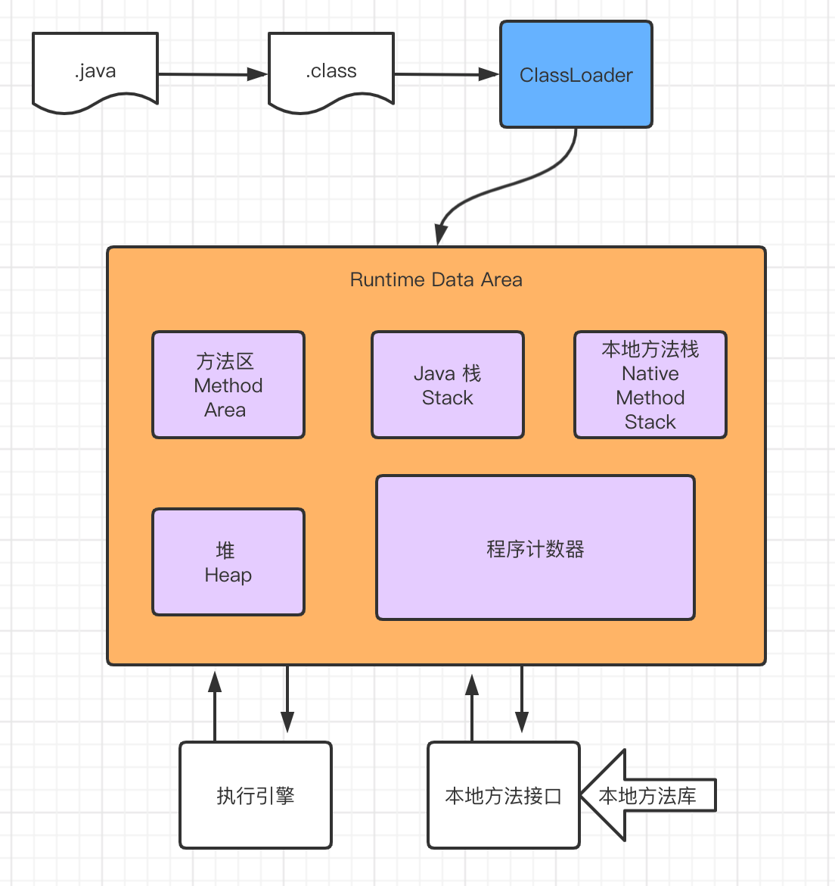

# JVM

Table of Contents
-----------------

* [1. JVM 的位置](#1-jvm-的位置)
* [2. JVM 的体系结构](#2-jvm-的体系结构)
* [3. 类加载器](#3-类加载器)
* [4. 双亲委派](#4-双亲委派)
* [5. 沙箱安全](#5-沙箱安全)
* [6. Native](#6-native)
* [7. PC 寄存器](#7-pc-寄存器)
* [8. 方法区](#8-方法区)
* [9. 栈](#9-栈)
* [10. 三种 JVM](#10-三种-jvm)
* [11. 堆](#11-堆)
* [12. 新生区 老年区](#12-新生区-老年区)
* [13. 永久区](#13-永久区)
* [14. 堆内存调优](#14-堆内存调优)
* [15. GC](#15-gc)
* [16. JMM](#16-jmm)
* [参考链接](#参考链接)

## 1. JVM 的位置

<div align="center">  </div><br>


 


## 2. JVM 的体系结构

<div align="center">  </div><br>


## 3. 类加载器

**作用:** 将类的字节码文件从 `JVM` 外部加载到内存中

<div align="center">  </div><br>

**Car.java**


```java
public class Car {

    private double price;

    public static void main(String[] args) {

        Car maybach = new Car();
        Car bentley = new Car();
        Car porsche = new Car();

        System.out.println(maybach.hashCode());  // 621009875
        System.out.println(bentley.hashCode());  // 1265094477
        System.out.println(porsche.hashCode());  // 2125039532

        Class<? extends Car> maybachClass = maybach.getClass();
        Class<? extends Car> bentleyClass = bentley.getClass();
        Class<? extends Car> porscheClass = porsche.getClass();

        System.out.println(maybachClass.hashCode());  // 856419764
        System.out.println(bentleyClass.hashCode());  // 856419764
        System.out.println(porscheClass.hashCode());  // 856419764

    }
}
```


## 4. 双亲委派

## 5. 沙箱安全

## 6. Native

## 7. PC 寄存器

## 8. 方法区

## 9. 栈

## 10. 三种 JVM

## 11. 堆

## 12. 新生区 老年区

## 13. 永久区

## 14. 堆内存调优

## 15. GC

## 16. JMM


## 参考链接

- [【狂神说Java】JVM快速入门篇](https://www.bilibili.com/video/BV1iJ411d7jS)