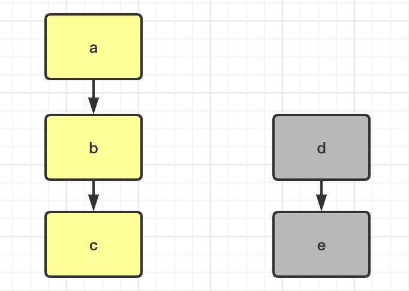
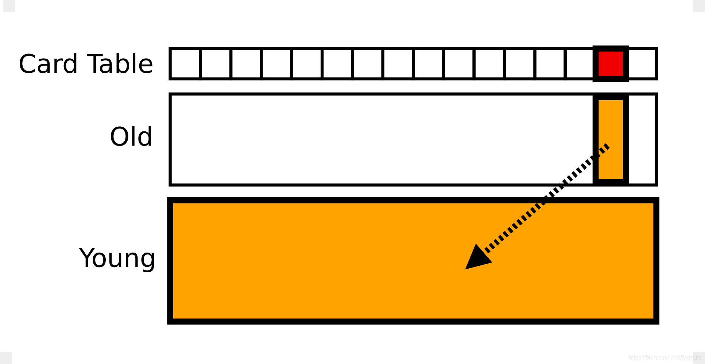
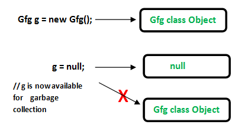
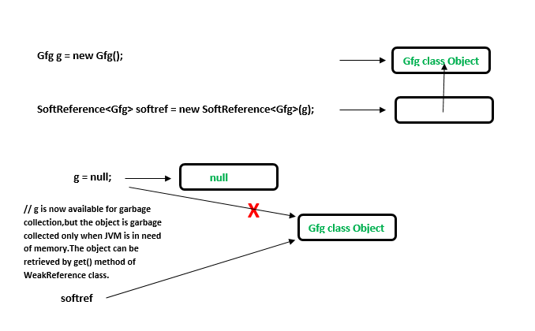
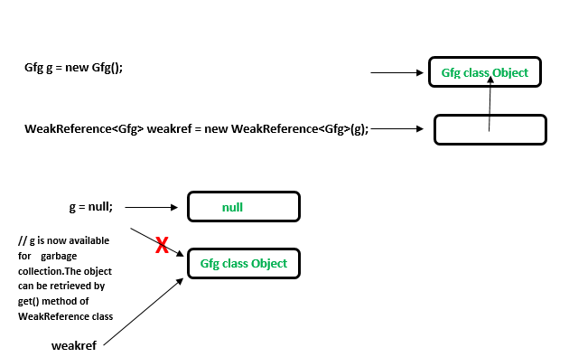
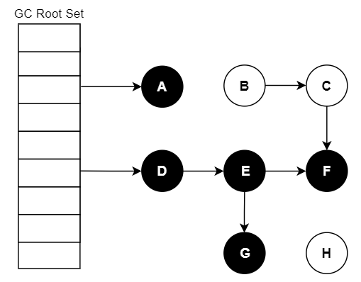
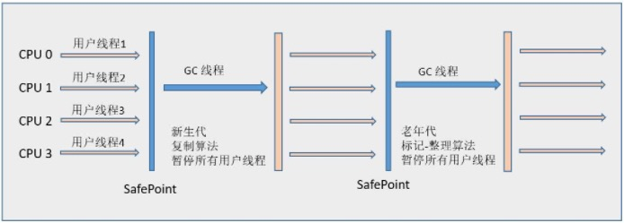
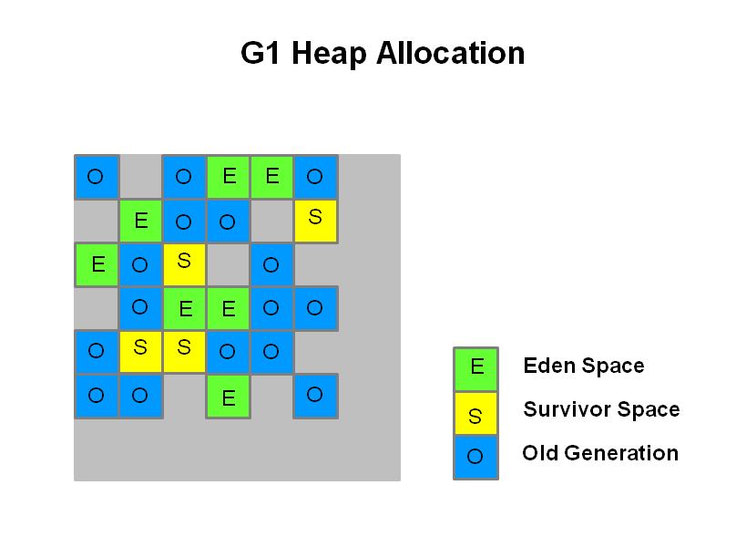

# JVM

Table of Contents
-----------------

* [Brainstorming](#brainstorming)
* [1. 运行时数据区](#1-运行时数据区)
   * [1.1 概述](#11-概述)
   * [1.2 VM Stack](#12-vm-stack)
* [2. 内存分配](#2-内存分配)
* [3. GC](#3-gc)
   * [3.1 可达性分析](#31-可达性分析)
      * [3.1.1 Rembered Set](#311-rembered-set)
      * [3.1.2 引用](#312-引用)
      * [3.1.3 三色标记法](#313-三色标记法)
   * [3.2 GC 算法](#32-gc-算法)
      * [3.2.1 Mark-Sweep](#321-mark-sweep)
      * [3.2.2 Mark-Copy](#322-mark-copy)
      * [3.2.3 Mark-Compact](#323-mark-compact)
   * [3.3 垃圾收集器](#33-垃圾收集器)
      * [3.3.1 概述](#331-概述)
      * [3.3.2 Serial](#332-serial)
      * [3.3.3 CMS](#333-cms)
      * [3.3.4 G1](#334-g1)
* [References](#references)


## Brainstorming

<div align="center">  </div><br>

## 1. 运行时数据区

该文基于 `HotSpot` 虚拟机

<div align="center">  </div><br>

### 1.1 概述

下图帮助理解记忆 `JVM` 运行时数据区


<div align="center">  </div><br>

### 1.2 VM Stack

<div align="center">  </div><br>

<div align="center">  </div><br>

## 2. 内存分配

<div align="center">  </div><br>


## 3. GC

### 3.1 可达性分析

**MyObj.java**


```java
qpublic class MyObj {

    private String name;
    private MyObj reference;

    public MyObj(String name) {
        this.name = name;
    }

    public MyObj(String name, MyObj reference) {
        this.name = name;
        this.reference = reference;
    }

    public static void main(String[] args) {

        MyObj a = new MyObj("a");
        MyObj b = new MyObj("b");
        MyObj c = new MyObj("c");

        a.reference = b;
        b.reference = c;

        new MyObj("b", new MyObj("e"));

    }
}
```

若将对象 a 当作 `GC roots` 的话：对象 d 和 e 属于不可达对象 -> 需被回收

<div align="center">  </div><br>

#### 3.1.1 Rembered Set

<div align="center">  </div><br>


```java
CARD_TABLE[this address >> 9] = 0;
```


#### 3.1.2 引用

**Strongly reference**

```java
// Java program to illustrate Strong reference 
class Gfg 
{ 
	//Code.. 
} 
public class Example 
{ 
	public static void main(String[] args) 
	{ 
		//Strong Reference - by default 
		Gfg g = new Gfg();	 
		
		//Now, object to which 'g' was pointing earlier is 
		//eligible for garbage collection. 
		g = null; 
	} 
} 
```

<div align="center">  </div><br>

**Soft reference**

```java
//Code to illustrate Soft reference 
import java.lang.ref.SoftReference; 
class Gfg 
{ 
	//code.. 
	public void x() 
	{ 
		System.out.println("GeeksforGeeks"); 
	} 
} 

public class Example 
{ 
	public static void main(String[] args) 
	{ 
		// Strong Reference 
		Gfg g = new Gfg();	 
		g.x(); 
		
		// Creating Soft Reference to Gfg-type object to which 'g' 
		// is also pointing. 
		SoftReference<Gfg> softref = new SoftReference<Gfg>(g); 
		
		// Now, Gfg-type object to which 'g' was pointing 
		// earlier is available for garbage collection. 
		g = null; 
		
		// You can retrieve back the object which 
		// has been weakly referenced. 
		// It successfully calls the method. 
		g = softref.get(); 
		
		g.x(); 
	} 
} 
```

<div align="center">  </div><br>


**Weak reference**

```java
//Java Code to illustrate Weak reference 
import java.lang.ref.WeakReference; 
class Gfg 
{ 
	//code 
	public void x() 
	{ 
		System.out.println("GeeksforGeeks"); 
	} 
} 

public class Example 
{ 
	public static void main(String[] args) 
	{ 
		// Strong Reference 
		Gfg g = new Gfg();	 
		g.x(); 
		
		// Creating Weak Reference to Gfg-type object to which 'g' 
		// is also pointing. 
		WeakReference<Gfg> weakref = new WeakReference<Gfg>(g); 
		
		//Now, Gfg-type object to which 'g' was pointing earlier 
		//is available for garbage collection. 
		//But, it will be garbage collected only when JVM needs memory. 
		g = null; 
		
		// You can retrieve back the object which 
		// has been weakly referenced. 
		// It successfully calls the method. 
		g = weakref.get(); 
		
		g.x(); 
	} 
} 
```

<div align="center">  </div><br>


**Phantom reference**

```java
//Code to illustrate Phantom reference 
import java.lang.ref.*; 
class Gfg 
{ 
	//code 
	public void x() 
	{ 
		System.out.println("GeeksforGeeks"); 
	} 
} 

public class Example 
{ 
	public static void main(String[] args) 
	{ 
		//Strong Reference 
		Gfg g = new Gfg();	 
		g.x(); 
		
		//Creating reference queue 
		ReferenceQueue<Gfg> refQueue = new ReferenceQueue<Gfg>(); 

		//Creating Phantom Reference to Gfg-type object to which 'g' 
		//is also pointing. 
		PhantomReference<Gfg> phantomRef = null; 
		
		phantomRef = new PhantomReference<Gfg>(g,refQueue); 
		
		//Now, Gfg-type object to which 'g' was pointing 
		//earlier is available for garbage collection. 
		//But, this object is kept in 'refQueue' before 
		//removing it from the memory. 
		g = null; 
		
		//It always returns null. 
		g = phantomRef.get(); 
		
		//It shows NullPointerException. 
		g.x(); 
	} 
} 
```


#### 3.1.3 三色标记法

> 黑, 白, 灰

<div align="center">  </div><br>

表示 A, D, E, F, G 可达

**多标：浮动垃圾**

当遍历到 D 时（灰色），执行了语句

```java
objD.fieldE = null;
```

E 应该是垃圾了，但还是继续追踪 E -> 不影响程序正确性，需等到下一轮 `GC` 进行回收

<div align="center">  </div><br>

**漏标：读写屏障**

当遍历到 E 时（灰色），执行了语句

```java
var G = objE.fieldG;  // 1. read
objE.fieldG = null;  // 2. write 
objD.fieldG = G;  // 3. write
```


<div align="center">  </div><br>

**读屏障**


**写屏障**

`aop` 思想		

```java
void oop_field_store(oop* field, oop new_value) {  
    pre_write_barrier(field); // 写屏障-写前操作
    *field = new_value; 
    post_write_barrier(field, value);  // 写屏障-写后操作
}
```


### 3.2 GC 算法

#### 3.2.1 Mark-Sweep

<div align="center">  </div><br>

#### 3.2.2 Mark-Copy

<div align="center">  </div><br>

#### 3.2.3 Mark-Compact

<div align="center">  </div><br>

### 3.3 垃圾收集器

#### 3.3.1 概述

<div align="center">  </div><br>

7 种适用于不同场景的垃圾收集器，连线代表可两两可搭配使用


#### 3.3.2 Serial

<div align="center">  </div><br>


#### 3.3.3 CMS

<div align="center">  </div><br>


#### 3.3.4 G1

`G1` 开创的基于 region 的堆内存布局

<div align="center">  </div><br>


<div align="center">  </div><br>


## References

- 周志明. 深入理解 Java 虚拟机 [M]. 机械工业出版社, 2011.
- [CyC2018 / CS-Notes](https://github.com/CyC2018/CS-Notes/blob/master/notes/Java%20%E8%99%9A%E6%8B%9F%E6%9C%BA.md)
- [大白话理解可达性分析算法](https://blog.csdn.net/qq_32099833/article/details/109253339)
- [Types of References in Java](https://www.geeksforgeeks.org/types-references-java/)
- [JVM之GC算法、垃圾收集算法——标记-清除算法、复制算法、标记-整理算法、分代收集算法](https://www.cnblogs.com/java-spring/p/9923423.html)
- [深入理解JVM(3)——7种垃圾收集器](https://crowhawk.github.io/2017/08/15/jvm_3/)
- [Interview - 垃圾回收](https://hadyang.github.io/interview/docs/java/jvm/gc/)
- [三色标记法与读写屏障](https://www.jianshu.com/p/12544c0ad5c1)