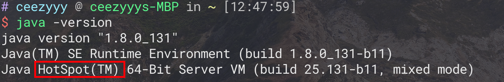
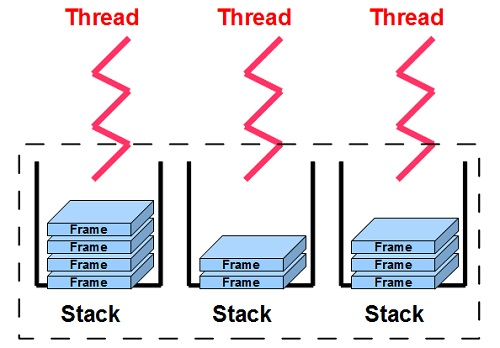
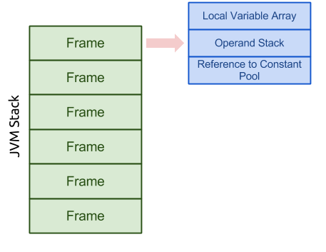

# JVM

Table of Contents
-----------------

* [Brainstorming](#brainstorming)
* [1. 运行时数据区](#1-运行时数据区)
   * [1.1 VM Stack](#11-vm-stack)
* [References](#references)

## Brainstorming

  
 

## 1. 运行时数据区

该文基于 `HotSpot` 虚拟机

  
 

  
 

### 1.1 VM Stack

  
 

  
 

## References

- 周志明. 深入理解 Java 虚拟机 [M]. 机械工业出版社, 2011.
- [JVM - Baeldung](https://www.baeldung.com/tag/jvm/)