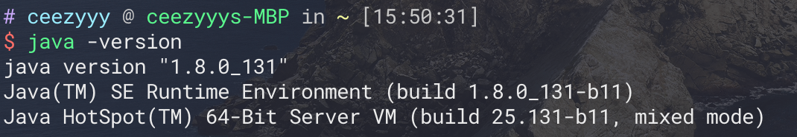
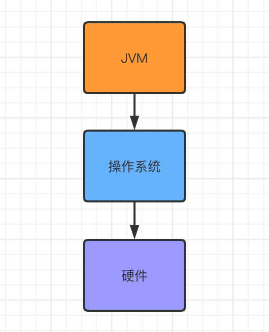
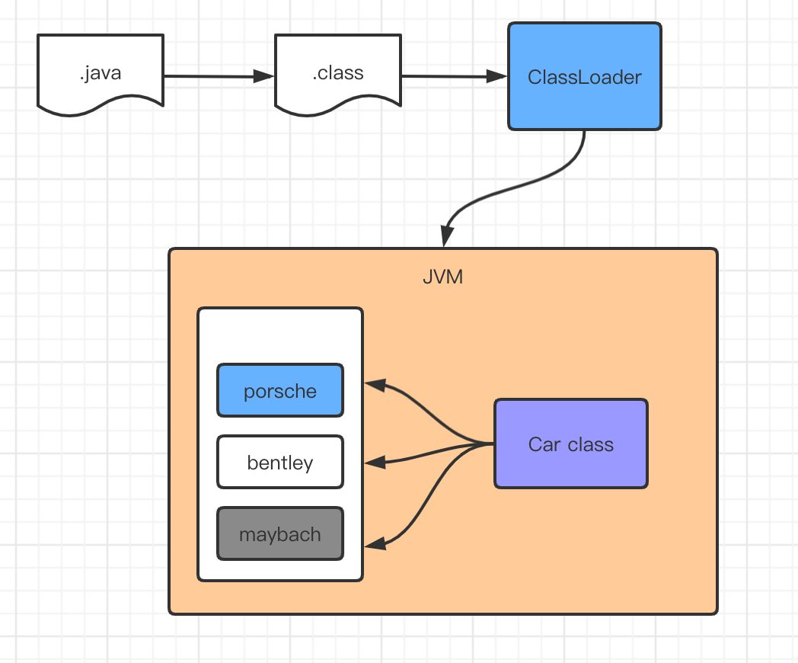
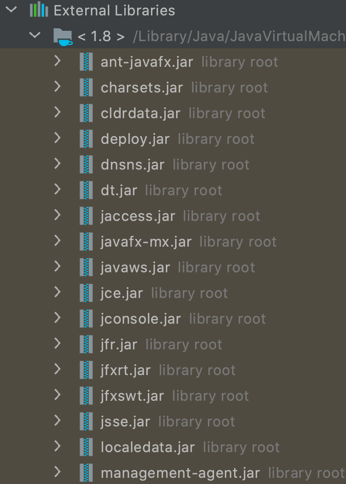
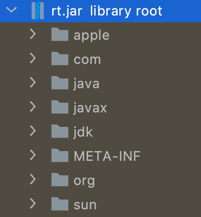
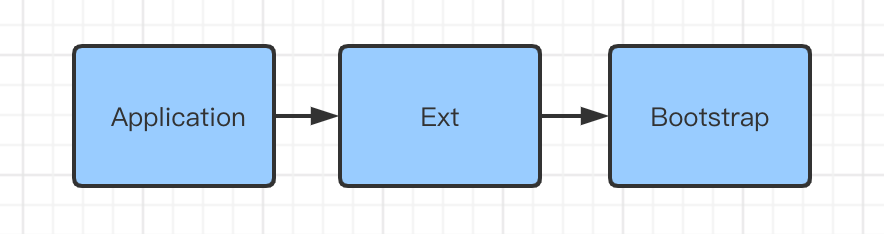
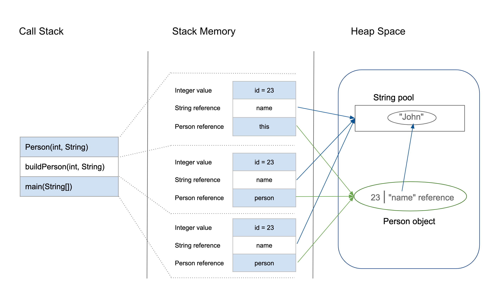

# JVM

Table of Contents
-----------------

* [Brainstorming](#brainstorming)
* [1. JVM 的位置](#1-jvm-的位置)
* [2. JVM 内存结构](#2-jvm-内存结构)
* [3. 类加载器](#3-类加载器)
* [4. 双亲委派](#4-双亲委派)
* [5. Native](#5-native)
* [6. 程序计数器 (PC 寄存器)](#6-程序计数器-pc-寄存器)
* [7. Stack Memory (线程私有)](#7-stack-memory-线程私有)
* [8. Heap Space (线程共享)](#8-heap-space-线程共享)
* [9. JVM 如何分配内存给堆栈](#9-jvm-如何分配内存给堆栈)
* [10. 方法区 (JDK 1.7)](#10-方法区-jdk-17)
* [11. 元数据区 (JDK 1.8)](#11-元数据区-jdk-18)
* [12. 堆内存调优](#12-堆内存调优)
* [13. GC](#13-gc)
* [14. JMM](#14-jmm)
* [References](#references)


## Brainstorming

<div align="center">  </div><br>


## 1. JVM 的位置

本篇文章基于 `HotSpot` 虚拟机

<div align="center">  </div><br>


<div align="center">  </div><br>


## 2. JVM 内存结构

<div align="center">  </div><br>

## 3. 类加载器

**作用:** 将类的字节码文件从 `JVM` 外部加载到内存中

<div align="center">  </div><br>

**Car.java**


```java
public class Car {

    private double price;

    public static void main(String[] args) {

        Car maybach = new Car();
        Car bentley = new Car();
        Car porsche = new Car();

        System.out.println(maybach.hashCode());  // 621009875
        System.out.println(bentley.hashCode());  // 1265094477
        System.out.println(porsche.hashCode());  // 2125039532

        Class<? extends Car> maybachClass = maybach.getClass();
        Class<? extends Car> bentleyClass = bentley.getClass();
        Class<? extends Car> porscheClass = porsche.getClass();

        System.out.println(maybachClass.hashCode());  // 856419764
        System.out.println(bentleyClass.hashCode());  // 856419764
        System.out.println(porscheClass.hashCode());  // 856419764

    }
}
```


## 4. 双亲委派

> 什么是 jar 包?
>
> jar 包实际上是 zip 压缩包，别人写好的类封装到一个 jar 包中，你在项目中可以引用该 jar 包，即直接使用他人已封装好的类（包括方法 / 属性）

<div align="center">  </div><br>

其中，`rt.jar` 是 `Java` 基础类库

<div align="center">  </div><br>

进入正题，

`JVM` 提供了三种类加载器：

- Bootstrap 加载器：主要加载 `JVM` 自身需要的类，负责加载 `<JAVA_HOME>/lib` 路径下的核心类库
- Extension 加载器：负责加载 `<JAVA_HOME>/lib/ext` 下的类库
- Application 加载器：加载 `classpath` 下的类库


**什么是双亲委派机制？**

> The Java platform uses a delegation model for loading classes. **The basic idea is that every class loader has a "parent" class loader.** When loading a class, a class loader first "delegates" the search for the class to its parent class loader before attempting to find the class itself.

即当 `class loader` 收到 “需要加载类” 的命令后，先向上找父类加载器（依次递归），若父类能找到就加载且成功返回，反之自己加载

<div align="center">  </div><br>


**双亲委派机制的作用是什么？**

保证安全

例如，`java.lang.String` 这个类，无论哪个 `class loader` 加载时**最终**都需要到 `Bootstrap` 加载器去找这个类，因此保证类的唯一性

假若没有双亲委派机制，开发者在 `classpath` 下自行写了 `java.lang.String` 这个类，那么系统将混乱（不知道应该加载哪一个）


（源码部分删减）

**ClassLoader.java**

```java
protected Class<?> loadClass(String name, boolean resolve)
    throws ClassNotFoundException
{
    synchronized (getClassLoadingLock(name)) {
        // First, check if the class has already been loaded
        Class<?> c = findLoadedClass(name);
        if (c == null) {
            try {
                if (parent != null) {
                    // 向上委派
                    c = parent.loadClass(name, false);
                } else {
                    // 直接到 Bootstrap 类加载器去找
                    c = findBootstrapClassOrNull(name);
                }
            } catch (ClassNotFoundException e) {
                // ClassNotFoundException thrown if class not found
                // from the non-null parent class loader
            }
          
            // 若还是找不到 则在 Application 类加载器找
            if (c == null) {
                // If still not found, then invoke findClass in order
                // to find the class.
                c = findClass(name);
            }
        }
        return c;
    }
}


protected Class<?> findClass(String name) throws ClassNotFoundException {
        throw new ClassNotFoundException(name);
    }
```


P.S: 英文原文为 `parent delegation model`，国内习惯于叫双亲


## 5. Native 

> A *native* method is a Java method (either an instance method or a class method) whose implementation is also written in another programming language such as C/C++.
>
> Moreover, a method marked as *native* cannot have a body and should end with a semicolon


当调用有 `native` 关键词修饰的方法时：

会入 `native method stack`（本地方法栈），调用本地方法接口


## 6. 程序计数器 (PC 寄存器)

**作用：**

- 字节码解释器通过改变程序计数器来依次读取指令，从而实现代码控制流
- 在多线程下，程序计数器记录当前线程执行的位置，从而当线程切换回来时，就知道上一次执行到哪了（线程私有，随着线程而诞生消亡）


## 7. Stack Memory (线程私有)


**什么是栈?**

> **Stack Memory in Java is used for static memory allocation and the execution of a thread.** 

`Java` 栈由一个个帧栈组成，帧栈随着每调用一个方法时产生

每调用一个方法时压栈，方法执行结束后出栈


**栈有什么特点?**

- It grows and shrinks as new methods are called and returned respectively
- Variables inside stack exist only as long as the method that created them is running
- It's automatically allocated and deallocated when method finishes execution
- If this memory is full, Java throws *java.lang.StackOverFlowError*
- Access to this memory is fast when compared to heap memory
- This memory is threadsafe as each thread operates in its own stack


<div align="center">  </div><br>


## 8. Heap Space (线程共享)


**什么是堆?**


> **Heap space in Java is used for dynamic memory allocation for Java objects and JRE classes at the runtime**.


堆是用来存放对象的内存空间


**堆有什么特点?**

- It's accessed via complex memory management techniques that include Young Generation, Old or Tenured Generation, and Permanent Generation
- If heap space is full, Java throws *java.lang.OutOfMemoryError*
- Access to this memory is relatively slower than stack memory
- This memory, in contrast to stack, isn't automatically deallocated. It needs Garbage Collector to free up unused objects so as to keep the efficiency of the memory usage
- Unlike stack, a heap isn't threadsafe and needs to be guarded by properly synchronizing the code


<div align="center">  </div><br>

其中 `heap` 分为三块区域：

- **Young Generation –** this is where all new objects are allocated and aged. A minor Garbage collection occurs when this fills up

- **Old or Tenured Generation –** this is where long surviving objects are stored. When objects are stored in the Young Generation, a threshold for the object's age is set and when that threshold is reached, the object is moved to the old generation

- **Permanent Generation –** this consists of JVM metadata for the runtime classes and application methods


## 9. JVM 如何分配内存给堆栈


在讨论 `JVM` 如何分配内存给堆栈之前，需要懂得一个概念：


**String Pool**


> When we create a *String* variable and assign a value to it, the JVM searches the pool for a *String* of equal value.
>
> **If found, the Java compiler will simply return a reference to its memory address, without allocating additional memory.**
>
> If not found, it'll be added to the pool (interned) and its reference will be returned.


```java
public class App {
    public static void main(String[] args) {
        
        String s1 = "Hello World";
        String s2 = "Hello World";

        System.out.println(s1 == s2);  // true
        
    }
}
```


但当使用 `new` 关键字（`String` 构造函数）创建 `string` 时，`JVM` 会在堆内存中给其分配新的空间

```java
public class App {
    public static void main(String[] args) {

        String s1 = "Hello World";
        String s2 = new String("Hello World");

        System.out.println(s1 == s2);  // false

    }
}
```


或者：

```java
public class App {
    public static void main(String[] args) {

        String s1 = new String("Hello World");
        String s2 = new String("Hello World");

        System.out.println(s1 == s2);  // false

    }
}
```


看一段 `demo`：


**Person.java**

```java
class Person {
    int id;
    String name;

    public Person(int id, String name) {
        this.id = id;
        this.name = name;
    }
}

public class PersonBuilder {
    private static Person buildPerson(int id, String name) {
        return new Person(id, name);
    }

    public static void main(String[] args) {
        int id = 23;
        String name = "John";
        Person person = null;
        person = buildPerson(id, name);
    }
}
```

<div align="center">  </div><br>


## 10. 方法区 (JDK 1.7)

以下三者存放在方法区中：

- 被 `static`，`final` 关键词修饰的变量
- 类信息（构造方法，接口定义）
- 运行时常量池


因为方法区中的信息需要长期存在，又称：“永久代”


**P.S：** 实例变量存放在 `heap` 中


## 11. 元数据区 (JDK 1.8)


## 12. 堆内存调优


## 13. GC


## 14. JMM


## References

- [【狂神说Java】JVM快速入门篇](https://www.bilibili.com/video/BV1iJ411d7jS)
- [深入理解Java类加载器(ClassLoader)](https://blog.csdn.net/javazejian/article/details/73413292)
- [Java 运行时的内存划分](https://github.com/crossoverJie/JCSprout/blob/master/MD/MemoryAllocation.md)
- [JVM 内存结构](https://github.com/doocs/jvm/blob/main/docs/01-jvm-memory-structure.md)
- [Stack Memory and Heap Space in Java](https://www.baeldung.com/java-stack-heap)
- [What is the concept of String Pool in java?](https://www.edureka.co/blog/java-string-pool/#:~:text=String%20Pool%20is%20a%20storage,performance%20and%20decrease%20memory%20overhead.)
- [Guide to Java String Pool](https://www.baeldung.com/java-string-pool)
- [Java 内存区域详解](https://github.com/Snailclimb/JavaGuide/blob/master/docs/java/jvm/Java内存区域.md#java-内存区域详解)
- [JVM 垃圾回收](https://github.com/Snailclimb/JavaGuide/blob/master/docs/java/jvm/JVM垃圾回收.md#jvm-垃圾回收)
- [类文件结构](https://github.com/Snailclimb/JavaGuide/blob/master/docs/java/jvm/类文件结构.md#类文件结构)
- [类加载过程](https://github.com/Snailclimb/JavaGuide/blob/master/docs/java/jvm/%E7%B1%BB%E5%8A%A0%E8%BD%BD%E8%BF%87%E7%A8%8B.md)
- [Java 虚拟机底层原理知识总结](https://github.com/doocs/jvm)
- [Difference Between JVM, JRE, and JDK](https://www.baeldung.com/jvm-vs-jre-vs-jdk#:~:text=The%20method%20area%2C%20also%20known,threads%20share%20this%20memory%20area.&text=The%20JVM%20allocates%20the%20memory,and%20arrays%20from%20this%20area.)