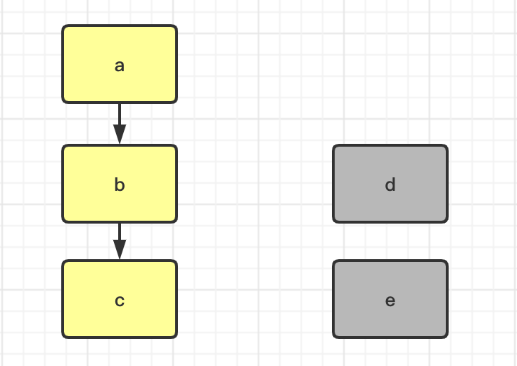

# JVM

Table of Contents
-----------------

* [Brainstorming](#brainstorming)
* [1. 运行时数据区](#1-运行时数据区)
   * [1.1 概述](#11-概述)
   * [1.2 VM Stack](#12-vm-stack)
* [2. GC](#2-gc)
   * [2.1 哪些内存需要回收?](#21-哪些内存需要回收)
      * [2.1.1 可达性分析](#211-可达性分析)
      * [2.1.2 引用](#212-引用)
   * [2.2 什么时候回收?](#22-什么时候回收)
   * [2.3 如何回收?](#23-如何回收)
* [References](#references)


## Brainstorming

<div align="center">  </div><br>

## 1. 运行时数据区

该文基于 `HotSpot` 虚拟机

<div align="center">  </div><br>

### 1.1 概述

<div align="center">  </div><br>

### 1.2 VM Stack

<div align="center">  </div><br>

<div align="center">  </div><br>

## 2. GC

### 2.1 哪些内存需要回收?

#### 2.1.1 可达性分析

**MyObj.java**


```java
public class MyObj {

    private String name;
    private MyObj reference;

    public MyObj(String name) {
        this.name = name;
    }

    public MyObj(String name, MyObj reference) {
        this.name = name;
        this.reference = reference;
    }

    public static void main(String[] args) {

        MyObj a = new MyObj("a");
        MyObj b = new MyObj("b");
        MyObj c = new MyObj("c");

        a.reference = b;
        b.reference = c;

        new MyObj("b", new MyObj("e"));

    }
}
```

若将对象 a 当作 `GC roots` 的话：对象 d 和 e 属于不可达对象 -> 需被回收

<div align="center">  </div><br>


#### 2.1.2 引用

**strongly reference**

```java
// Java program to illustrate Strong reference 
class Gfg 
{ 
	//Code.. 
} 
public class Example 
{ 
	public static void main(String[] args) 
	{ 
		//Strong Reference - by default 
		Gfg g = new Gfg();	 
		
		//Now, object to which 'g' was pointing earlier is 
		//eligible for garbage collection. 
		g = null; 
	} 
} 
```

<div align="center">  </div><br>

**soft reference**

```java
//Code to illustrate Soft reference 
import java.lang.ref.SoftReference; 
class Gfg 
{ 
	//code.. 
	public void x() 
	{ 
		System.out.println("GeeksforGeeks"); 
	} 
} 

public class Example 
{ 
	public static void main(String[] args) 
	{ 
		// Strong Reference 
		Gfg g = new Gfg();	 
		g.x(); 
		
		// Creating Soft Reference to Gfg-type object to which 'g' 
		// is also pointing. 
		SoftReference<Gfg> softref = new SoftReference<Gfg>(g); 
		
		// Now, Gfg-type object to which 'g' was pointing 
		// earlier is available for garbage collection. 
		g = null; 
		
		// You can retrieve back the object which 
		// has been weakly referenced. 
		// It successfully calls the method. 
		g = softref.get(); 
		
		g.x(); 
	} 
} 
```

<div align="center">  </div><br>


**weak reference**

```java
//Java Code to illustrate Weak reference 
import java.lang.ref.WeakReference; 
class Gfg 
{ 
	//code 
	public void x() 
	{ 
		System.out.println("GeeksforGeeks"); 
	} 
} 

public class Example 
{ 
	public static void main(String[] args) 
	{ 
		// Strong Reference 
		Gfg g = new Gfg();	 
		g.x(); 
		
		// Creating Weak Reference to Gfg-type object to which 'g' 
		// is also pointing. 
		WeakReference<Gfg> weakref = new WeakReference<Gfg>(g); 
		
		//Now, Gfg-type object to which 'g' was pointing earlier 
		//is available for garbage collection. 
		//But, it will be garbage collected only when JVM needs memory. 
		g = null; 
		
		// You can retrieve back the object which 
		// has been weakly referenced. 
		// It successfully calls the method. 
		g = weakref.get(); 
		
		g.x(); 
	} 
} 
```

<div align="center">  </div><br>


**phantom reference**

```java
//Code to illustrate Phantom reference 
import java.lang.ref.*; 
class Gfg 
{ 
	//code 
	public void x() 
	{ 
		System.out.println("GeeksforGeeks"); 
	} 
} 

public class Example 
{ 
	public static void main(String[] args) 
	{ 
		//Strong Reference 
		Gfg g = new Gfg();	 
		g.x(); 
		
		//Creating reference queue 
		ReferenceQueue<Gfg> refQueue = new ReferenceQueue<Gfg>(); 

		//Creating Phantom Reference to Gfg-type object to which 'g' 
		//is also pointing. 
		PhantomReference<Gfg> phantomRef = null; 
		
		phantomRef = new PhantomReference<Gfg>(g,refQueue); 
		
		//Now, Gfg-type object to which 'g' was pointing 
		//earlier is available for garbage collection. 
		//But, this object is kept in 'refQueue' before 
		//removing it from the memory. 
		g = null; 
		
		//It always returns null. 
		g = phantomRef.get(); 
		
		//It shows NullPointerException. 
		g.x(); 
	} 
} 
```


### 2.2 什么时候回收?


### 2.3 如何回收?

 


## References

- 周志明. 深入理解 Java 虚拟机 [M]. 机械工业出版社, 2011.
- [大白话理解可达性分析算法](https://blog.csdn.net/qq_32099833/article/details/109253339)
- [Types of References in Java](https://www.geeksforgeeks.org/types-references-java/)