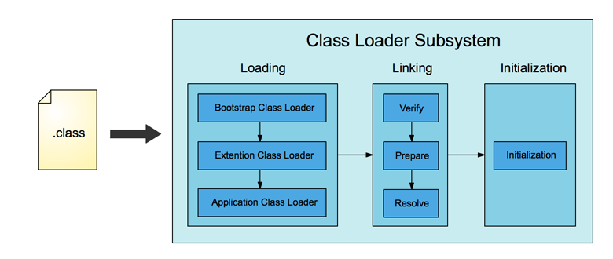
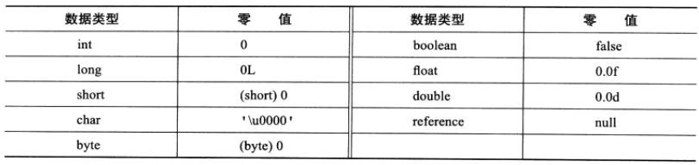

# 类加载机制

<div align="center">  </div><br>

Table of Contents
-----------------

* [Loading](#loading)
* [Linking](#linking)
   * [Verify](#verify)
   * [Prepare](#prepare)
   * [Resolve](#resolve)
* [Initialization](#initialization)


## Loading

1. 通过一个类的全类名获取定义此类的二进制字节流
2.  将这个字节流所代表的静态存储结构转化为 `Method Area` 的运行时数据结构
3. 在内存中生成一个代表这个类的 `java.lang.Class` 对象（反射），作为 `Method Area` 这个类的各种数据的访问入口

## Linking

### Verify

保证加载类的正确性，理解为安全检查

### Prepare

为 `staic` 变量在方法区分配内存空间，设置变量的初始值

```java
public class Person {
    private String name;
    private static int a = 1;

    public Person(String name) {
        this.name = name;
    }

    public void sayHi() {
        System.out.println("My name is " + name);
    }
}
```

例如，在 `private static int a = 1;` 这句中，

在类加载的 `linking` 过程，方法区中设置初始值为 0，

而在之后的 `initialization` 过程才设置变量值为 1


⚠️注意：

1. `static final` 修饰的值在编译过程中已初始化
2. 类的静态变量存放在 `Method Area` 中
3. 实例变量存放在 `heap` 中，不在此流程内


**基本数据类型的零值**

<div align="center">  </div><br>

### Resolve

暂不详述


## Initialization

初始化其实就是一个赋值的操作，它会执行一个类构造器的 `<clinit>()` 方法

由编译器自动收集类中所有变量的赋值动作


