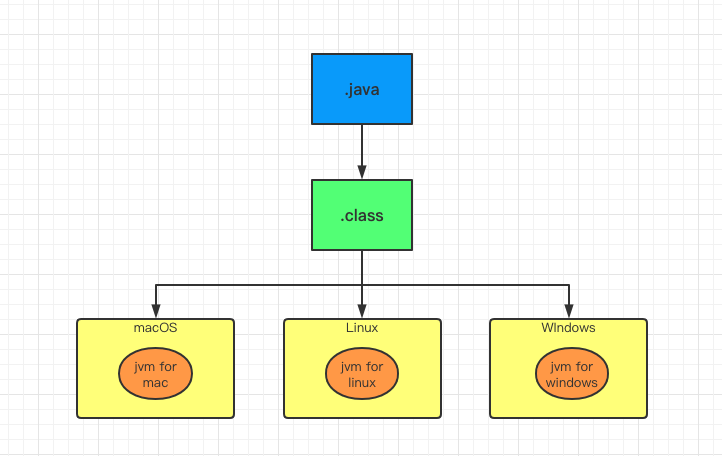
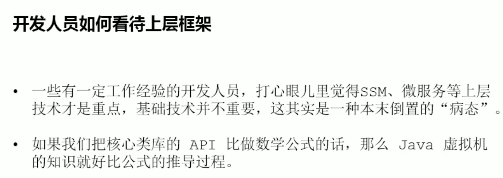
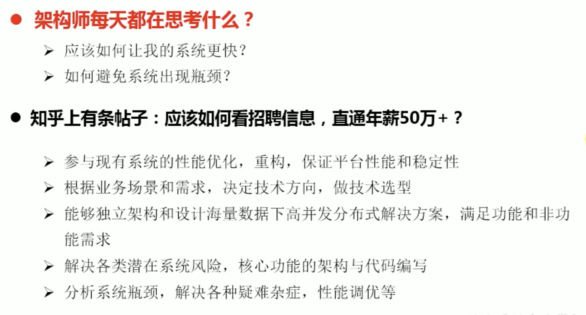

# JVM 概述

Table of Contents
-----------------

* [1. 什么是 JVM ?](#1-什么是-jvm-)
* [2. 为什么要学 JVM ?](#2-为什么要学-jvm-)
* [参考链接](#参考链接)

## 1. 什么是 JVM ?

维基百科

> **Java虚拟机**（英语：Java Virtual Machine，缩写为JVM），一种能够运行[Java bytecode](https://zh.wikipedia.org/wiki/Java_bytecode)的[虚拟机](https://zh.wikipedia.org/wiki/虛擬機器)，以[堆栈结构机器](https://zh.wikipedia.org/wiki/堆疊結構機器)来进行实做。最早由[Sun微系统](https://zh.wikipedia.org/wiki/昇陽電腦)所研发并实现第一个实现版本，是[Java平台](https://zh.wikipedia.org/wiki/Java平臺)的一部分，能够运行以[Java](https://zh.wikipedia.org/wiki/Java)语言写作的[软件](https://zh.wikipedia.org/wiki/軟體)[程序](https://zh.wikipedia.org/wiki/程式)。
>
> Java虚拟机有自己完善的[硬体](https://zh.wikipedia.org/wiki/硬体)架构，如[处理器](https://zh.wikipedia.org/wiki/处理器)、[堆栈](https://zh.wikipedia.org/wiki/堆栈)、[寄存器](https://zh.wikipedia.org/wiki/寄存器)等，还具有相应的[指令](https://zh.wikipedia.org/wiki/指令)系统。JVM屏蔽了与具体[操作系统](https://zh.wikipedia.org/wiki/操作系统)平台相关的信息，使得Java[程序](https://zh.wikipedia.org/wiki/程序)只需生成在Java虚拟机上运行的目标代码（[字节码](https://zh.wikipedia.org/wiki/字节码)），就可以在多种平台上不加修改地运行。通过对中央处理器（[CPU](https://zh.wikipedia.org/wiki/CPU)）所执行的软件实现，实现能执行[编译](https://zh.wikipedia.org/wiki/编译)过的Java程序码（[Applet](https://zh.wikipedia.org/wiki/Applet)与应用程序）。

**Write once, run anyway**

  
 

## 2. 为什么要学 JVM ?

- 面试
- 中高级程序员必备技能（项目管理 / 调优）
- 极客精神（垃圾回收 / JIT / 底层）

  
 

  
 

## 参考链接

- [TIOBE](https://www.tiobe.com/tiobe-index/)
- [Java](https://zh.wikipedia.org/wiki/Java)