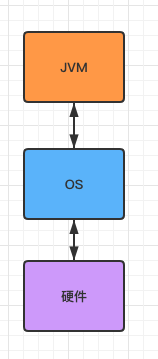
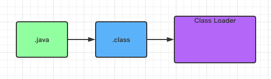

# JVM 概述

Table of Contents
-----------------

* [1. 什么是 JVM ?](#1-什么是-jvm-)
* [2. 为什么要学 JVM ?](#2-为什么要学-jvm-)
* [3. JVM 体系结构](#3-jvm-体系结构)
   * [ClassLoader](#classloader)
   * [Method Area](#method-area)
   * [Heap](#heap)
   * [VM Stack](#vm-stack)
   * [程序计数器](#程序计数器)
* [参考链接](#参考链接)

## 1. 什么是 JVM ?

维基百科

> **Java虚拟机**（英语：Java Virtual Machine，缩写为JVM），一种能够运行[Java bytecode](https://zh.wikipedia.org/wiki/Java_bytecode)的[虚拟机](https://zh.wikipedia.org/wiki/虛擬機器)，以[堆栈结构机器](https://zh.wikipedia.org/wiki/堆疊結構機器)来进行实做。最早由[Sun微系统](https://zh.wikipedia.org/wiki/昇陽電腦)所研发并实现第一个实现版本，是[Java平台](https://zh.wikipedia.org/wiki/Java平臺)的一部分，能够运行以[Java](https://zh.wikipedia.org/wiki/Java)语言写作的[软件](https://zh.wikipedia.org/wiki/軟體)[程序](https://zh.wikipedia.org/wiki/程式)。
>
> Java虚拟机有自己完善的[硬体](https://zh.wikipedia.org/wiki/硬体)架构，如[处理器](https://zh.wikipedia.org/wiki/处理器)、[堆栈](https://zh.wikipedia.org/wiki/堆栈)、[寄存器](https://zh.wikipedia.org/wiki/寄存器)等，还具有相应的[指令](https://zh.wikipedia.org/wiki/指令)系统。JVM屏蔽了与具体[操作系统](https://zh.wikipedia.org/wiki/操作系统)平台相关的信息，使得Java[程序](https://zh.wikipedia.org/wiki/程序)只需生成在Java虚拟机上运行的目标代码（[字节码](https://zh.wikipedia.org/wiki/字节码)），就可以在多种平台上不加修改地运行。通过对中央处理器（[CPU](https://zh.wikipedia.org/wiki/CPU)）所执行的软件实现，实现能执行[编译](https://zh.wikipedia.org/wiki/编译)过的Java程序码（[Applet](https://zh.wikipedia.org/wiki/Applet)与应用程序）。

`JVM` 类似于一台小电脑运行在 `macOS` / `Linux` / `Win` 操作系统，直接与操作系统进行交互，而不与硬件打交道

  
 

## 2. 为什么要学 JVM ?

- 面试
- 中高级程序员必备技能（项目管理 / 调优）
- 极客精神（垃圾回收 / JIT / 底层）

## 3. JVM 体系结构

先从全览看一下 `JVM` 的体系结构

  
 

我们使用 `IDEA` 编写的是 `.java` 文件，本质上是一个文本（包含着英文符号以及缩进）

`JVM` 并不认识，故 `.java` 需要进行编译，转换为二进制的 `.class` 文件

### ClassLoader

`ClassLoader` 就好比一个搬运工，将所有的 `.class` 文件搬运到 `JVM` 中

  
 

### Method Area

用于存放类似于元数据信息方面的数据，比如类信息，常量，静态变量，编译后的代码等...

`ClassLoader` 将 `.class` 文件搬过来后先丢到这一块上

线程共享区域

### Heap

主要放了一些存储的数据，比如对象实例，数组...

线程共享区域

### VM Stack

代码的运行空间，每个方法都会放到栈里面执行

线程独享

### 程序计数器

主要就是完成一个加载工作，类似于一个指针一样的，指向下一行我们需要执行的代码

线程独享

## 参考链接

- [大白话带你认识JVM](https://juejin.im/post/6844904048013869064)