# RabbitMQ

<div align="center">  </div><br>


Table of Contents
-----------------

* [1. 什么是 MQ?](#1-什么是-mq)
   * [1.1 生产者](#11-生产者)
   * [1.2 消费者](#12-消费者)
* [2. 为什么要使用 MQ?](#2-为什么要使用-mq)
   * [2.1 解耦](#21-解耦)
   * [2.2 削峰](#22-削峰)
   * [2.3 数据分发](#23-数据分发)
* [3. 消息队列存在的问题](#3-消息队列存在的问题)
   * [3.1 系统复杂性](#31-系统复杂性)
   * [3.2 数据一致性](#32-数据一致性)
   * [3.3 可用性](#33-可用性)
* [4. 同类产品比较](#4-同类产品比较)
* [5. Preparation](#5-preparation)
   * [5.1 安装 rabbitmq](#51-安装-rabbitmq)
   * [5.2 添加新用户](#52-添加新用户)
   * [5.3 创建 virtual host](#53-创建-virtual-host)
* [6. "Hello World"](#6-hello-world)
* [7. Work queues](#7-work-queues)
* [8. Publish / Subscribe](#8-publish--subscribe)
* [9. Routing](#9-routing)
* [10. Topics](#10-topics)
* [参考资料](#参考资料)


## 1. 什么是 MQ?

<div align="center"> 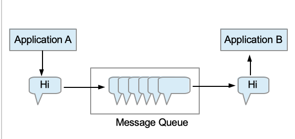 </div><br>


`MQ` 即为 `message queue`，消息队列是应用程序和应用程序之间的通信方法


### 1.1 生产者

- 生产者：把数据放到队列中的执行者


### 1.2 消费者

- 消费者：将数据从队列中取出的执行者


> **RabbitMQ is a message broker: it accepts and forwards messages. You can think about it as a post office: when you put the mail that you want posting in a post box, you can be sure that Mr. or Ms. Mailperson will eventually deliver the mail to your recipient. In this analogy, RabbitMQ is a post box, a post office and a postman.**


<div align="center">  </div><br>


## 2. 为什么要使用 MQ?

- 应用解耦
- 流量削峰
- 数据分发 


### 2.1 解耦

一个系统的耦合度越高，容错性就越低（牵一发而动全身）


解耦是消息队列所要解决最本质的问题。

解耦，一个事务，只关心核心的流程，而需要依赖其他系统但不那么重要的事情，有通知即可，无需等待结构。


举个例子，在一个订单系统中

<div align="center"> 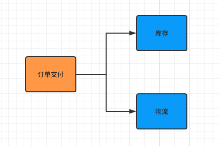 </div><br>

包含以下功能（流程）：

- 订单支付
- 库存
- 物流


若物流系统发生故障


加入消息队列前：

则订单系统需要等待，终端系统等待时间过长会造成用户体验感极差


加入了消息队列后：

用户支付操作正常完成，将数据放到消息队列中，并及时返回“支付成功“的讯号

而当物流系统恢复后，补充处理消息队列中的订单消息即可（异步），用户几乎感受不到


<div align="center">  </div><br>


### 2.2 削峰

<div align="center"> 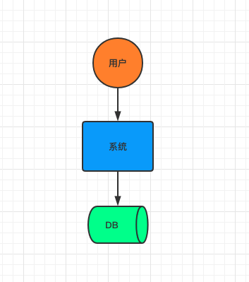 </div><br>

在没有引入消息队列前：

若服务器在某一时间段的访问量陡增，例如常见的秒杀，双 11 等，公司原有的服务器承受不了高强度的访问量，会造成数据库崩溃（频繁地与系统 `IO` 打交道）


这时需引入消息队列：

<div align="center"> 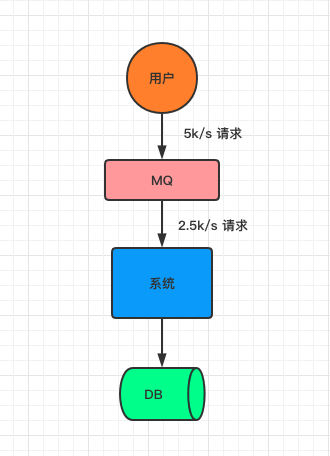 </div><br>

起到削峰的作用


### 2.3 数据分发


## 3. 消息队列存在的问题

任何事物都有两面性，在系统引入消息队列也有其缺点：

- 系统复杂性
- 数据一致性
- 可用性


### 3.1 系统复杂性

在系统中引入 `mq` 主要会造成以下问题：

- 重复消费
- 消息丢失
- 消息顺序消费


### 3.2 数据一致性

数据的一致性涉及到分布式事务的知识，广泛存在于分布式系统中

引入消息队列会将这个问题的缺点放大


### 3.3 可用性

如何保证 `mq` 的高可用性？


## 4. 同类产品比较

（实习的时候，公司用的是 `kafka`）

<div align="center"> 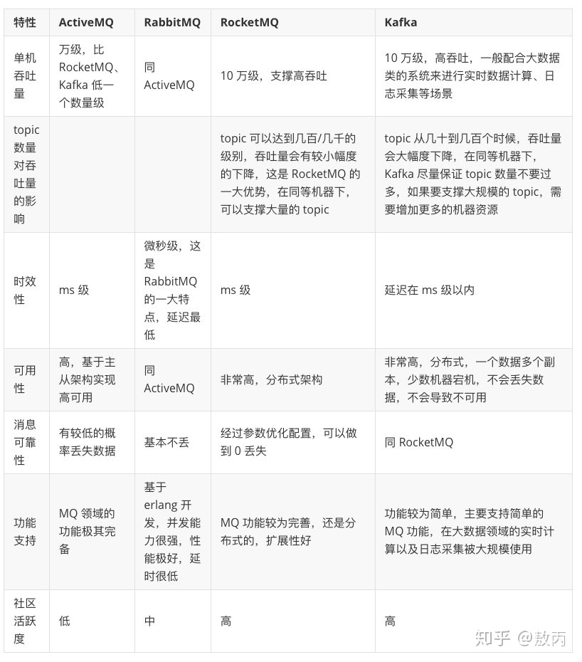 </div><br>


## 5. Preparation

### 5.1 安装 rabbitmq

采用 `homebrew` 安装 `rabbitmq`

<div align="center"> 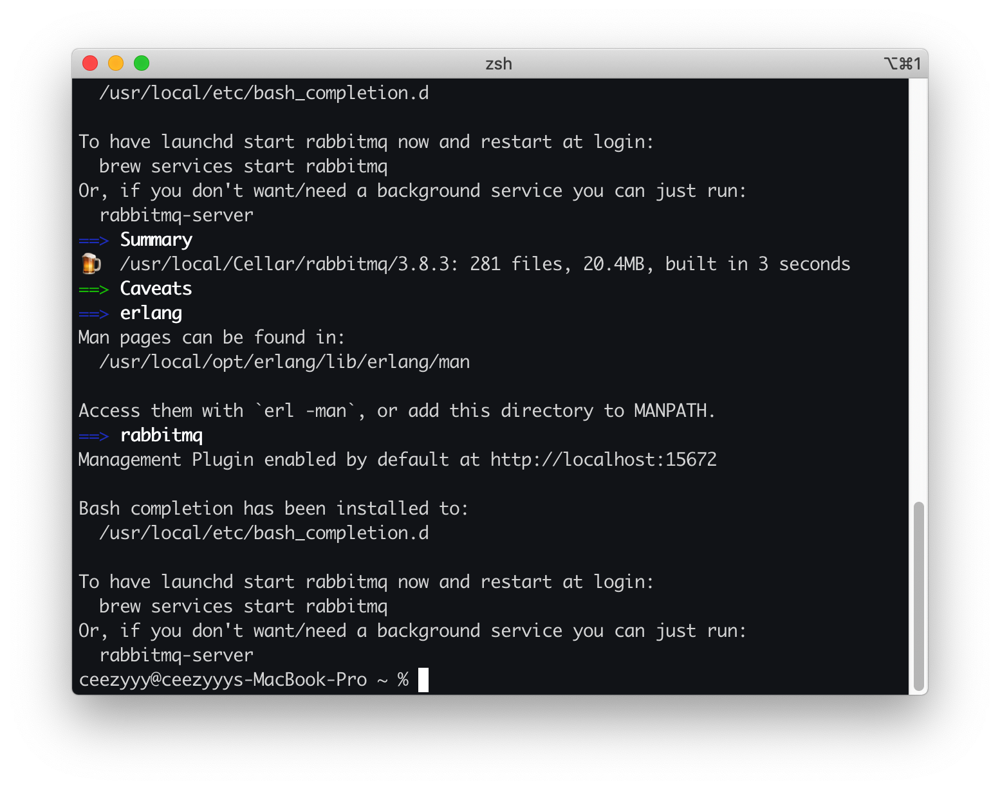 </div><br>


通过 `homebrew` 安装的软件位于 `/usr/local/Cellar` 上


<div align="center"> 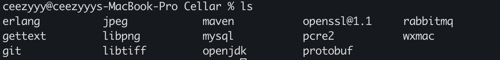 </div><br>

启动 `rabbitmq-server`


<div align="center"> 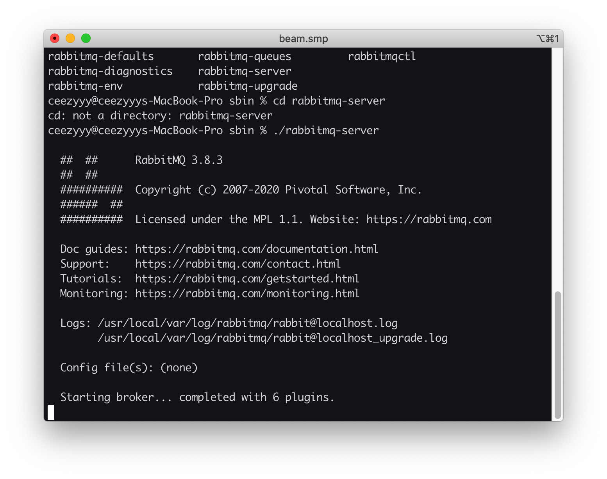 </div><br>


输入网址：

```html
http://localhost:15672/
```

<div align="center"> 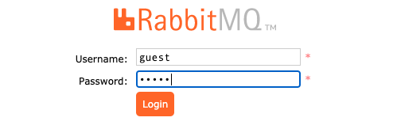 </div><br>

默认账号密码都为 `guest`

搭建成功

<div align="center"> 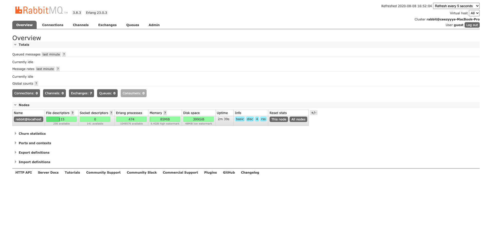 </div><br>


### 5.2 添加新用户

设置新账号


<div align="center">  </div><br>

添加成功！

<div align="center"> 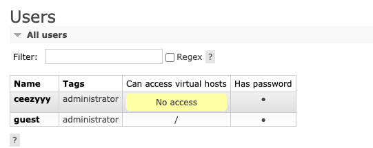 </div><br>


###  5.3 创建 virtual host

<div align="center"> 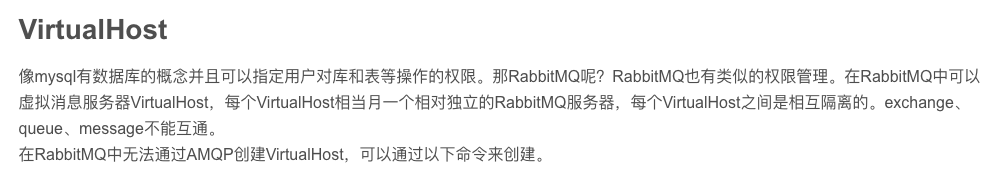 </div><br>

创建新的 `virtual host`：`myVH`


<div align="center"> 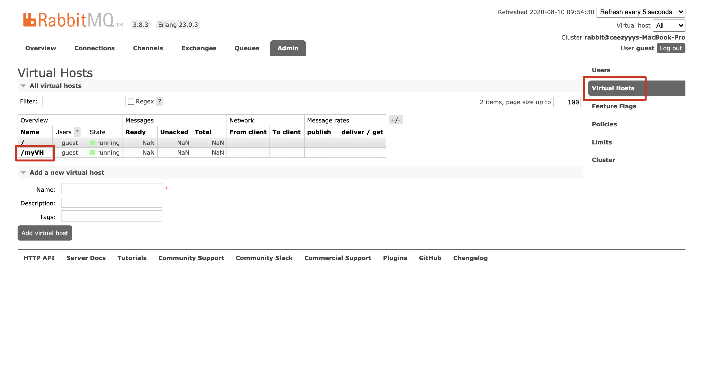 </div><br>


添加 `permission`

<div align="center"> 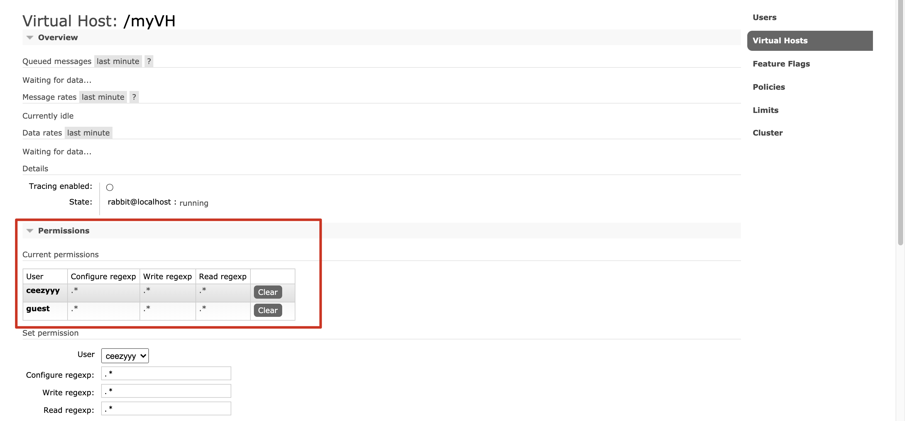 </div><br>


## 6. "Hello World"

<div align="center"> 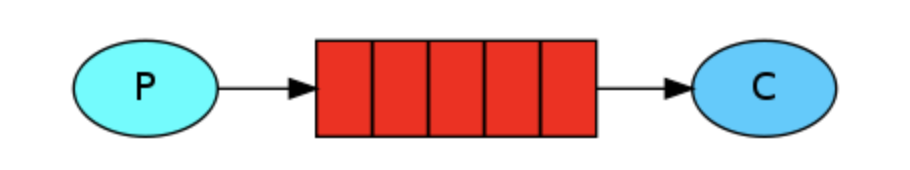 </div><br>

引入 `maven`

```xml
<dependencies>

  <!-- https://mvnrepository.com/artifact/com.rabbitmq/amqp-client -->
  <dependency>
    <groupId>com.rabbitmq</groupId>
    <artifactId>amqp-client</artifactId>
    <version>5.9.0</version>
  </dependency>

  <!-- https://mvnrepository.com/artifact/org.slf4j/slf4j-api -->
  <dependency>
    <groupId>org.slf4j</groupId>
    <artifactId>slf4j-api</artifactId>
    <version>1.7.30</version>
  </dependency>

  <!-- https://mvnrepository.com/artifact/org.slf4j/slf4j-simple -->
  <dependency>
    <groupId>org.slf4j</groupId>
    <artifactId>slf4j-simple</artifactId>
    <version>1.7.30</version>
    <scope>test</scope>
  </dependency>

</dependencies>
```


自定义 `ConnectionFactoryUtil` 工具类

**ConnectionFactoryUtil.java**

```java
/**
 * Connection factory util
 */
public class ConnectionFactoryUtil {
    public static ConnectionFactory getConnectionFactory() {
        ConnectionFactory connectionFactory = new ConnectionFactory();
        connectionFactory.setVirtualHost("/myVH");
        connectionFactory.setUsername("ceezyyy");
        connectionFactory.setPassword("123456");
        return connectionFactory;
    }
}
```


**Publisher.java**

```java
/**
 * Publisher of "hello world"
 */
public class Publisher {
    private static final String QUEUE_NAME = "hello";

    public static void main(String[] args) throws IOException, TimeoutException {

        // get factory
        ConnectionFactory factory = ConnectionFactoryUtil.getConnectionFactory();

        try (Connection connection = factory.newConnection();
             Channel channel = connection.createChannel()) {
            channel.queueDeclare(QUEUE_NAME, false, false, false, null);
            String message = "Hello World";
            channel.basicPublish("", QUEUE_NAME, null, message.getBytes());
            System.out.println("Message sent!");
        }

    }

}
```

消息发送成功！

<div align="center"> 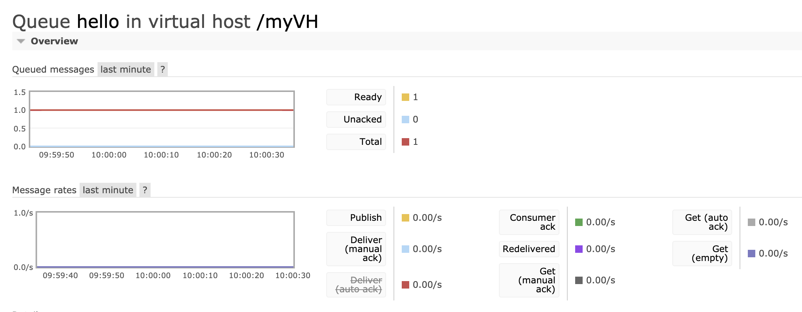 </div><br>

<div align="center"> 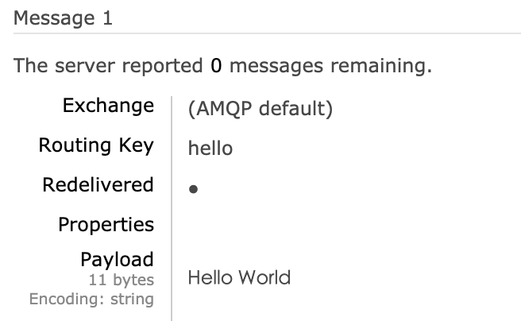 </div><br>

发送完消息，需要定义 `consumer` 接受消息

> That's it for our publisher. Our consumer listens for messages from RabbitMQ, so unlike the publisher which publishes a single message, we'll keep the consumer running to listen for messages and print them out.


**Consumer.java**

```java
/**
 * Consumer of "hello world"
 * <p>
 * we want the process to stay alive while the consumer is listening asynchronously for messages to arrive
 */
public class Consumer {

    public static void main(String[] args) throws Exception {

        ConnectionFactory factory = ConnectionFactoryUtil.getConnectionFactory();

        Connection connection = factory.newConnection();

        Channel channel = connection.createChannel();

        channel.queueDeclare(Publisher.QUEUE_NAME, false, false, false, null);
        System.out.println("Waiting for message");

        DeliverCallback deliverCallback = new DeliverCallback() {
            @Override
            public void handle(String consumerTag, Delivery message) throws IOException {
                String receivedMessage = new String(message.getBody());
                System.out.println("Received message: " + receivedMessage);
            }
        };

        CancelCallback cancelCallback = new CancelCallback() {
            @Override
            public void handle(String consumerTag) throws IOException {
                System.out.println("Receive failed!");
            }
        };

        channel.basicConsume(Publisher.QUEUE_NAME, deliverCallback, cancelCallback);

    }

}
```

消费成功！

<div align="center">  </div><br>


## 7. Work queues


<div align="center"> 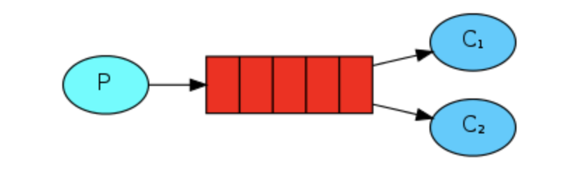 </div><br>


> In the [first tutorial](https://www.rabbitmq.com/tutorials/tutorial-one-java.html) we wrote programs to send and receive messages from a named queue. In this one we'll create a *Work Queue* that will be used to distribute time-consuming tasks among multiple workers.
>
> The main idea behind Work Queues (aka: *Task Queues*) is to avoid doing a resource-intensive task immediately and having to wait for it to complete. Instead we schedule the task to be done later. We encapsulate a *task* as a message and send it to a queue. A worker process running in the background will pop the tasks and eventually execute the job. When you run many workers the tasks will be shared between them.
>
> This concept is especially useful in web applications where it's impossible to handle a complex task during a short HTTP request window.


**Publisher.java**

```java
/**
 * Publisher of work queues
 */
public class Publisher {

    static final String WORK_QUEUE_NAME = "work_queue";

    public static void main(String[] args) throws Exception {
        ConnectionFactory factory = ConnectionFactoryUtil.getConnectionFactory();

        try (Connection connection = factory.newConnection();
             Channel channel = connection.createChannel()
        ) {
            channel.queueDeclare(WORK_QUEUE_NAME, true, false, false, null);

            StringBuilder s = new StringBuilder("Work queue here!");

            // simulate
            for (int i = 0; i < 10; i++) {
                s.append(i);
                channel.basicPublish("", WORK_QUEUE_NAME, null, s.toString().getBytes());
            }

            System.out.println("Message sent!");
        }

    }

}
```


创建 2 个消费者

**Consumer1.java**

```java
/**
 * Consumer1 of work queues
 */
public class Consumer1 {

    public static void main(String[] args) throws Exception {
        ConnectionFactory factory = ConnectionFactoryUtil.getConnectionFactory();
        Connection connection = factory.newConnection();
        final Channel channel = connection.createChannel();

        channel.queueDeclare(Publisher.WORK_QUEUE_NAME, true, false, false, null);
        System.out.println("Receiving message");

        // request a specific prefetchCount "quality of service" settings for this channel.
        channel.basicQos(1);

        DeliverCallback deliverCallback = new DeliverCallback() {
            @Override
            public void handle(String consumerTag, Delivery message) throws IOException {
                System.out.println("Consumer1 here!");

                try {
                    String receivedMessage = new String(message.getBody());
                    System.out.println(receivedMessage);
                    Thread.sleep(1000);
                } catch (InterruptedException e) {
                    e.printStackTrace();
                } finally {

                    System.out.println("Done");

                    /*
                     * In order to make sure a message is never lost, RabbitMQ supports message acknowledgments.
                     * An acknowledgement is sent back by the consumer to tell RabbitMQ that a particular message has been received,
                     * processed and that RabbitMQ is free to delete it.
                     * */
                    channel.basicAck(message.getEnvelope().getDeliveryTag(), false);

                }
            }
        };

        CancelCallback cancelCallback = new CancelCallback() {
            @Override
            public void handle(String consumerTag) throws IOException {
                System.out.println("Receive failed!");
            }
        };

        channel.basicConsume(Publisher.WORK_QUEUE_NAME, deliverCallback, cancelCallback);

    }
}
```


**Consumer2.java**

```java
/**
 * Consumer2 of work queues
 */
public class Consumer2 {
    public static void main(String[] args) throws Exception {
        ConnectionFactory factory = ConnectionFactoryUtil.getConnectionFactory();
        Connection connection = factory.newConnection();
        final Channel channel = connection.createChannel();

        channel.queueDeclare(Publisher.WORK_QUEUE_NAME, true, false, false, null);
        System.out.println("Receiving message");

        // request a specific prefetchCount "quality of service" settings for this channel.
        channel.basicQos(1);

        DeliverCallback deliverCallback = new DeliverCallback() {
            @Override
            public void handle(String consumerTag, Delivery message) throws IOException {
                System.out.println("Consumer2 here!");

                try {
                    String receivedMessage = new String(message.getBody());
                    System.out.println(receivedMessage);
                    Thread.sleep(1000);
                } catch (InterruptedException e) {
                    e.printStackTrace();
                } finally {

                    System.out.println("Done");

                    /*
                     * In order to make sure a message is never lost, RabbitMQ supports message acknowledgments.
                     * An acknowledgement is sent back by the consumer to tell RabbitMQ that a particular message has been received,
                     * processed and that RabbitMQ is free to delete it.
                     * */
                    channel.basicAck(message.getEnvelope().getDeliveryTag(), false);

                }
            }
        };

        CancelCallback cancelCallback = new CancelCallback() {
            @Override
            public void handle(String consumerTag) throws IOException {
                System.out.println("Receive failed!");
            }
        };

        channel.basicConsume(Publisher.WORK_QUEUE_NAME, deliverCallback, cancelCallback);

    }
}
```


启动生产者

<div align="center"> 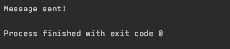 </div><br>


启动消费者 1

<div align="center"> 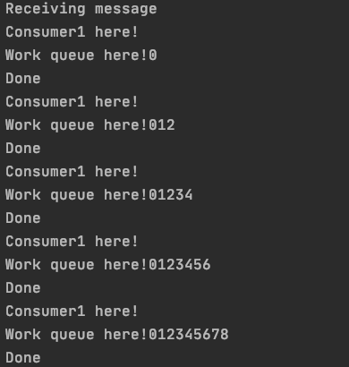 </div><br> 


启动消费者 2

<div align="center"> 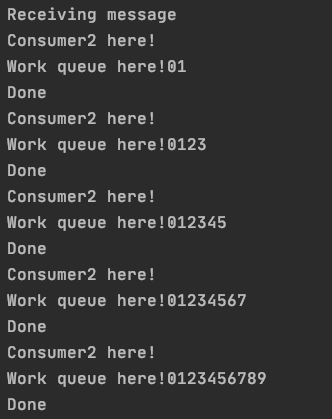 </div><br>


## 8. Publish / Subscribe

<div align="center"> 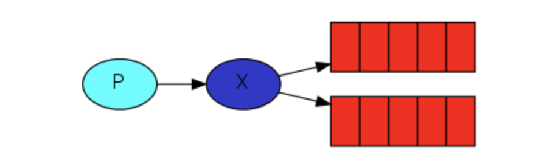 </div><br>

> In the [previous tutorial](https://www.rabbitmq.com/tutorials/tutorial-two-java.html) we created a work queue. The assumption behind a work queue is that each task is delivered to exactly one worker. In this part we'll do something completely different -- we'll deliver a message to multiple consumers. This pattern is known as "publish/subscribe".
>
> To illustrate the pattern, we're going to build a simple logging system. It will consist of two programs -- the first will emit log messages and the second will receive and print them.
>
> In our logging system every running copy of the receiver program will get the messages. That way we'll be able to run one receiver and direct the logs to disk; and at the same time we'll be able to run another receiver and see the logs on the screen.
>
> Essentially, published log messages are going to be broadcast to all the receivers.


`publish / subscribe` 的思想很简单：生产者发送消息，不同的（多个）消费者接受消息


这里引入一个新的概念：`exchange`


`exchange` 的功能：

- 接受来自 `publisher` 的消息
- 将消息分发到不同的队列中


**exchange 如何将消息分发到不同的队列？**


## 9. Routing


## 10. Topics


## Conclusion

- Try-with-resources
- 视频入门 + 官网教程


## 参考资料

- [RabbitMQ Tutorials](https://www.rabbitmq.com/getstarted.html)
- [什么是消息队列？](https://juejin.im/post/6844903817348136968)
- [消息队列的使用场景是怎样的？](https://www.zhihu.com/question/34243607)
- [消息队列设计精要](https://tech.meituan.com/2016/07/01/mq-design.html)
- [Java – Try with Resources](https://www.baeldung.com/java-try-with-resources)


