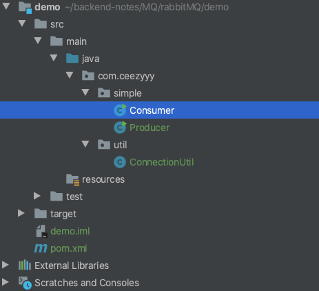
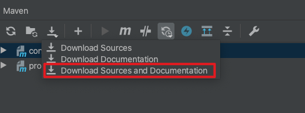
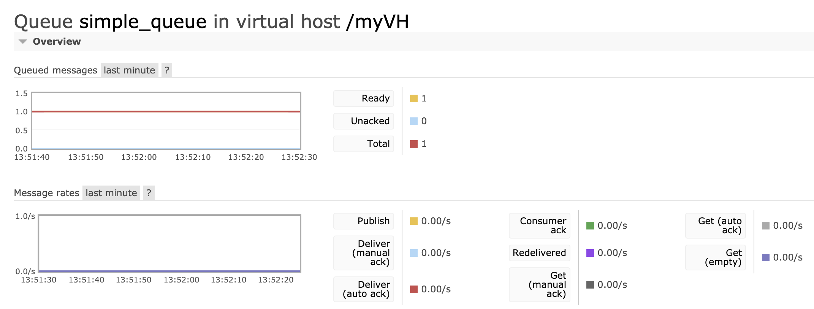
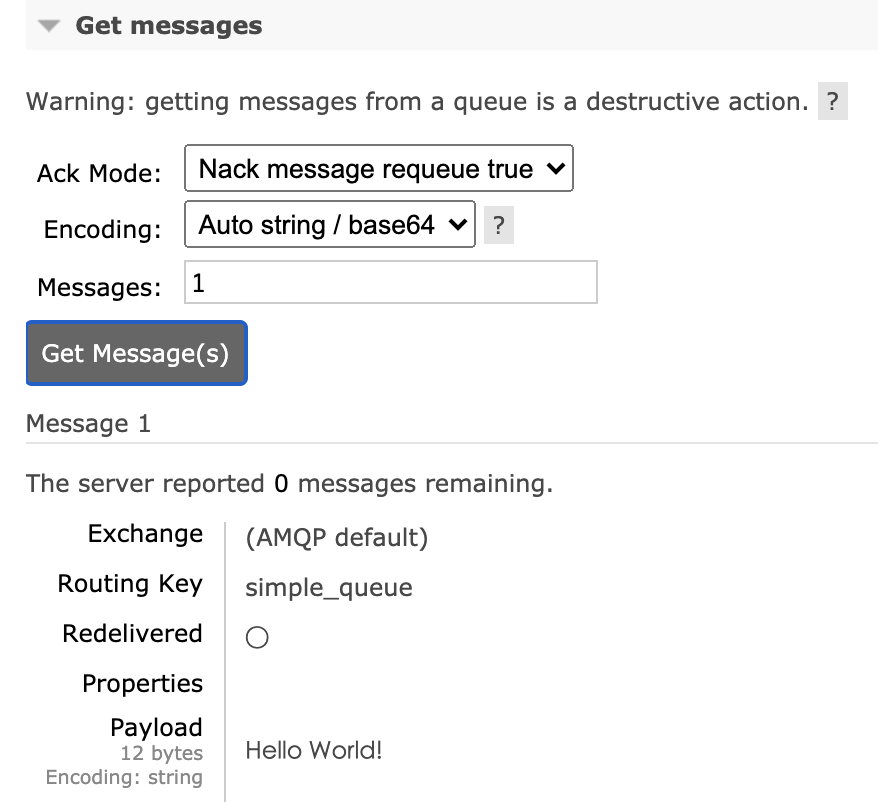
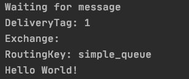

# RabbitMQ

<div align="center">  </div><br>

Table of Contents
-----------------

* [1. 什么是 MQ?](#1-什么是-mq)
   * [1.1 生产者](#11-生产者)
   * [1.2 消费者](#12-消费者)
* [2. 为什么要使用 MQ?](#2-为什么要使用-mq)
   * [2.1 解耦](#21-解耦)
   * [2.2 削峰](#22-削峰)
   * [2.3 数据分发](#23-数据分发)
* [3. 消息队列存在的问题](#3-消息队列存在的问题)
   * [3.1 系统复杂性](#31-系统复杂性)
   * [3.2 数据一致性](#32-数据一致性)
   * [3.3 可用性](#33-可用性)
* [4. 同类产品比较](#4-同类产品比较)
* [5. Quickstart](#5-quickstart)
   * [5.1 安装 rabbitmq](#51-安装-rabbitmq)
   * [5.2 添加新用户](#52-添加新用户)
   * [5.3 创建 virtual host](#53-创建-virtual-host)
   * [5.4 Producer](#54-producer)
   * [5.5 Consumer](#55-consumer)
* [6. Work queues](#6-work-queues)
* [7. Publish / Subscribe](#7-publish--subscribe)
* [8. Routing](#8-routing)
* [9. Topics](#9-topics)
* [Conclusion](#conclusion)
* [参考资料](#参考资料)


## 1. 什么是 MQ?

<div align="center">  </div><br>


`MQ` 即为 `message queue`，消息队列是应用程序和应用程序之间的通信方法


### 1.1 生产者

- 生产者：把数据放到队列中的执行者


### 1.2 消费者

- 消费者：将数据从队列中取出的执行者


> **RabbitMQ is a message broker: it accepts and forwards messages. You can think about it as a post office: when you put the mail that you want posting in a post box, you can be sure that Mr. or Ms. Mailperson will eventually deliver the mail to your recipient. In this analogy, RabbitMQ is a post box, a post office and a postman.**


<div align="center">  </div><br>


## 2. 为什么要使用 MQ?

- 应用解耦
- 流量削峰
- 数据分发 


### 2.1 解耦

一个系统的耦合度越高，容错性就越低（牵一发而动全身）


解耦是消息队列所要解决最本质的问题。

解耦，一个事务，只关心核心的流程，而需要依赖其他系统但不那么重要的事情，有通知即可，无需等待结构。


举个例子，在一个订单系统中

<div align="center">  </div><br>

包含以下功能（流程）：

- 订单支付
- 库存
- 物流


若物流系统发生故障


加入消息队列前：

则订单系统需要等待，终端系统等待时间过长会造成用户体验感极差


加入了消息队列后：

用户支付操作正常完成，将数据放到消息队列中，并及时返回“支付成功“的讯号

而当物流系统恢复后，补充处理消息队列中的订单消息即可（异步），用户几乎感受不到


<div align="center">  </div><br>


### 2.2 削峰

<div align="center">  </div><br>

在没有引入消息队列前：

若服务器在某一时间段的访问量陡增，例如常见的秒杀，双 11 等，公司原有的服务器承受不了高强度的访问量，会造成数据库崩溃（频繁地与系统 `IO` 打交道）


这时需引入消息队列：

<div align="center">  </div><br>

起到削峰的作用


### 2.3 数据分发


## 3. 消息队列存在的问题

任何事物都有两面性，在系统引入消息队列也有其缺点：

- 系统复杂性
- 数据一致性
- 可用性


### 3.1 系统复杂性

在系统中引入 `mq` 主要会造成以下问题：

- 重复消费
- 消息丢失
- 消息顺序消费


### 3.2 数据一致性

数据的一致性涉及到分布式事务的知识，广泛存在于分布式系统中

引入消息队列会将这个问题的缺点放大


### 3.3 可用性

如何保证 `mq` 的高可用性？


## 4. 同类产品比较

（实习的时候，公司用的是 `kafka`）

<div align="center">  </div><br>


## 5. Quickstart

### 5.1 安装 rabbitmq

采用 `homebrew` 安装 `rabbitmq`

<div align="center">  </div><br>


通过 `homebrew` 安装的软件位于 `/usr/local/Cellar` 上


<div align="center">  </div><br>

启动 `rabbitmq-server`


<div align="center">  </div><br>


输入网址：

```html
http://localhost:15672/
```

<div align="center">  </div><br>

默认账号密码都为 `guest`

搭建成功

<div align="center">  </div><br>


### 5.2 添加新用户

设置新账号


<div align="center">  </div><br>

添加成功！

<div align="center">  </div><br>


###  5.3 创建 virtual host

<div align="center">  </div><br>

创建新的 `virtual host`：`myVH`


<div align="center">  </div><br>


添加 `permission`

<div align="center">  </div><br>


接下来做一个简单的 `hello world` 案例
<div align="center">  </div><br>


### 5.4 Producer

**目的**

`producer` 发送消息到 `rabbitmq` 队列，`consumer` 可以从队列获取消息，使用 `rabbitmq` 简单模式（simple）

**步骤**

1. 创建连接工厂（设置 `rabbitmq` 连接参数）
2. 创建连接
3. 创建频道
4. 声明队列
5. 发送消息
6. 关闭资源

 

**目录结构**

<div align="center">  </div><br>


**maven 依赖**

```xml
<!-- https://mvnrepository.com/artifact/com.rabbitmq/amqp-client -->
<dependency>
    <groupId>com.rabbitmq</groupId>
    <artifactId>amqp-client</artifactId>
    <version>5.9.0</version>
</dependency>
```


引入依赖后记得点击这个

<div align="center">  </div><br>

可以下载源码以及文档注释


定义 `ConnectionUtil` 工具类

**ConnectionUtil.java**

```java
/**
 * Connection Util
 */
public class ConnectionUtil {

    public Connection createConnection() throws IOException, TimeoutException {

        // create connection factory
        ConnectionFactory connectionFactory = new ConnectionFactory();

        // set connection
        connectionFactory.setVirtualHost("/myVH");
        connectionFactory.setUsername("ceezyyy");
        connectionFactory.setPassword("123456");

        // create connection
        return connectionFactory.newConnection();

    }

}
```


**Producer.java**

```java
/**
 * Producer of rabbitmq
 */
public class Producer {

    static final String QUEUE_NAME = "simple_queue";

    public static void main(String[] args) throws IOException, TimeoutException {

        // get connection from ConnectionUtil
        Connection connection = new ConnectionUtil().createConnection();

        // create channel
        Channel channel = connection.createChannel();

        /*
         * declare queue
         *
         * @param queue the name of the queue
         * @param durable true if we are declaring a durable queue (the queue will survive a server restart)
         * @param exclusive true if we are declaring an exclusive queue (restricted to this connection)
         * @param autoDelete true if we are declaring an autodelete queue (server will delete it when no longer in use)
         * @param arguments other properties (construction arguments) for the queue
         * */
        channel.queueDeclare(QUEUE_NAME, true, false, false, null);

        /*
         * publish message
         *
         * @param exchange the exchange to publish the message to
         * @param routingKey the routing key
         * @param props other properties for the message - routing headers etc
         * @param body the message body
         * */
        String message = "Hello World!";
        channel.basicPublish("", QUEUE_NAME, null, message.getBytes());
        System.out.println("Sending message " + message);

        // close resource
        channel.close();
        connection.close();

    }

}
```


注意：

- 不同的业务可以设置不同的 `virtual host`


启动 `producer`


<div align="center">  </div><br>

<div align="center">  </div><br>


### 5.5 Consumer

**步骤**

1. 创建连接工厂
2. 创建连接
3. 创建频道
4. 声明队列
5. 创建消费者
6. 监听队列


**Consumer.java**

```java
public class Consumer {

    public static void main(String[] args) throws IOException, TimeoutException {

        // get connection from ConnectionUtil
        Connection connection = new ConnectionUtil().createConnection();

        // create channel
        Channel channel = connection.createChannel();

        /*
         * declare queue
         *
         * @param queue the name of the queue
         * @param durable true if we are declaring a durable queue (the queue will survive a server restart)
         * @param exclusive true if we are declaring an exclusive queue (restricted to this connection)
         * @param autoDelete true if we are declaring an autodelete queue (server will delete it when no longer in use)
         * @param arguments other properties (construction arguments) for the queue
         * */
        channel.queueDeclare(Producer.QUEUE_NAME, true, false, false, null);

        // create consumer
        DefaultConsumer defaultConsumer = new DefaultConsumer(channel) {
            @Override
            public void handleDelivery(String consumerTag, Envelope envelope, AMQP.BasicProperties properties, byte[] body) throws IOException {
                System.out.println("DeliveryTag: " + envelope.getDeliveryTag());
                System.out.println("Exchange: " + envelope.getExchange());
                System.out.println("RoutingKey: " + envelope.getRoutingKey());
                System.out.println(new String(body));
            }
        };

        /*
         * basic consumer
         *
         * Start a non-nolocal, non-exclusive consumer, with
         * a server-generated consumerTag.
         * @param queue the name of the queue
         * @param autoAck true if the server should consider messages
         * acknowledged once delivered; false if the server should expect
         * explicit acknowledgements
         * @param callback an interface to the consumer object
         * @return the consumerTag generated by the server
         * */
        channel.basicConsume(Producer.QUEUE_NAME, true, defaultConsumer);
        System.out.println("Waiting for message");

    }
}
```


启动 `consumer`

成功消费！

<div align="center">  </div><br>


## 6. Work queues


## 7. Publish / Subscribe


## 8. Routing


## 9. Topics


## Conclusion

- 工厂模式的设计思想经常接触 需要学习
- 官方文档太重要


## 参考资料

- [rabbitmq](https://www.rabbitmq.com/)
- [RabbitMQ Tutorials](https://www.rabbitmq.com/getstarted.html)
- [RocketMQ系统精讲，经受历年双十一狂欢节考验的分布式消息中间件](https://www.bilibili.com/video/BV1L4411y7mn?p=1)
- [什么是消息队列？](https://juejin.im/post/6844903817348136968)
- [消息队列的使用场景是怎样的？](https://www.zhihu.com/question/34243607)
- [消息队列设计精要](https://tech.meituan.com/2016/07/01/mq-design.html)
- [mac 安装 RabbitMQ](https://blog.csdn.net/u010046908/article/details/54773323)


