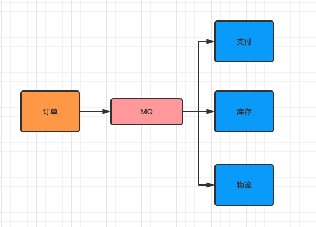

# RabbitMQ

<div align="center">  </div><br>

Table of Contents
-----------------

* [1. 什么是 MQ?](#1-什么是-mq-1)
   * [1.1 生产者](#11-生产者-1)
   * [1.2 消费者](#12-消费者-1)
* [2. 为什么要使用 MQ?](#2-为什么要使用-mq-1)
   * [2.1 解耦](#21-解耦-1)
   * [2.2 削峰](#22-削峰-1)
   * [2.3 数据分发](#23-数据分发-1)
* [3. 同类产品比较](#3-同类产品比较-1)
* [4. Quickstart](#4-quickstart-1)
   * [4.1 安装 rabbitmq](#41-安装-rabbitmq-1)
* [参考资料](#参考资料-1)


## 1. 什么是 MQ?

<div align="center">  </div><br>


`MQ` 即为 `message queue`，消息队列是应用程序和应用程序之间的通信方法


### 1.1 生产者

- 生产者：把数据放到队列中的执行者


### 1.2 消费者

- 消费者：将数据从队列中取出的执行者


<div align="center">  </div><br>


## 2. 为什么要使用 MQ?

- 应用解耦
- 流量削峰
- 数据分发 


### 2.1 解耦


<div align="center">  </div><br>


<div align="center">  </div><br>


### 2.2 削峰


### 2.3 数据分发


## 3. 同类产品比较

暂略


## 4. Quickstart

### 4.1 安装 rabbitmq

采用 `homebrew` 安装 `rabbitmq`

<div align="center">  </div><br>


通过 `homebrew` 安装的软件位于 `/usr/local/Cellar` 上


<div align="center">  </div><br>

启动 `rabbitmq-server`


<div align="center">  </div><br>


输入网址：

```html
http://localhost:15672/
```

<div align="center">  </div><br>

默认账号密码都为 `guest`

搭建成功

<div align="center">  </div><br>


## 参考资料

- [rabbitmq](https://www.rabbitmq.com/)
- [RocketMQ系统精讲，经受历年双十一狂欢节考验的分布式消息中间件](https://www.bilibili.com/video/BV1L4411y7mn?p=1)
- [什么是消息队列？](https://juejin.im/post/6844903817348136968)
- [消息队列的使用场景是怎样的？](https://www.zhihu.com/question/34243607)
- [mac 安装 RabbitMQ](https://blog.csdn.net/u010046908/article/details/54773323)
