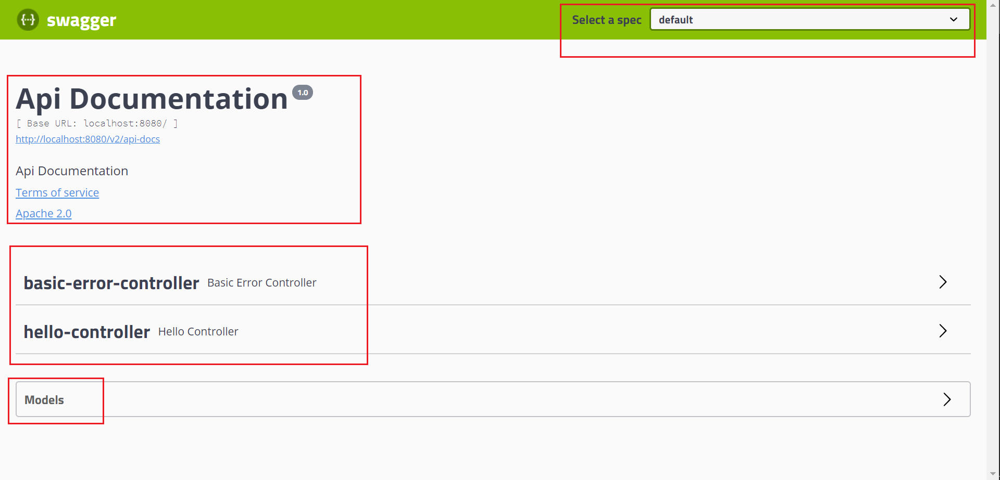

# Swagger

## 目录

* [1. 什么是 swagger?](#1-----swagger-)
* [2. 为什么用 swagger?](#2------swagger-)
* [3. SpringBoot 集成 swagger](#3-springboot----swagger)
* [4. 配置 swagger](#4----swagger)
* [5. swagger 配置扫描接口](#5-swagger-------)


## 1. 什么是 swagger?

<div align="center">  </div><br>

- 流行的 `API` 框架

- `RESTful API` 文档在线自动生成工具


## 2. 为什么用 swagger?

实时更新最新 API，降低集成的风险，为前后端集成联调服务


## 3. SpringBoot 集成 swagger

**引入依赖**

<div align="center">  </div><br>


<div align="center">  </div><br>

**pom.xml**

```xml
<!-- https://mvnrepository.com/artifact/io.springfox/springfox-swagger2 -->
<dependency>
    <groupId>io.springfox</groupId>
    <artifactId>springfox-swagger2</artifactId>
    <version>2.9.2</version>
</dependency>

<!-- https://mvnrepository.com/artifact/io.springfox/springfox-swagger-ui -->
<dependency>
    <groupId>io.springfox</groupId>
    <artifactId>springfox-swagger-ui</artifactId>
    <version>2.9.2</version>
</dependency>
```


**配置类**

`springboot` 集成 `swagger` 需要有配置类

**SwaggerConfig.java**

```java
@Configuration
@EnableSwagger2
public class SwaggerConfig {

}
```


**测试 swagger-ui**

```
http://localhost:8080/swagger-ui.html
```


:heavy_check_mark: 访问成功

<div align="center">  </div><br>

## 4. 配置 swagger


## 5. swagger 配置扫描接口


