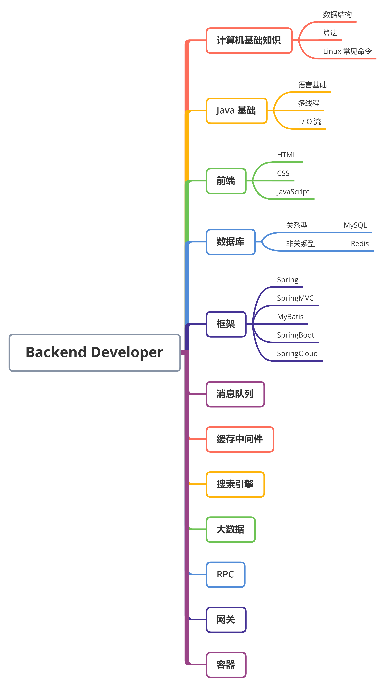

# backend-notes

:rocket: Backend notes for humans

## Road map

  
 

## :key: ​Computer Science

- 计算机网络
- 操作系统
- 数据结构与算法
  - [数组](https://github.com/ceezyyy/awesome-backend-developer/blob/master/CS/DataStructures/Array/notes/Array.md)
  - 栈和队列
  - 链表
  - 二分搜索树
  - 集合和映射
  - 优先队列和堆
  - 线段树
  - Tire
  - 并查集
  - AVL
  - 红黑树
  - 哈希表
- 设计模式
  - 让你的对象知悉现况：观察者模式
  - 装饰对象：装饰者模式
  - [烘烤 OO 的精华：工厂模式](https://github.com/ceezyyy/awesome-backend-developer/blob/master/CS/DesignPatterns/FactoryPattern/notes/FactoryPattern.md)
  - 独一无二的对象：单件模式
  - 封装调用：命令模式
  - 随遇而安：适配器与外观模式
  - 封装算法：模板方法模式
  - 管理良好的集合：迭代器与组合模式
  - 事务的状态：状态模式
  - 控制对象访问：代理模式
  - 模式中的模式：复合模式

## :hammer:Tools

- [Maven](https://github.com/ceezyyy/backend-notes/blob/master/Tools/Maven/Maven.md)

## :coffee: Java 

- 语言基础
  - [I / O 流](https://github.com/ceezyyy/Awesome-backend-developer/blob/master/Java/Advance/IO/IO.md)
  - [反射](https://github.com/ceezyyy/awesome-backend-developer/blob/master/Java/Advance/Reflection/Reflection.md)
- [多线程](https://github.com/ceezyyy/backend-notes/blob/master/Java/Advance/Multithreading/notes/Multithreading.md)
- JVM

  

## :desktop_computer: Frontend

- JavaScript
- jQuery
- Ajax
- JSON

  

## :floppy_disk: Database

- MySQL
- [Redis](https://github.com/ceezyyy/awesome-backend-developer/blob/master/CacheMiddleware/Redis/Notes/Redis.md)

## :leaves: Framework

- 预备知识
  - [Tomcat](https://github.com/ceezyyy/Awesome-backend-developer/blob/master/Web/Core/Tomcat/Tomcat.md)
  - [HTTP Protocol](https://github.com/ceezyyy/awesome-backend-developer/blob/master/Web/Core/Servlet/HTTP.md)
  - Servlet
  - Filter & Listener
- [MyBatis](https://github.com/ceezyyy/awesome-backend-developer/blob/master/Framework/MyBatis/notes/MyBatis.md)
- [Spring](https://github.com/ceezyyy/awesome-backend-developer/blob/master/Framework/Spring/notes/Spring.md)
- [SpringMVC](https://github.com/ceezyyy/backend-notes/blob/master/Framework/SpringMVC/notes/Springmvc.md)
- Spring Boot

 

## :bullettrain_side: Big Data

- [Hadoop](https://github.com/ceezyyy/backend-notes/blob/master/BigData/Hadoop/notes/Hadoop.md)
- [HDFS](https://github.com/ceezyyy/backend-notes/blob/master/BigData/HDFS/notes/HDFS.md)
- [MapReduce]()
- [Spark]()

## :book: Reading

- [技术人员的发展之路 - CoolShell](https://coolshell.cn/articles/17583.html)
- [谈谈技术学习的一些方法论](https://www.frankfeekr.cn/2019/05/09/%E8%B0%88%E8%B0%88%E6%8A%80%E6%9C%AF%E5%AD%A6%E4%B9%A0%E7%9A%84%E4%B8%80%E4%BA%9B%E6%96%B9%E6%B3%95%E8%AE%BA/)

