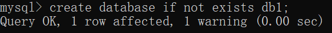
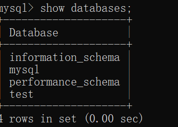
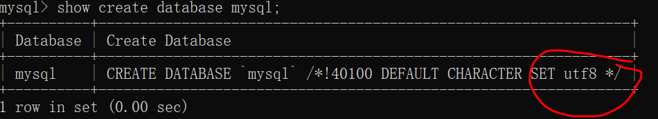
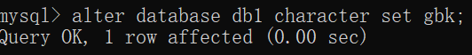
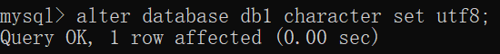
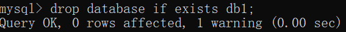
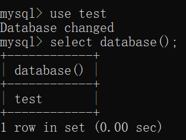
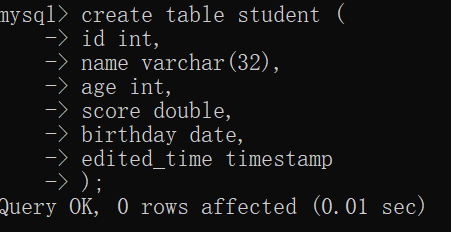
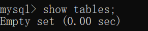

# MySQL 学习

## 目录

1. 基础
2. 约束
3. 多表
4. 事务

## MySQL 基础

**:warning: 所有语句都要以`;`结束**

### DDL 操作库

#### C Create 增加

`create database 库名`


这是基本操作，但我们知道数据库无法重复创建，所以我们来个升级版的语句，在创建数据库之前先进行判断

`create database if not exists 库名`




#### R Retrieve 查询

查询所有数据库

`show databases;`

查看所有数据库的名称




`show create database mysql;` 

目的：查看某个数据库字符集




#### U Update 修改

`alter database 库名 character set 字符集`







#### D Delete 删除

:warning: ​删库危险

`drop database if exists 库名`





#### 使用数据库

`use 数据库名;`

使用某个数据库，相当于进入到某个数据库中（对其进行操作）




`select database();`

查看当前正在使用的数据库查看当前正在使用的数据库


### DDL 操作表

#### C Create 创建

 ```Create 表名 (列名1 数据类型1,列名n 数据类型n)```

**MySQL 6 种重要数据类型**

1. `int` 整型
2. `double` 浮点型
3. `date` 日期型 `yyyy-MM-dd`
4. `datetime` 日期型  ` yyyy-MM-dd HH:mm:ss`
5. `timestamp` 时间戳 默认当前时间
6. `varchar` 字符串





#### R Retrieve 查询

`show tables;`

查看当前数据库的所有表，一开始没有表所以是 empty。




#### U Update 修改

总共分 5 类：

1. 修改表名
2. 修改字符集
3. 修改列名称 类型
4. 增加列
5. 删除列


#### D Delete 删除

`Drop table if exists 表名;`


