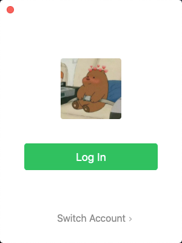

# Spring Security OAuth2

## 目录

* [1. 基础概念](#1-----)
  + [1.1 什么是认证](#11------)
  + [1.2 什么是会话](#12------)

## 1. 基础概念

为了更好地理解 `Spring Security OAuth2`，你需要了解以下概念

### 1.1 什么是认证

**认证就是判断一个用户身份是否合法的过程**

举个例子，微信是我们身边必不可少的社交软件

  
 

我们登录微信一般有三种方式：

- 输入账号密码
- 手机验证码
- 扫描二维码

**系统为什么要认证？**

认证是为了保护系统的隐私数据和资源，用户的身份合法方可访问该系统的资源

### 1.2 什么是会话

会话也称 `session`，`session` 对象存储特定用户会话所需的属性及配置信息

常见的方式有：

- 基于 `session` 方式
- 基于 `token` 方式

**会话有什么用？**

我们知道，`http` 协议是无状态的协议，但当网站需要跟踪用户信息，知道谁访问了“我”的时候，就需要会话。

会话也可以方便上网冲浪者。当我们登录微博时，

  
 

会话可以存储用户的信息，不用每一次登录都需要验证，“记住我”的功能就是基于会话实现的

此外，电商网站，例如淘宝，京东，使用会话技术可以存储用户的购物车信息。

 

**基于 token 的会话**

  
 

1. 用户验证
2. 服务器校验用户信息，若通过，则生成 `token` 返回给客户端
3. 客户端保存 `token`（地点不限于 `cookie`）
4. 携带 `token` 请求
5. 服务器验证 `token`，若验证通过则读取用户相关信息

