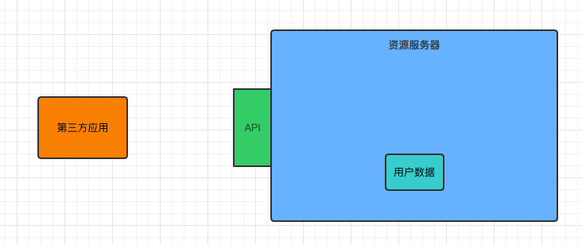
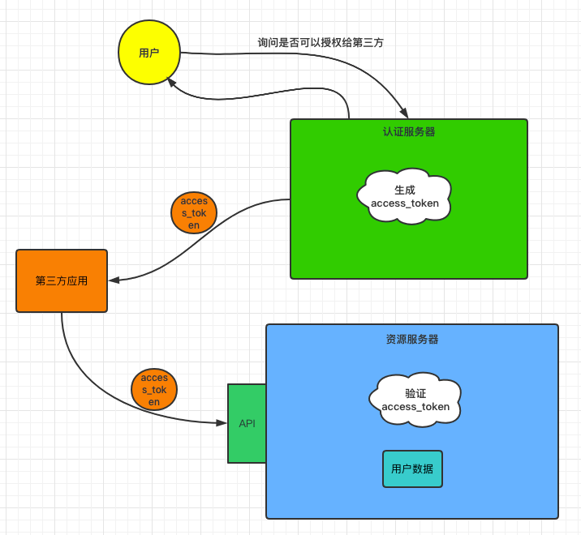

# OAuth2 快速入门

## 目录


## 1. 基础概念

为了更好地理解  `OAuth2`，你需要了解以下概念

### 1.1 什么是认证

**认证就是判断一个用户身份是否合法的过程**

举个例子，微信是我们身边必不可少的社交软件

<div align="center">  </div><br>

我们登录微信一般有三种方式：

- 输入账号密码
- 手机验证码
- 扫描二维码

**系统为什么要认证？**

认证是为了保护系统的隐私数据和资源，用户的身份合法方可访问该系统的资源


### 1.2 什么是会话

会话也称 `session`，`session` 对象存储特定用户会话所需的属性及配置信息

常见的方式有：

- 基于 `session` 方式
- 基于 `token` 方式

**会话有什么用？**

我们知道，`http` 协议是无状态的协议，但当网站需要跟踪用户信息，知道谁访问了“我”的时候，就需要会话。

会话也可以方便上网冲浪者。当我们登录微博时，

<div align="center">  </div><br>

会话可以存储用户的信息，不用每一次登录都需要验证，“记住我”的功能就是基于会话实现的

此外，电商网站，例如淘宝，京东，使用会话技术可以存储用户的购物车信息。

 

**基于 token 的会话**


<div align="center">  </div><br>

1. 用户验证
2. 服务器校验用户信息，若通过，则生成 `token` 返回给客户端
3. 客户端保存 `token`（地点不限于 `cookie`）
4. 携带 `token` 请求
5. 服务器验证 `token`，若验证通过则读取用户相关信息


### 1.3 什么是授权

授权是控制不同的角色（拥有不同权限的用户）能够访问不同的资源


## 2. OAuth2 

### 2.1 什么是 OAuth2

`OAuth2` 是目前最流行的授权机制，用来授权第三方应用，获取用户数据

### 2.2 由来

要了解一个技术的诞生，需要了解其诞生之前的历史。一般一项新技术的诞生是为了解决以前技术的不足

<div align="center">  </div><br>

举个例子，假设我们的用户数据保存在资源服务器，对外暴露 `api`，供第三方应用调用

但如果，第三方应用为恶意应用，通过获取数据进行非法交易，危害社会，那么后果不堪设想


这时，认证服务器和 `token` 登场了

<div align="center">  </div><br>


- 认证服务器的作用是验证第三方应用的身份合法性（认证的流程就不在此赘述）

- 若合法，给 `access_token`，反之则不给

- 第三方应用带着 `access_token` 去访问资源服务器，此时还需要资源服务器的验证

- 验证通过则允许访问


P.S：认证服务器和资源服务器可以在同一台服务器上


这时问题来了，认证服务器生成 `access_token` 竟然没人管！

即用户在完全不知情的情况下 / 没有同意的情况下，信息被访问 / 泄露


此时 `resource owner` 出现了


<div align="center">  </div><br>

总的来说，当第三方应用向访问你的数据时，衍生了一系列安全问题 

`OAuth2` 就是关于这些的规范


一句话概括：`OAuth2` 是目前最流行的授权机制，用来授权第三方应用，获取用户数据


### 2.3 互联网场景

首先看一个熟悉的例子：


假如我居住在一个小区，进出小区需要有密码，密码是小区居民所拥用的


但是，每天都有许多快递员出入，为了让他们送货到家，需要让其进入小区


如果这时候给了他们密码，会造成安全问题，比如说当快递员不负责该片区的时候，他仍然知道小区的密码；快递员可以告诉其他人密码，越来越多人知道密码等等安全问题


有没有一种办法，能让快递员自由进入小区，又不必知道小区居民的密码，且他唯一的权限就是送货，其他需要密码的场景他都没有权限？


这时，一套授权机制诞生了

1. 门禁系统的密码下面，有一个“授权”按钮，快递员需要按下这个按钮申请授权
2. 小区居民看到有人申请授权，核实其身份，比如说你来自哪个快递公司，姓名，照片等；若同意，则确认授权
3. 门禁系统得到确认后，向快递员显示一个令牌，即 `access token`，并附有有效期
4. 快递员输入令牌，进入小区


**这样做有什么好处？**

- 令牌附有有效期，在有效期内可以出入小区，而不用每次都向小区居民请求
- 小区可能有不止一个门禁，可以使用一个 `access token` 通过


在互联网中：

以微信小程序为例：

- 微信：门禁系统，存储着用户信息
- 小区居民：用户自身
- 快递员：第三方应用 / 第三方小程序


**令牌和密码有什么差异？**

- 有效期长短
- 令牌可以被随时撤销
- 令牌有限权限


### 2.4 四种方式

先看看有哪四种方式：

- 授权码（authorization-code）
- 隐藏式（implicit）
- 密码式（password）
- 客户端凭证（client credentials）


注意：

不管哪一种授权方式，第三方应用在申请令牌之前都会经过系统备案，说明自己的身份，防止令牌被滥用

两个身份识别码：

- 客户端 id
- 客户端密钥


这里介绍常用的 **授权式**，其他的用到了再去了解


**授权式** 指的是第三方应用先申请一个授权码，然后再用该码获取令牌


流程：

1. A 网站提供一个链接，用户点击后跳转到 B 网站，授权用户数据给 A 网站使用

   ```http
   https://b.com/oauth/authorize?
     response_type=code&
     client_id=CLIENT_ID&
     redirect_uri=CALLBACK_URL&
     scope=read
   ```

   参数说明：

   `response_type`：要求返回的授权码

   `client_id`：让 B 知道是谁在请求

   `redirect_uri`：B 网站接受或拒绝请求后跳转的网址

   `scope`：授权范围（这里是只读）


2. 在 B 网站要求用户登录，询问是否同意给予 A 网站授权，若同意则跳回 A 网站

   ```http
   https://a.com/callback?code=AUTHORIZATION_CODE
   ```

   参数说明：

   `code`：授权码

   

3. A 网站拿到授权码之后，向 B 网站请求令牌

   ```http
   https://b.com/oauth/token?
    client_id=CLIENT_ID&
    client_secret=CLIENT_SECRET&
    grant_type=authorization_code&
    code=AUTHORIZATION_CODE&
    redirect_uri=CALLBACK_URL
   ```

   参数说明：

   `client_id`：客户端 id （用于验证客户端是否备案）

   `client_secret`：客户端密钥（用于验证客户端是否备案）

   `grant_type`：授权方式

   `code`：授权码

   `redirect_uri`：令牌颁发后的回调地址


4. B 网站收到请求之后，就会颁发令牌

   ```json
   {    
     "access_token":"ACCESS_TOKEN",
     "token_type":"bearer",
     "expires_in":2592000,
     "refresh_token":"REFRESH_TOKEN",
     "scope":"read",
     "uid":100101,
     "info":{...}
   }
   ```

   

## 3. Demo

### 3.1 案例架构

| 项目        | 端口 | 说明       |
| ----------- | ---- | ---------- |
| Auth-server | 8080 | 授权服务器 |
| User-server | 8081 | 资源服务器 |
| Client-app  | 8082 | 第三方应用 |


先创建一个 `oauth-demo` 的空项目


再次回顾一下这幅图：

<div align="center">  </div><br>


### 3.2 授权服务器

需要配置：

- 用户
- token 的存储位置
- 令牌端点的安全约束
- 客户端详细信息
- 令牌的访问端点和令牌服务


**配置用户**

**SecurityConfig.java**

```java
@Configuration
public class SecurityConfig extends WebSecurityConfigurerAdapter {
    @Bean
    PasswordEncoder passwordEncoder() {
        return new BCryptPasswordEncoder();
    }

    @Override
    protected void configure(AuthenticationManagerBuilder auth) throws Exception {
        auth.inMemoryAuthentication()
                .withUser("ceezyyy")
                .password(new BCryptPasswordEncoder().encode("123"))
                .roles("admin")
                .and()
                .withUser("javaboy")
                .password(new BCryptPasswordEncoder().encode("123"))
                .roles("user");
    }

    @Override
    protected void configure(HttpSecurity http) throws Exception {
        http.csrf().disable().formLogin();
    }
}
```

配置了两个用户：

- ceezyyy
- javaboy


**配置 token**

**AccessTokenConfig.java**

```java
@Configuration
public class AccessTokenConfig {
    @Bean
    TokenStore tokenStore() {
        // 配置 token 存储在内存中
        return new InMemoryTokenStore();
    }
}
```


配置 `token` 存储在内存中

（`token` 也可以存储在 `redis` / 结合 `jwt`）


**配置 token 端点的安全约束**


### 3.3 资源服务器

**什么是资源服务器？**

资源服务器就是用来存储用户信息，例如微信的资源服务器就是用来存储微信上用户的信息


### 3.4 第三方应用搭建


### 3.5 测试


## 参考资料

- [[简易图解]『 OAuth2.0』 猴子都能懂的图解](https://learnku.com/articles/20031)
- [OAuth 2.0 的一个简单解释](http://www.ruanyifeng.com/blog/2019/04/oauth_design.html)
- [OAuth 2.0 的四种方式](http://www.ruanyifeng.com/blog/2019/04/oauth-grant-types.html)

- [这个案例写出来，还怕跟面试官扯不明白 OAuth2 登录流程？](https://mp.weixin.qq.com/s/GXMQI59U6uzmS-C0WQ5iUw)


