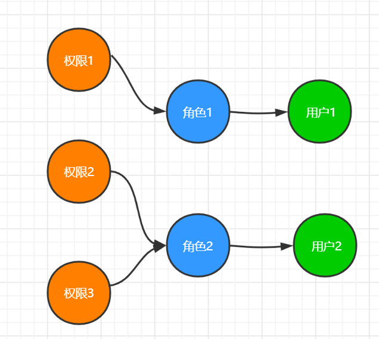
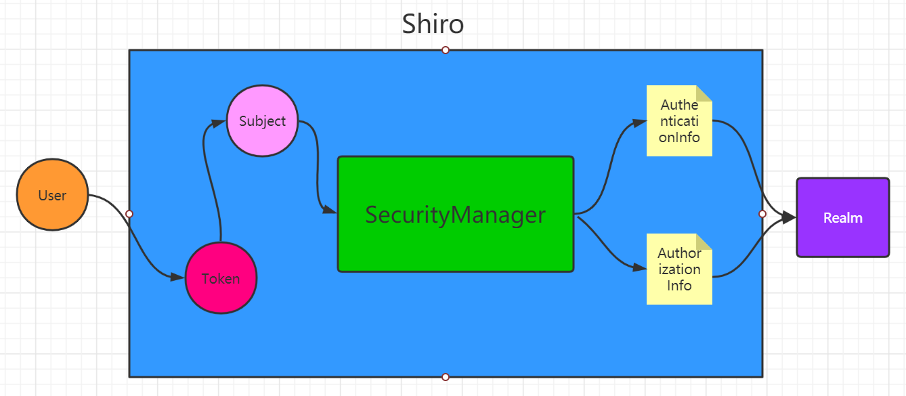
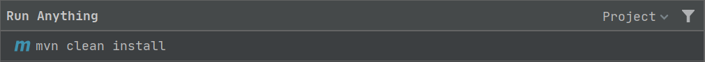
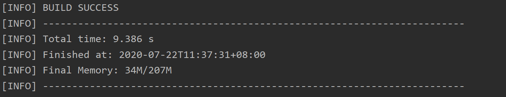
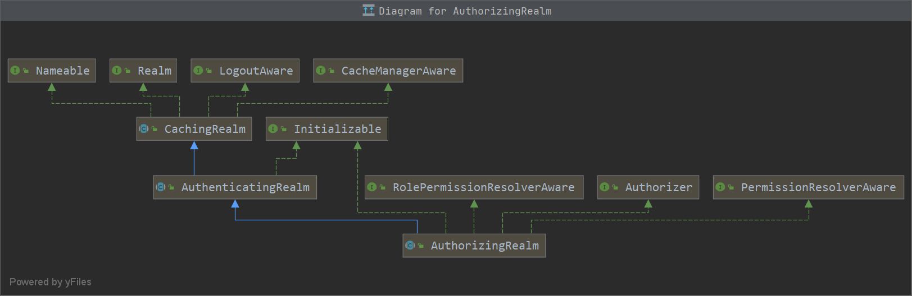
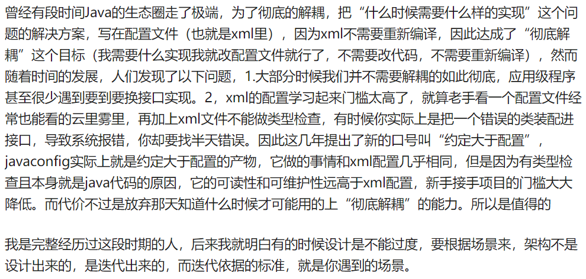

# Shiro

## 目录

* [1. 知识储备](#1-----)
  + [1.1 什么是认证？](#11-------)
  + [1.2 什么是授权？](#12-------)
  + [1.3 什么是凭证？](#13-------)
  + [1.4 什么是 Cookie?](#14-----cookie-)
  + [1.5 什么是 Session?](#15-----session-)
  + [1.6 Session 认证流程](#16-session-----)
  + [1.7 什么是 Token?](#17-----token-)
  + [1.8 Token 和 Session 的区别](#18-token---session----)
  + [1.9 什么是 JWT?](#19-----jwt-)
  + [1.10 Token 和 JWT 的区别](#110-token---jwt----)
* [2. 什么是 Shiro?](#2-----shiro-)
* [3. 用户，角色，权限的关系](#3------------)
* [4. 核心组件](#4-----)
* [5. 工作流程](#5-----)
* [6. Quickstart](#6-quickstart)
  + [6.1 引入依赖](#61-----)
  + [6.2 自定义过滤器](#62-------)
  + [6.3 配置类](#63----)
  + [6.4 编写认证和授权规则](#64----------)
    - [6.4.1 认证过滤器](#641------)
    - [6.4.2 授权过滤器](#642------)
* [参考资料](#----)


## 1. 知识储备

### 1.1 什么是认证？


<div align="center">  </div><br>

**认证 (Authentication) 就是验证当前用户的身份，证明"你是你自己"**

例如：

- 用户名密码登录
- 邮箱发送验证信息
- bb手机号接受验证码

   

### 1.2 什么是授权？


<div align="center">  </div><br>

**用户授权 (Authorization) 给第三方应用**

例如：

- 安装 `APP` 时，会询问用户是否授予（访问相册，地理位置等权限）
- 访问小程序时，会询问是否允许授予权限（获取昵称，头像，地区等个人信息）

实现授权的方式：

- cookie
- session
- token
- OAuth


### 1.3 什么是凭证？


<div align="center">  </div><br>

**凭证是一个令牌，用来标识访问者的身份**

例如：你出国旅行或出差时，有护照，标明你是一个中国人

在互联网应用中，许多网站有以下几种模式：

- 访客模式
- 普通用户模式
- 会员模式

访客模式：访客只能浏览帖子而不能发表言论

普通用户模式：当用户登录成功时，服务器会给发送请求的浏览器颁发一个 `token` ，用来表明身份，可以发表言论，点赞之类的

会员模式：类似于普通用户模式，解锁一些普通用户没有的功能


### 1.4 什么是 Cookie?


<div align="center">  </div><br>

**cookie 是一种记录服务器和客户端会话状态的机制**

`HTTP` 是无状态的协议，即服务端不会保存任何会话信息

这样会造成服务端无法确认当前访问者的信息，无法分辨上一次发送请求的当前用户是否为同一人 

所以服务器与浏览器为了进行会话跟踪，就必须主动维护一个状态，通过 `cookie` 和 `session` 实现

`cookie` 的特点：

- 存储在客户端
- 不可跨域


### 1.5 什么是 Session?

**session 是一种记录服务器和客户端会话状态的机制**

`session` 是基于 `cookie` 实现的，`session` 存储在服务器端，`sessionId` 会被存储到客户端的 `cookie` 中


### 1.6 Session 认证流程


### 1.7 什么是 Token?


### 1.8 Token 和 Session 的区别


### 1.9 什么是 JWT?


### 1.10 Token 和 JWT 的区别


## 2. 什么是 Shiro?

`Shiro` 是一款主流的 `Java` 安全框架，不依赖任何容器，可运行在 `Java SE` 和 `Java EE` 项目中

主要功能：

- 身份认证
- 授权
- 会话管理
- 加密


## 3. 用户，角色，权限的关系

**赋予角色权限**

**赋予用户角色**


<div align="center">  </div><br>


## 4. 核心组件

- UsernamePasswordToken

  `Shiro` 用来封装用户登录信息，使用用户登录信息来创建 `token`

- SecurityManager

  `Shiro` 核心，负责安全认证和授权

- Subject

  包含用户信息

- Realm

  开发者自定义的模块，根据项目需求，验证和授权的逻辑全部写在 `Realm` 中

- AuthenticationInfo

  用户角色信息集合，认证时使用

- AuthorizationInfo 

  角色的权限信息集合，授权时使用

- DefaultWebSecurityManager

  安全管理器，自定义的 `Realm` 需注入到次才能生效

- ShiroFilterFactoryBean

  过滤器工厂。`Shiro` 的基本运行机制是开发者制定流程，底层由 `ShiroFilterFactoryBean` 创建的 `filters` 来完成各种功能


## 5. 工作流程


<div align="center">  </div><br>

- 用户进入系统先根据 `username` 和 `password` 获取 `token`
- `Subject` 保存用户信息
- `SecurityManager` 根据 `AuthenticationInfo`（你是哪个角色）及 `AuthorizationInfo`（你有哪些权限）进行安全管理
- 其中 `AuthenticationInfo` 以及 `AuthorizationInfo` 根据用户自定义 `Realm` 生成


## 6. Quickstart

若使用

<div align="center">  </div><br>

创建 `springboot` 项目时失败，可以自定义 `Initializr service url` 成阿里云

```u
https://start.aliyun.com/
```

秒速

### 6.1 引入依赖

**pom.xml**

```xml
<!-- https://mvnrepository.com/artifact/org.apache.shiro/shiro-spring -->
<dependency>
    <groupId>org.apache.shiro</groupId>
    <artifactId>shiro-spring</artifactId>
    <version>1.5.3</version>
</dependency>
```

确保环境没问题

<div align="center">  </div><br>

<div align="center">  </div><br>

### 6.2 自定义过滤器

`account` 表

**account.sql**

```sql
DROP TABLE IF EXISTS `account`;
CREATE TABLE `account` (
  `id` int NOT NULL AUTO_INCREMENT,
  `username` varchar(20) DEFAULT NULL,
  `password` varchar(20) DEFAULT NULL,
  `perms` varchar(20) DEFAULT NULL,
  `role` varchar(20) DEFAULT NULL,
  PRIMARY KEY (`id`)
) ENGINE=InnoDB AUTO_INCREMENT=4 DEFAULT CHARSET=utf8;

INSERT INTO `account` VALUES (1,'zs','123123','',''),(2,'ls','123123','manage','administrator'),(3,'ww','123123','','');
```

<div align="center">  </div><br>

自定义 `realm`，实现授权和验证的逻辑

**AccountRealm.java**

```java
public class AccountRealm extends AuthorizingRealm {
    @Override
    protected AuthorizationInfo doGetAuthorizationInfo(PrincipalCollection principalCollection) {
        return null;
    }

    @Override
    protected AuthenticationInfo doGetAuthenticationInfo(AuthenticationToken authenticationToken) throws AuthenticationException {
        return null;
    }
}
```


重写验证的方法

**AccountRealm.java**

```java
public class AccountRealm extends AuthorizingRealm {

    @Autowired
    private AccountService accountService;

    /**
     * 授权逻辑
     *
     * @param principalCollection
     * @return
     */
    @Override
    protected AuthorizationInfo doGetAuthorizationInfo(PrincipalCollection principalCollection) {
        return null;
    }

    /**
     * 验证逻辑
     *
     * @param authenticationToken
     * @return
     * @throws AuthenticationException
     */
    @Override
    protected AuthenticationInfo doGetAuthenticationInfo(AuthenticationToken authenticationToken) throws AuthenticationException {

        // get UsernamePasswordToken
        UsernamePasswordToken token = (UsernamePasswordToken) authenticationToken;

        // get account by username (from database)
        Account account = accountService.findByUsername(token.getUsername());

        if (account != null) {
            return new SimpleAuthenticationInfo(account, account.getPassword(), getName());
        }

        // if account is null
        return null;

    }
}
```


其中重写验证逻辑：

- 获取 `token`
- 根据 `token` 中的用户名从数据库中查询 `account` 
- 若查询出 `account` 对象，通过 `Shiro` 中的 `SimpleAuthenticationInfo` 对象进行验证


### 6.3 配置类

**ShiroConfig.java**

```java
@Configuration
public class ShiroConfig {

    /**
     * 注入自定义 accountRealm
     *
     * @return
     */
    @Bean
    public AccountRealm accountRealm() {
        return new AccountRealm();
    }

    /**
     * 将自定义的 accountRealm 注入到 shiro 提供的安全管理器中
     *
     * @param accountRealm
     * @return
     */
    @Bean
    public DefaultWebSecurityManager defaultWebSecurityManager(@Qualifier("accountRealm") AccountRealm accountRealm) {
        return new DefaultWebSecurityManager(accountRealm);
    }

    /**
     * 由 shiro 提供的 ShiroFilterFactoryBean 帮开发者创建 filters
     *
     * @param defaultWebSecurityManager
     * @return
     */
    @Bean
    public ShiroFilterFactoryBean shiroFilterFactoryBean(@Qualifier("defaultWebSecurityManager") DefaultWebSecurityManager defaultWebSecurityManager) {
        ShiroFilterFactoryBean shiroFilterFactoryBean = new ShiroFilterFactoryBean();
        shiroFilterFactoryBean.setSecurityManager(defaultWebSecurityManager);
        return shiroFilterFactoryBean;
    }
    
}
```

写配置类的思路：

- 了解核心组件
- 了解核心组件之间的关系
- coding 的时候看源码的构造方法和 getter 和 setter 


**Java Config 配置类有什么优势？为什么现在推崇？**

[Spring4.x推荐使用java配置，为什么推荐这种配置方式？与xml配置和注解配置相比有什么优势？- 知乎](https://www.zhihu.com/question/278435266)

<div align="center">  </div><br>

**@Autowired 和 @Qualifier 有什么区别？**

- @Autowired 按类型注入
- @Qualifier 按名称注入 

### 6.4 编写认证和授权规则

#### 6.4.1 认证过滤器

- anon：无需认证
- authc：必须认证
- authcBasic：需要通过 `HTTPBasic` 认证
- user：不一定通过认证，只要曾经被 `Shiro` 记录即可


#### 6.4.2 授权过滤器

- perms：必须拥有某个权限才能访问
- role：必须拥有某个角色才能访问
- port：请求的端口必须是指定值
- rest：请求必须基于 `RESTful`
- ssl：必须是安全的 `URL` 请求


## 参考资料

- [傻傻分不清之 Cookie、Session、Token、JWT](https://juejin.im/post/5e055d9ef265da33997a42cc)

- [【硬核干货】2小时学会Spring Boot整合Shiro](https://www.bilibili.com/video/BV16C4y187S9?from=search&seid=10384979958239744928)

  

