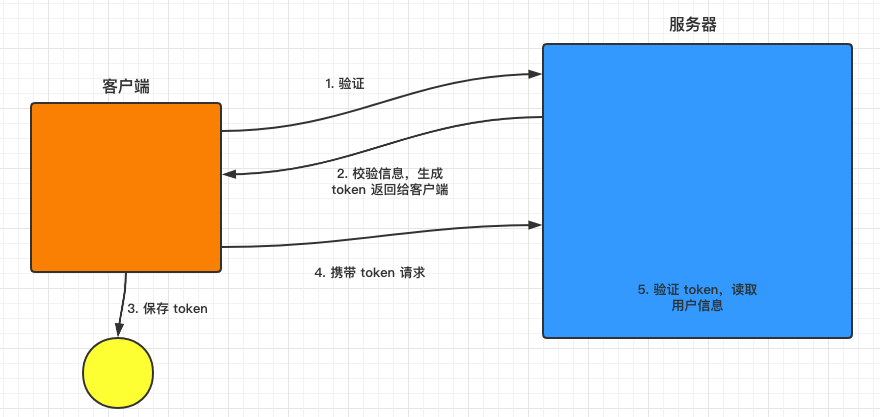
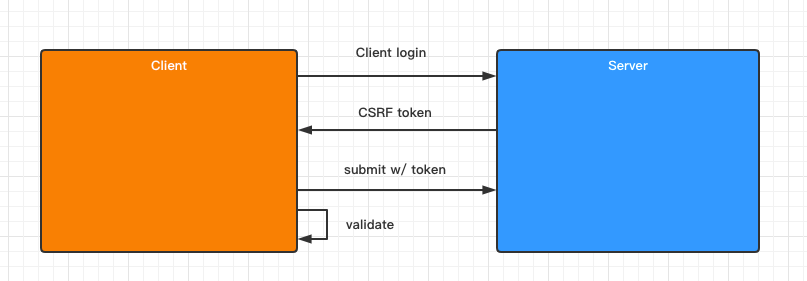
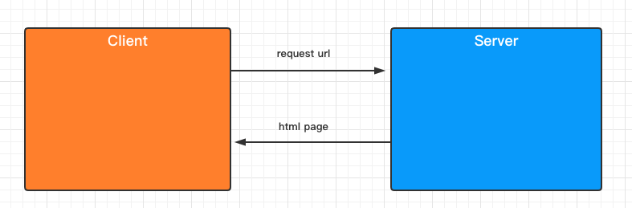
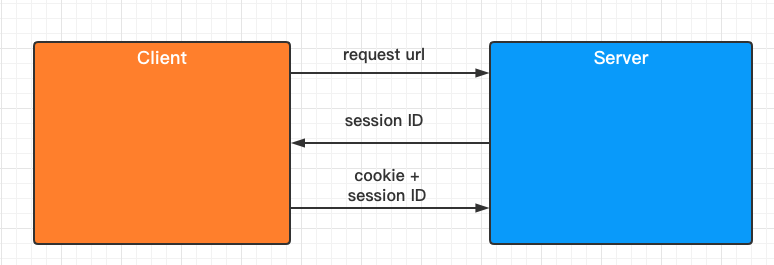
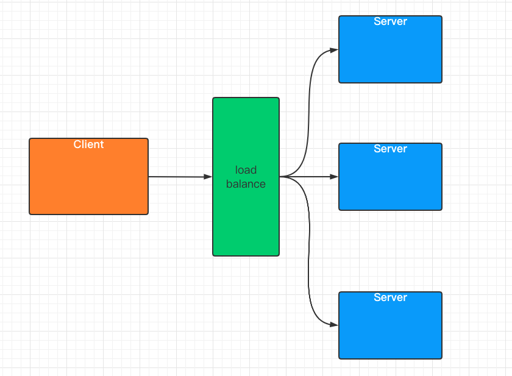
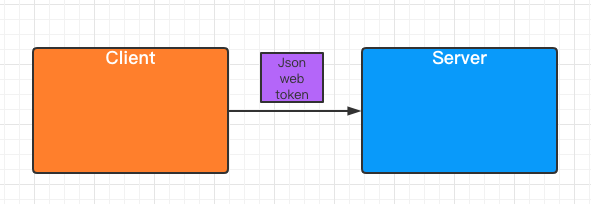
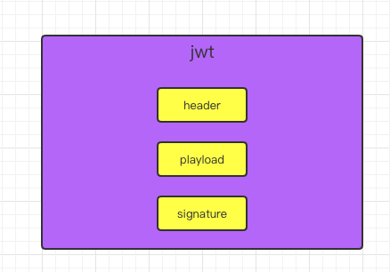
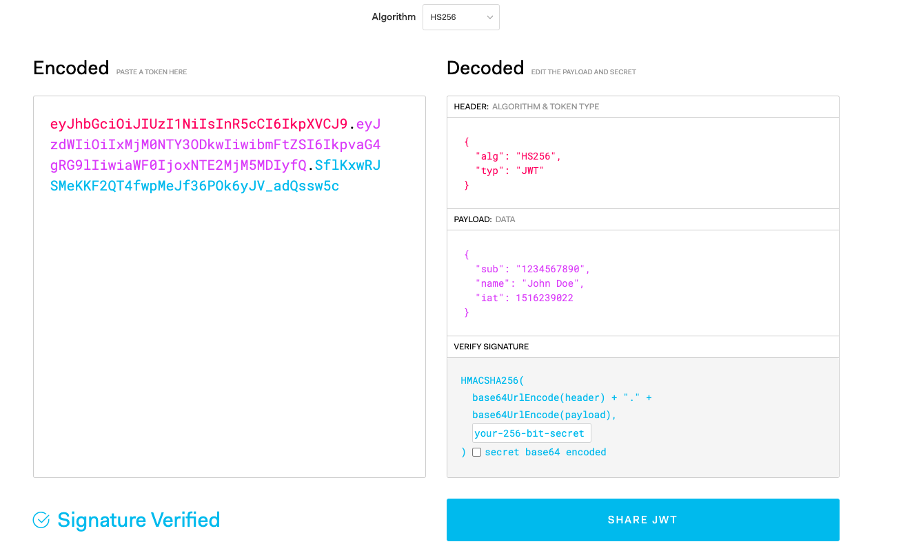
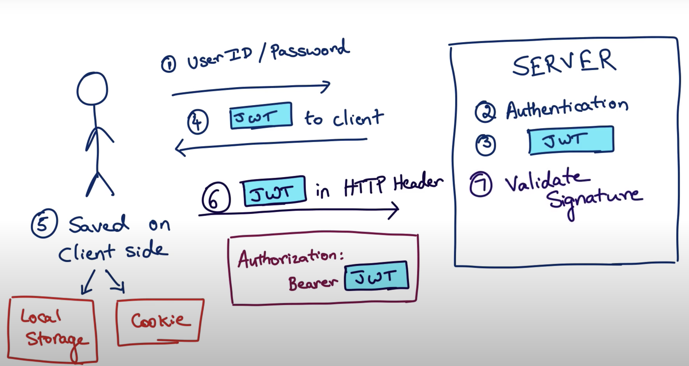
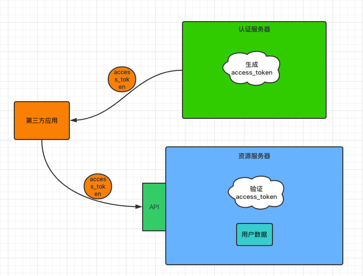

# Spring Security

Table of Contents
-----------------

* [1. Preparation](#1-preparation)
   * [1.1 什么是认证](#11-什么是认证)
   * [1.2 什么是会话](#12-什么是会话)
   * [1.3 什么是授权](#13-什么是授权)
* [2. Quickstart](#2-quickstart)
* [3. Basic Auth](#3-basic-auth)
* [4. Users Roles and Authorities](#4-users-roles-and-authorities)
   * [4.1 User service](#41-user-service)
   * [4.2 Password](#42-password)
* [5. Role Based Authentication](#5-role-based-authentication)
* [6. Permission Based Authentication](#6-permission-based-authentication)
* [7. Cross-site request forgery (CSRF)](#7-cross-site-request-forgery-csrf)
* [8. Database Authentication](#8-database-authentication)
* [9. JWT](#9-jwt)
   * [9.1 What is JWT?](#91-what-is-jwt)
   * [9.2 The structure of JWT](#92-the-structure-of-jwt)
   * [9.3 Workflow](#93-workflow)
   * [9.4 Pros and Cons](#94-pros-and-cons)
* [10. OAuth2](#10-oauth2)
   * [10.1 什么是 OAuth2](#101-什么是-oauth2)
   * [10.2 由来](#102-由来)
   * [10.3 互联网场景](#103-互联网场景)
   * [10.4 四种方式](#104-四种方式)
* [11. Spring Security using OAuth2 in Spring Boot](#11-spring-security-using-oauth2-in-spring-boot)
* [12. Conclusion](#12-conclusion)
* [Source Code](#source-code)
* [References](#references)


## 1. Preparation

### 1.1 什么是认证

**认证就是判断一个用户身份是否合法的过程**

举个例子，微信是我们身边必不可少的社交软件

<div align="center">  </div><br>

我们登录微信一般有三种方式：

- 输入账号密码
- 手机验证码
- 扫描二维码

**系统为什么要认证？**

认证是为了保护系统的隐私数据和资源，用户的身份合法方可访问该系统的资源


### 1.2 什么是会话

会话也称 `session`，`session` 对象存储特定用户会话所需的属性及配置信息

常见的方式有：

- 基于 `session` 方式
- 基于 `token` 方式

**会话有什么用？**

我们知道，`http` 协议是无状态的协议，但当网站需要跟踪用户信息，知道谁访问了“我”的时候，就需要会话。

会话也可以方便上网冲浪者。当我们登录微博时，

<div align="center">  </div><br>

会话可以存储用户的信息，不用每一次登录都需要验证，“记住我”的功能就是基于会话实现的

此外，电商网站，例如淘宝，京东，使用会话技术可以存储用户的购物车信息。

 

**基于 token 的会话**


<div align="center">  </div><br>

1. 用户验证
2. 服务器校验用户信息，若通过，则生成 `token` 返回给客户端
3. 客户端保存 `token`（地点不限于 `cookie`）
4. 携带 `token` 请求
5. 服务器验证 `token`，若验证通过则读取用户相关信息


### 1.3 什么是授权

授权是控制不同的角色（拥有不同权限的用户）能够访问不同的资源


## 2. Quickstart

添加依赖

**pom.xml**

```xml
<dependencies>
  <dependency>
    <groupId>org.springframework.boot</groupId>
    <artifactId>spring-boot-starter-security</artifactId>
  </dependency>
  <dependency>
    <groupId>org.springframework.boot</groupId>
    <artifactId>spring-boot-starter-web</artifactId>
</dependency>
```

`controller` 层

**HelloController.java**

```java
@RestController
public class HelloController {

    @RequestMapping("/")
    public String sayHello() {
        return "Hello!";
    }
    
}
```

配置端口为 9090

```yaml
server:
  port: 9090
```

当 `url` 输入以下网址时

<div align="center">  </div><br>

页面变成了

<div align="center">  </div><br>


可见，我们的接口没有赤裸裸地暴露供第三方随意访问了，`spring security` 框架给我们加了一层保护

用户名默认为 `user`

密码从控制台可以获得

<div align="center">  </div><br>

成功跳转！

<div align="center">  </div><br>


⚠️注意：

`login` 之后默认跳转到 `/` 路径


## 3. Basic Auth

集成 `Spring Security`

**ApplicationSecurityConfig.java**

```java
@Configuration
@EnableWebSecurity
public class ApplicationSecurityConfig extends WebSecurityConfigurerAdapter {
    @Override
    protected void configure(HttpSecurity http) throws Exception {
        http
                .authorizeRequests()
                .anyRequest()
                .authenticated()
                .and()
                .httpBasic();
    }
}
```

继承了 `WebSecurityConfigurerAdapter`，我们重写了 `configure` 方法（参数为 `HttpSecurity`）

解释一下编写思路（编写时会有代码提示）

对发过来的 `http request`

1. 授权请求
2. 所有请求
3. 都要验证
4. 和
5. 使用 `http basic` 验证方式


<div align="center">  </div><br>

修改 `controller`

**HelloController.java**

```java
@RestController
public class HelloController {

    @RequestMapping("/hello")
    public String sayHello() {
        return "Hello!";
    }

}
```


成功访问！


<div align="center">  </div><br>

## 4. Users Roles and Authorities

### 4.1 User service

在安全领域

用户包括一般包括以下信息：

- username
- password
- role
- authorities
- and more

`username` 和 `password` 很好理解，我们无论登录哪个网站，都需要用户名和密码来校验我们的身份

`role` 和 `authorities` 又如何理解呢？

我们在生活中有许多身份，在学校我们既是学生，也是父母的孩子，说不定还是校篮球队队长

权限一般与角色一起谈论。比如说你是学生，你可以享受教育优惠的权限，你可以享受在高中大学读书的权利...

你是篮球队队长，你就有组织训练的权限，有管理队员的权限...

<div align="center">  </div><br>


`Spring security` 默认的用户是 `user`

```java
@Configuration
@EnableWebSecurity
public class ApplicationSecurityConfig extends WebSecurityConfigurerAdapter {

    @Autowired
    private PasswordEncoder passwordEncoder;

    /**
     * 配置用户信息
     *
     * @return
     */
    @Override
    @Bean
    protected UserDetailsService userDetailsService() {

        // user 1: admin
        UserDetails admin = User.builder()
                .username("admin")
                .password(passwordEncoder.encode("123"))
                .roles(ADMIN.name())
                .build();

        // user 2: visitor
        UserDetails visitor = User.builder()
                .username("visitor")
                .password(passwordEncoder.encode("123"))
                .roles(VISITOR.name())
                .build();


        return new InMemoryUserDetailsManager(admin, visitor);

    }

    @Override
    protected void configure(HttpSecurity http) throws Exception {
        http
                .csrf().disable()
                .authorizeRequests()
                .antMatchers("/index").permitAll()
                .antMatchers("/admin").hasRole(ADMIN.name())
                .antMatchers("/visitor").hasRole(VISITOR.name())
                .anyRequest()
                .authenticated()
                .and()
                .httpBasic();
    }
}
```


解释（具体查看源码）：

- User：用户类
- UserDetails：用户信息类
- InMemoryUserDetailsManager：用户信息保存在内存


这里有一个小技巧，方法返回值是 `UserDetailsService`

是一个接口，点击左边绿色图标可以查看其实现类

<div align="center">  </div><br>


总的来说，用户信息配置类通过工厂模式创建了一个用户信息对象，并保存在内存中


### 4.2 Password

作为一个企业级安全框架，是决不允许密码以明文形式存储

`Spring security` 为我们提供了一个利器：`PasswordEncoder`

**PasswordEncoder.class**

```java
public interface PasswordEncoder {
    String encode(CharSequence var1);

    boolean matches(CharSequence var1, String var2);

    default boolean upgradeEncoding(String encodedPassword) {
        return false;
    }
}
```

采用第三种加密方式：

<div align="center">  </div><br>

**PasswordConfig.java**

```java
@Configuration
public class PasswordConfig {

    @Bean
    public PasswordEncoder passwordEncoder() {
        return new BCryptPasswordEncoder(10);
    }

}
```


<div align="center">  </div><br>

debug 一下，发现明文密码 “123” 已经加密


成功访问！

<div align="center">  </div><br>


## 5. Role Based Authentication

**特定的网址只能由特定的角色访问**

**对象是角色**

模拟两个角色：

- admin（拥有增删改查的权限）
- visitor （只有查的权限）


<div align="center">  </div><br>


为了方便理解，在用户信息中设置两个角色：

- admin
- visitor


权限枚举类：

**UserPermission.java**

```java
public enum UserPermission {

    CREATE("create"),
    READ("read"),
    UPDATE("update"),
    DELETE("delete");

    private final String permission;

    UserPermission(String permission) {
        this.permission = permission;
    }

    public String getPermission() {
        return permission;
    }

}
```

角色枚举类：

**UserRole.java**

```java
public enum UserRole {

    // 使用 guava 工具类简化代码
    VISITOR(Sets.newHashSet(UserPermission.READ)),
    ADMIN(Sets.newHashSet(UserPermission.CREATE, UserPermission.READ, UserPermission.UPDATE, UserPermission.DELETE));

    private final Set<UserPermission> permissionSet;

    UserRole(Set<UserPermission> permissionSet) {
        this.permissionSet = permissionSet;
    }

    public Set<UserPermission> getPermissionSet() {
        return permissionSet;
    }
    
}
```

权限枚举类：

**UserPermission.java**

```java
public enum UserPermission {

    CREATE("create"),
    READ("read"),
    UPDATE("update"),
    DELETE("delete");

    private final String permission;

    UserPermission(String permission) {
        this.permission = permission;
    }

    public String getPermission() {
        return permission;
    }

}
```

不同的 `request` 对应着不同的角色

**ApplicationSecurityConfig.java**

```java
@Override
protected void configure(HttpSecurity http) throws Exception {
  http
    .authorizeRequests()
    .antMatchers("/index").permitAll()
    .antMatchers("/admin").hasRole(ADMIN.name())
    .antMatchers("/visitor").hasRole(VISITOR.name())
    .anyRequest()
    .authenticated()
    .and()
    .httpBasic();
}
```


**HelloController.java**

```java
@RestController
public class HelloController {

    @GetMapping("/admin")
    public String sayAdmin() {
        return "Admin here";
    }

    @GetMapping("/visitor")
    public String sayVisitor() {
        return "Visitor here";
    }

}
```


当我们用 `admin` 账户去访问 `/visitor` 接口时，被拒绝了

<div align="center">  </div><br>

```json
{
    "timestamp": "2020-07-29T09:29:29.881+00:00",
    "status": 403,
    "error": "Forbidden",
    "message": "",
    "path": "/visitor"
}
```


当访问 `/admin` 接口时

<div align="center">  </div><br>

访问成功！

<div align="center">  </div><br>


## 6. Permission Based Authentication

和 `Role Based Authentication` 不同的是

**特定的网址只能由拥有特定权限的人访问**

**对象是权限**

<div align="center">  </div><br>

**不同的用户拥有不同的角色，不同的角色也拥有着不同的权限**


举个例子，看图理解

<div align="center">  </div><br>


现在我们定一个 `manageController`，模拟 `CRUD` 操作：

**manageController.java**

```java
@RestController
@RequestMapping("/manage")
public class ManageController {

    // create
    @PostMapping("/create")
    public String create() {
        return "Creating...";
    }

    // read
    @GetMapping("/read")
    public String read() { return "Reading...";
    }

    // update
    @PutMapping("/update")
    public String update() { return  "Updating...";
    }

    // delete
    @DeleteMapping("/delete")
    public String delete() {
        return "Deleting...";
    }

}
```

先以 `admin` 账户访问 

<div align="center">  </div><br>

访问成功！


<div align="center">  </div><br>


发送 `POST` 请求

<div align="center">  </div><br>


访问失败


<div align="center">  </div><br>

发送 `PUT` 请求 


<div align="center">  </div><br>


访问失败


<div align="center">  </div><br>

发送 `DELETE` 请求


<div align="center">  </div><br>


访问失败

<div align="center">  </div><br>

那么如何解决这个问题？

只要加上一行代码即可

**ApplicationSecurityConfig.java**

```java
 @Override
protected void configure(HttpSecurity http) throws Exception {
    http
            .csrf().disable()  // talk about it later
            .authorizeRequests()
            .antMatchers("/index").permitAll()
            .antMatchers("/admin").hasRole(ADMIN.name())
            .antMatchers("/visitor").hasRole(VISITOR.name())
            .anyRequest()
            .authenticated()
            .and()
            .httpBasic();
}
```

这个稍后会详细解释


处理了这个问题之后，让我们专注于这章的重点：`Permission Based Authentication`


进入 `UserDetails` 接口的源码，发现有一个称作 `getAuthorities` 的集合类

```java
public interface UserDetails extends Serializable {
    Collection<? extends GrantedAuthority> getAuthorities();

    String getPassword();

    String getUsername();

    boolean isAccountNonExpired();

    boolean isAccountNonLocked();

    boolean isCredentialsNonExpired();

    boolean isEnabled();
}
```

一个用户有着不同的权限，这个就是用来存储用户权限的


那么这个方法的值从哪里获得呢？


那就得进入 `UserBuilder` 里面瞧瞧了


**UserBuilder.class**

```java
public static class UserBuilder {
    private String username;
    private String password;
    private List<GrantedAuthority> authorities;
    private boolean accountExpired;
    private boolean accountLocked;
    private boolean credentialsExpired;
    private boolean disabled;
    private Function<String, String> passwordEncoder;
```

在 `UserBuilder` 中，有一个名为 `authorities` 的属性


是一个集合列表，存放着类型为 `GrantedAuthority` 的元素


在 `UserBuilder` 中有一个 `authorities` 方法

```java
public User.UserBuilder authorities(Collection<? extends GrantedAuthority> authorities) {
  this.authorities = new ArrayList(authorities);
  return this;
}
```


传入的是权限的集合


秉承着封装的思想，我们需要在 `role` 中定义一个方法，获取每个用户的权限集合


`GrantedAuthority` 有着 3 个实现类


<div align="center">  </div><br>

进入到 `SimpleGrantedAuthority` 中，发现其对应着一个属性：

```java
public final class SimpleGrantedAuthority implements GrantedAuthority {
    private static final long serialVersionUID = 530L;
    private final String role;
```


再对着 `UserBuilder` 的源码一起看


**原来权限类中也有记录用户的信息**

并且以 `ROLE_` 开头


```java
public User.UserBuilder roles(String... roles) {
    List<GrantedAuthority> authorities = new ArrayList(roles.length);
    String[] var3 = roles;
    int var4 = roles.length;
for(int var5 = 0; var5 < var4; ++var5) {
    String role = var3[var5];
    Assert.isTrue(!role.startsWith("ROLE_"), () -> {
        return role + " cannot start with ROLE_ (it is automatically added)";
    });
    authorities.add(new SimpleGrantedAuthority("ROLE_" + role));
}
```


我们的 `role` 枚举类，增加了一个方法，获得所在角色的所有权限

**UserRole.java**

```java
public enum UserRole {

    // 使用 guava 工具类简化代码
    VISITOR(Sets.newHashSet(UserPermission.READ)),
    ADMIN(Sets.newHashSet(UserPermission.CREATE, UserPermission.READ, UserPermission.UPDATE, UserPermission.DELETE));

    private final Set<UserPermission> permissionSet;

    UserRole(Set<UserPermission> permissionSet) {
        this.permissionSet = permissionSet;
    }

    public Set<UserPermission> getPermissionSet() {
        return permissionSet;
    }

    // get authorities from specific role
    public Set<SimpleGrantedAuthority> getGrantedAuthorities() {

        // convert permission to SimpleGrantedAuthority
        Set<SimpleGrantedAuthority> authorities = getPermissionSet().stream()
                .map(userPermission -> new SimpleGrantedAuthority(userPermission.getPermission()))
                .collect(Collectors.toSet());

        // add role to authorities
        authorities.add(new SimpleGrantedAuthority("ROLE_" + this.name()));

        return authorities;

    }

}
```


最终，我们的 `ApplicationSecurityConfig` 类变成：

**ApplicationSecurityConfig.java**

```java
@Configuration
@EnableWebSecurity
public class ApplicationSecurityConfig extends WebSecurityConfigurerAdapter {

    @Autowired
    private PasswordEncoder passwordEncoder;

    /**
     * 配置用户信息
     *
     * @return
     */
    @Override
    @Bean
    protected UserDetailsService userDetailsService() {

        // user 1: admin
        UserDetails admin = User.builder()
                .username("admin")
                .password(passwordEncoder.encode("123"))
//                .roles(ADMIN.name())  // ROLE_ADMIN
                .authorities(ADMIN.getGrantedAuthorities())
                .build();

        // user 2: visitor
        UserDetails visitor = User.builder()
                .username("visitor")
                .password(passwordEncoder.encode("123"))
//                .roles(VISITOR.name())  // ROLE_VISITOR
                .authorities(VISITOR.getGrantedAuthorities())
                .build();


        return new InMemoryUserDetailsManager(admin, visitor);

    }

    @Override
    protected void configure(HttpSecurity http) throws Exception {
        http
                // TODO: talk more in depth later
                .csrf().disable()
                .authorizeRequests()
                .antMatchers("/index").permitAll()
//                .antMatchers("/admin").hasRole(ADMIN.name())
//                .antMatchers("/visitor").hasRole(VISITOR.name())
//                .antMatchers(HttpMethod.GET, "/manage/create").hasAnyRole(ADMIN.name(), VISITOR.name())
          			
          			// order does matter
                .antMatchers(HttpMethod.POST, "/manage/create").hasAuthority(CREATE.getPermission())
                .antMatchers(HttpMethod.PUT, "/manage/update").hasAuthority(UPDATE.getPermission())
                .antMatchers(HttpMethod.DELETE, "/manage/delete").hasAuthority(DELETE.getPermission())
                .anyRequest()
                .authenticated()
                .and()
                .httpBasic();
    }
}
```


用 `admin` 账户登录

<div align="center">  </div><br>


访问 `/read` 成功


<div align="center">  </div><br>


<div align="center">  </div><br>


访问 `/create` 成功


<div align="center">  </div><br>


<div align="center">  </div><br>


访问 `/update` 成功


<div align="center">  </div><br>


<div align="center">  </div><br>


访问 `/delete` 成功


<div align="center">  </div><br>


<div align="center">  </div><br>


而使用 `visitor` 身份访问时，只能访问 `/read` 接口


除了这种方式，还有在 `controller` 增加 `annotation` 的方法，在此先不演示


## 7. Cross-site request forgery (CSRF)

该段落参考 [跨站请求伪造 - wiki]([https://zh.wikipedia.org/wiki/%E8%B7%A8%E7%AB%99%E8%AF%B7%E6%B1%82%E4%BC%AA%E9%80%A0](https://zh.wikipedia.org/wiki/跨站请求伪造))


什么是 `forgery`?

<div align="center">  </div><br>

什么是 `CSRF`?

> 跨站请求攻击，简单地说，是攻击者通过一些技术手段欺骗用户的浏览器去访问一个自己曾经认证过的网站并运行一些操作（如发邮件，发消息，甚至财产操作如转账和购买商品）。由于浏览器曾经认证过，所以被访问的网站会认为是真正的用户操作而去运行。这利用了web中用户身份验证的一个漏洞：**简单的身份验证只能保证请求发自某个用户的浏览器，却不能保证请求本身是用户自愿发出的**。

注意，`CSRF` 有时也称作 `XSRF` 


举个例子


假如一家银行用以运行的转账操作的 `URL` 地址如下：

```html
https://bank.example.com/withdraw?account=AccoutName&amount=1000&for=PayeeName
```


那么，一个恶意攻击者可以在另外一个网站放置如下代码：

```html

```


如果有账户名为Alice的用户访问了恶意站点，而她之前刚访问过银行不久，登录信息尚未过期，那么她就会损失1000资金。


细思极恐（所以不要访问一些不知名有风险的网站）

 

这种恶意的网址可以有很多种形式，藏身于网页中的许多地方。此外，攻击者也不需要控制放置恶意网址的网站。例如他可以将这种地址藏在论坛，博客等任何用户生成内容的网站中。这意味着如果服务端没有合适的防御措施的话，用户即使访问熟悉的可信网站也有受攻击的危险。

透过例子能够看出，攻击者并不能通过CSRF攻击来直接获取用户的账户控制权，也不能直接窃取用户的任何信息。他们能做到的，是欺骗用户的浏览器，让其以用户的名义运行操作。


流程

<div align="center">  </div><br>

其中 `submit` 主要针对的是 `POST`，`DELETE`，  `PUT` 请求


所以在我们之前的时候，只能通过 `GET` 请求访问，加上 `csrf.disable()` 才能让 `Spring security` 放行


## 8. Database Authentication

话不多说，直接上代码


## 9. JWT

### 9.1 What is JWT?

为了更好地了解 `JWT`，让我们从一个简单的例子说起


<div align="center">  </div><br>

`HTTP` 是无状态的协议，对于 `URL` 请求，做出相应的 `response`

在“远古时期”，当发出的 `URL` 是请求静态页面，服务器不需要知道谁访问了我

但随着科技的发展，以前的需求无法满足了，浏览器需要跟踪用户状态（知道谁在访问我），这时 `session token` 诞生了


常见的策略有两种：

- Session token（Session ID + Cookies）
- Json web token (JWT)


先介绍 `session token`


**token 是什么？**

举个例子，当你去维修手机时，维修师傅告诉你 3 天之后过来领取你的手机，且给了你一张纸条，上面写着维修单号

3 天之后，你拿着带有维修单号的纸条去维修店，师傅根据你的维修单号在后台查询个人信息和维修信息，从而帮你维修


<div align="center">  </div><br>

再来看看 `jwt`

技术的发展日新月异，单体应用很快进化到了微服务 / 分布式


<div align="center">  </div><br>

传统的 `session token` 的方式有缺陷，因为 `session ID` 被存储到了不同的服务器上，解决这个的方法有两个：

- 缓存数据库 `redis`
- 索引


为了适应这种微服务场景， `jwt` 出场了


<div align="center">  </div><br>

举个例子，

像你进入了维修店，这次维修师傅给你的纸条不再是只有一串维修订单号码，而是记录了你的详细信息（姓名，日期，维修订单号，维修产品...），而维修店后台没有存储任何信息。每次过来维修只需要带这张纸条，有需求会在上面更新


那如何保证安全问题呢？万一被人篡改了怎么办？

这时 `jwt` 需要有签名，用于验证用户身份（下一节更深入研究）


### 9.2 The structure of JWT


<div align="center">  </div><br>


<div align="center">  </div><br>


- header
- playload
- signature


### 9.3 Workflow

<div align="center">  </div><br>

### 9.4 Pros and Cons


## 10. OAuth2 

### 10.1 什么是 OAuth2

`OAuth2` 是目前最流行的授权机制，用来授权第三方应用，获取用户数据

### 10.2 由来

要了解一个技术的诞生，需要了解其诞生之前的历史。一般一项新技术的诞生是为了解决以前技术的不足

<div align="center">  </div><br>

举个例子，假设我们的用户数据保存在资源服务器，对外暴露 `api`，供第三方应用调用

但如果，第三方应用为恶意应用，通过获取数据进行非法交易，危害社会，那么后果不堪设想


这时，认证服务器和 `token` 登场了

<div align="center">  </div><br>


- 认证服务器的作用是验证第三方应用的身份合法性（认证的流程就不在此赘述）

- 若合法，给 `access_token`，反之则不给

- 第三方应用带着 `access_token` 去访问资源服务器，此时还需要资源服务器的验证

- 验证通过则允许访问


P.S：认证服务器和资源服务器可以在同一台服务器上


这时问题来了，认证服务器生成 `access_token` 竟然没人管！

即用户在完全不知情的情况下 / 没有同意的情况下，信息被访问 / 泄露


此时 `resource owner` 出现了


<div align="center">  </div><br>

总的来说，当第三方应用向访问你的数据时，衍生了一系列安全问题 

`OAuth2` 就是关于这些的规范


一句话概括：`OAuth2` 是目前最流行的授权机制，用来授权第三方应用，获取用户数据


### 10.3 互联网场景

首先看一个熟悉的例子：


假如我居住在一个小区，进出小区需要有密码，密码是小区居民所拥用的


但是，每天都有许多快递员出入，为了让他们送货到家，需要让其进入小区


如果这时候给了他们密码，会造成安全问题，比如说当快递员不负责该片区的时候，他仍然知道小区的密码；快递员可以告诉其他人密码，越来越多人知道密码等等安全问题


有没有一种办法，能让快递员自由进入小区，又不必知道小区居民的密码，且他唯一的权限就是送货，其他需要密码的场景他都没有权限？


这时，一套授权机制诞生了

1. 门禁系统的密码下面，有一个“授权”按钮，快递员需要按下这个按钮申请授权
2. 小区居民看到有人申请授权，核实其身份，比如说你来自哪个快递公司，姓名，照片等；若同意，则确认授权
3. 门禁系统得到确认后，向快递员显示一个令牌，即 `access token`，并附有有效期
4. 快递员输入令牌，进入小区


**这样做有什么好处？**

- 令牌附有有效期，在有效期内可以出入小区，而不用每次都向小区居民请求
- 小区可能有不止一个门禁，可以使用一个 `access token` 通过


在互联网中：

以微信小程序为例：

- 微信：门禁系统，存储着用户信息
- 小区居民：用户自身
- 快递员：第三方应用 / 第三方小程序


**令牌和密码有什么差异？**

- 有效期长短
- 令牌可以被随时撤销
- 令牌有限权限


### 10.4 四种方式

先看看有哪四种方式：

- 授权码（authorization-code）
- 隐藏式（implicit）
- 密码式（password）
- 客户端凭证（client credentials）


注意：

不管哪一种授权方式，第三方应用在申请令牌之前都会经过系统备案，说明自己的身份，防止令牌被滥用

两个身份识别码：

- 客户端 id
- 客户端密钥


这里介绍常用的 **授权式**，其他的用到了再去了解


**授权式** 指的是第三方应用先申请一个授权码，然后再用该码获取令牌


流程：

1. A 网站提供一个链接，用户点击后跳转到 B 网站，授权用户数据给 A 网站使用

   ```http
   https://b.com/oauth/authorize?
     response_type=code&
     client_id=CLIENT_ID&
     redirect_uri=CALLBACK_URL&
     scope=read
   ```

   参数说明：

   `response_type`：要求返回的授权码

   `client_id`：让 B 知道是谁在请求

   `redirect_uri`：B 网站接受或拒绝请求后跳转的网址

   `scope`：授权范围（这里是只读）


2. 在 B 网站要求用户登录，询问是否同意给予 A 网站授权，若同意则跳回 A 网站

   ```http
   https://a.com/callback?code=AUTHORIZATION_CODE
   ```

   参数说明：

   `code`：授权码

   

3. A 网站拿到授权码之后，向 B 网站请求令牌

   ```http
   https://b.com/oauth/token?
    client_id=CLIENT_ID&
    client_secret=CLIENT_SECRET&
    grant_type=authorization_code&
    code=AUTHORIZATION_CODE&
    redirect_uri=CALLBACK_URL
   ```

   参数说明：

   `client_id`：客户端 id （用于验证客户端是否备案）

   `client_secret`：客户端密钥（用于验证客户端是否备案）

   `grant_type`：授权方式

   `code`：授权码

   `redirect_uri`：令牌颁发后的回调地址


4. B 网站收到请求之后，就会颁发令牌

   ```json
   {    
     "access_token":"ACCESS_TOKEN",
     "token_type":"bearer",
     "expires_in":2592000,
     "refresh_token":"REFRESH_TOKEN",
     "scope":"read",
     "uid":100101,
     "info":{...}
   }
   ```

   


## 12. Conclusion

1. `Springboot` 与其他框架整合时，配置类：
   - 一定要加上 `@Configuration` 注解
   - 加上 `@EnableXXX` 注解
   
2. 多看源码

3. 多了解设计模式，起码要看得懂别人用的设计模式

4. `guava` 工具类简化代码（可以研究一下）

5. `stream` 流式编程（`JDK 8` 新特性）

6. `Optional` 类（`JDK 8` 新特性）

   


## Source Code

- [security-demo](https://github.com/ceezyyy/backend-notes/tree/master/Security/SpringSecurity/code/security-demo)


## References

- [Spring Security | FULL COURSE](https://www.youtube.com/watch?v=her_7pa0vrg)
- [What is JWT authorization really about - Java Brains](https://www.youtube.com/watch?v=soGRyl9ztjI&t=244s)
- [What is the structure of a JWT - Java Brains](https://www.youtube.com/watch?v=_XbXkVdoG_0)
- [JSON Web Token 入门教程](http://www.ruanyifeng.com/blog/2018/07/json_web_token-tutorial.html)
- [Java Streams Tutorial | 2020](https://www.youtube.com/watch?v=Q93JsQ8vcwY)
- [[简易图解]『 OAuth2.0』 猴子都能懂的图解](https://learnku.com/articles/20031)
- [OAuth 2.0 的一个简单解释](http://www.ruanyifeng.com/blog/2019/04/oauth_design.html)
- [OAuth 2.0 的四种方式](http://www.ruanyifeng.com/blog/2019/04/oauth-grant-types.html)
