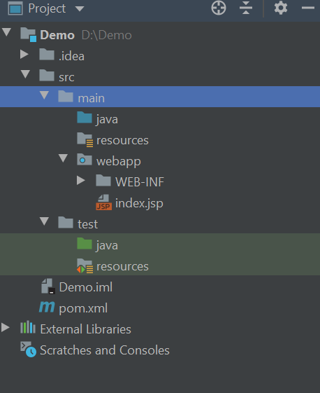
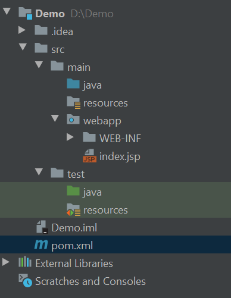
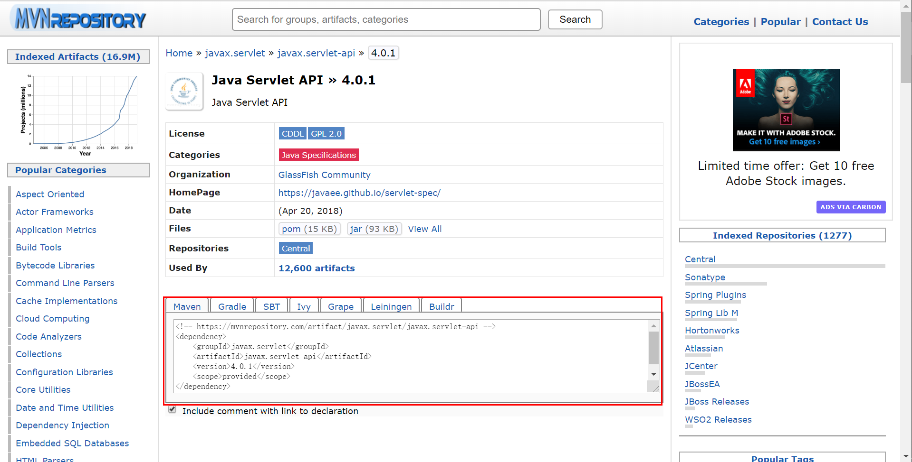
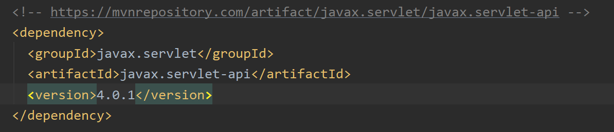
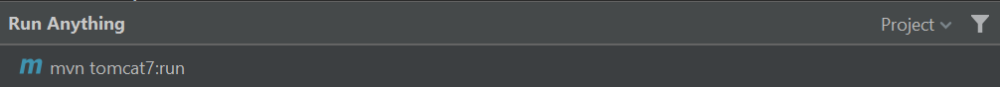
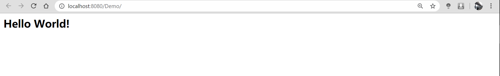

# Maven

## Category

  * [1. Cognize](#1-cognize)
    + [1.1 什么是 Maven ?](#11-----maven--)
    + [1.2 解决了什么问题 ?](#12----------)
    + [1.3 同类技术](#13-----)
    + [1.4 技术主要组成](#14-------)
    
  * [2. Quickstart](#2-quickstart)
    + [2.1 Download](#21-download)
    + [2.2 Maven 默认生命周期](#22-maven-------)
    + [2.3 Maven 标准目录结构](#23-maven-------)
    + [2.4 页面跳转 Demo](#24------demo)
    
  * [3. 总结与提高](#3------)

    

## 1. Cognize

### 1.1 什么是 Maven ?

  
 

`Maven` 是一个项目管理工具，帮助开发者更好地构造和管理 `Java` 项目

### 1.2 解决了什么问题 ?

1. `jar` 包冲突

   在创建大型项目的时候，我们都会导入各种的依赖包，需要一个个下载，导入，过程繁琐。且过多的依赖包会产生版本冲突。

2. 一次性执行单元测试

   在 Coding 的时候，我们都知道利用 `JUnit` 进行单元测试是十分快捷简便的方法。但运行实际项目时，需要的单元测试很多，如果每次都单独测试会特别麻烦

3. 快速打包

   帮助 `Web` 应用快速打包部署

### 1.3 同类技术

### 1.4 技术主要组成

1. 依赖管理

   **可复用性**

   多个项目会有相同的依赖，`Maven` 可以帮我们很好地管理。

  
 

2. 项目的一键构建

   

  
 

## 2. Quickstart

### 2.1 Download

1. 进入官网

  
 

2. 下载

  
 

3. 解压到文件夹

4. 配置，添加到环境变量 

  
 

5. 修改 `settings.xml`

   - `local repo`：本地仓库

   - `remote repo`：私服

   - `center repo`：中央仓库

   

   
  
 

   :warning: 填坑指南：

   1. **注意路径名称！！！**（这里留下一个坑，到时了解一下 `XML` 语法）

   2. 注意斜杠和反斜杠区别

   3. 不要出现中文和空格

      

      
    
  
 

   
  
 

6. 更换阿里云镜像

   [两款国内 Java 开发者必备的提速神器](https://mp.weixin.qq.com/s/S5XlfQMUjK_uPRTH3YdSYA)

   

### 2.2 Maven 默认生命周期

### 2.3 Maven 标准目录结构

  
 

- `src`：根目录

- `main`：主目录
  - `java`：核心代码目录
  -  `resources`：核心代码资源目录
  - `webapp`：网页相关

- `test`：测试目录
  - `java`：测试代码
  - `resources`：测试代码资源目录

这是 `Maven` 帮我们定义好一套统一的规范

即每个文件夹都有着特定的命名和功能，便于识别及管理。

### 2.4 页面跳转 Demo

1. 选择 `webapp` 骨架

   

  
 

  
 

2. 补全标准目录结构

   
  
 

3. 配置文件

   **依赖**

     
  
 

   - `groupId`：项目的介绍及标识

   举个例子：`org.apache.maven`，从标识清晰明了明白这是一个名为 `maven` 的项目，来自于 `apache` 的机构

   - `artifacted`：不带版本号的 `jar` 包名称

   - `version`：版本号

   - `scope`：作用域
     - `test`：只在测试中起效果
     - `provided`：只在编译中起效果 

   

   

   **常见的 `dependencies` / `plugin`：**

   - `Tomcat plugin`

   开发 Web 项目，当然少不了应用服务器 ——  `Tomcat`

   

   :warning:注意

   使用 `Tomcat 7` 时，运行项目的命令是： `mvn tomcat7:run`

   

   

   - `Servlet`

   - `JUnit` 单元测试

   

  
 

  
  
 

4. 生成项目

  
  
 

  
  
 

5. Succeeded!

  
  
 

## 3. Summary

1. 遇到不会的优先查官方文档
2. 对于 `jar` 包冲突的解决方法是设置 `<scope>` 属性