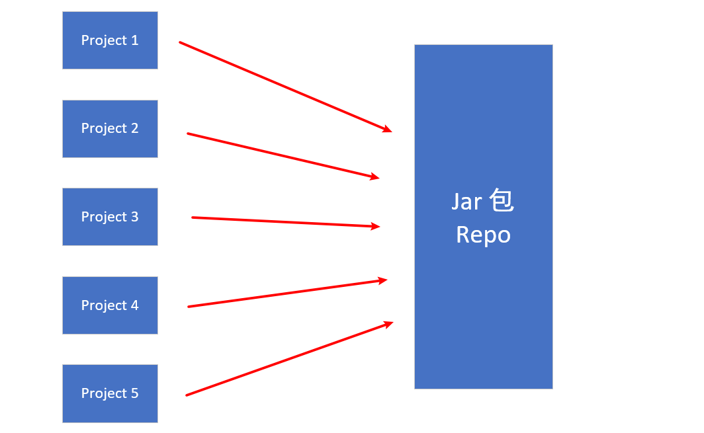
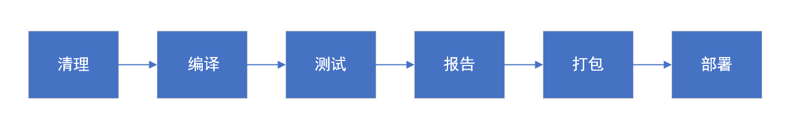
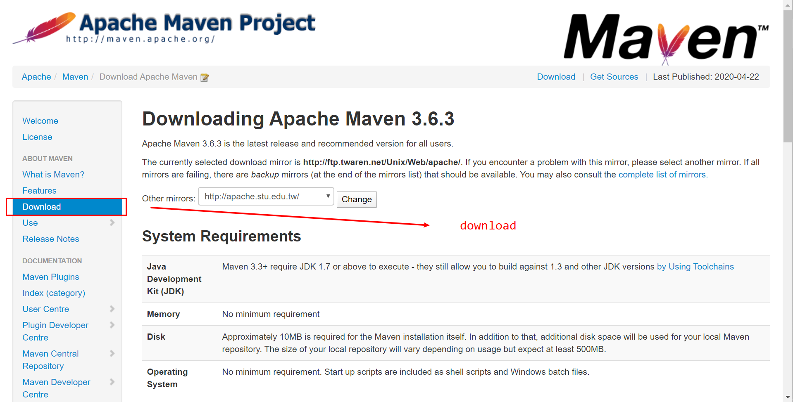
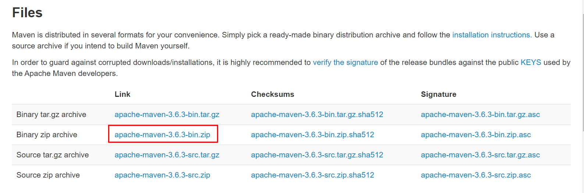
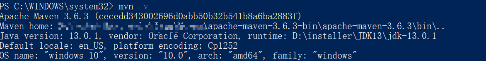
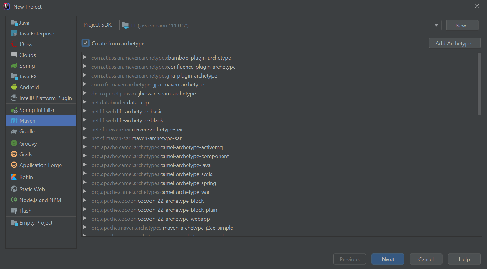
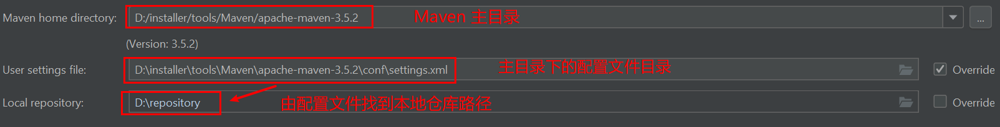

# Maven

## 1. Cognize

### 1.1 什么是 Maven ?

  
 

`Maven` 是一个项目管理工具，帮助开发者更好地构造和管理 `Java` 项目

### 1.2 解决了什么问题 ?

1. `jar` 包冲突

   在创建大型项目的时候，我们都会导入各种的依赖包，需要一个个下载，导入，过程繁琐。且过多的依赖包会产生版本冲突。

2. 一次性执行单元测试

   在 Coding 的时候，我们都知道利用 `JUnit` 进行单元测试是十分快捷简便的方法。但运行实际项目时，需要的单元测试很多，如果每次都单独测试会特别麻烦

3. 快速打包

   帮助 `Web` 应用快速打包部署

### 1.3 同类技术

### 1.4 技术主要组成

1. 依赖管理

   **可复用性**

   多个项目会有相同的依赖，`Maven` 可以帮我们很好地管理。

  
 

2. 项目的一键构建

   

  
 

### 1.5 为什么 Maven 会出现 ?

## 2. 快速入门

### 2.1 Download

1. 进入官网

  
 

2. 下载

  
 

3. 解压到文件夹

4. 配置，添加到环境变量 

  
 

5. 修改 `settings.xml`

   `local repo`：本地仓库
   
   `remote repo`：私服
   
   `center repo`：中央仓库
   
   
   
   
  
 
   
   
   :warning: 填坑指南：
   
   1. **注意路径名称！！！**（这里留下一个坑，到时了解一下 `XML` 语法）
   
   2. 注意斜杠和反斜杠区别
   
   3. 不要出现中文和空格
   
      
   
      
   
      

   
  
 

6. 更换阿里云镜像

   [两款国内 Java 开发者必备的提速神器](https://mp.weixin.qq.com/s/S5XlfQMUjK_uPRTH3YdSYA)

   

### 2.2 Maven 默认生命周期

### 2.3 Maven 标准目录结构

### 2.3 使用 IDEA 创建 Maven 骨架

1. 选择 `webapp` 骨架

   
  
 

   2. `Maven` 设置

   
  
 
   
   3. 测试
   
  
 
   

