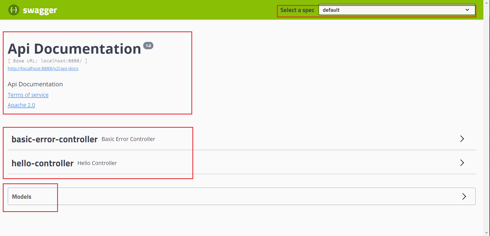

# Swagger

<div align="center">  </div><br>


## 目录

* [1.什么是 Swagger?](#1----swagger-)
* [2.为什么使用 Swagger?](#2------swagger-)
* [3.Quickstart](#3quickstart)
  + [3.1 引入依赖](#31-----)
  + [3.2 集成 SpringBoot](#32----springboot)
* [参考链接](#----)


## 1.什么是 Swagger?

`Swagger` 是一款强大的 `API` 开发工具，可以贯穿全流程，从设计到文档，从测试到开发


## 2.为什么使用 Swagger?

- `API` 文档与 `API` 定义同步更新
- 在线测试 `API` 接口


## 3.Quickstart

### 3.1 引入依赖

**pom.xml**

```xml
<dependency>
    <groupId>io.springfox</groupId>
    <artifactId>springfox-swagger2</artifactId>
    <version>2.9.2</version>
</dependency>


<dependency>
    <groupId>io.springfox</groupId>
    <artifactId>springfox-swagger-ui</artifactId>
    <version>2.9.2</version>
</dependency>
```

### 3.2 集成 SpringBoot

**SpringFoxConfig.java**

```java
@Configuration
@EnableSwagger2
public class SpringFoxConfig {

}
```

**HelloController.java**

```java
@RestController
public class HelloController {

    @GetMapping("/hello")
    public String hello() {
        return "Hello";
    }
}
```

访问

```html
http://localhost:8888/swagger-ui.html
```

:heavy_check_mark: `swagger` 搭建成功


<div align="center">  </div><br>

其中 `basic-error-controller` 就是我们常见的错误页面

<div align="center">  </div><br>


## 参考链接

[【狂神说Java】一小时掌握Swagger技术](https://www.bilibili.com/video/BV1Y441197Lw?from=search&seid=17955201807129821797)