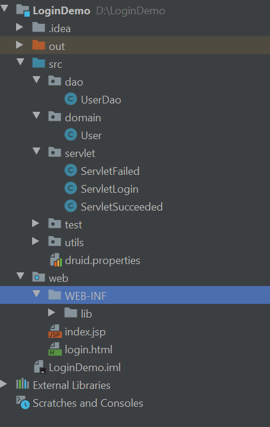

# 实战案例

## 1. 用户登录

### 1.1 项目需求

1. 用户登录页面
2. 数据库：`Spring JDBC` 封装 `JDBC Template`，采用 `Druid` 连接池技术
3. 登录成功失败分别转发两个 `Servlet`

### 1.2 实现效果

登录页面

  
 

登录成功

  
 

登录失败

  
 

### 1.3 需求分析

  
 

`view`：登录页面，前端展示

`LoginServlet`：获取参数，处理逻辑

`UserDao`：进行数据库查询，返回 `User` 或 `null` 

`SucceededServlet`：对查询成功做出响应

`FailServlet`：对查询失败做出相应

### 1.4 开发流程

1. 数据库连接池配置，环境依赖，数据库建库建表

  
 

2. `VIEW` 层：
   1. 展示页面，将参数提交给 `MODEL`

3. `DAO` 层：
   1. 从 `MODEL` 获得 `JavaBean` 查询对象进行查询，将结果返回给 `MODEL`

4. `MODEL` 层：
   1. 从 `request` 获参，封装成 `BeanUtils`，传 `DAO` 查询 
   2. 根据 `DAO` 返回的结果进行资源转发（共享域）

### 1.5 目录结构

  
 

`dao`：与数据库直接打交道

`domain`：将查询内容封装成对象（面向对象），便于获取各种属性

`servlet`：`MODEL` 层的逻辑，资源内部转发（共享域）

`test`：测试 `DAO` 层代码

`utils`：工具类

`web/WEB-INF/lib`：依赖仓库

`login.html`：`VIEW` 页面

### 1.6 总结与填坑

:warning:注意：

1. 知识输出很重要，便于消化理解以及加深印象
2. 有问题时检查 `Tomcat`配置（特别是重装 `IDEA` 后会忘了配置） 
3. 用 `Maven` 之前，项目依赖放在 `Web/WEB-INF/lib` 下，目录和名称都不能错，否则系统找不到会报 `500` 错误

