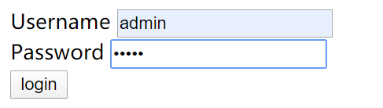
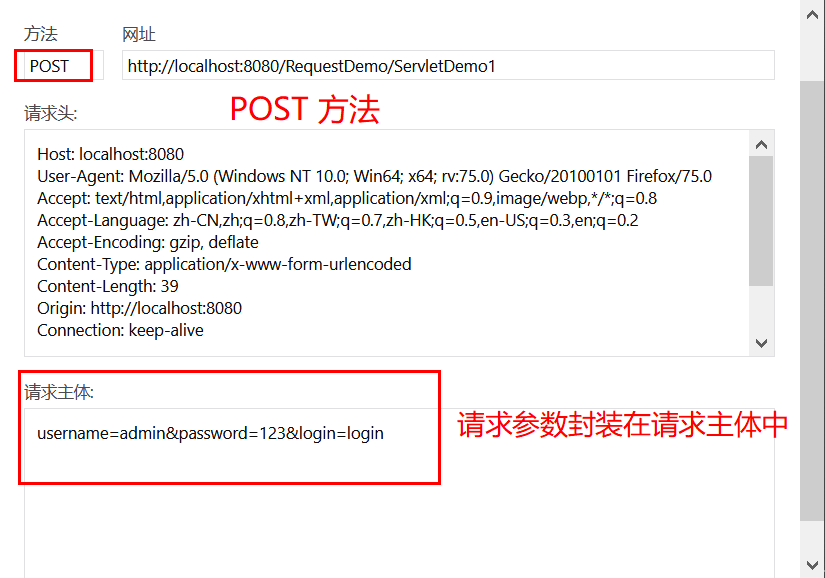
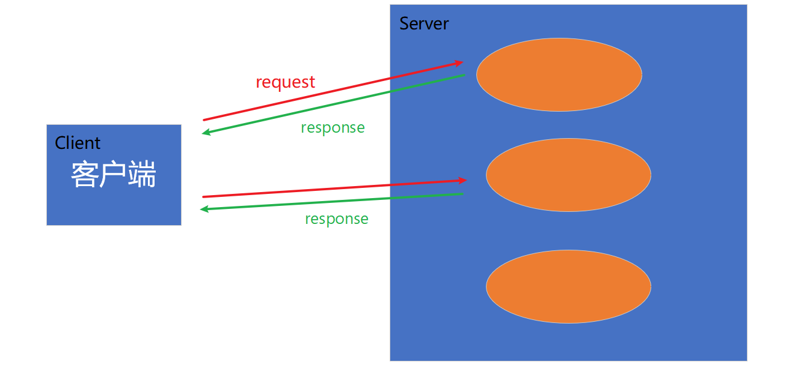
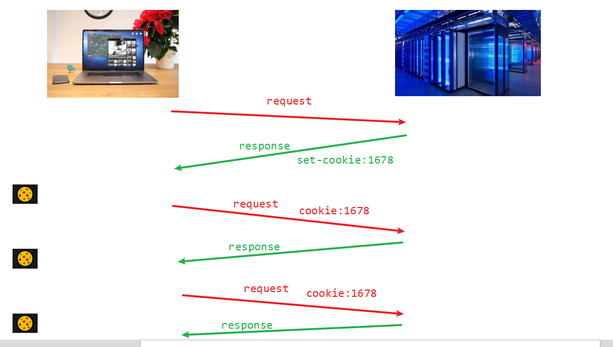
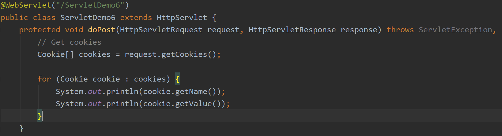
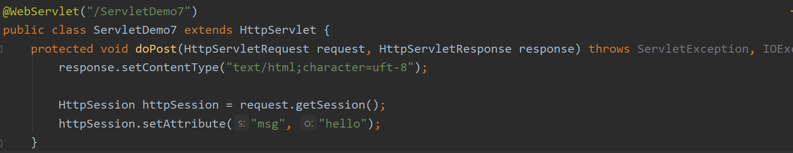

# Servlet 之 HTTP 篇

## 目录


## 1. HTTP 协议

<div align="center">  </div><br>

### 概念

**`HTTP`协议是 Web 的核心。**


`HTTP` 定义了：

1. 客户端和服务器交换报文的**结构**
2. 进行报文交换的请求方式


### 特点

1. 基于 `TCP` 的运输协议：安全可靠
2. 无状态协议：`HTTP` 服务器不保存任何关于用户请求的消息
3. 默认端口：80


## 2. HTTP 报文格式

### 2.1 Request 对象

#### 2.1.1 预备知识

我们先搞清楚一个概念：

<div align="center">  </div><br>


当你在`URL`中输入这一串的时候：

`localhost`是主机ip

`8080`是当前进程的端口号（`Tomcat`默认端口是 8080）

`/ServletDemo/`是指当前的虚拟目录（告诉别人你的项目放在哪，这样才可以访问到）


注意，此时是（默认）自动跳转到 `index.jsp`  页面的

<div align="center">  </div><br>


当你在浏览器网址栏输入：
<div align="center">  </div><br>

客户端向浏览器发送一个 `request` 请求，请求报文格式由 4 个部分组成：

1. 请求行

2. 请求头

3. 空行

4. 请求体


<div align="center">  </div><br>

#### 2.1.2 请求行

请求行包括了请求方式，重点了解的是 `GET` 和 `POST` 方法，两者的区别是前者在 `URL` 字段会带有请求对象的标识。

比如：

**GET**

先定义一个表单，指定提交方式为 `GET`：

```html
<form action="/RequestDemo/ServletDemo1" method="get">
```

> 注意：这里的 `RequestDemo/` 是虚拟路径，一般以项目名标识
>
> `ServletDemo1/` 是 Servlet 的路径

<div align="center">  </div><br>

提交表单之后，`URL` 会显示带有请求对象的标识，且请求体为空。

<div align="center">  </div><br>

<div align="center">  </div><br>


**POST**

若提交表单的方式是 `POST` 方法：

```html
<form action="/RequestDemo/ServletDemo1" method="post">
```


点击提交之后，`URL` 没有携带请求参数：


<div align="center">  </div><br>


这时，**请求体** 派上用场了，请求参数为封装在请求体中：

<div align="center">  </div><br>


#### 2.1.3 请求头


`Host` ：主机域名

`User-Agent`：你用什么浏览器？

`Accept-language` ：你讲什么语言？


```java
request.getHeader("user-agent");
```


#### 2.1.4 请求体

略。


#### 2.1.5 获取请求参数通用方式

1. 获取参数的 `value` ：

```java
request.getParameter(s);
```

2. 获取所有参数，存储在 `map` 集合中：

```java
Map<String, String[]> parameterMap = request.getParameterMap();
```

:warning: 注意

1. `key`的值是 string 类型，即参数名称
2. `value` 的值是 string 数组类型，因为一个键可能对应多个值


**解决中文乱码问题**

```java
request.setCharacterEncoding("utf-8");
```


#### 2.1.6 请求转发

一种在服务器**内部**转发资源的方式

```java
request.getRequestDispatcher("path").forward(request, response);
```

**特点**

1. 资源内部转发方式，浏览器 `URL` 不发生变化（不能转发到外部，压根找不到）
2. `path` 是指资源内部的路径
3. 一次请求


#### 2.1.7 共享数据


### 2.2 Response 对象

服务器端发给客户端的消息


#### 2.2.1 预备知识

**数据格式**

1. 响应行
2. 响应头
3. 空行
4. 响应体


#### 2.2.2 响应行

在客户端发送请求消息之后，服务器端会告诉客户端这次请求 / 通信的效果如何，就有以下状态码。

**状态码**

`200`：成功，我们最喜欢看到的

`302`：重定向。对于客户端的请求，不在此（请求的）路径上，服务器端告诉客户端：你应该去找另一个路径

`404`：找不到路径。要请求的路径不在服务器资源里

`405`：请求方式没有对应的响应方法

`500`：服务器内部出现异常


这里需要讲一下`重定向`，先举个例子：


<div align="center">  </div><br>

举一个例子，假设你要想吃牛排，你去到一家餐馆，

Q：请问有牛排吗？（请求）

A：没有，牛排馆在隔壁（重定向）

Q：请问是牛排馆吗？（再次请求）

A：是的，请进（响应）


```java
response.sendRedirect("path");
```


:warning: 注意 


`sendRedirect` 与 `forward` 的区别？

1. 前者是两次请求，后者是一次

2. 前者可以重定向到服务器资源外的网站（Google，Baidu......），后者只能在服务器资源内进行转发

3. 前者不能共享数据（因为不是单单在服务器内部），后者可以

   


#### 2.2.3 响应头

当我们输入百度的网址：
<div align="center">  </div><br>


<div align="center">  </div><br>

`Content-type` ：响应体的格式以及编码


这个相当于：


服务器：

” Hey 浏览器！

我发送的响应是`text/html`格式的，你要用浏览器解析引擎才能正确显示内容，

以及我的编码是`utf-8`的。“


:warning:注意

无论显示的是中文还是英文，强烈建议在首部写上这一行代码，以避免乱码的折磨。

```java
response.setContentType("text/html;charset=utf-8");
```


#### 2.2.4 响应体

略。


### 2.3 ServletContext 对象

#### 2.3.1 什么是 ServletContext ?

`ServletContext` 对象代表整个 `Web` 应用，可以和 `web container` 来进行通信。

比如我们用的 `Tomcat` 就属于 `web container` 的一种。


**获取方法**

```java
ServletContext servletContext = this.getServletContext();
```


<div align="center">  </div><br>


#### 2.3.2 为什么要用 ServletContext 对象 ?

1. 获取 `MIME` 对象

2. 域对象

3. 获取文件的真实路径

   


## 3. 会话技术

### 3.1 概念

**什么是会话？**

<div align="center">  </div><br>

先举个例子：


A：你好！

B：你好！

A：你吃饭了吗？

B：我吃饭了！

A：你吃饱了吗？

B：不想跟你聊天了，拜拜


从客户端第一次请求，到服务器端最后一次响应，整个过程称为一次会话。


之前我们提过，`HTTP` 协议是**无状态的**，也就是服务器不保存任何关于用户的数据。


但是在生活中网购过程中，我们每次浏览商品，点击"添加购物车"，都是客户端给浏览器端发送一次请求，那电商网站如何保存我们购物车里面的内容呢？


<div align="center">  </div><br>

这就用到了**会话技术**。


### 3.2 Cookie


**一个 Web 网站希望“识别”用户，即希望把内容（用户的动作行为）与用户联系起来。**


为此，HTTP 协议使用了 ​​ Cookie。


<div align="center">  </div><br>

假设你做在电脑前，访问某著名电商网站


访问之后，该网站会产生一个唯一识别码，并以此作为索引在其后端数据库产生一个表项，并在 `response` 消息中，加入 `set-cookie`头，记录消息返回给客户端，里面会保存访问的主机名称以及唯一标识。


客户端收到来自服务器的响应之后，会将 `cookie` 存入它管理的特定的 `cookie` 文件中


之后每当该客户端访问此电商网站，在 `request` 消息体中都会带有 `cookie: xxxx` 的消息，便于服务器端跟踪该用户的行为。（根据用户每一次的点击流，创作用户画像，来为其推荐商品，带来巨大的商业价值），此外，也大大方便了用户，保存了用户名，手机号码，家庭住址等信息，而不用每一次访问都要输入了。


在 Java 中，有一个 `Cookie` 类


<div align="center">  </div><br>

下面我们就尝试一个 Demo：

1. 创建一个 `Cookie` 对象，将其加到 `response` 中

<div align="center">  </div><br>


2. 在另一个资源发送 `request` 过程中，获取它

<div align="center">  </div><br>


3. Succeeded!

<div align="center">  </div><br>

:warning: 注意

在 Tomcat 8.5 以上版本，对 `Cookie` 的 `value` 作出了要求，会不支持一些字符比如空格


### 3.3 Session

#### 3.3.1 什么是 Session ?


#### 3.3.2 Session 有什么用 ?


#### 3.3.3 快速入门


<div align="center">  </div><br>


<div align="center">  </div><br>


#### 3.3.4 Session 与 Cookie 的区别

1. `Session` 存储在服务器，`Cookie` 存储在客户端
2. `Session` 相对安全
3. `Session` 没有数据大小限制