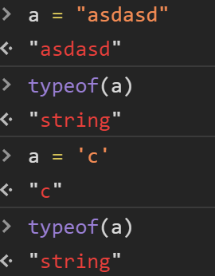
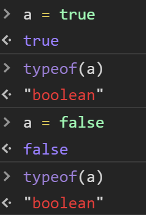
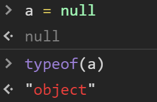
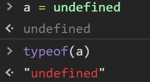
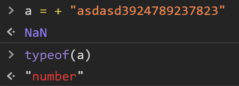
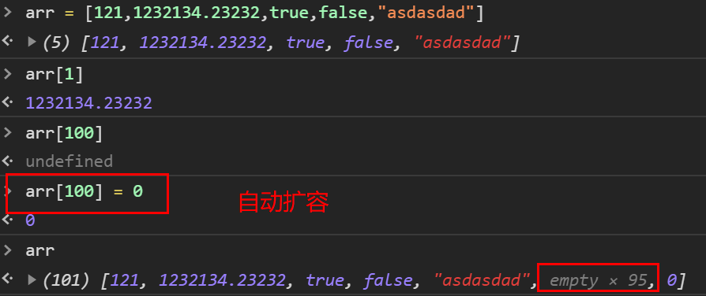
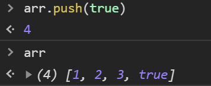
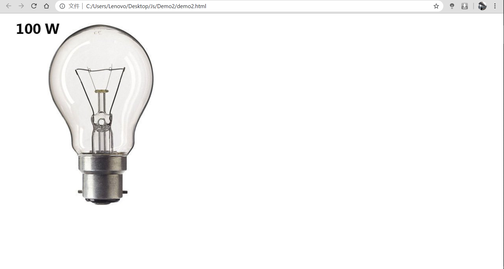
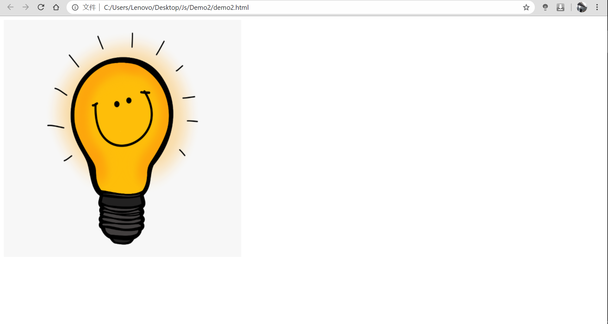

# JavaScript


<div align="center">  </div><br>


## Category

  * [1. What is JavaScript ?](#1-what-is-javascript--)
  * [2. Why we use JavaScript ?](#2-why-we-use-javascript--)
  * [3. JavaScript Quickstart](#3-javascript-quickstart)
    + [3.1 Data type](#31-data-type)
    + [3.2 Operator](#32-operator)
      - [3.2.1 `+`](#321----)
      - [3.2.2 `==` and `===`](#322------and------)
    + [3.3 Object](#33-object)
      - [3.3.1 Function](#331-function)
      - [3.3.2 Array](#332-array)
      - [3.3.3 Regex](#333-regex)
  * [4. JavaScript Advanced](#4-javascript-advanced)
    + [4.1 DOM](#41-dom)
      - [4.1.1 What is DOM ?](#411-what-is-dom--)
      - [4.1.2 Why we use DOM ?](#412-why-we-use-dom--)
      - [4.1.3 DOM Quickstart](#413-dom-quickstart)
    + [4.2 BOM](#42-bom)
    + [4.3 Event](#43-event)
      - [4.3.1 What is Event ?](#431-what-is-event--)
      - [4.3.2 Quickstart](#432-quickstart)


## 1. What is JavaScript ?

**`JavaScript`是一门客户端脚本语言**

特点：

1. 运行在客户端（每个浏览器都有 JS 解析引擎）
2. 脚本语言（不需要编译，直接被浏览器引擎解析）


## 2. Why we use JavaScript ?

在前端三件器中：

`HTML`：显示页面（最基础的页面）

`CSS`：美观页面

`JavaScript`：增强与用户之间的交互，做动态内容


## 3. JavaScript Quickstart

### 3.1 Data type

1. `number`
2. `string`
3. `boolean`
4. `null`
5. `undefined`


:warning:注意

Js 是一本弱类型语言

声明变量用 `var` 关键字

```javascript
var a
```
<div align="center">  </div><br>

**number**

1. 整数
2. 小数
3. NaN

<div align="center">  </div><br>

**string**

1. 字符

2. 字符串

   

<div align="center">  </div><br>

**boolean**

1. true
2. false

<div align="center">  </div><br>

**null**

<div align="center">  </div><br>

Js 的一个bug :smile:


**undefined**

<div align="center">  </div><br>

### 3.2 Operator

#### 3.2.1 `+` 

在 Js 中，`+` 不仅仅是加法运算符

<div align="center">  </div><br>

还可以用来：**类型转换**

1. `string` 类型

   - 纯数字->  转 `字面值`

     <div align="center">  </div><br>

   - 非纯数字：转 `NaN`
   
     <div align="center">  </div><br>


2. `boolean` 类型

   - `true`：1

   - `false`：0

<div align="center">  </div><br>


#### 3.2.2 `==` and `===`

在 Js 中，`==` 号用来判断两个变量的值是否相等

- 若两个变量是同一类型：直接判断

- 若不同类型：转成同一类型再判断

  


<div align="center">  </div><br>


`===`：判断两个变量的类型和值是否完全相同


<div align="center">  </div><br>


### 3.3 Object

1. `Function` 对象
2. `Array` 对象


#### 3.3.1 Function 


```javascript

```

:warning:注意

1. 形参类型可省略（弱类型），返回参数可省略
2. 方法调用只与函数名称有关，与参数列表无关
3. `function.length` 返回函数形参的个数
4. 


#### 3.3.2 Array 


```javascript
var arr = new Array()  // 创建空数组
var arr = new Array(5)  // 长度为 5 的数组，默认为空
var arr = [1,2,3]  // 直接赋值
```


<div align="center">  </div><br>


:warning:注意

1. 列表中元素类型可不统一
2. 数组长度可变（可自动扩容，不存在 `index` 溢出）


**常用方法**

**join()：拼接字符串**

<div align="center">  </div><br>

**push()：动态增加元素**

<div align="center">  </div><br>

#### 3.3.3 Regex 

**正则表达式**

1. 单个字符 `[]`

   `\d`：[0-9]（英文：digit）

   `\w`：[a-zA-Z0-9_] （英文：word）

2. 量词符号

   `?`：出现 0 次或 1 次

   `*`：出现 0 次或多次

   `+`：出现 1 次或多次

   `{m,n}`：出现 `m <= x <= n` 次

3. 开始结束

   `^`：开始

   `$`：结束


**正则对象**

1. 创建

```javascript
var reg = /regular expression/
```

 

2. 用法

   **判断一个字符串是否符合定义的 `reg` 规则**

   ```javascript
   var reg = /^\w{1,9}$/
   reg.test()  // 返回 true / false
   ```

   :warning:注意
   
   `\w` 为反斜杠


## 4. JavaScript Advanced

### 4.1 DOM

#### 4.1.1 What is DOM ? 


<div align="center">  </div><br>

#### 4.1.2 Why we use DOM ?

`DOM` 通过特定 `id` 值来获取`html` 元素，通过调用方法来修改其属性


#### 4.1.3 DOM Quickstart

1. 获取 `html` 标签对象

   ```javascript
   document.getElementById("id")  // 获取 html tag 对象
   ```

2. 查 `API` 修改属性

   

```html
<body>
    
    <p id="text"> Hello World! </p>


    <script>
        var laptop = document.getElementById("laptop")
        alert("I'm gonna change!")
        laptop.src = "../img/mbp.jpg"

        var text = document.getElementById("text")
        text.innerHTML = "Succeeded!"
    </script>
</body>

```

<div align="center">  </div><br>


<div align="center">  </div><br>


### 4.2 BOM


### 4.3 Event

#### 4.3.1 What is Event ?


#### 4.3.2 Quickstart

```html
<body>
    
</body>
```


<div align="center">  </div><br>

<div align="center">  </div><br>