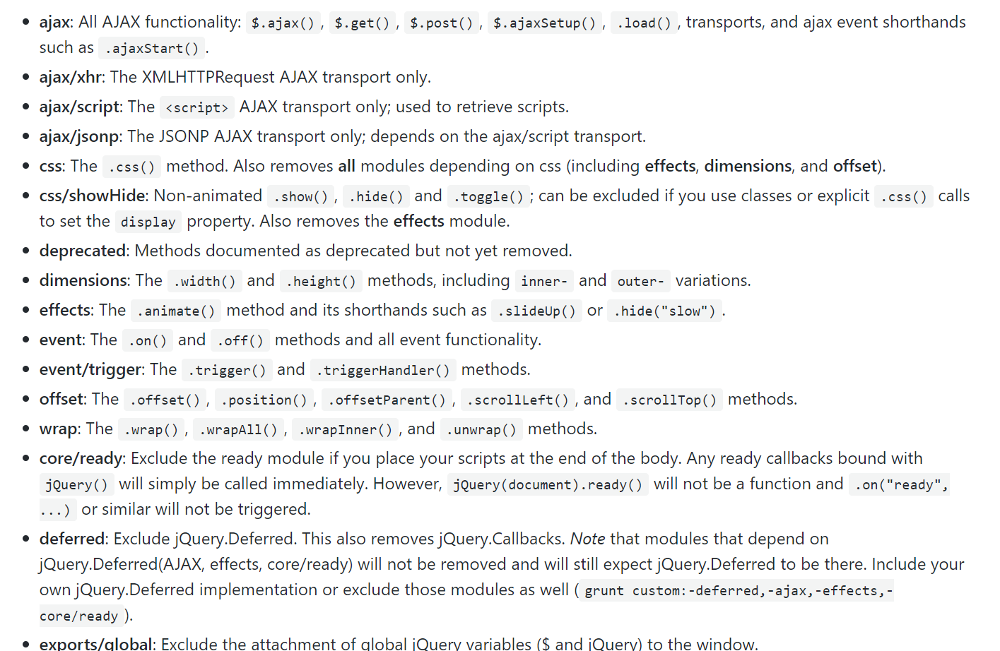
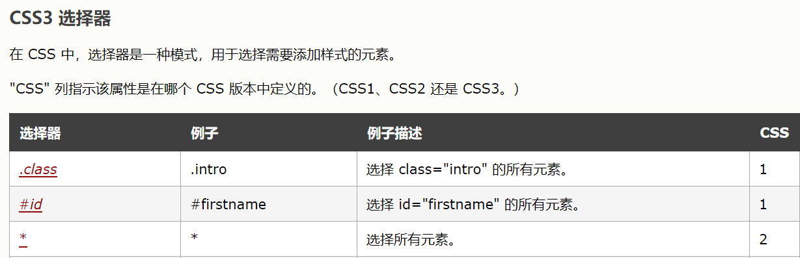
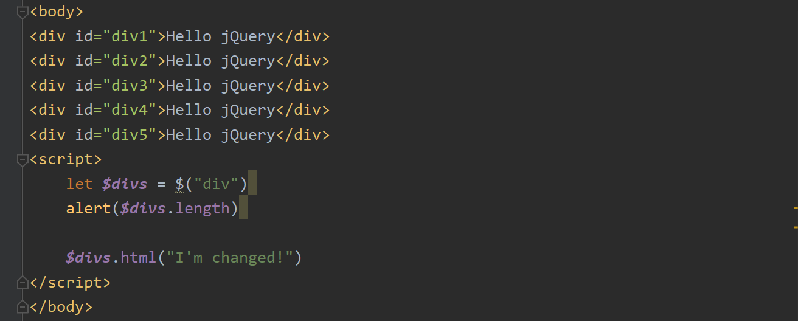
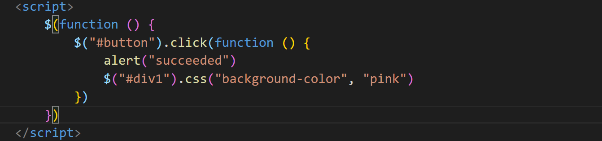
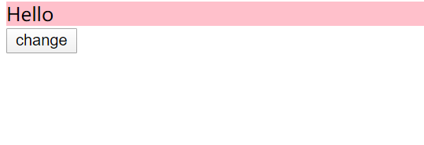

# jQuery

## Mind map

  
 

## Category

* [1. What is jQuery](#1-what-is-jquery)
* [2. Why we use jQuery](#2-why-we-use-jquery)
* [3. Quickstart](#3-quickstart)
  + [3.1 预备知识](#31-----)
  + [3.2  jQuery 对象 与 Js 对象](#32--jquery------js---)

## 1. What is jQuery

  
 

`jQuery` 是一个 `Js` 框架，对其原生代码进行封装起到简化的作用

## 2. Why we use jQuery

1. 为将来学习 `Ajax` 做铺垫

  
 

## 3. Quickstart

### 3.1 预备知识

什么是 `Js` 框架 ?

举个例子，这是我们原先写的 `Js` 原生代码，

  
 

  
 

这段简单的 `JavaScript` 完成了三个功能：

1. 获取元素
2. 修改 `innerHTML`
3. 弹窗

我们将其封装成 `$()` 函数

  
 

  
 

可以发现，经过封装之后，这样调用十分方便

`jQuery` 框架也是这个原理

框架就是将原生代码抽取出来，让开发者更专注于开发，达到简化的目的。

:warning:注意

单独的 `Js` 文件不需要写 `` 标签！

  
 

### 3.2  jQuery 对象 与 Js 对象

区别：

1. `jQuery` 对象更强大，方便
2. 方法不通用
3. `Js` 转 `jQuery`：`$(Js对象)`

1. 通过 `$` 获取所有 `div` 标签
2. 调用 `html()` 方法进行重新赋值

**效果**

  
 

  
 

### 3.3 基础知识

1. 事件绑定：对动作进行响应（如：点击鼠标）
2. 入口函数：资源加载完成后进行函数调用
3. 样式控制：对 `DOM` 对象进行样式控制

  
 

  
 

  
 

  
 

### 3.4 选择器

