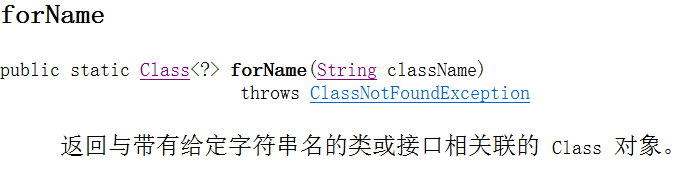
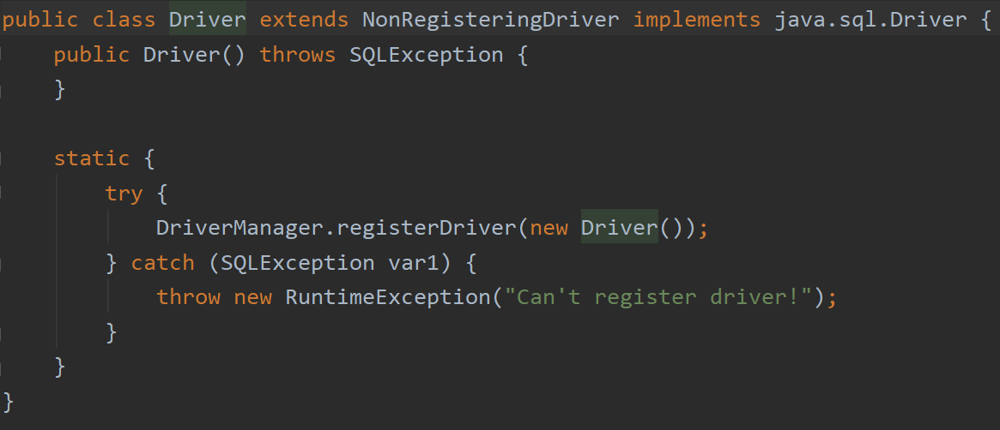

# JDBC

## Category

* [Definition](#definition)
* [Process](#process)
  + [出门前的准备 —— 导入`jar`包](#-------------jar--)
  + [初来乍到 —— 注册](#----------)
  + [搭桥 —— 获取 `Connection`对象](#----------connection---)
  + [开工大吉 —— 获取 `Statement`对象](#------------statement---)
  + [打天下 —— 执行 `SQL`操作](#-----------sql---)
  + [收工 —— 释放资源](#----------)

## Definition

**Java Database Connectivity**

通俗来讲，就是用 Java 语言来操作各种关系型数据库。

Java 为我们提供了 几种非常常用的 接口，然后由各个（关系型数据库）公司来编写实现类，实现上面的接口，“封装“成一个 `jar`包，也就是我们说的`驱动`。


## Process

### 出门前的准备 —— 导入`jar`包

并且 `Add as library`


**注意**

导入 `jar`包而不是导入文件夹！

### 初来乍到 —— 注册

```java
Class.forName("com.mysql.jdbc.Driver");
```

这是什么意思呢？



这个是返回 `com.mysql.jdbc.Driver`这个类的 `Class`对象。

那这个对象里面有什么呢？

我们查看一下源码



这个 `Driver`类里面有一个静态方法，目的是注册驱动。

只是我们简化了这种写法。


### 搭桥 —— 获取 `Connection`对象

```java
Connection connection = DriverManager.getConnection(url, username, password);
```

这里的 `url`是指数据库的路径

` jdbc:mysql//localhost:3306/database`

其中 `database`为你的数据库名称。

获取对象之后，我们程序已经与数据库建立好连接了，接下来就要干正事了。


### 开工大吉 —— 获取 `Statement`对象

开工了，要执行我们`CRUD`的操作了，这时候需要获取执行我们 SQL 语句的 `Statement`对象。

```java
Statement statement = connection.createStatement();
```

接着我们要定义一个字符串，写符合我们需求的 `SQL` 语句。

```java
String s = "";
```


### 打天下 —— 执行 `SQL`操作

```java
int count = statement.executeUpdate(s);
```

显然右边代表执行`SQL`语句，

左边的 `count`用来记录所影响的行数。

或者：

```java
ResultSet resultSet = statement.executeQuery();
```

将查询的对象放到结果集里面。


### 收工 —— 释放资源

最后，我们需依次关闭 `statement` 和 `connection`

```java
statement.close();
connection.close();
```


