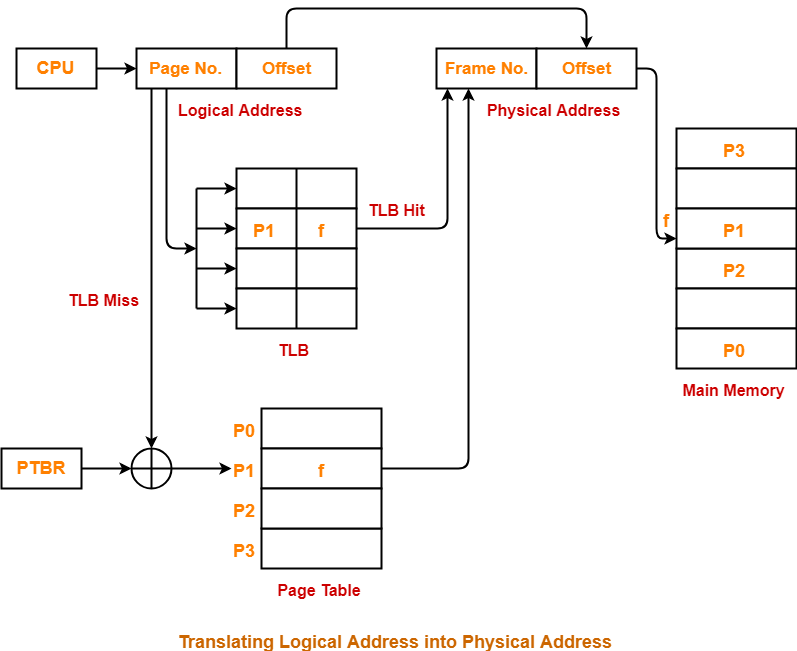
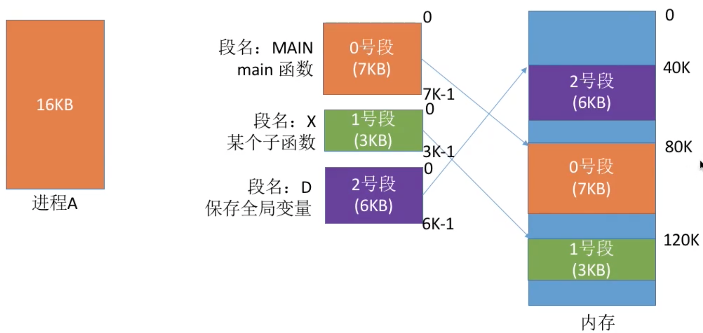

# Memory Management

Table of Contents
-----------------

* [1. 空间分配与回收](#1-空间分配与回收)
   * [1.1 分页存储](#11-分页存储)
      * [1.1.1 基于快表的地址变换过程](#111-基于快表的地址变换过程)
   * [1.2 分段存储](#12-分段存储)
* [2. 虚拟内存技术（空间扩充）](#2-虚拟内存技术空间扩充)
   * [2.1 虚拟内存](#21-虚拟内存)
   * [2.2 缺页中断](#22-缺页中断)
   * [2.3 页面置换算法](#23-页面置换算法)
      * [2.3.1 OPT](#231-opt)
      * [2.3.2 FIFO](#232-fifo)
      * [2.3.3 LRU](#233-lru)
      * [2.3.4 Clock](#234-clock)

## 1. 空间分配与回收

### 1.1 分页存储

  
 

**Example**

若页面大小 L 为 1K 字节，页号 2 对应的内存块号 b = 8，请将逻辑地址 A = 2500 转换为物理地址 E（E = 8644）

**TLB（快表）**

快表（TLB，联想寄存器），是一种访问速度比内存快很多的高速缓冲存储器，用来存放当前访问的若干页表项，以加速地址变换的过程

#### 1.1.1 基于快表的地址变换过程

1. 计算 `page No.` 和 `offset`
2. **检查 page No. 合法性**
3. 查快表，若命中，直接跳到第 5 步
4. 查 `page table`，找到页面存放的内存块号
5. 根据内存块号和 `offset` 得到物理地址
6. 访问目标内存单元

  
 

### 1.2 分段存储

> 按照进程的自身逻辑分成若干个段

  
 

## 2. 虚拟内存技术（空间扩充）

### 2.1 虚拟内存

> 虚拟内存是让有限的物理内存扩充成更大的逻辑内存

每个进程都有自己的地址空间，即逻辑内存。这个地址空间被分为许多块，每一块称作一页。这些页被映射到物理内存中，

**但是：**

- 不需要映射到连续的内存中
- 不需要所有页都在内存中

综上所述，虚拟内存允许进程不用将地址空间的每一页都映射到物理内存中，即一个进程不用全部掉入内存就可以运行，这让有限的内存运行大程序成为可能

### 2.2 缺页中断 

> 若页面不在内存时，便产生缺页中断，交给操作系统缺页中断处理程序来处理

此时缺页的进程阻塞，放入阻塞队列，调页完成后再将其唤醒，放回就绪队列

### 2.3 页面置换算法

#### 2.3.1 OPT

> 以后永远不使用 / 最长时间内不被使用

**Example**

假设系统为某进程分配了 3 个内存块，并会依次访问这些页面：

7 0 1 2 0 3 0 4 2 3 0 3 2 1 2 0 1 7 0 

| 访问页面 | 7    | 0    | 1    | 2    | 0    | 3    | 0    | 4    | 2    | 3    | 0    | 3    | 2    | 1    | 2    | 0    | 1    | 7    | 0    |
| -------- | ---- | ---- | ---- | ---- | ---- | ---- | ---- | ---- | ---- | ---- | ---- | ---- | ---- | ---- | ---- | ---- | ---- | ---- | ---- |
| 内存块 1 | 7    | 7    | 7    | 2    |      | 2    |      | 2    |      |      | 2    |      |      | 2    |      |      |      | 7    |      |
| 内存块 2 |      | 0    | 0    | 0    |      | 0    |      | 4    |      |      | 0    |      |      | 0    |      |      |      | 0    |      |
| 内存块 3 |      |      | 1    | 1    |      | 3    |      | 3    |      |      | 3    |      |      | 1    |      |      |      | 1    |      |
| 是否缺页 | √    | √    | √    | √    |      | √    |      | √    |      |      | √    |      |      | √    |      |      |      | √    |      |

**缺点**

只有当进程运行时才知道下一个将访问的页面（**无法预判程序的执行流程**），故该算法实际不可行

#### 2.3.2 FIFO

> 每次淘汰的页面是最早进入内存的页面

**Example**

假设系统为某进程分配了 3 个内存块，并会依次访问这些页面：

3 2 1 0 3 2 4 3 2 1 0 4

| 访问页面 | 3    | 2    | 1    | 0    | 3    | 2    | 4    | 3    | 2    | 1    | 0    | 4    |
| -------- | ---- | ---- | ---- | ---- | ---- | ---- | ---- | ---- | ---- | ---- | ---- | ---- |
| 内存块 1 | 3    | 3    | 3    | 0    | 0    | 0    | 4    |      |      | 4    | 4    |      |
| 内存块 2 |      | 2    | 2    | 2    | 3    | 3    | 3    |      |      | 1    | 1    |      |
| 内存块 3 |      |      | 1    | 1    | 1    | 2    | 2    |      |      | 2    | 0    |      |
| 是否缺页 | √    | √    | √    | √    | √    | √    | √    |      |      | √    | √    |      |

**缺点**

与算法实际运行的规律不一致，算法性能差

#### 2.3.3 LRU

> Least Recently Used

**Example**

假设系统为某进程分配了 4 个内存块，并会依次访问这些页面：

1 8 1 7 8 2 7 2 1 8 3 8 2 1 3 1 7 1 3 

| 访问页面 | 1    | 8    | 1    | 7    | 8    | 2    | 7    | 2    | 1    | 8    | 3    | 8    | 2    | 1    | 3    | 1    | 7    | 1    | 3    |
| -------- | ---- | ---- | ---- | ---- | ---- | ---- | ---- | ---- | ---- | ---- | ---- | ---- | ---- | ---- | ---- | ---- | ---- | ---- | ---- |
| 内存块 1 | 1    | 1    |      | 1    |      | 1    |      |      |      |      | 1    |      |      |      |      |      | 1    |      |      |
| 内存块 2 |      | 8    |      | 8    |      | 8    |      |      |      |      | 8    |      |      |      |      |      | 7    |      |      |
| 内存块 3 |      |      |      | 7    |      | 7    |      |      |      |      | 3    |      |      |      |      |      | 3    |      |      |
| 内存块 4 |      |      |      |      |      | 2    |      |      |      |      | 2    |      |      |      |      |      | 2    |      |      |
| 是否缺页 | √    | √    |      | √    |      | √    |      |      |      |      | √    |      |      |      |      |      | √    |      |      |

**缺点**

性能好，但实现开销大（需要硬件支持）

#### 2.3.4 Clock

> FIFO 算法的改进版本，给每个页面设置一个访问位，并将访问过的页面链接成循环队列

**Example**

- 当某页被访问时，置 R 为 1
- 当需要淘汰页面时：
  - 若 R 为 0，将其换出
  - 若 R 为 1，将其置为 0

  
 

