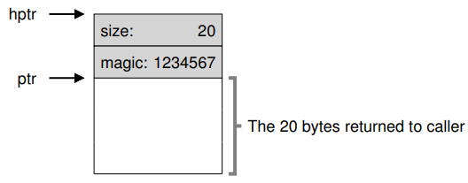
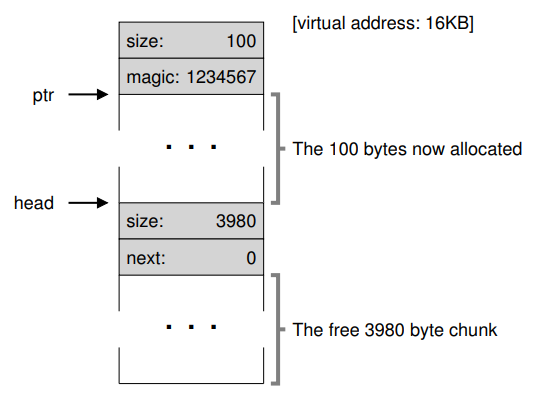
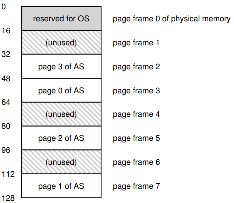
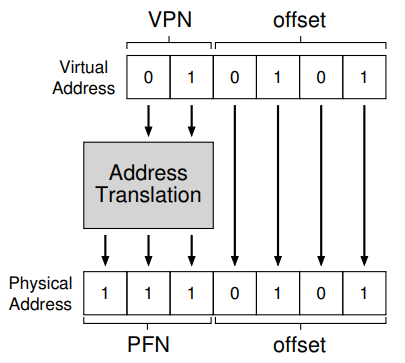
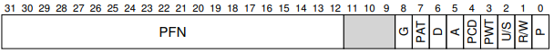
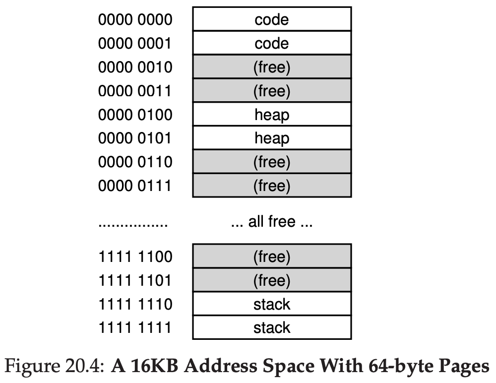
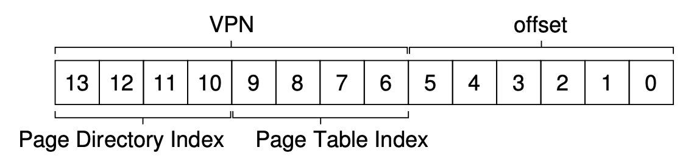
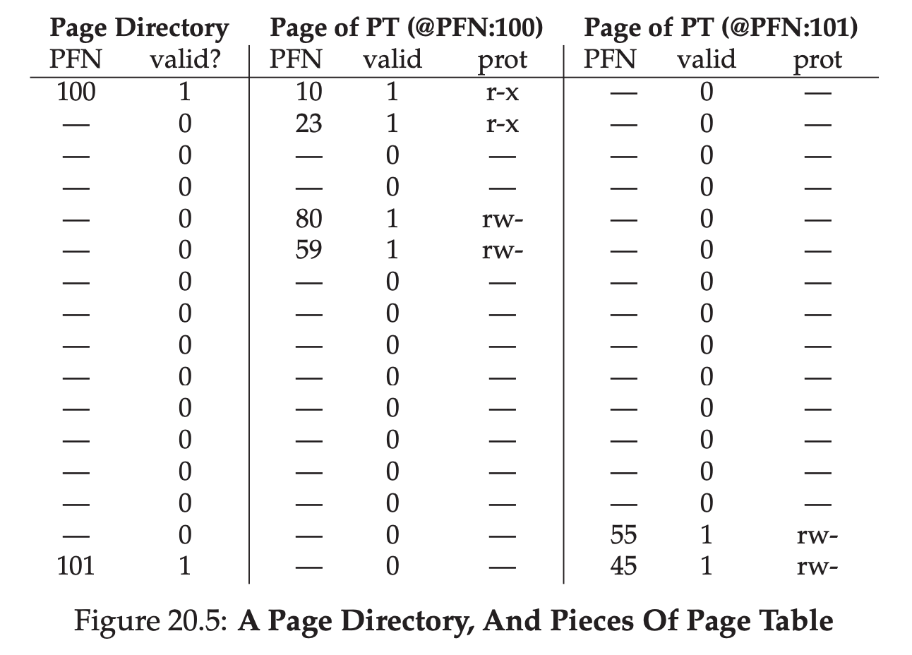

# Memory Management

Table of Contents
-----------------

* [1. Overview](#1-overview)
* [2. Base and Bound](#2-base-and-bound)
* [3. Segmentation](#3-segmentation)
* [4. Free-space Management](#4-free-space-management)
   * [4.1 Mechanism](#41-mechanism)
      * [4.1.1 Splitting &amp; merging](#411-splitting--merging)
      * [4.1.2 Tracking](#412-tracking)
* [5. Paging](#5-paging)
   * [5.1 Page](#51-page)
   * [5.2 Page frame](#52-page-frame)
   * [5.3 Page table](#53-page-table)
      * [5.3.1 Linear structure](#531-linear-structure)
      * [5.3.2 Tree structure](#532-tree-structure)
   * [5.4 TLB](#54-tlb)
      * [5.4.1 A memory trace](#541-a-memory-trace)
      * [5.4.2 Cache](#542-cache)
   * [5.5 Swapping](#55-swapping)
      * [5.5.1 Swap space](#551-swap-space)
      * [5.5.2 Clock algorithm](#552-clock-algorithm)


## 1. Overview

<div align="center">  </div><br>

## 2. Base and Bound

<div align="center">  </div><br>

**Example**

physical address = virtual address (offset) + base

| virtual address | physical address     |
| --------------- | -------------------- |
| 0               | 16KB                 |
| 1KB             | 17KB                 |
| 3000            | 19384                |
| 4400            | error (out of bound) |

**Internal Fragmentation**

> allocated but not in use

<div align="center">  </div><br>


<div align="center">  </div><br>


## 3. Segmentation

**Example**

<div align="center">  </div><br>

<div align="center">  </div><br>

**段寄存器**

| segment | base address | size |是否反向增长|
| ------- | ------------ | ---- |----|
| code    | 32KB         | 2KB  |1|
| heap    | 34KB         | 2KB  |1|
| stack   | 28KB         | 2KB  |0|


**code**

virtual address: 100 -> offset: 100

physical address: 32868


**heap**

virtual address: 4200 -> offset: 104

physical address: 34920


**stack**

virtual address: 15KB -> offset: 1KB

physical address: 27KB


**External Fragmentation**

<div align="center">  </div><br>


## 4. Free-space Management

**FreeSpaceManagement.c**

```c
// Allocates the requested memory and returns a pointer to it
void *malloc(size_t size)


// Deallocates the memory previously allocated by a call to calloc/malloc/realloc
void free(void *ptr)
```

### 4.1 Mechanism

#### 4.1.1 Splitting & merging

<div align="center">  </div><br>

free list

<div align="center">  </div><br>

`malloc(1)`

<div align="center">  </div><br>

`free(10)`（10 is a pointer）

<div align="center">  </div><br>

merging

<div align="center">  </div><br>


#### 4.1.2 Tracking

**header**

```c
typedef struct header_t {
  int size;
  int magic;
} header_t;
```

<div align="center">  </div><br>

**free**

```c
void free(void *ptr) {
  header_t *hptr = (void *)ptr - sizeof(header_t);
}
```

<div align="center">  </div><br>

free: header + space allocated to users


**Example**

memory: 4KB (4096 B)

header: 8 B -> rest: 4088 B

<div align="center">  </div><br>


request: 100 B

<div align="center">  </div><br>


## 5. Paging

### 5.1 Page


<div align="center">  </div><br>

### 5.2 Page frame

<div align="center">  </div><br>

### 5.3 Page table

#### 5.3.1 Linear structure

**Example**

process: 64 B

page: 16 B

<div align="center">  </div><br>

VPN: virtual page number

<div align="center">  </div><br>

<div align="center">  </div><br>

PFN: page frame number

<div align="center">  </div><br>

**PTE: page table entry**

<div align="center">  </div><br>


#### 5.3.2 Tree structure

**multi-level page table**

<div align="center">  </div><br>

<div align="center">  </div><br>

**Example 1**

virtual address: 16 KB

page: 64 B


**256 pages / keys**

<div align="center">  </div><br>

PTE: 4 B -> page table: 256 x 4 = 1 KB

<div align="center">  </div><br>

then, **chop up the page table into page-sized unit**

so, page directory has 16 units, each unit has 16 PTEs


<div align="center">  </div><br> 


<div align="center">  </div><br>

instead of allocating the full *sixteen* pages for a linear page table,

we allocate only *three*: one for the page directory, and two for the chunks of the page table that have valid mappings

<div align="center">  </div><br>


Q: If the virtual address is 11 1111 1000 0000

A: PFN: 55, offset: 00 0000


**Example 2**

Consider a virtual memory system with physical memory of 8GB, a page size of 8KB and 46 bit virtual address. *Assume every page table exactly fits into a single page*. If PTE size is 4B then how many levels of page tables would be required?


**Explained**

keys: 2<sup>33</sup>

linear page table size: 2<sup>35</sup> B > 2<sup>13</sup> B, continue

one-level page directory: 2<sup>22</sup> units, size: 2<sup>24</sup> B > 2<sup>13</sup> B, continue

two-level page directory: 2<sup>11</sup> units, size: 2<sup>13</sup> B = 2<sup>13</sup> B, done

so, 3 levels are required

<div align="center">  </div><br>


### 5.4 TLB

#### 5.4.1 A memory trace

**Example**

```c
int arr[1000];
// do something
for (int i = 0; i < 1000; i++) {
  arr[i] = 0;
}
```

**assembly code**

<div align="center">  </div><br>

**virtual space: 64 KB**

page: 1 KB

code: VPN 1

arr: VPN 39 - 42


**physical space**

page table: 1 KB


**memory access**

前 5 次循环迭代的过程（假设 page table 在物理内存中）


<div align="center">  </div><br>


#### 5.4.2 Cache 

**Example**

virtual address: 256 B

page: 16 B

int a[10];

**ExampleOfTLB.c**

```c
int sum = 0;
for (int i = 0; i < 10; i++) {
  sum += a[i];
}
```

**result**

```
miss hit hit miss hit hit hit miss hit hit
```


<div align="center">  </div><br>


### 5.5 Swapping

#### 5.5.1 Swap space

<div align="center">  </div><br>

**What happens when a program fetches data from memory? (TLB is missed)**

Three import cases:

1. valid, present
2. valid, not present
3. not valid

#### 5.5.2 Clock algorithm

> Approximating LRU

<div align="center">  </div><br>

