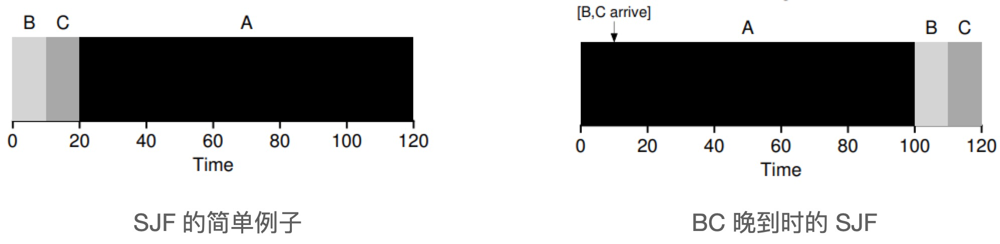
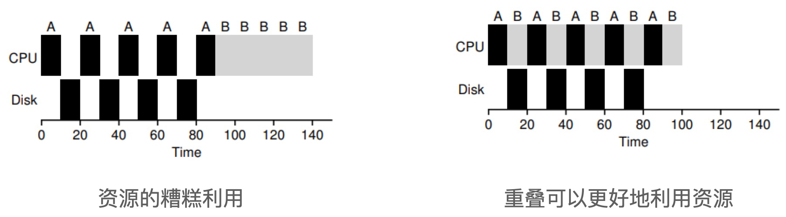
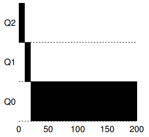
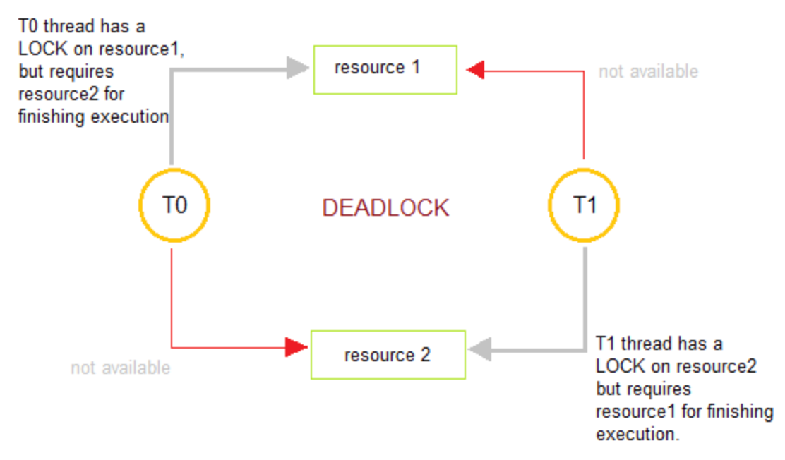
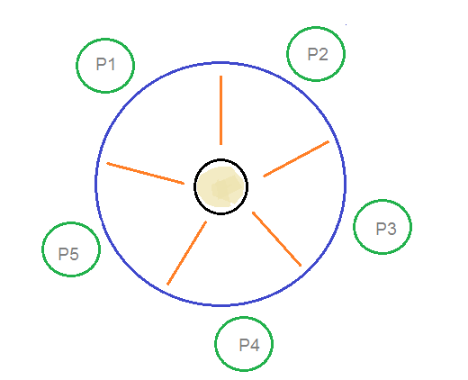

# Process Management

Table of Contents
-----------------

* [1. Blueprint](#1-blueprint)
* [2. States](#2-states)
* [3. System call](#3-system-call)
* [4. Scheduling](#4-scheduling)
   * [4.1 思想](#41-思想)
      * [4.1.1 FIFO](#411-fifo)
      * [4.1.2 SJF](#412-sjf)
      * [4.1.3 STCF](#413-stcf)
      * [4.1.4 RR](#414-rr)
      * [4.1.5 结合 IO](#415-结合-io)
   * [4.2 实现](#42-实现)
      * [4.2.1 MLFQ](#421-mlfq)
* [5. Synchronization](#5-synchronization)
   * [5.1 Basic Idea](#51-basic-idea)
   * [5.2 Spin Lock](#52-spin-lock)
      * [5.2.1 Test and Set](#521-test-and-set)
      * [5.2.2 CAS](#522-cas)
   * [5.3 Condition Variable](#53-condition-variable)
   * [5.4 Producer–Consumer Problem](#54-producerconsumer-problem)
   * [5.5 Readers-Writers Problem](#55-readers-writers-problem)
   * [5.6 Dining Philosophers Problem（待补充）](#56-dining-philosophers-problem待补充)
* [6. Deadlock](#6-deadlock)
   * [6.1 产生的必要条件](#61-产生的必要条件)
   * [6.2 死锁避免](#62-死锁避免)
      * [6.2.1 背景](#621-背景)
      * [6.2.2 安全状态](#622-安全状态)
      * [6.2.3 单个资源的银行家算法](#623-单个资源的银行家算法)
      * [6.2.4 多个资源的银行家算法](#624-多个资源的银行家算法)
   * [6.3 死锁检测 &amp; 恢复](#63-死锁检测--恢复)
      * [6.3.1 单个资源](#631-单个资源)
      * [6.3.2 多个资源](#632-多个资源)


## 1. Blueprint

**Process**

<div align="center">  </div><br>


**Thread**

<div align="center">  </div><br>


**Parallelism VS Concurrency**

<div align="center">  </div><br>

**schedule()**

```c
schedule() {
  pNew = getNext(ReadyQueue);
  switch_to(pCur, pNew);
}
```


## 2. States

<div align="center">  </div><br>


## 3. System call

<div align="center">  </div><br>

**Linux 下主要的系统调用**

|   Task   |          Commands           |
| :------: | :-------------------------: |
| 进程控制 |   fork(); exit(); wait();   |
| 进程通信 |  pipe(); shmget(); mmap();  |
| 文件操作 |  open(); read(); write();   |
| 设备操作 |  ioctl(); read(); write();  |
| 信息维护 | getpid(); alarm(); sleep(); |
|   安全   | chmod(); umask(); chown();  |


## 4. Scheduling

### 4.1 思想

#### 4.1.1 FIFO

<div align="center">  </div><br>

#### 4.1.2 SJF

<div align="center">  </div><br>


#### 4.1.3 STCF

<div align="center">  </div><br>

#### 4.1.4 RR

<div align="center">  </div><br>

#### 4.1.5 结合 IO

> 一个进程在等待另一个进程的 I/O 完成时使用 CPU

<div align="center">  </div><br>


### 4.2 实现

#### 4.2.1 MLFQ

**Rule 1**

先执行优先级高的队列


**Rule 2**

对于在相同优先级队列中的任务，采用 `RR` 算法

<div align="center">  </div><br>

**Rule 3**

新任务放入最高优先级队列（在最开始的假设是短工作，并赋予最高优先级；如果确实是短工作，很快就会执行完毕；反之，则移动到低优先级的队列中）


<div align="center">  </div><br>


<div align="center">  </div><br>

**Rule 4**

当任务用完整个时间片后，降低其优先级

**但是**，若任务主动释放 CPU，则优先级不变（让交互型工作快速进行）

<div align="center">  </div><br>

**改进版 Rule 4**

一旦工作用完了其在某一队列中的时间配额，无论中间主动放弃了多少次 CPU，都降低其优先级（避免被长作业“愚弄“）


<div align="center">  </div><br>


**Rule 5**

经过一段时间 S，就将所有工作重新放入到最高优先级队列中（避免长作业 “饥饿”，甚至饿死）

<div align="center">  </div><br>


## 5. Synchronization

### 5.1 Basic Idea

```cpp
lock_t mutex;
// do something
lock(&mutex);
balance = balance + 1;
unlock(&mutex);
```

锁就是一个变量，保存了**某一时刻的状态**


### 5.2 Spin Lock

<div align="center">  </div><br>

#### 5.2.1 Test and Set

**test-and-set**

```c
typedef struct lock_t { int flag; } lock_t;

void init(lock_t *mutex) {
  // 0 -> lock is available
  // 1 -> held
  mutex->flag = 0;
}


void lock(lock_t *mutex) {
  // TEST the flag
  while (mutex->flag == 1);
  // spin-wait
  // now SET it
  mutex->flag = 1;
}


void unlock(lock_t *mutex) {
  mutex->flag = 0;
}
```

**缺陷**

通过适时的中断，使得两个线程都可以进入临界区


**TestAndSet 原子指令**

```c
int TestAndSet(int *old_ptr, int new) {
  int old = *old_ptr;
  *old_ptr = new;
  return old;
}


void lock(lock_t *mutex) {
  while (TestAndSet(&mutex->flag, 1) == 1);
}

```


#### 5.2.2 CAS

> Compare and Swap

**CompareAndSwap 原子指令**

```c
int CompareAndSwap(int *ptr, int expected, int new) {
  int actual = *ptr;
  if (actual == expected)  // COMPARE
    *ptr = new;  // SWAP
  return actual;
}


void lock(lock_t *mutex) {
  while (CompareAndSwap(&mutex->flag, 0, 1) == 1);
}

```


### 5.3 Condition Variable

```c
// Declaration of thread condition variable 
pthread_cond_t cond = PTHREAD_COND_INITIALIZER; 

// declaring mutex 
pthread_mutex_t lock = PTHREAD_MUTEX_INITIALIZER; 

// 0 -> unfinished
// 1 -> finished
int done = 1; 

void thr_join() {
  Pthread_mutex_lock(&lock);
  
  while (done == 0) 
    Pthread_cond_wait(&cond, &lock);
  
  Pthread_mutex_unlock(&lock);
}


void thr_exit() {
  Pthread_mutex_lock(&lock);
  
  done = 1;
  Pthread_cond_signal(&cond);
  
  Pthread_mutex_unlock(&lock);
}
```


### 5.4 Producer–Consumer Problem

<div align="center">  </div><br>

**Constraints**

- 只有缓冲区没满时，`producer` 才能把产品放入缓冲区，否则必须等待
- 只有缓冲区不空时，`consumer` 才能从中取出产品，否则必须等待
- 缓冲区是临界资源，各进程必须互斥地访问（因为并发条件下，若两个进程同时将各自的产品放入缓冲区同一个位置，会出现 “数据覆盖” 的现象）


**Explained**

- Semaphore Q: 用来保证缓冲区进程互斥，初始值为 1（Q 代表 queue）
- Semaphore E: 初始值为 n（E 代表 empty，缓冲区空闲的位置）
- Semaphore F: 初始值为 0（F 代表 filled，缓冲区已占用的位置）


**Producer**

```java
void producer() {
  while (T) {
    // 生产数据
    produce();
    // 是否有空闲的位置可以投放
    wait(E);
    // 当前缓冲区是否被占用
    wait(Q);
    // 投放数据
    append();
    // 释放缓冲区
    signal(Q);
    // 更新缓冲区已占用的数量
    signal(F);
  }
}
```


**Consumer**

```java
void consumer() {
  while (T) {
    // 缓冲区是否有数据可以被消费
    wait(F);
    // 缓冲区是否被占用
    wait(Q);
    // 从缓冲区拿数据
    take();
    // 释放缓冲区的资源
    signal(Q);
    // 缓冲区空闲位置增加
    signal(E);
    // 消费数据
    consume();
  }
}
```


### 5.5 Readers-Writers Problem

<div align="center">  </div><br>

**Contraints**

两种场景（针对同一时刻）：

1. 一个 `writer`
2. 多个 `reader`


**Explained**

- Semaphore W: 写操作是互斥的，初始值为 1（W 代表 write）
- readCount: 当前 `reader` 的数量（普通变量），初始值为 0
- Semaphore mutex: 用来互斥地增减 `readCount` 的值，初始值为 1


**Writer**

```java
void write() {
  // 是否有其他进程在写数据
  wait(W);
  // 写入数据
  writing();
  // 释放资源
  signal(W);
}
```


**Reader**

```java
void read() {
  
  // 互斥地增加 readCount 数量
  wait(mutex);
  readCount++;
  //当第一个 reader 进来时, 给 writer 上锁
  if (readCount == 1) {
    wait(W);
  }
  signal(mutex);
  
  // 进行读操作
  reading();
  
  // 互斥地减少 readCount 数量
  wait(mutex);
  readCount--;
  // 当没有 reader 进程时, 释放 writer 锁
  if (readCount == 0) {
    signal(W);
  }
  signal(mutex);
  
}
```


### 5.6 Dining Philosophers Problem（待补充）

<div align="center">  </div><br>


**Background**

At any instant, a philosopher is either eating or thinking. When a philosopher wants to eat, he uses two chopsticks - one from their left and one from their right. When a philosopher wants to think, he keeps down both chopsticks at their original place


## 6. Deadlock

死锁是指多个进程在执行过程中互相等待对方的资源而造成全部阻塞的情况

<div align="center">  </div><br>

### 6.1 产生的必要条件

产生死锁**必须同时满足以下四个条件**（联想哲学家进餐问题）


<div align="center">  </div><br>

1. 互斥：若资源是共享的，则可避免死锁
2. Hold and wait：若放弃手里的 / 不去等待其他资源，则可避免死锁
3. 非抢占式：若其他进程可以抢夺，则可避免死锁
4. 循环等待


### 6.2 死锁避免

#### 6.2.1 背景

银行家算法（Banker's Algorithm）是一个避免死锁的著名算法（算法中银行家好比操作系统，资金好比系统资源，申请的客户好比进程）


在银行中：

- 客户申请贷款数量有限，每个客户在第一次申请时要声明最大资金量
- 在满足贷款要求后，客户应及时归还
- 银行家应尽量满足客户需要


#### 6.2.2 安全状态

若没有发生死锁，并且即使所有进程突然请求对资源的最大需求，也仍然存在**某种调度次序能够使得每一个进程运行完毕**，则称该状态是安全的


<div align="center">  </div><br>

- `Has`：表示已分配的资源
- `Max`：表示所需的最大资源


分配流程：从图 a 开始出发，先让 B 拥有所需的资源（如图 b），等 B 运行结束后释放所有资源（如图 C）；再依次分配给 C（如图 d） 和 A（如图 e）


#### 6.2.3 单个资源的银行家算法

<div align="center">  </div><br>

第一次请求后：“银行家” 仅剩 2 个单位的资源

第二次请求后：”银行家“（操作系统）仅剩 1 个单位资源，无法满足任一 “客户” （进程）的最大需求


**因此，算法会拒绝之前的请求，避免进入图 c 的状态**


#### 6.2.4 多个资源的银行家算法

在操作系统中，是

存在多个进程以及资源

<div align="center">  </div><br>

- E: 总资源
- P: 已分配资源
- A: 待分配资源


**检查一个状态是否安全的算法如下：**


1. 查找右边的矩阵（待分配矩阵）是否存在一行小于等于向量 A；若不存在，则系统将会发生死锁，状态是不安全的
2. 若存在，则将该进程标记为终止，并将其已分配资源加到 A 中
3. 重复以上两步骤=。直到所有进程都标记为终止，则状态是安全的


若一个状态是不安全的，则需要拒绝进入这个状态


### 6.3 死锁检测 & 恢复

#### 6.3.1 单个资源

<div align="center">  </div><br>

图示说明：

- 正方形代表资源，圆形代表进程
- 正方形指向圆形代表资源分配给该进程，圆形指向正方形代表进程请求该资源


**总结**

若有向图存在环，则证明有死锁的存在


#### 6.3.2 多个资源

<div align="center">  </div><br>


图示说明：

- E 向量：资源总量
- A 向量：资源剩余量
- C 矩阵：进程所占有资源数量
- R 矩阵：进程所请求资源数量


**总结**

每个进程最开始都不被标记。当算法结束时，任何没有被标记的进程都是死锁进程

1. 寻找一个没有标记的进程 Pi，它所请求的资源小于等于 A
2. 若找到，标记该进程，并将 C 矩阵的第 i 行向量加到 A 中，转第一步
3. 若没找到，算法终止

