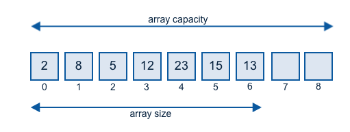

# Data Structures & Algorithms

## Data Structures

### Array

  
 

- [Array](https://github.com/ceezyyy/backend-notes/blob/master/cs-core/data-structures-and-algorithm/code/data-structures-and-algorithms/data-structures/src/array/DynamicArray.java)

### Stack

  
 

- [Stack](https://github.com/ceezyyy/backend-notes/blob/master/cs-core/data-structures-and-algorithm/code/data-structures-and-algorithms/data-structures/src/stack/ArrayStack.java)

### Queue

  
 

## Algorithms

### Sorting

- [Insertion sort](https://github.com/ceezyyy/backend-notes/blob/master/Core/data-structures-and-algorithm/code/data-structures-and-algorithms/algorithms/src/sorting/insertionSort/InsertionSort.java)
- Bubble sort
- [Selection sort](https://github.com/ceezyyy/backend-notes/blob/master/Core/data-structures-and-algorithm/code/data-structures-and-algorithms/algorithms/src/sorting/selectionSort/SelectionSort.java)
- Shellsort		
- Quicksort
- Merge sort
- Heapsort
- Counting sort
- Bucket sort
- Radix sort

### Searching

- [Linear Search](https://github.com/ceezyyy/backend-notes/blob/master/Core/data-structures-and-algorithm/code/data-structures-and-algorithms/algorithms/src/searching/linearSearch/LinearSearch.java)
- Binary Search

### Union-Find

